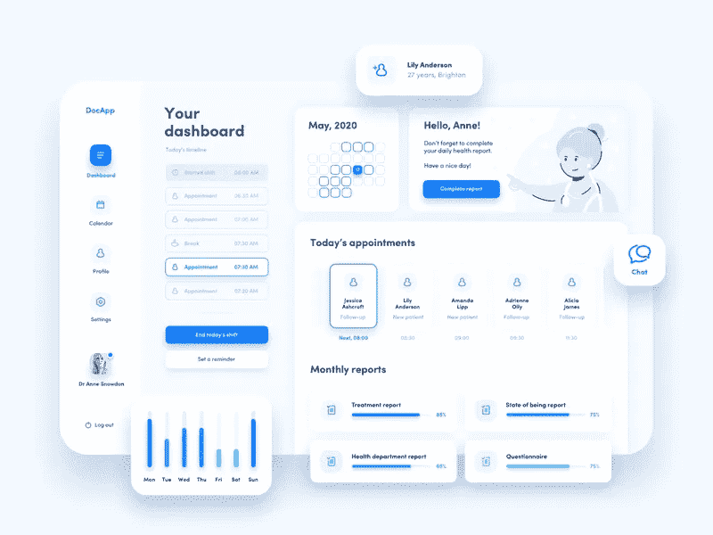
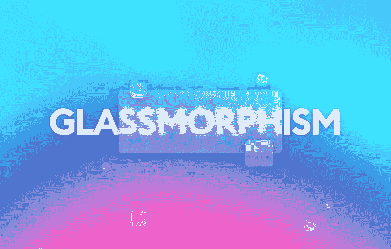
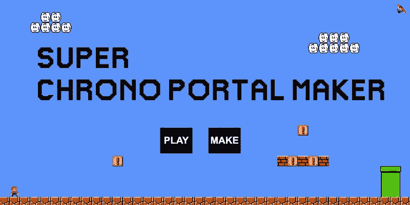

# 开发投资组合:如何脱颖而出

> 原文：<https://betterprogramming.pub/dev-portfolios-how-to-stand-out-from-the-crowd-4a5d990b3400>

## 如今，如果你的投资组合没有给雇主留下深刻印象，你很难获得第一份科技工作

许多新开发人员从相同的模板创建相同的登录页面(我也没有任何不同)。结果，求职者淹没在一堆简历和其他投资组合中。

# 为你的作品集创建有趣的项目

照片由 Ketut Subiyanto 从 Pexels 拍摄

我是一名前端开发人员，拥有一个小型软件公司。作为一名企业家，我见过许多候选人的投资组合。这些开发人员创建的许多登录页面都是像素级的完全相同！

在波兰，我们对前端开发人员有一个难以置信的挑战，叫做“每周网络开发挑战”我喜欢这个挑战，我大三的时候就参加了。每周参与者创建登录页面，然后获得反馈。

因此，在一些挑战之后，多个开发人员在他们的投资组合/简历中有类似的项目，然后他们用这些项目申请同一个雇主。

设身处地为雇主着想。你正在寻找一个新的开发人员，所以你发布了一份工作邀请。几个小时后，你得到十份简历，都是同一个项目！没有一个人在人群中鹤立鸡群。

这些挑战对练习是有用的，但当你试图突出自己时，它们就不合适了。当你找第一份工作时，没人告诉你这些。所以我现在才告诉你！

# 你可以用 HTML 和 CSS 做很多事情

CSS 中的天气图像

如果您还不知道 JavaScript，您仍然可以在以后创建项目和添加脚本。从建立与你喜欢或经常使用的网站相似的简单网站开始。然后逐渐开始建立更复杂的网站。

# 哪里可以找到设计灵感？

作为一个有抱负的前端开发人员，你可能不太了解设计。那完全没问题！你永远不会负责创建一个网站或产品的设计。了解设计的基础知识是有帮助的，而且在我看来是必需的，但是你可以把它留到以后熟悉前端堆栈的时候。

我见过的大多数作品集都不太吸引人，因为没有受过多少设计训练的开发人员试图自己设计。

做了几年前端开发，还是不知道怎么创作出那些漂亮的设计。我是 100%的技术人员。我没有想象力(除了空间想象力！).让设计师做他们的工作。

但是为了帮助我们自己，我们可以用他们创造的东西！最著名的设计灵感网站有:

*   [滴水不漏](https://dribbble.com/)
*   [行为](https://behance.net/)

您可以在那里搜索图像，并使用它们来制作编码版本。记得给设计负责人点赞就行了！

# 你应该创造什么？

您可以创建各种不同的项目。大多数 Dribbble/Behance 登录页面都将是一个挑战，因为有很多图像和图标。但是可以开发应用！应用程序没有登陆页面那么花哨，但也没关系。更少的自定义图像意味着更少的问题。

Diana Malewicz 的医疗应用仪表板

如你所见，自定义图标并不多。你可以用免费的来替换它们，或者，如果你已经知道一些设计，你可以创建你自己的。

但你不会被迫这样做。您可以创建多个其他东西，例如:

*   [单格图像](https://a.singlediv.com/)
*   [CSS 图片](https://www.albertwalicki.com/unique-weather-app-images)
*   CSS 动画

我喜欢花时间在搜索[密码本](https://codepen.io/)上寻找新的灵感。你也应该试试！

# JavaScript 初学者

[https://codemyui . com/simple-hamburger-menu-x-mark-animation/](https://codemyui.com/simple-hamburger-menu-x-mark-animation/)

在开始您的 JavaScript 冒险之旅时(这永远不会结束，即使对于 JavaScript 大师来说也是如此)，您可以添加简单的脚本。你可以通过添加一些 JavaScript 来升级所有的静态网站。

这里有一些简单的想法:

*   动画汉堡菜单。
*   滚动后位置固定的页眉。
*   点击时向下滚动到该部分的按钮。
*   滚动动画。
*   单击时打开模式/弹出窗口的按钮。
*   基本网站状态—点击添加和移除元素。

你可以做很多事情！

# 已经懂 JavaScript 了？

如果您熟悉 JavaScript，您可以进一步创建项目。我的很多项目都是从前端开始的。后端要么没有开发，正在进行中，要么我们公司只负责创建前端。你也可以这样做。创建准备好与后端集成的应用程序！

# 一半应用程序

正如我之前写的，每个人都创建登陆页面。所以，要脱颖而出，为什么不做一个更复杂的 app 呢？前端的应用要简单得多，也更容易达到完美的像素。可能会有很多不同的屏幕，但它们都比登陆页面小得多。

如果你已经有了静态仪表板应用程序，你可以让它起死回生！你不需要了解后端就可以创建完整的应用程序(当然是为了学习过程)。我最喜欢的工具是一个 JSON 服务器。使用这个工具，您可以创建自己的数据库，包含所有必要的请求。

我很乐意在某人的投资组合中看到这样的应用程序。基本授权、用户资料、带有一些图表的仪表板，就是这样。它不一定是一个大的应用程序，但它表明有人理解请求，这是一个很大的优势。

# 工具

https://glassmorphism.com

创建各种登录页面和仪表板后，您可能会感到无聊。那完全没问题！您可以创建许多其他项目。

创造不同的工具可能有助于对抗无聊。这些工具可以在 Bootstrap 或 Tailwind 等布局框架中制作。它看起来不会很棒，但是它几乎可以跳过 HTML 和 CSS 部分。有了这个帮助，您可以专注于 JavaScript 部分。

# 创造什么？

一切能加快你工作的东西！如果你讨厌 UI(用户界面)，你可以创建自己的 UI 生成器！

发电机

*   箱形阴影发生器
*   自定义 CSS 复选框/无线电输入生成器
*   新的流行 UI 生成器，如[神经形态](https://neumorphism.io/#55b9f3)或[玻璃形态](https://glassmorphism.com/)

其他的

*   绘图工具(如 MS Paint)
*   数据可视化
*   你自己的 NPM 模块

# 比赛

超级时空门户制作

我几乎没见过初级前端开发者 CV 里的游戏。你可以用 JavaScript 创建很多简单的游戏，它们的复杂性会逐渐增加。可以从井字游戏开始，到 3D 游戏结束！

一些用 JavaScript 编写的游戏示例:

*   [用教程制动 2D](https://developer.mozilla.org/pl/docs/Games/Tutorials/2D_Breakout_game_pure_JavaScript)
*   [超级马里奥类游戏](https://js13kgames.com/games/super-chrono-portal-maker/index.html)
*   [移动立方体](https://js13kgames.com/games/1024-moves/index.html)

创作游戏可能很难。如果你把游戏的逻辑分解成几个主要因素，那将是最好的。了解你需要做什么会很有帮助。我给你描述一下井字游戏的逻辑。

*   游戏应该有两种游戏模式:玩家对玩家和玩家对电脑。
*   其中一名玩家选择`0`，另一名玩家选择`x`来标记他们的选择。
*   这个游戏是轮流玩的。
*   当其中一个玩家用他/她的符号填满整个列/行/对角线时，游戏结束。
*   如果没人赢，那就是平局。

附加功能:

*   随机选择哪个玩家开始。
*   添加重启按钮。
*   添加用户名。

# 请随便

我希望我已经给了你雇主的观点。如果你不帮助自己脱颖而出，别人也不会。

感谢您的阅读，再见！