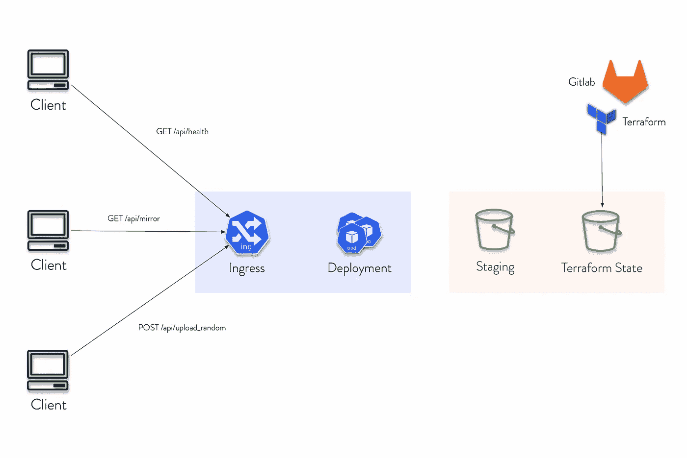
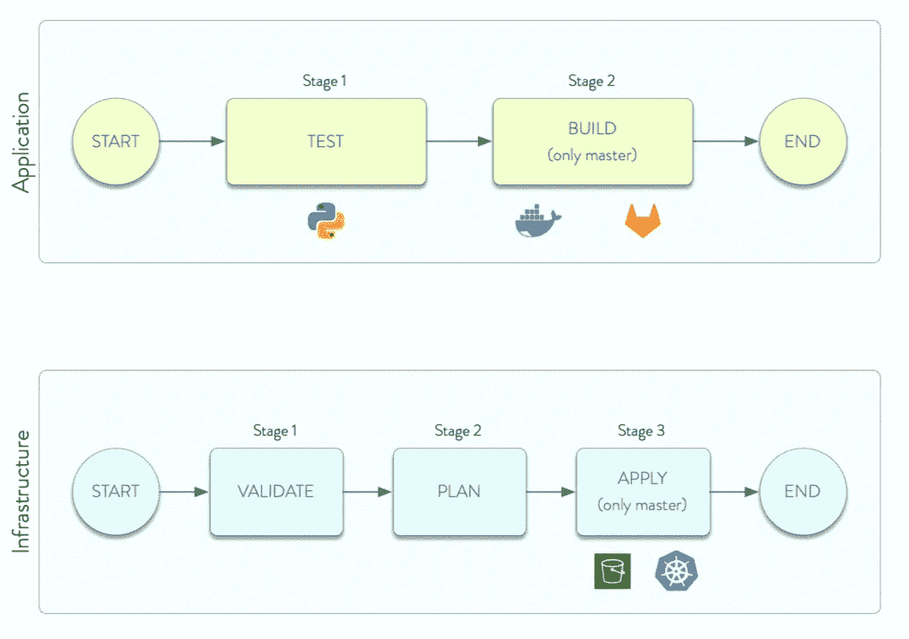

# 用 Terraform、Gitlab、Kubernetes 和 AWS 开发 Docker 容器化 Python API

> 原文：<https://betterprogramming.pub/develop-a-docker-containerized-python-api-deployed-with-terraform-gitlab-kubernetes-and-aws-238234caaaf5>

## 了解这些平台更多信息的分步指南


照片由 [Ishant Mishra](https://unsplash.com/es/@ishant_mishra54?utm_source=medium&utm_medium=referral) 在 [Unsplash](https://unsplash.com?utm_source=medium&utm_medium=referral) 上拍摄

你好，互联网！几个月前，我参加了 DevOps 的一个面试任务，我决定发布我实现的解决方案，这使我通过了技术步骤。

尽管这个机会最终并不符合我的需求，但这个任务非常有趣，对于开始学习工作工具的初级开发人员来说，可能是一个很好的起点:)。

# 技术栈

IT 行业经常使用以下堆栈。涉及的技术有:

*   CI/CD: Gitlab CI
*   编码:Python
*   云提供商:AWS
*   IAAC:地形
*   微服务:Kubernetes

# 问题是

开发一个 web 服务器，在`port 4545`上公开以下端点:

## 蜜蜂

`/api/health`返回一个包含`{“status”: “ok”}`的 JSON 负载

`/api/mirror?word={word}`返回包含转换后的输入单词的 JSON 有效负载，如下所示:

*   小写字母必须转换成大写字母。
*   大写字母必须转换成小写字母。
*   任何一个数字都必须和它的补数反相(9 变成 0，8 变成 1，7 变成 2，… 0 变成 9)。
*   任何其他字符都应保持原样。
*   反转`w34hole`弦`(luca <-> acul)`；比如`/api/mirror?word=F0oBar25 returns {“transformed”: “47RAb0oF”}`。

开发一个简单的测试用例来测试上面提到的例子。

## CI/CD

您必须编写管道来运行应用程序测试(仅在主分支上)，构建应用程序的 docker 映像并将其推送到私有注册中心。

## 库伯内特斯

使用 Terraform 在 K8s 集群上部署应用程序。交付件应做到以下几点:

*   使用您推送到注册表的 docker 映像。
*   提供侦听`port 80`并将流量重定向到应用程序的入口。

## 将（行星）地球化（以适合人类居住）

定义将文件从应用程序上传到 S3 存储桶的基础架构。

向您的应用程序添加一个端点，监听对`*/api/upload-random*` 的`POST`调用，创建一个. txt 文件，以随机数作为内容，并将其上传到 S3 桶。

# 我的解决方案

首先，这个问题一开始可能看起来又长又复杂，但是如果你能把它分解成小的子问题来解决，它实际上是相当容易的。最后，一个好的软件工程师应该总是能够解决最困难的问题。

因此，建议的体系结构如下:



建筑

平心而论，这是一个非常简单的架构。它分为三个部分:

左边:客户通过需求定义的 API 发出请求。API 位于 Kubernetes 的入口组件上(在这种情况下，服务是`LoadBalancer`类型的)。

中间:服务将“外部”连接到“内部”，这由 Kubernetes 部署表示，Python 服务器 Dockerized 位于其中。

右边:最后但同样重要的是，staging bucket 将用于上传由 API 生成的`random_upload`文件和我们的 Terraform 代码的状态。

**注意:**我不会解释每一行代码。这个小型架构是为已经对 Python、Terraform、Docker 和 Kubernetes 有所了解的人设计的。不多，只是一点点。被警告。了解它的最好方法，除了看这篇文章，就是克隆回购，自己去探索。

## 仓库

将存储库分开:一个用于应用程序代码，一个用于基础设施代码。在所有的好处中，您将能够在两个不同的范围内保存 CI/CD 作业。

所以，一个将是[应用-代码-回购](https://gitlab.com/astrolu/application-oper-challenge)，另一个是[基础设施-代码-回购](https://gitlab.com/astrolu/infrastructure-oper-challenge)。

## 当地的 Kubernetes 集群

在所有本地构建 Kubernetes 集群的解决方案中，比如 Kind 或 MiniKube，我会用一个简单的 Docker 桌面来简化这个项目的范围。对我来说，对于 Mac M1 来说，这个软件做得很好。要启用它，进入 Docker 桌面的设置并切换 Kubernetes 选项。

完成后，您就可以开始了。您有一个本地工作的 K8S 集群。

# API: Python 应用服务器

全球共有三种 API，如下所示:

`/api/health`简单地返回服务的状态。它要么返回“ok”要么超时，所以这里没有什么需要解释的。

```
@api.route('/api/health', methods=['GET'])
def get_health():
    return {"status": "ok"}
```

`/api/mirror`使用前面提到的转换来转换单词。转换在一个名为`string_transform.py`的单独文件中。测试用例(唯一的一个，lol)确保转换函数正常工作。

```
@api.route('/api/mirror', methods=['GET'])
def get_mirror():
    word = request.args.get("word")
    return {"transformed": string_transform.transform(word)}
```

是迄今为止最有趣的。它在定义的最小值和最大值之间创建一个随机数，然后创建一个同名文件，并使用 boto3 在 bucket 上上传它。

```
@api.route('/api/upload-random', methods=['POST'])
def post_upload_random():
    min = 0
    max = 9999
    random_number = str(random.randint(min, max))
    filename = f'{random_number}.txt' file.create_file(filename, random_number)
    s3.upload_file(file_name=filename, bucket='oper-qual-staging')
    return {"uploaded": "ok"}
```

[](https://gitlab.com/astrolu/application-oper-challenge/-/tree/main/application/python-docker/src) [## application/python-docker/src main astro Lu/application-oper-challenge GitLab

### GitLab.com

gitlab.com](https://gitlab.com/astrolu/application-oper-challenge/-/tree/main/application/python-docker/src) 

# Dockerfile 文件

要构建 docker 映像，代码非常简单。它只是在目标映像上安装需求，并在容器中执行 python flask 服务器。代码如下:

```
FROM python:3.8-slim-busterWORKDIR /app
COPY requirements.txt requirements.txt
RUN pip3 install -r requirements.txtCOPY src .CMD ["python3", "-m" , "flask", "run", "--host=0.0.0.0", "--port=4545"]
```

[](https://gitlab.com/astrolu/application-oper-challenge/-/blob/main/application/python-docker/Dockerfile) [## 应用程序/python-docker/docker file main astro Lu/应用程序-操作-挑战 GitLab

### GitLab.com

gitlab.com](https://gitlab.com/astrolu/application-oper-challenge/-/blob/main/application/python-docker/Dockerfile) 

# 将（行星）地球化（以适合人类居住）

## provider.tf

提供程序文件设置用于项目的 Terraform 提供程序。在这种情况下， [AWS](https://registry.terraform.io/providers/hashicorp/aws/latest/docs) 和 [Kubernetes](https://registry.terraform.io/providers/hashicorp/kubernetes/latest/docs) 提供者。

对于 AWS，S3 将保存 Terraform 状态，这样我们就不会将它存储在本地机器中。或者，您也可以将其存储在 Gitlab 中。

对于 Kubernetes，您必须插入您的主机和令牌才能访问 docker 集群。

[](https://gitlab.com/astrolu/infrastructure-oper-challenge/-/blob/main/infrastructure/provider.tf) [## infra structure/provider . TF main astro Lu/infra structure-oper-challenge git lab

### GitLab.com

gitlab.com](https://gitlab.com/astrolu/infrastructure-oper-challenge/-/blob/main/infrastructure/provider.tf) 

## main.tf

## 模块/部署

部署部分是 Terraform 项目中最有趣的部分，因为它是 infra-as-a-code 本身的精华。

部署将指向推送到 Gitlab 注册表的 Python 服务器的 docker 映像。您还需要指定一个`container_port`，包括活性探测器，以检查集群是否健康。如果已经有了`*/api/health*` API，为什么还要浪费它呢？

这个文件还包含 Kubernetes 的秘密，这是建立到上面提到的注册中心的连接所必需的。

代码相当长，所以[点击探究](https://gitlab.com/astrolu/infrastructure-oper-challenge/-/blob/main/infrastructure/modules/k8s/deployment/main.tf)。

## 模块/服务

`LoadBalancer`是暴露 Kubernetes 豆荚所必需的。没有它，就不可能到达服务。除此之外，映射`external:internal`端口也很重要，这样您就知道必须使用哪个端口来提供服务。代码如下:

# 云提供商:AWS

AWS 是目前为止我最喜欢的云提供商。在这个项目中，S3 将被选为服务，主要有两个目的:

*   包含项目地形状态的存储桶，因此不会存储在本地
*   一个存储由`/api/upload-random`随机生成的文件的桶。

必须创建访问凭据和权限。拥有简单的 S3FullAccess 权限的用户完全适合这个项目的范围。下载 AWS 凭证并在 CI/CD 变量中设置它们。

# Gitlab CI

Gitlab 提供了使用共享 runnerss 的可能性，这些共享 runner 免费为您运行 CI/CD 管道。你不必在你的机器上安装 gitlab-runner(也许，Raspberry Pi 4 是一个便宜的好选择)。

从 Gitlab 设置中为两个项目启用 runner 之后，您必须设置 CI/CD 变量，这些变量是 runner 在执行任务时使用的环境变量。

我配置的有`AWS_ACCESS_KEY_ID`、`AWS_DEFAULT_REGION`、`AWS_SECRET_ACCESS_KEY`、`CI_REGISTRY_EMAIL`、`CI_REGISTRY_PASS`、`CI_REGISTRY_USER`和`SVC_TERRAFORM_K8S`。



# 应用程序管道

位于应用程序文件夹下的应用程序管道有两个阶段:测试和构建。

*   测试将测试运行单元测试的 python 代码。
*   如果测试成功完成，它将触发一个构建阶段(仅在主分支上)，在这个阶段，docker 映像被推送到私有 gitlab 注册表。

**注意**:构建阶段只在主分支中工作，因为需求要求它只能在主分支上推送映像。

[](https://gitlab.com/astrolu/application-oper-challenge/-/blob/main/application/python-docker/.gitlab-ci.yml) [## 应用程序/python-docker/。gitlab-ci.yml 主 astrolu /应用程序-操作-挑战 gitlab

### GitLab.com

gitlab.com](https://gitlab.com/astrolu/application-oper-challenge/-/blob/main/application/python-docker/.gitlab-ci.yml) 

## 基础设施管道

基础设施管道分为三个阶段:验证、规划和应用。

*   验证阶段检查 terraform 代码是否有效。
*   如果是，它将触发一个创建 tf 计划的计划阶段。
*   自动部署基础架构的最后一个手动应用阶段。

**注意**:应用阶段只在主分支中起作用，因为代码将只部署在一个“生产”环境中。

[](https://gitlab.com/astrolu/infrastructure-oper-challenge/-/blob/main/infrastructure/.gitlab-ci.yml) [## 基础设施/。gitlab-ci.yml 主 astro Lu/infra structure-oper-challenge git lab

### GitLab.com

gitlab.com](https://gitlab.com/astrolu/infrastructure-oper-challenge/-/blob/main/infrastructure/.gitlab-ci.yml) 

# **到达服务点**

## **DNS 记录**

**为了更有趣，设置一个 DNS 记录。如果您拥有一个域，则将 DNS 记录直接指向集群，即** `**kubernetes.lucacesarano.com**` **作为集群的端点，而** `**api.lucacesarano.com**` **用于到达 API。**

如果你想从你的网络之外接触到它，你需要使你的服务可用。一种简单而常见的方法是使用反向代理。我没有这方面的指南，但你可能想旋转这个 docker 容器来做这件事。

使用反向代理，您将只暴露一台机器上的一个端口，然后将路由映射到家庭网络中您想要的任何服务。目前最简单的是 [**NGinx 代理管理器**](https://nginxproxymanager.com/) **。**

## **邮递员**

**使用**[**Postman**](https://www.postman.com/)**来测试你的 API。设置您的端点和之前创建的 API，并查看是否一切正常。**

```
**Want to connect with the author?****You know the gist. Send me a message for any clarification, and let’s keep in touch for any possibilities. My contacts are available on my** [**website**](https://lucacesarano.com)**. See ya!**
```