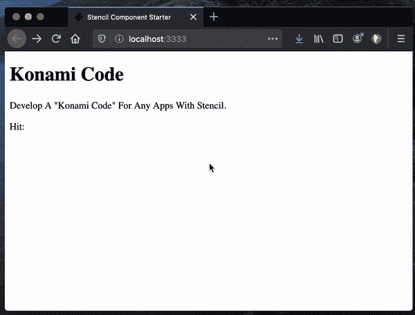
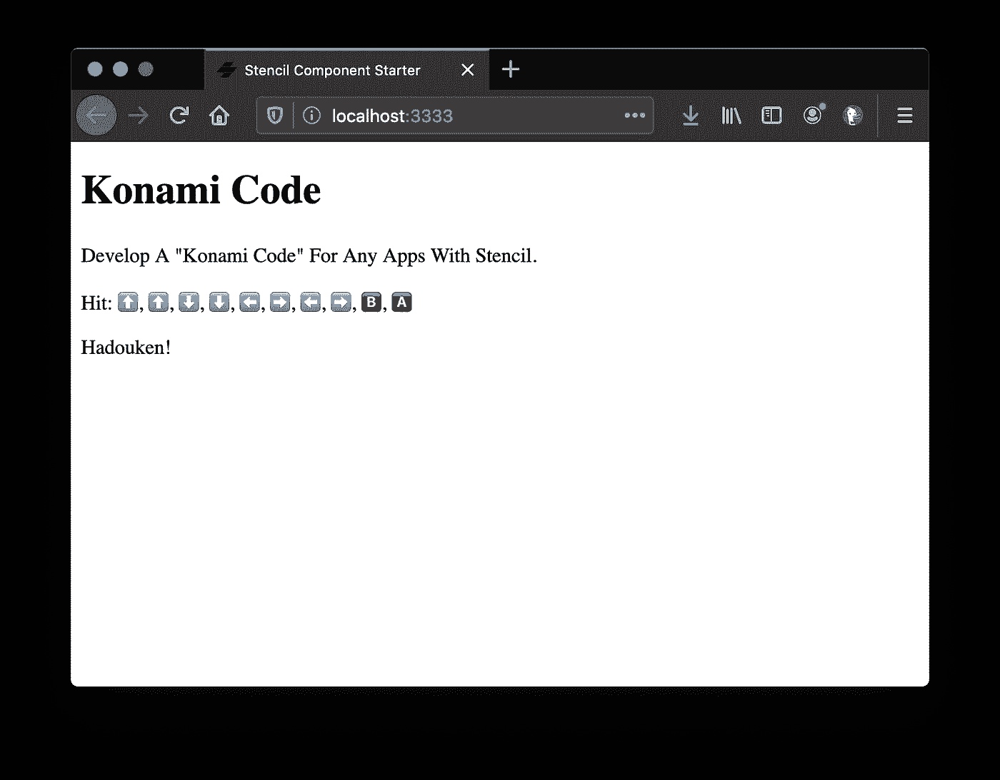
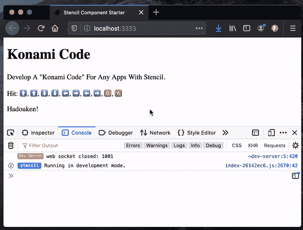
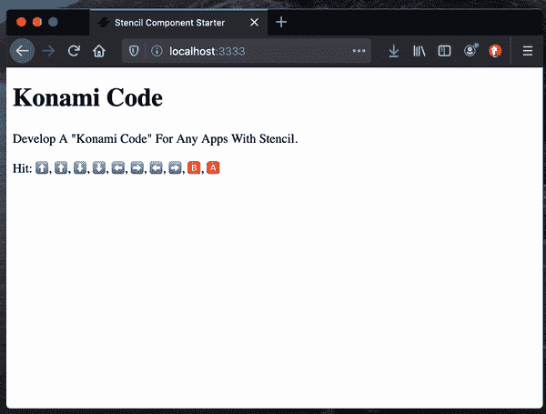
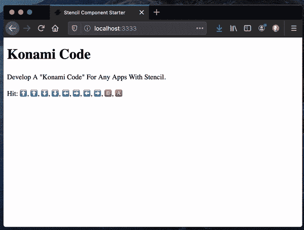

# 如何为任何带有模板的应用程序开发 Konami 代码

> 原文：<https://betterprogramming.pub/develop-a-konami-code-for-any-apps-with-stencil-bd8b11a50071>

## 在任何现代 web 应用程序中添加密码功能


照片由[穆罕默德·诺哈西](https://unsplash.com/@coopery?utm_source=unsplash&utm_medium=referral&utm_content=creditCopyText)在 [Unsplash](https://unsplash.com/?utm_source=unsplash&utm_medium=referral&utm_content=creditCopyText) 上拍摄

我已经连续分享了 35 篇[每日一招](https://medium.com/@david.dalbusco/one-trick-a-day-d-34-469a0336a07e)的博文，直到原定的瑞士新冠肺炎隔离期结束的日期，2020 年 4 月 19 日。

这一里程碑被推迟了，但尽管我们必须继续努力，一些微小的积极迹象已经出现。希望更好的日子就在前面。

# Konami 密码

Konami Code 是一种出现在许多 Konami 视频游戏中的作弊代码，允许玩家在按下游戏控制器上的一系列按钮时显示隐藏的功能或解锁成就:⬆️、⬆️、⬇️、⬇️、⬅️、➡️、⬅️、➡️。

由于它在流行文化中找到了一席之地，许多网站或应用程序目前正在使用它来提供动画，让我们这些极客和书呆子笑一笑😄。

这就是为什么我认为这是一个介绍[模板](https://stenciljs.com/)的好例子，也是一个结束这一系列文章的有趣想法。



# 开始

首先，我们使用 CLI 创建新的独立组件。

```
npm init stencil
```

出现提示时，选择`component`作为启动器类型，并提供`konami-code`作为项目名称。完成后，跳转到目录并安装依赖项。

```
cd konami-code && npm install
```

# 空白组件

starter 组件是用一些“Hello World！”类型代码。这就是为什么，为了让这个教程更容易理解，我们先清理一下。

请注意，我们不会重命名包和文件，因为我们会在之后将其发布到 [npm](https://www.npmjs.com/) 中。

我们编辑`./src/component/my-component/my-component.tsx`来修改属性标签，以便使用我们的组件作为`<konami-code/>`。而且，还会渲染“哈都肯！”因为《街头霸王 2 涡轮增压》把常规代码放在初始闪屏之前，使涡轮增压达到八星⭐.

```
import { Component, h } from "@stencil/core";

@Component({
  tag: "konami-code",
  styleUrl: "my-component.css",
  shadow: true,
})
export class MyComponent {
  render() {
    return <div>Hadouken!</div>;
  }
}
```

我们还没有修改 CSS，但是为了测试目的，我们修改了`./src/index.html`，以反映新的`tag`名称。

```
<!DOCTYPE html>
<html dir="ltr" lang="en">
<head>
  <meta charset="utf-8">
  <meta name="viewport" content="width=device-width, initial-scale=1.0, minimum-scale=1.0, maximum-scale=5.0">
  <title>Stencil Component Starter</title>

  <script type="module" src="/build/konami-code.esm.js"></script>
  <script nomodule src="/build/konami-code.js"></script>

</head>
<body>

  <h1>Konami Code</h1>

  <p>Develop A "Konami Code" For Any Apps With Stencil</p>

  <p>Hit: ⬆️,  ⬆️, ⬇️, ⬇️, ⬅️, ➡️️, ⬅️, ➡️, 🅱️, 🅰️</p>

  <konami-code></konami-code>

</body>
</html>
```

如果我们运行我们的项目(`npm run start`)，您的默认浏览器应该在地址`http://localhost:3333`自动打开，您应该能够看到呈现的以下元素:



# 侦查

默认情况下，我们将隐藏我们的组件内容，并希望只有在特定的键盘按键序列(⬆️、⬆️、⬇️、⬇️、⬅️、➡️、⬅️、➡️)被点击时才显示它。

因此，我们可以在我们的`./src/components/my-component/my-component.tsx`中将它定义为一个只读数组。

```
private readonly konamiCode: string[] = [
  "ArrowUp",
  "ArrowUp",
  "ArrowDown",
  "ArrowDown",
  "ArrowLeft",
  "ArrowRight",
  "ArrowLeft",
  "ArrowRight",
  "KeyB",
  "KeyA"
];
```

为了监听事件，我们通常注册和注销 [EventListener](https://developer.mozilla.org/en-US/docs/Web/API/EventListener) 。关于 Stencil 的一个很酷的事情是，它使得通过使用[装饰器](https://stenciljs.com/docs/events)来做这些事情成为可能。保持代码的整洁非常好。

因为我们对跟踪键盘按键感兴趣，所以我们在监听 [keydown](https://developer.mozilla.org/en-US/docs/Web/API/Document/keydown_event) 事件。

此外，为了将用户密钥列表与代码序列进行比较，我们将密钥保存在一个新的数组中。我们还负责将它的最大长度限制为与序列完全相同的长度(使用`shift`我们分别删除数组中的第一个对象和内存中保存的最老的键)，最后将它们作为`string`进行比较(`join`使用提供的分隔符解析数组)。

```
private keys: string[] = [];

@Listen("keydown", { target: "document" })
onKeydown($event: KeyboardEvent) {
  this.keys.push($event.code);

  if (this.keys.length > this.konamiCode.length) {
    this.keys.shift();
  }

  const match = this.konamiCode.join(",") === this.keys.join(",");
}
```

在这一点上，我们的布局应该不会改变，但是如果我们为了演示的目的在监听器函数的末尾添加一个`console.log($event.code, match);`，我们应该能够通过观察调试器来测试我们的组件。



# 条件渲染

为了有条件地呈现我们代码的结果，我们引入了一个新的[状态](https://stenciljs.com/docs/state)变量，如果对其进行修改，将会导致组件`render`函数被再次调用。

我们用它来有条件地呈现我们的消息“Hadouken！”

```
import {Component, h, Listen, State} from '@stencil/core';

@Component({
  tag: "konami-code",
  styleUrl: "my-component.css",
  shadow: true,
})
export class MyComponent {
  @State()
  private match: boolean = false;

  private readonly konamiCode: string[] = [
    "ArrowUp",
    "ArrowUp",
    "ArrowDown",
    "ArrowDown",
    "ArrowLeft",
    "ArrowRight",
    "ArrowLeft",
    "ArrowRight",
    "KeyB",
    "KeyA",
  ];

  private keys: string[] = [];

  @Listen("keydown", { target: "document" })
  onKeydown($event: KeyboardEvent) {
    this.keys.push($event.code);

    if (this.keys.length > this.konamiCode.length) {
      this.keys.shift();
    }

    this.match = 
         this.konamiCode.join(",") === this.keys.join(",");
  }

  render() {
    return <div>{this.match ? "Hadouken!" : undefined}</div>;
  }
}
```

如果你想在你的浏览器中测试它，你现在应该注意到消息在默认情况下消失了，但是你可以让它在你点击 Konami 代码序列时出现🎉。


# 动态内容

您可能有兴趣让用户指定他们自己的消息，而不是“Hadouken！”毕竟，也许有些人更愿意展示“Shoryuken！”😁。

这就是为什么我们可以将固定文本转换成一个`<slot/>`。

```
render() {
  return <div>{this.match ? <slot>Hadouken!</slot> : undefined}
         </div>;
}
```

我最近了解到，我们可以为`<slot/>`提供一个默认值。这样做，如果提供了开槽元素，它将显示，如果没有，默认的“Hadouken！”将被使用。

例如:`<konami-code></konami-code>`显示“Hadouken！”但是`<konami-code>Shoryuken!</konami-code>`渲染，嗯，“肖玉肯！”


# 风格

即使它完成了工作，我们的组件也可以有点风格化。这就是为什么我建议我们将它修改为`visible`而不是逻辑渲染的原因。

我们也可以在屏幕中央显示信息。

这就是为什么我们引入了[宿主元素](https://stenciljs.com/docs/host-element)来有条件地设置所有组件的样式。

```
render() {
  return <Host class={this.match ? 'visible' : undefined}>
    <div><slot>Hadouken!</slot></div>
  </Host>;
}
```

注意`<Host/>`元素必须从`@stencil/core`导入。

为了给组件设置样式，我们修改了它的相关样式`./src/components/my-component/my-components.css`。我们定义了我们的`:host`，组件，来覆盖整个屏幕，并且我们设置我们的信息显示在屏幕的中间。

因为我们通过一个类来应用消息的可见性，不管是否在容器上设置，我们添加了一个相关的样式`:host(.visible)`来实际显示消息。

```
:host {
  display: block;

  position: absolute;
  top: 0;
  left: 0;
  right: 0;
  bottom: 0;

  z-index: 1;

  visibility: hidden;
  opacity: 0;

  background: rgba(0, 0, 0, 0.8);
  transition: opacity 250ms ease-in;
}

:host(.visible) {
  visibility: inherit;
  opacity: 1;
}

div {
  position: absolute;

  top: 50%;
  left: 50%;

  transform: translate(-50%, -50%);

  color: white;
  font-size: 4rem;
}
```

如果我们在浏览器中再次尝试我们的组件，结果应该会更平滑一点。



# 关闭复活节彩蛋

很好，如果 Konami 代码序列被命中，我们已经在我们的应用程序中平滑地显示了一个复活节彩蛋，但是，正如您可能已经注意到的，消息一旦显示就会保持打开状态。

有几种可能的方法来处理这个问题。一个快速解决方案是在容器上发生`click`事件，从而重置我们的`match`状态。

```
render() {
  return <Host 
          class={this.match ? 'visible' : undefined} 
          onClick={() => this.match = false}>
    <div><slot>Hadouken!</slot></div>
  </Host>;
}
```

以防万一，我还建议在不使用 style 时阻止容器上的事件。

```
:host {
  pointer-events: none;
}

:host(.visible) {
  visibility: inherit;
  opacity: 1;
}
```

我们现在可以通过点击鼠标来关闭我们的信息。



# 总共

总之，我们的组件包含很少的代码:

```
import {Component, h, Listen, State, Host} from '@stencil/core';

@Component({
  tag: "konami-code",
  styleUrl: "my-component.css",
  shadow: true,
})
export class MyComponent {
  @State()
  private match: boolean = false;

  private readonly konamiCode: string[] = [
    "ArrowUp",
    "ArrowUp",
    "ArrowDown",
    "ArrowDown",
    "ArrowLeft",
    "ArrowRight",
    "ArrowLeft",
    "ArrowRight",
    "KeyB",
    "KeyA",
  ];

  private keys: string[] = [];

  @Listen("keydown", { target: "document" })
  onKeydown($event: KeyboardEvent) {
    this.keys.push($event.code);

    if (this.keys.length > this.konamiCode.length) {
      this.keys.shift();
    }

    this.match = 
         this.konamiCode.join(",") === this.keys.join(",");
  }

  render() {
    return <Host 
          class={this.match ? 'visible' : undefined} 
          onClick={() => this.match = false}>
      <div><slot>Hadouken!</slot></div>
    </Host>;
  }
}
```

我们的风格几乎和我们的组件一样长😅。

```
:host {
  display: block;

  position: absolute;
  top: 0;
  left: 0;
  right: 0;
  bottom: 0;

  z-index: 1;

  visibility: hidden;
  opacity: 0;

  background: rgba(0, 0, 0, 0.8);
  transition: opacity 250ms ease-in;

  pointer-events: none;
}

:host(.visible) {
  visibility: inherit;
  opacity: 1;

  pointer-events: all;
  cursor: pointer;
}

div {
  position: absolute;

  top: 50%;
  left: 50%;

  transform: translate(-50%, -50%);

  color: white;
  font-size: 4rem;
}
```

# 奖金

为了演示的目的，我还编写了一个向键盘显示事件的小组件，这是本文的第一个 GIF。如果感兴趣，这是它的代码。关于我们已经实施的计划，没有什么特别的。

唯一需要注意的技巧是这些与数组的链接。如果您正在操作一个，您必须创建一个新的来触发对函数`render`的新调用。此外，如果是动态渲染，为每个项目设置`key`属性更安全。

```
import {Component, h, Listen, State} from '@stencil/core';

@Component({
  tag: "konami-keys",
  shadow: true,
})
export class MyKeys {
  @State()
  private keys: string[] = [];

  @Listen("keydown", { target: "document" })
  onKeydown($event: KeyboardEvent) {
    this.keys = [...this.keys, $event.code]; // 10 being the length of the Konami Code
    if (this.keys.length > 10) {
      this.keys.shift();
    }
  }

  render() {
    return this.keys.map((key: string, i: number) => {
      return <span key={i}>{this.renderKey(key)}&nbsp;</span>;
    });
  }

  private renderKey(key: string) {
    if (key=== "ArrowUp") {
      return "⬆️";
    } else if (key=== "ArrowDown") {
      return "⬇️";
    } else if (key=== "ArrowLeft") {
      return "⬅️";
    } else if (key=== "ArrowRight") {
      return "➡️";
    } else if (key=== "KeyB") {
      return "🅱️";
    } else if (key=== "KeyA") {
      return "🅰️";
    } else {
      return key;
    }
  }
}
```