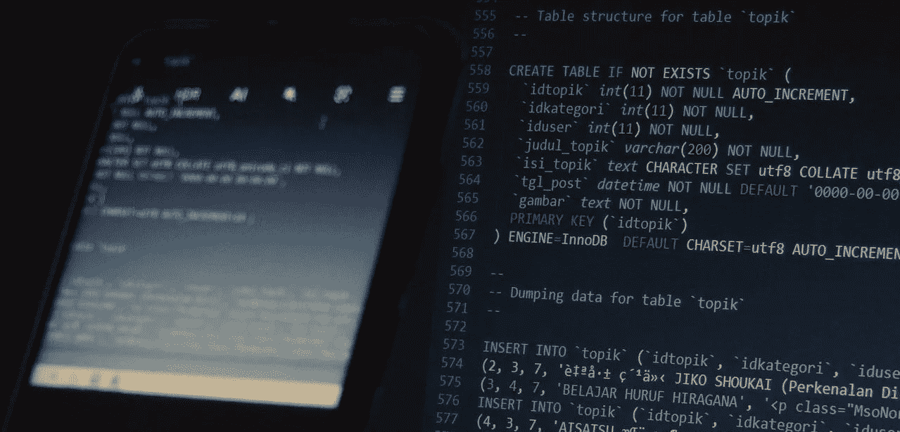

# 开发一个 Rust 宏来自动编写 SQL 样板代码

> 原文：<https://betterprogramming.pub/develop-a-rust-macro-to-automatically-write-sql-boilerplate-code-60c25d86adcb>

## 关于 Rust 的元编程



图片由[做利用](https://pixabay.com/users/do_exploit-19423556/?utm_source=link-attribution&amp;utm_medium=referral&amp;utm_campaign=image&amp;utm_content=5933101) [Pixabay](https://pixabay.com//?utm_source=link-attribution&amp;utm_medium=referral&amp;utm_campaign=image&amp;utm_content=5933101) 中的

这个故事描述了一个 Rust 宏的编写，它自动实现 SQL 语句的包装方法，以减少使用 SQL 数据库时的样板代码需求。该宏在 [crates.io](https://crates.io/crates/derive-sql) 上可用，但在现阶段仍处于发展中，有许多限制，包括仅支持`rusqlite`包装器。程序宏的源代码可以在麻省理工学院开源许可下在 https://github.com/juliendecharentenay/derive-sql 获得。

我写了这个代码和故事，因为我想完善我对过程宏的理解。我选择围绕 SQL 开发一些东西，因为我预计我的电子邮件屏蔽附带项目—[https://1-ml.com](https://1-ml.com)—将需要它来存储和检索使用统计数据。

这个故事中表达的观点/意见是我自己的。这个故事与我的个人经历和选择有关，并提供了希望有用的信息，但没有任何担保。

我的学习是从 Rust 编程语言的“如何编写自定义派生宏”一节开始的——[https://doc . Rust-lang . org/book/ch19-06-macros . html # How-to-write-a-custom-derive-macro](https://doc.rust-lang.org/book/ch19-06-macros.html#how-to-write-a-custom-derive-macro)而编码之旅是从创建一个名为`derive-sql`的库箱开始的，下面的`Cargo.toml`中的`proc-macro=true`将它声明为一个过程化宏……

# 目标

程序宏的目标是促进 SQL 数据库中`struct`的存储和检索。例如，这个故事使用以下数据结构来存储联系人:

`DeriveSql`宏为`Contact`实现以下方法:

我想指出几个方面:

我选择让`insert`、`update`和`delete`方法在被调用时消费对象。除了允许方法链接之外，这种选择没有特别的原因——这可能相关，也可能不相关。

该实现基于包装 SQLite 的`rusqlite`机箱。从长远来看，我希望尝试使它与 SQL 引擎无关，以便它与`rust-postgres`机箱兼容(并且可能作为一个扩展目标，为 web 客户端应用程序添加与 [IndexedDB API](https://developer.mozilla.org/en-US/docs/Web/API/IndexedDB_API) 的兼容性)。

# 测试驱动开发

对于这个项目，我选择了使用文档测试的测试驱动开发。使用这种方法，我必须同时编写文档和测试。这是我喜欢 Rust 的一个方面——它使应用(甚至驱使我)良好实践变得容易。

文档测试采用以下形式——为了可读性，已经删除了必需的`//!`前导注释:

我首先从实现`create_table`方法开始，然后逐渐添加其他方法及其相关测试。在这个阶段，没有一个测试成功，因为还没有实现任何东西。

# 履行

## 解决纷争

在谈论实现本身之前，这一段讨论了当事情不按计划进行时可以做些什么。

用程序宏解决问题并不简单。编写过程宏是一种“像编译器一样思考”的练习。一个人编写代码，然后生成要编译的代码。这会导致代码中出现不可见的编译错误:

解决这样的问题要么需要一个优秀的开发人员——我不是——大量的试验和错误，要么让“不可见”的代码可见。后者很容易实现，既可以使用`cargo-expand`机箱——参见这里的——也可以使用编译器命令(由`cargo-expand`包装)。如下所示的编译器命令仅在`nightly`中可用，即需要使用`rustup default nightly`将 Rust 工具链从`stable`更改为`nightly`:

```
cargo rustc --profile=check -- -Zunpretty=expanded
```

我更喜欢直接使用编译器命令，因为它省去了添加另一个依赖项。在上面的情况下使用它，我得到了下面的代码摘录，我的错误很明显——我试图使用`r.get(0)?`(第 8 行和第 9 行),但是它被扩展成一个字符串来代替代码:

将扩展代码输出到文件中有时会很有帮助。生成的代码，经过一点点调整以避免编译错误，如下所示，可以被编辑以研究要做的修改，并看看成功是什么样子的。

## 实现结构

我将`DeriveSql`宏的实现结构化为(a)一个包含文档和入口函数`derive_sql`的`lib.rs`和(b)一个`struct``ImplDerive`——在文件`implderive.rs`中——负责代码生成。代码生成在下面显示的方法`generate`中完成。独立方法上的方法支架，每个方法对应于一个要实现的方法——也就是说，一个名为`impl_create_table`的方法为方法`create_table`生成代码。

《铁锈之书》可能比我更好地解释了程序宏的工作原理。但是让我尝试用我自己的话和理解来表述它。

程序宏编写基于应用程序宏的代码编译的代码。在衍生宏的情况下，程序宏应用于`struct`、`enum`或`union`。程序宏读取的代码以`TokenStream`的形式提供——名义上是一个令牌流。使用`syn`库(参见[文档](https://docs.rs/syn/latest/syn/))对该`TokenStream`进行解析，以在衍生宏场景中生成可用的数据结构`DeriveInput`——参见[文档](https://docs.rs/syn/latest/syn/struct.DeriveInput.html)——表示应用程序宏的`struct`(或`enum`或`union`)，即`struct`前面有`#[derive(...)]`。

使用`DeriveInput`数据结构中可用的信息，程序宏将生成一个表示所生成代码的标记流。为此，使用了`quote`板条箱——参见[文档](https://docs.rs/quote/latest/quote/)。

我的挑战一直是(现在仍然是)理解并恰当地使用`DeriveInput`数据结构和`quote::quote!`宏。

在我的实现中，`ImplDerive` `struct`存储了对从输入`TokenStream`创建的`DeriveInput`对象的引用，如下所示:

在这个故事中，我讨论了两种方法的实现:`create_table`，因为它相对简单，和`insert`，因为它稍微复杂一些。其他方法的实现可以在[https://github . com/juliendecharentenay/derive-SQL/blob/main/src/impl derive . RS](https://github.com/juliendecharentenay/derive-sql/blob/main/src/implderive.rs)查看。

## “create_table”的实现

对于我们使用`Contact`的示例，方法`create_table`的实现如下所示:

以下代码显示了生成方法`create_table`实现的程序宏。为了便于解释，展开了两个方法调用`self.name()`和`self.get_fields_named()`。

实施分为两部分:(a)准备信息和语句——第 6 行和第 37 行——以及(b)使用`quote!`宏生成令牌流——第 39 行到第 45 行。

在我看来，理解令牌流是如何生成的是关键。`quote!`使用令牌流和令牌标识符解释 Rust 代码。在上面第 49 行代码中，`#name`是指第 7 行定义的变量`name`的内容，这是应用了 derive 宏的`struct`的名称，即本例中的`Contact`。

看了上面这个，我可能会(错误地)假设`Contact`可以写成`impl My#name`改成`MyContact`。不幸的是，事情并非如此。为了做出这样的改变，需要使用类似于`syn::Ident::new(format!("My{}", name), name.span())`的东西来定义一个新的`Ident`。

生成`create_table`方法的挑战在于检索应用了派生宏的`struct`的成员。这些成员用于生成创建表的 SQL 语句。这是通过(a)检查宏是否应用于数据`struct`(第 10–14 行)以及`struct`字段是否为命名字段(第 15–19 行)，以及(b)使用命名字段的名称并将其类型转换为 SQL 类型(第 24–25 行)，基于命名字段的列表构建 SQL 查询语句来实现的。

## 执行```选择```

对于我们的例子，使用`Contact`，方法`select`的实现将如下所示:

以下代码显示了生成`select`方法实现的程序宏:

`select`和`create_table`功能的主要区别在于第 39 行。第 39 行从 SQL 语句返回的字段中生成一个`Contact`对象。`#( #fields: #fields_assignment ), *`导致两个向量的扩展:`fields`和`fields_assignement`，带有一个`,`字符分隔符——导致语句`name: r.get(0)?, phone_number: r.get(1)?`。这在`quote`板条箱文档的[插补](https://docs.rs/quote/latest/quote/macro.quote.html#interpolation)部分有解释，值得详细阅读。

向量`fields`是包含命名字段标识符的向量，即`name`、`phone_number`等。，为`Ident`。

向量`fields_assignment`包含赋值方。回到故障排除部分，我最初的方法是使用一个字符串向量。但是如前一节所述，`quote!`宏对一串标记进行操作，因此字符串向量中的每个字符串都被视为一个字符串标记。

在第 32 行，上面的代码显示了所选择的方法，其中向量`fields_assignment`是令牌流的向量——每个令牌流都是使用`quote!`宏生成的。我花了一些时间才明白，但我最终还是明白了。

这个故事非常简要地概述了我开发过程宏的历程。我希望它对那些对类似工作感兴趣的人有所帮助。虽然生成相对简单的代码听起来工作量很大，但在我看来，它的好处在于只需编写一次代码，就可以在任何地方应用它。

关于`DeriveSql`宏，它是一个正在进行中的工作，有许多缺点——包括我缺乏 SQL 知识。我将进一步开发它，以满足我的需求——如果需要的话，也满足其他人的需求(通过 [GitHub](https://github.com/juliendecharentenay/derive-sql) 联系)——希望它能成为 Rust 生态系统的有用补充。

感谢阅读。敬请关注更多内容。