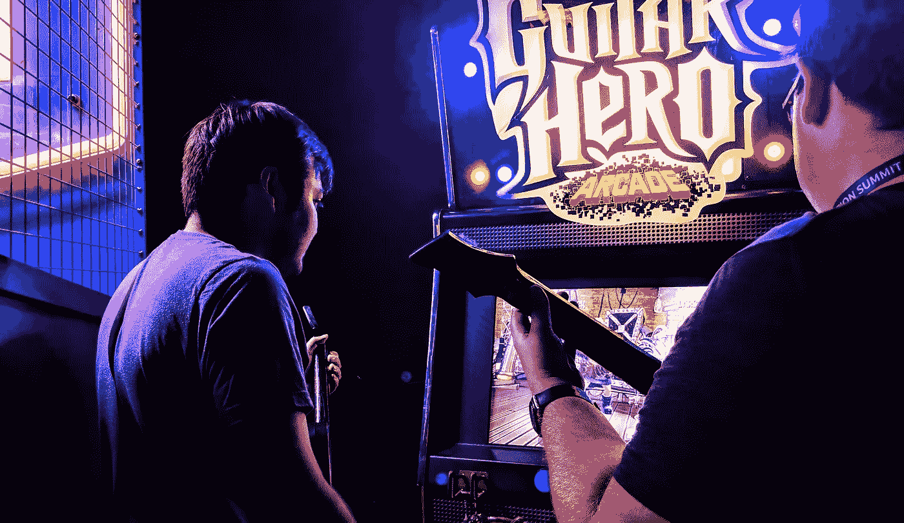
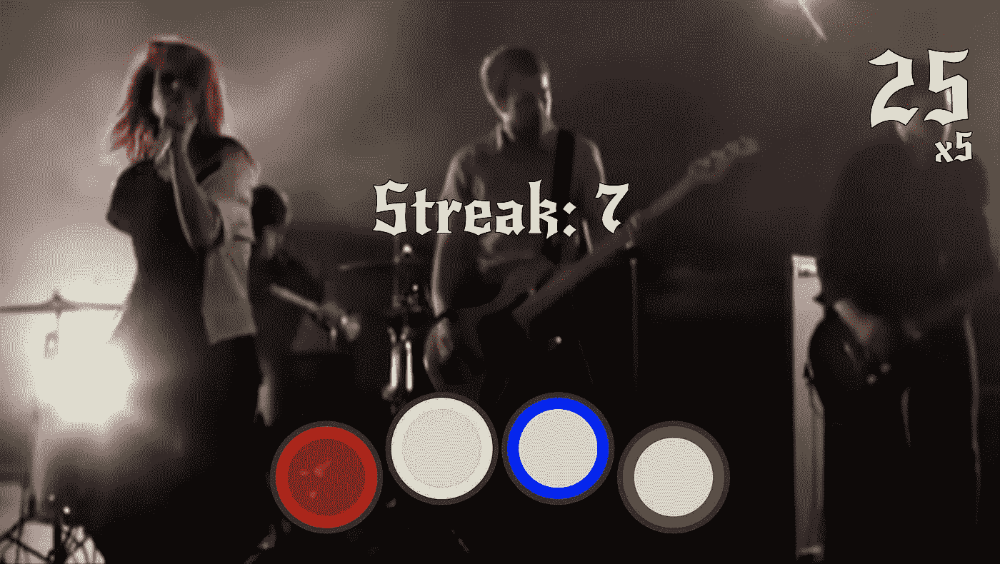
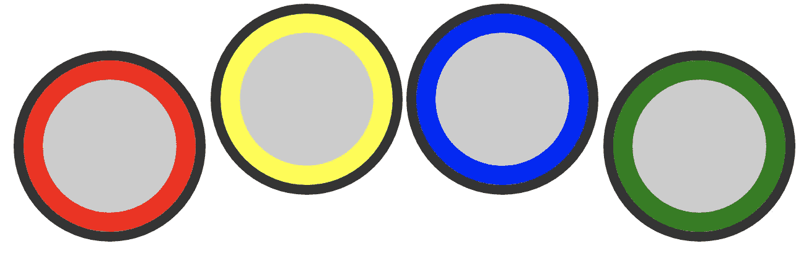
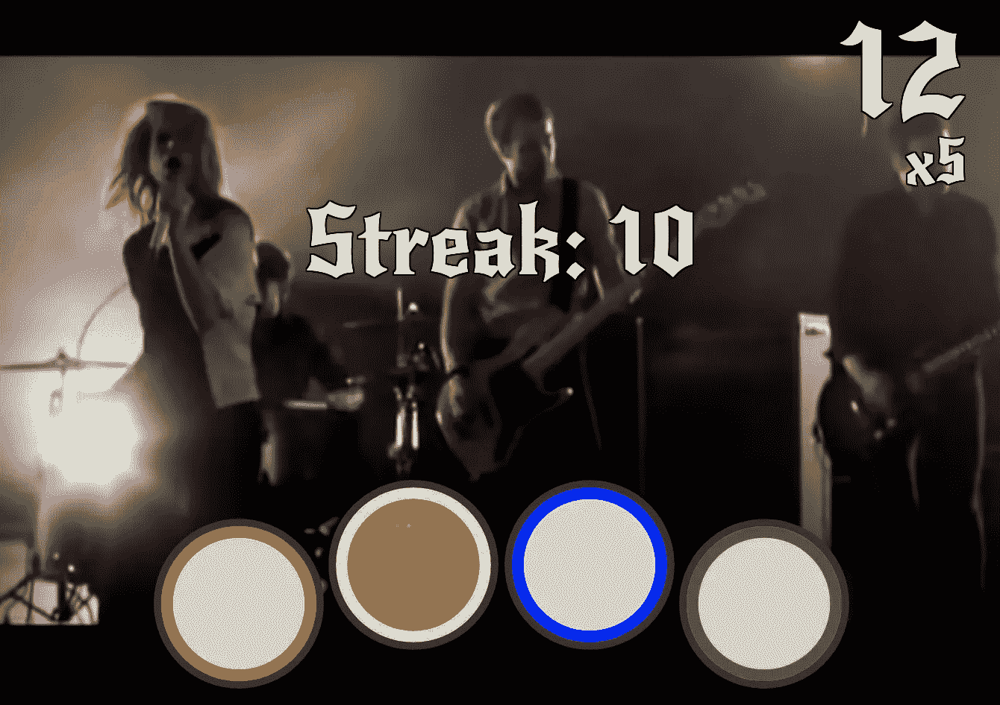

# 用 HTML 和 JavaScript 开发一个简单的摇滚乐队游戏

> 原文：<https://betterprogramming.pub/develop-a-simple-rock-band-game-with-html-and-javascript-61270f708b6>

## 使用 Gamepad API 为所有级别构建音乐游戏

在本文中，我们将学习如何使用标准 HTML 和普通 JavaScript 开发一个简单版本的摇滚乐队或吉他英雄风格的游戏**。这是我们作为 [Codeland:Distributed](https://codelandconf.com/) 会议的一部分所做的“摇动游戏手柄 API”研讨会的简短版本。**

这将是一个小游戏(只需要 10 分钟！)，但它有一个很酷的因素:它将与连接到计算机的摇滚乐队 drumset 配合使用。特别是，我们将为 PlayStation 3 使用 Harmonix Drumset，但您可以使用不同的控制器。

让我们从展示结果开始:

我们在研讨会期间开发的游戏截图

尽管这篇文章会很短。因此，我们不会深入探究[游戏手柄 API](https://w3c.github.io/gamepad/)——我们在研讨会期间做过的事情——并将它的使用限制在我们需要的基本部分。

开始编码吧！

# 操作游戏控制器

首先，我们需要读取连接/断开事件，并保存连接的游戏手柄的唯一标识符:

现在我们将开发包含游戏最关键部分的代码:检查游戏手柄中是否有变化的方法。为此，我们将创建一个新功能，游戏手柄连接后浏览器将调用该功能:

现在，那个函数是空的，它是[使用](https://developer.mozilla.org/en-US/docs/Web/API/window/requestAnimationFrame) `[window.requestAnimationFrame](https://developer.mozilla.org/en-US/docs/Web/API/window/requestAnimationFrame)`不断地调用自己。我们使用那个方法是因为它比`setTimeout`或`setInterval`更可靠，并且我们知道它将在屏幕刷新之前被调用(这很方便)。

我们将有一个游戏手柄/鼓连接到计算机，但我们将遍历列表，而不是直接访问唯一标识符。我们这样做是为了保持一致性，以防连接多个游戏手柄(如果你开发多人游戏版本，这可能会很有帮助。)

当我们遍历游戏手柄列表时，我们将读取它们的按钮，稍后我们将需要访问这些按钮:

现在我们有了按钮列表，下一步是遍历该列表，检查是否有任何按钮被按下。

我们可以在同一个`readValues`函数中这样做，但是为了方便以后扩展，可以把它分开，所以我们将创建一个新函数来处理按钮被按下的事件:

我们已经处于一个很好的位置，因为我们检测到每个按钮被按下的时间。至此，我们已经完成了一半(简单的)游戏引擎。我们仍然需要生成音符/按钮的随机序列，但在此之前我们需要处理一个问题。

如果您一直在编写代码，那么您会注意到，当您按下一个按钮时，`buttonPressed`函数会被多次调用。发生这种情况是因为无论我们尝试多快，按钮按下的时间都超过了 16 毫秒，这使得按钮按下的时间超过了屏幕刷新的一个周期，最终导致`readValues`和`buttonPressed`被调用了不止一次。

为了避免这种行为，我们将添加一个新的变量来保存按钮的状态，并且只在按钮的前一个状态是“未按下”时调用`buttonPressed`

我们正在处理所有与鼓组相关的代码。所以剩下的大部分逻辑将不会与游戏手柄管理有关，而是与游戏本身有关。

# 游戏逻辑编码

首先，让我们生成一个随机按钮来按。我们用的是架子鼓，按键是 0–3，会让我们的生活更轻松。

> *注意:您的鼓机或游戏手柄上的按钮可能会有不同的顺序。我们连接到浏览器的 Harmonix 有以下顺序:红色(按钮 2)、黄色(3)、蓝色(0)和绿色(1)。我们将相应地开发，确保这与你的架子鼓/吉他/控制器一起工作。*

[用](https://developer.mozilla.org/en-US/docs/Web/JavaScript/Reference/Global_Objects/Math/random) `[Math.random()](https://developer.mozilla.org/en-US/docs/Web/JavaScript/Reference/Global_Objects/Math/random)`生成随机数很简单。我们需要确保我们在正确的时间调用它:

*   在游戏开始的时候。
*   在处理了正确的按钮按下事件之后。

其代码如下:

现在，什么是没有分数的游戏？让我们继续增加点数并记录正确弹奏的音符。

至此，我们完成了整个游戏:

*   使用游戏手柄 API，我们读取鼓中的点击。
*   我们生成一个目标按钮。
*   我们检测用户是否按下了目标按钮。
*   如果是，我们生成一个新的目标按钮。
*   我们跟踪点和条纹。

但是少了一件大事！玩家看不到分数，也看不到该按哪个按钮。到目前为止，我们只做了 JavaScript，所以玩家根本看不到任何东西！

是时候让 HTML 和 CSS 来拯救我们了。

# 创建界面

让我们从向 HTML 添加所有关键部分开始:点、条纹和一组鼓。

然后我们设计鼓的样式:

鼓现在看起来像这样:

提起中间的鼓，以匹配真正的 PS3 鼓组

至于点和条纹值，我们只是将它们放置在页面中:

完成游戏前的最后一部分是将 JavaScript 与 HTML/CSS 连接起来，这样屏幕就会显示游戏中的值。

对于点和条纹，我们可以在`generateNewRandomActive()`函数中完成。请记住，它在游戏开始时被调用，每次按下正确的按钮时:

至于哪个按钮是下一个要点击的，我们将通过 JS 向 drumset 添加一个类，并使用 CSS 样式化相应的按钮(为鼓设置半透明版本的背景):

这样，我们就完成了游戏:我们点击了正确的鼓，选择了一个新的随机鼓，我们看到了分数和连胜记录，等等。

# 添加一些耀斑

但是让我们现实一点。游戏可以，但是太简单了。它缺少一些*的潇洒*:

*   屏幕看起来大部分是白色的
*   字体是 Times New Roman……没有多少摇滚乐

纠正字体问题很简单。我们需要选择一种更合适的字体，比如谷歌字体:

最后是樱桃色上衣。为了去掉所有的白色，使它看起来更像游戏，我们将放一个实际的视频作为游戏背景。

为此，在 Youtube 或其他视频服务上浏览视频，点击“分享”按钮，然后选择“嵌入”复制`<iframe>`代码并粘贴到 HTML 的开头:

确保将视频`iframe`的大小调整到 100%，并将`?autoplay=1&controls=0`添加到视频中，这样控件将不会显示，视频将自动开始播放。

> 技巧:你可以添加一个播放列表，而不是使用视频。然后视频会一个接一个。

并使视频容器占据整个屏幕:

最后一次触摸，我们完成了，游戏看起来更好了:

游戏截图使用帕拉摩尔的视频“无知”

对于一个只有 150 行代码(16 个 HTML + 73 个 CSS + 61 个 JS)的游戏来说还不错，而且没有使用任何库，只有标准和普通的 JavaScript。

如果你想探索代码，[游戏在 Codepen](https://codepen.io/alvaromontoro/full/abdMQzL) 上(你需要一个游戏手柄来玩这个版本):

我们在研讨会期间开发的实际游戏

# 结论

这个游戏不像原来的摇滚乐队和吉他英雄游戏那么复杂，但是对于一个人 10 分钟开发出来的东西来说还是很有趣的。

它非常适合还不会玩真正游戏的孩子(我的孩子喜欢这个版本)，并且它有很多扩展和改进的空间:

*   添加助推器/组合倍增器
*   在连续 10+，20+，30+后添加鼓励信息
*   将它与 Youtube API 集成，以检测歌曲/视频的结尾并显示统计数据
*   将它与其他 APIs 插件结合起来，以检测音乐何时变大，从而加快节奏
*   添加一个带有注释和时间的 JSON 文件，这样注释会在合适的时间从顶部落下…

许多改进并不需要太多时间，使得游戏更像真实的游戏。

享受编码！