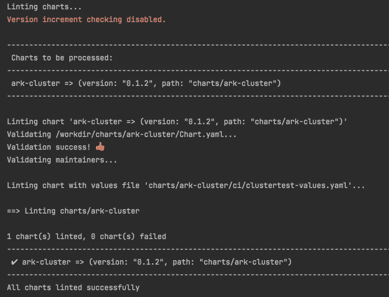
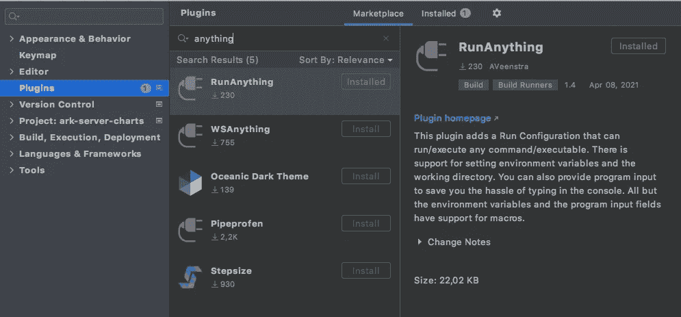
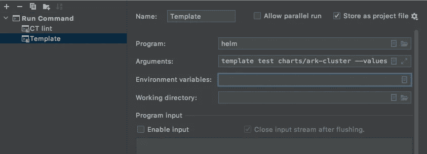
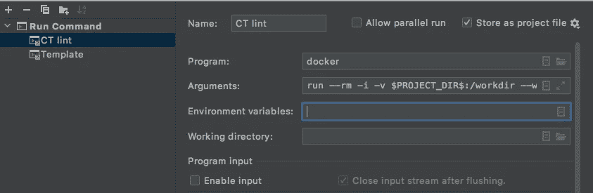
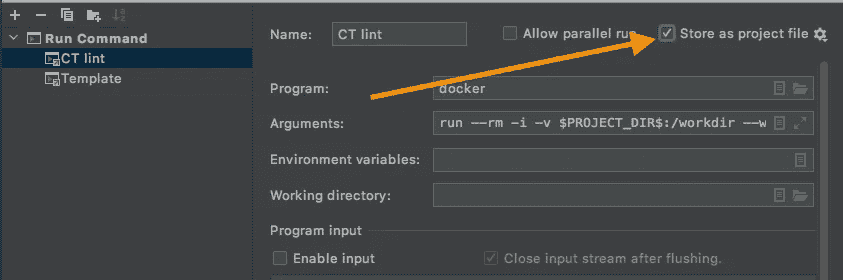

# 像专业人士一样开发舵图

> 原文：<https://betterprogramming.pub/develop-helm-charts-like-a-pro-a9fea5a33fe5>

## 使用 PyCharm 运行配置的强大功能来节省时间


蒂姆·莫斯霍尔德在 [Unsplash](https://unsplash.com/s/photos/gears?utm_source=unsplash&utm_medium=referral&utm_content=creditCopyText) 上拍摄的照片



PyCharm-CE 中的 ct lint 输出

# 开发新应用

在为 [Kubernetes](https://kubernetes.io/) 开发新应用时，开发人员开始参与 [Helm](https://helm.sh/) 图表的创建。这可能很乏味，而且每当您更改图表中的语法或间距错误时，您可能会浪费大量时间等待 CI 管道运行。

由于大多数 ide 和 [PyCharm-CE](https://www.jetbrains.com/pycharm/download/#section=windows) 也提供运行配置，所以您可以通过向 IDE 添加图表项目的模板和 lint 配置来简化工作。

## 舵绒布和模板

从本地安装或通过 Docker 运行 Helm:

```
helm lint charts/mychart# ordocker run --rm -i -v $PWD:/workdir --workdir /workdir alpine/helm \
  helm lint charts/mychart 
```

您还可以用想要使用的值来制作图表模板:

```
helm template test charts/mychart \
  --values chart/mychart/ci/test-values.yaml# ordocker run --rm -i -v $PWD:/workdir --workdir /workdir alpine/helm \
  helm template test charts/mychart \
  --values chart/mychart/ci/test-values.yaml
```

**提示:**您还可以向 Helm 传递一个逗号分隔的`values`文件列表。

## 图表测试工具

与 Helm 类似，[图表测试](https://github.com/helm/chart-testing)应用程序(`ct`)打印您的图表，但它也做一些额外的检查，并且是可配置的。它还可以用来测试对 Kubernetes 集群的部署，这在与`kind`一起使用时非常方便。(我在参考资料中链接了下面的一篇文章。)

**提示** *:* 用`brew install chart-testing`安装图表测试。

您可以在本地运行`ct`,也可以使用 Docker:

```
ct lint --all --chart-dirs=charts# ordocker run --rm -i -v $PWD:/workdir --workdir /workdir \
  quay.io/helmpack/chart-testing ct lint --all --chart-dirs=charts
```

如果您有一个可以部署的 Kubernetes 测试集群，您可以使用`ct`进行测试部署:

```
ct install --namespace test --all --chart-dirs=charts# ordocker run --rm -i -v $PWD:/workdir --workdir /workdir \
  -v $KUBECONFIG:/root/.kube/config --network host \  
  quay.io/helmpack/chart-testing ct install --namespace test \
  --all --chart-dirs=charts
```

**提示:** 使用 Docker 将**而不是**在 macOS 或 Windows 上工作，因为 Docker 不是在主机上本地运行的。但是你可以用`brew install chart-testing`轻松安装图表测试。

# 运行配置

在 PyCharm 中，您可以轻松安装额外的插件来设置您的跑步配置。一个非常有用的插件是[运行任何东西](https://github.com/AVeenstra/RunAnything)，因为它允许你运行任何工具或命令。

**提示:**用`brew install --cask pycharm-ce`安装 PyCharm-CE。



PyCharm 的 run any 插件

这样，您可以设置以下运行配置，以便在将图表推送到上游之前快速检查图表。

## 舵模板运行配置

添加上面的`helm template`命令，使用或不使用 Docker 来设置您的运行配置。



PyCharm 运行配置:头盔模板

## 图表测试 lint 配置

添加上面的`ct lint`命令来设置您的运行配置。



PyCharm 运行配置:ct lint

你可以用`$PROJECT_DIR$`引用你的项目目录。

## 分享您的跑步配置

您可以启用复选框来保存项目的运行配置，并与协作者共享它们:



与您的项目共享您的运行配置

# 资源

[](https://helm.sh) [## 舵

### Helm 是查找、共享和使用为 Kubernetes 构建的软件的最佳方式。Helm 帮助您管理 Kubernetes…

helm.sh](https://helm.sh) [](https://github.com/helm/chart-testing) [## 舵/海图-测试

### ct 是检验舵图的工具。它旨在用于林挺和测试拉请求。它…

github.com](https://github.com/helm/chart-testing) 

## 用 KinD 测试和部署你的舵图

[](/how-to-continuously-test-and-deploy-your-helm-charts-on-kubernetes-clusters-using-kind-d71e3585d2dc) [## 如何使用 Kind 在 Kubernetes 集群上持续测试和部署您的舵图

### 设置 CI/CD 工具，轻松发布图表

better 编程. pub](/how-to-continuously-test-and-deploy-your-helm-charts-on-kubernetes-clusters-using-kind-d71e3585d2dc) 

## 使用 Circle-CI 部署到 KinD 的示例图表

[](https://github.com/DrPsychick/charts) [## 心理检查/图表

### 包含有用图表的知识库，如 cronjobs。通过在…上创建帐户，为 DrPsychick/charts 的发展做出贡献

github.com](https://github.com/DrPsychick/charts) 

## 通过 GitHub 动作使用图表测试

[](https://github.com/helm/charts-repo-actions-demo) [## 舵/图表-回购-行动-演示

### 用 GitHub 页面和动作演示测试和托管图表库的示例项目。主人支持舵 3…

github.com](https://github.com/helm/charts-repo-actions-demo)