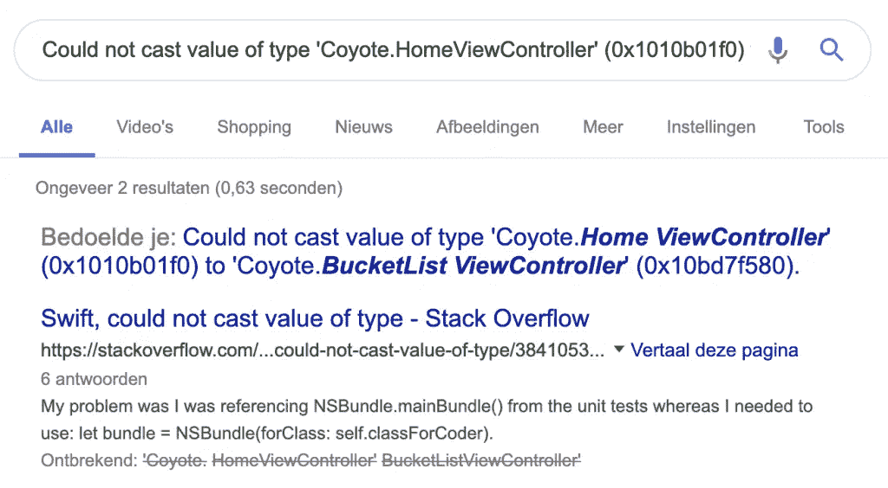
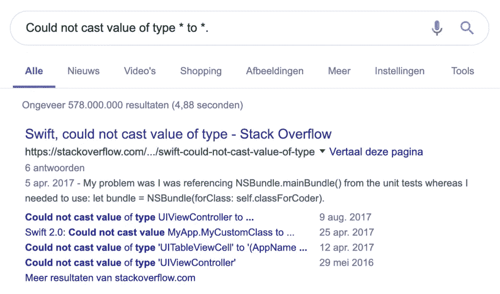
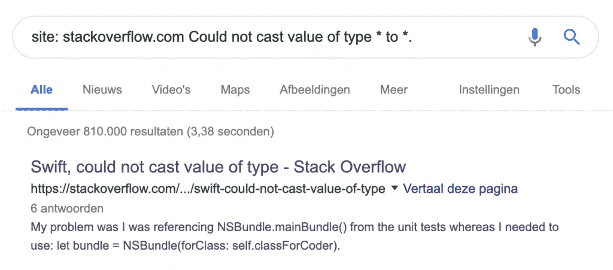
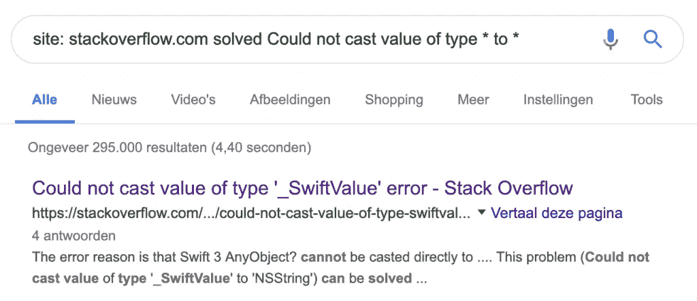
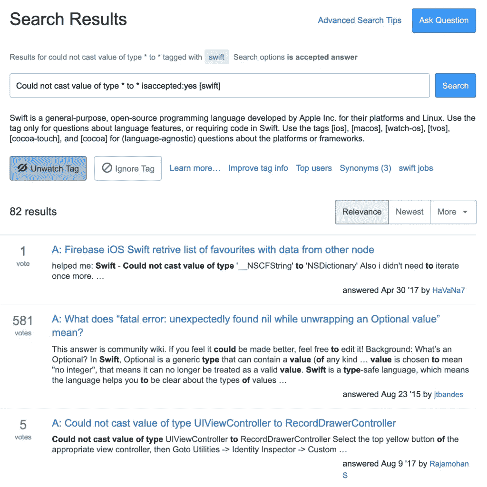

# 使用 Google 搜索提示和技巧提高开发人员的工作效率

> 原文：<https://betterprogramming.pub/developer-productivity-boost-with-google-search-tips-tricks-9ae384602e22>

照片由[安德里亚斯·克拉森](https://unsplash.com/@schmaendels)在 [Unsplash](https://unsplash.com/photos/gZB-i-dA6ns) 上拍摄

你可以做很多事情来加快交付时间，正如我在我的文章“加速开发:技巧集”中所描述的但是在这里，我将更详细地解释我每天使用的技巧和窍门，以便更快地找到我的答案。

# 使用通配符星号*

当您在 Xcode 中遇到问题时，您通常会收到包含特定类型的错误信息。

搜索包含特定类型的生成错误

尽管你经常会发现你的答案中有一些常见的错误，但它并不总是那么有效。

为此，您可以使用通配符星号`*`。

你只需用`*`替换你的特定类型，就像我们在这个例子中看到的`Coyote.HomeViewController (0x1010b01f0)`和`Coyote.BucketListViewController (0x10bd7f580)`。这包括您的应用程序名称、类名和指针，这些都是您的应用程序所独有的。你在谷歌上输入的最后一个关键词是:

在搜索词中使用星号提高开发人员的工作效率

上述改进总共产生了 578.000.000 个结果，而没有星号的结果总共只有两个。正如你在上面的例子中看到的，搜索结果更加精确，更有可能是你所需要的。

# 使用特定的域

如果您知道在哪里搜索，开发人员的工作效率会得到更大的提高。如果您在搜索一个特定的代码示例，很可能您会想要搜索[堆栈溢出](https://stackoverflow.com)。以上面的例子为例，我们将进行如下搜索:

使用特定网站进行目标搜索

这将结果的数量缩小到 810，000。结果对我们的情况来说更加具体，并且更有可能包含我们正在寻找的答案。

# 使用“已解决”作为额外的搜索词

虽然它不是谷歌官方支持的功能，但它确实可以通过过滤掉未解决的问题来提高开发者的工作效率。

使用“已解决”搜索词查找已解决的答案

这将结果的数量缩小到 295，000，使我们更加接近正确的答案。

如果你想知道为什么我把 solved 关键字放在开头而不是结尾，这确实有所不同。关键词的顺序影响优先级，带来不同的结果。

事实上，上例中在末尾使用 solved 的第一个结果并没有被标记为在堆栈溢出时解决。然而，谷歌可能足够聪明，能够根据它的数据找出一个答案是否是好的。

## 使用“已接受”而不是“已解决”

您可能希望在堆栈溢出中使用“accepted”而不是“solved”。当堆栈溢出将答案标记为已接受，而不是将问题标记为已解决时，这样做效果更好。然而，“已解决”似乎在其他网站上运行得更好。

# 直接在堆栈溢出上搜索不是更能提高开发人员的生产力吗？

嗯，你可能认为那是真的。然而，在他们的搜索页面上搜索相同的答案并没有那么[高效](https://stackoverflow.com/search?q=Could+not+cast+value+of+type+*+to+*+isaccepted%3Ayes+%5Bswift%5D)。即使只搜索与 Swift 相关的答案和问题，包括一个被接受的答案，搜索结果也相当令人失望。

直接搜索堆栈溢出并不总能提高开发人员的工作效率

虽然这是特定于堆栈溢出的，其他网站可能在这方面做得更好，但也可能是其他网站有同样的问题。所以，要一个一个来，有时候要自己去发现。

# 其他搜索示例

上面的例子对于寻找特定代码问题的答案非常有用。然而，有时您想要找到其他东西，比如用 Swift 编写的文档扫描库:

在 GitHub 上搜索特定的 Swift 库

或者你可能想找一篇特定的 [SwiftLee](https://www.avanderlee.com/) 博客文章。

查找特定的 SwiftLee 博客帖子

或者，如果你想教别人如何在谷歌上搜索 Swift 博客，试试[这个](http://lmgtfy.com/?q=site%3A+avanderlee.com+swift+blog)。

我希望这能提高开发人员的工作效率。