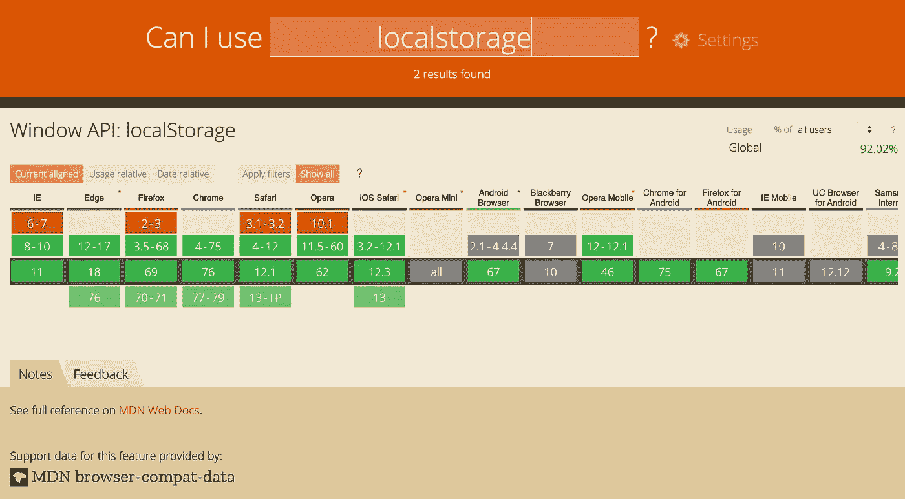
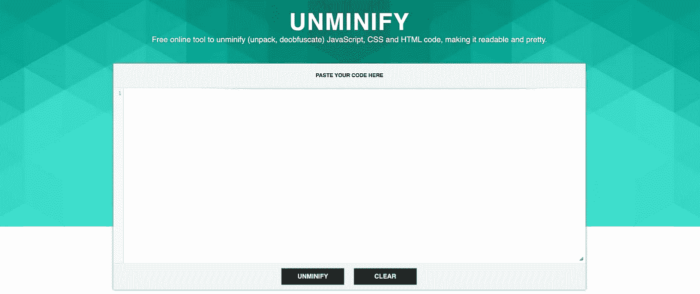
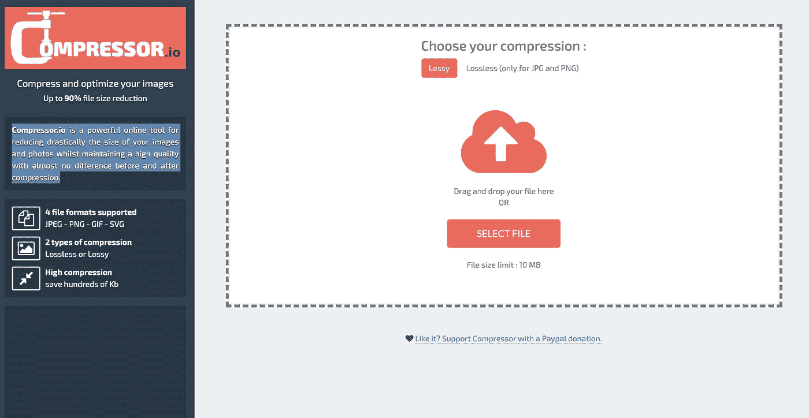
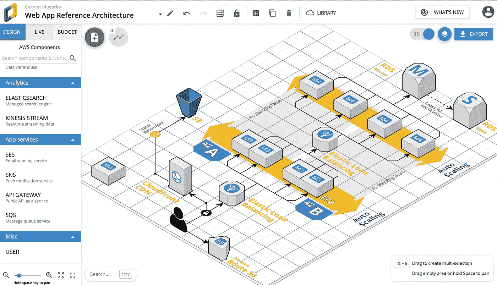
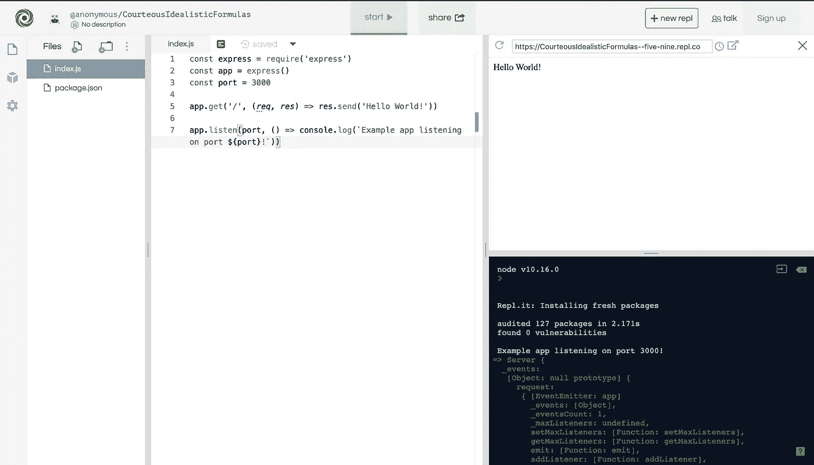
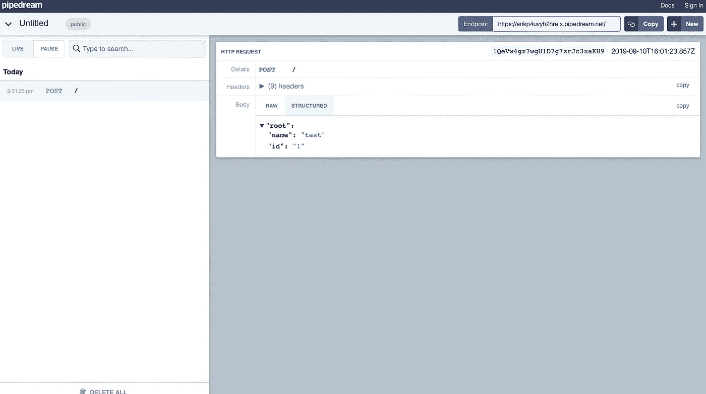
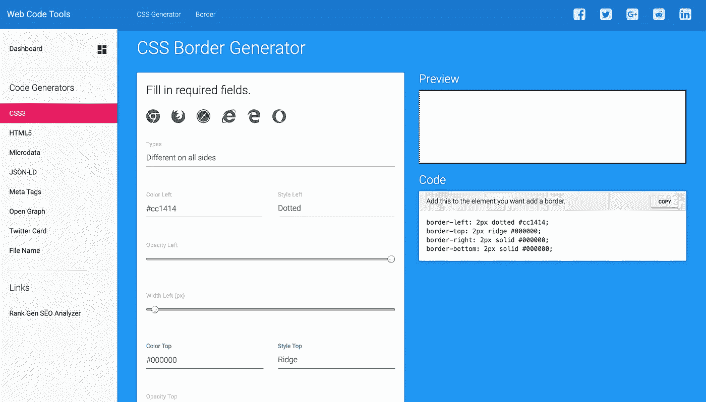
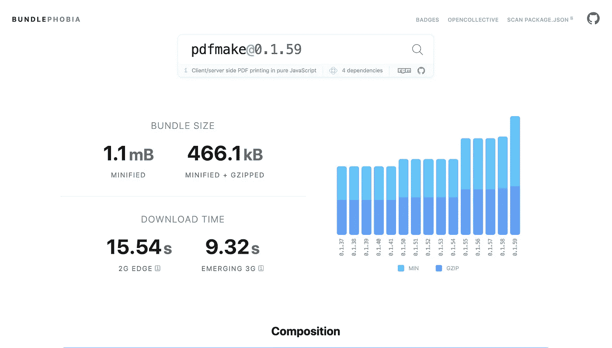
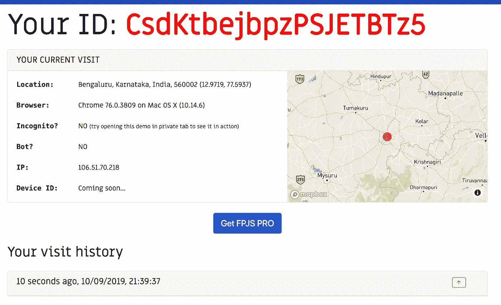

# 提高生产力的开发工具

> 原文：<https://betterprogramming.pub/developer-tools-to-increase-your-productivity-6f4ec0c96dd9>

## *让你生活更轻松的 9 种工具*

由 [Markus Spiske](https://unsplash.com/@markusspiske?utm_source=unsplash&utm_medium=referral&utm_content=creditCopyText) 在 [Unsplash](https://unsplash.com/s/photos/tool?utm_source=unsplash&utm_medium=referral&utm_content=creditCopyText) 上拍摄的 BG 图像

互联网不只是帮助你学习如何编码，还有很多有用的在线工具可以在开发的不同阶段帮助你，节省你在每项任务上花费的宝贵时间。

这里有一个在线工具的列表，对任何开发者来说都很方便(排序不分先后)。

# 1.我能用吗

如果您想知道任何 web APIs(例如:本地存储)的浏览器兼容性，可以使用**吗？它提供了更新的支持表，以确定桌面和移动浏览器对 API 的支持。**

****

**测试浏览器上本地存储的兼容性**

# **2.不均匀**

**[Unminify.com](https://unminify.com/)是一个免费的在线工具，可以解包(解压)JavaScript、CSS 和 HTML 代码，使其可读且美观。这是最常用的代码美化网站之一。**

**发现很难读懂没有缩进的代码或者只包含一行不可读代码的文件？只需复制粘贴您的代码，使其在不到一秒钟的时间内变得清晰易读。**

****

**unminfiy.com**

# **3.压缩机**

**图像大小是决定网站加载时间的主要因素。**

**[Compressor.io](https://compressor.io/) 是一款在线工具，可以在不降低图像质量的情况下缩小图像尺寸。工具太好了，图像压缩前后几乎没有区别。**

****

**compressor.io**

# **4.Cloudcraft**

**[Cloudcraft](https://cloudcraft.co/) 帮助你设计和预算你的云。它有一个非常酷的拖放界面，通过连接不同的云基础设施服务来创建 3D 图表(目前仅用于 [AWS](https://aws.amazon.com/) )。**

**它有一个预算选项卡，可为您提供当前体系结构的成本明细。**

****

**使用 AWS 服务规划云架构。**

# **5.回复它**

**Repl.it 是你多年来一直在寻找的完美的在线集成开发环境。你可以在不到两秒钟的时间内为你喜欢的语言或技术栈启动任何编程环境。**

**它支持所有现代语言，如 Python、[、Kotlin](https://kotlinlang.org/) 、 [Ruby](https://www.ruby-lang.org/en/) 和 JS。您可以安装库或包并直接使用它们，而不必下载或管理它们。**

**您可以通过共享 repl.it 链接直接共享您的代码，还可以嵌入一个`repl.it`供您的用户与代码交互。**

****

**在节点服务器环境中使用 Express JS。**

# **6.RequestBin**

**RequestBin 为您提供了一个即时 HTTP 端点，它将收集所有发送的请求，以便您可以轻松地解释它们来检查和验证数据。**

**当您必须调试来自不同网站的 webhook 请求，并且您不知道您可能收到的数据的确切结构或类型时，它会非常有用。**

****

**通过对端点的 post 请求接收的数据。**

# **7.Web 代码**

**Web 代码是最好的代码生成器之一。只需输入您的需求，您就可以为各种基本和高级需求生成代码。**

**这对于不熟悉 HTML 和 CSS 的 web 开发人员来说非常有用。**

****

**为四边的不同边框生成 CSS 代码**

# **8.捆绑恐惧症**

**自从现代前端框架出现以来，人们就希望尽可能地降低包的大小，以减少用户的页面加载时间。**

**[BundlePhobia](https://bundlephobia.com/) 帮助你分析一个`npm`包能给你的项目增加多少大小。

您可以将您的`package.json`文件直接上传到网站，以获得项目中所有包的分析或搜索单个包的详细信息。**

****

**计算 pdfmake 库的大小**

# **9.指纹. js**

**去过那里，做过那个。通过网站从浏览器获取唯一标识符列表并不是一件容易的事情。**

**幸运的是，这个令人敬畏的[库](https://fingerprintjs.com/)产生了一个独特的浏览器标识符，而没有使用 cookies 或任何恶意用户可以轻易重置的数据。它可以从 web 浏览器中快速提取大量属性，这些属性可以单独使用，也可以创建一个哈希来识别唯一的用户。**

**它是移动设备上 UUID 设备的最接近的替代品，你可以为你的网络项目得到它。你可以通过 CDN 使用它，或者使用`npm`包安装它。**

****

**从浏览器中提取用户信息。**

**目前就这样，我将很快发布一个最有用的公共 API 列表。同时，你可以阅读我的另一篇文章，关于更好的 UX 的 Web APIs，关于更好的编程的 T2。**