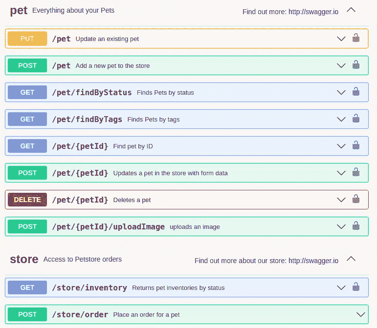

# 2022 年的开发者趋势— API 民主化和 API 管理

> 原文：<https://betterprogramming.pub/developer-trends-of-2022-api-democratization-and-api-management-ca61031e6dd2>

## 我们关注的趋势

斯蒂芬·道森在 [Unsplash](https://unsplash.com?utm_source=medium&utm_medium=referral) 上拍摄的照片

如果您是任何类型的现代应用程序的开发人员，那么您可能不仅仅是熟悉 API——您可能是高级用户。今天，为消费者和无止境内容的生产者构建的应用程序是相互连接的。API 是连接这些应用程序的粘合剂，充当独立服务之间通信的主要工具。

随着近年来 API 的使用、开发和产品化的迅猛发展，我们看到了一个即将出现的新趋势:API 民主化和 API 管理。在这篇文章中，我们将看看 API 的过去和未来，特别是考虑 API 民主化和管理在 API 未来中的作用。

# API 在哪里

让我们从回顾过去开始，研究对 API 的需求最初是如何产生的，以及为什么 API 在历史上一直是开发者的专属领域。

## 作为契约的 API

API 代表双方之间的契约。这两方是服务的提供者(有时称为服务器或发布者)和消费者(有时称为客户)。API 是一个双方同意的接口(API 中的 I ),双方将使用它进行通信。该接口包括关于如何到达 API(URL)、消息格式、可以执行的动作以及通信的安全性要求的规定。

[Swagger Petstore](https://petstore3.swagger.io/) 是遵循 [OpenAPI 规范](https://spec.openapis.org/oas/v3.1.0)的 API 定义的经典例子。每个 API 端点都有一个明确定义的 URL 和请求方法，以及对安全性、请求和响应格式的要求和期望。

在今天的世界中，API 通常被期望通过 SOAP 或 REST 这样的样式或协议来访问。术语 API 今天的用法主要是指它们在 web 服务中的用法。然而，几十年前，应用程序中的不同组件(如本地、桌面应用程序)都有 API 来促进彼此之间的通信。

当时，API 只是用来抽象应用程序不同层的代码库。

随着 Web 2.0 的成熟和云计算成为标准，API 的使用范围扩大了，标准化了不同的黑盒应用程序如何相互通信。通过使用 API 来指定不同服务如何通信，这些服务的实现细节——包括使用的编程语言或框架——变得无关紧要。

这意味着所有不同种类的服务可以一起工作，只要它们都有定义良好的 API。API 允许应用程序跨多个服务器和数据中心扩展。

最近，专门围绕可用的 API 来设计和开发应用程序。组织正在寻找可用的创新 API——可能是开放和免费的，也可能是收费的——他们正在构建利用这些 API 的全功能应用程序(和整个企业)。这与过去的方向相反，过去的 API 是为了满足应用程序的需求而构建的。

## 开发人员是 API 设计的唯一贡献者

从一开始，API 就由开发人员根据利益相关者的需求来设计和构建。涉众将提供一组需求，开发团队将决定契约应该是什么并构建它。无论 API 是由内部开发团队构建的，还是与外部开发人员合作构建的，API 设计的任务都是开发人员的责任。

当时，这是有意义的，因为开发人员是构建 API 的人，坦率地说，他们是唯一了解 API 开发内容的人。

简而言之，涉众会放下需求文档，然后走开。在那之后，构建 API 的每一个剩余方面——从设计到开发再到部署——都完全属于开发人员的领域。

# API 的发展方向

随着 API 开发业务的转变，整个应用程序——在某些情况下，整个业务——都是围绕 API 套件构建的。这种转变带来了对两个新学科的需求:API 民主化和 API 管理。

## API 民主化

我们谈到了在过去，开发人员如何单独通知一个 API 的整个生命周期，这包括 API 设计。API 民主化包括开放 API 生命周期——特别是设计阶段——让组织中的其他人参与进来。

如果一个企业的唯一产品是一组暴露该企业秘密的 API，那么这些 API 的输入和输出就不仅仅需要开发人员的支持。从高管利益相关者到产品经理，每个人都需要参与 API 的设计。这不再仅仅是高度技术性的领域。

需要战略思维来确保公司的 API(与“产品”同义)不会重叠和产生多余的功能。公司必须确保它的每一个 API 都符合以下标准:

*   满足企业的销售需求。公司不应该出售顾客不愿意付钱的产品。类似地，API 必须给公司带来切实的价值，积极地影响底线。
*   应对它所服务的竞争环境。就像产品一样，API 构建组织必须熟悉他们的竞争对手。API 提供了什么价值主张？一个 API 能接触到哪一部分客户，它如何比竞争对手更有效地做到这一点？
*   设计时考虑到了未来的发展。新技术迅速出现。数据隐私和安全法规是一个不断变化的目标。消费趋势从一个季度转移到下一个季度。API 的设计是否能够承受和适应这些变化？

业务分析师不再能够简单地创建规范并将其交给开发团队。相反，必须进行更规范的过程，确保正在开发的 API 实际上满足企业各个层面的需求，无论是内部使用还是外部使用。

现在，成功交付 API 和基于 API 的应用程序需要每个人都参与进来。这对企业意味着什么？这意味着需要采用能够促进这种民主化方法的工具和平台。这些平台将提供低代码或无代码的 API 设计工具，使利益相关者能够与开发人员一起充当副驾驶。

孤立的开发已经成为过去；API 民主化正在取而代之。

## API 管理

这将我们带到 API 开发正在改变的下一个领域:API 管理策略。API 管理简化了跟踪公司发布的所有 API 及其版本、环境和用途的任务。

如今，企业构建的应用程序可能依赖于成百上千个 API。这些 API 被部署到内部数据中心和多个云提供商，其中一些可供公众使用，而另一些只有特权或私有的内部访问权限。有些 API 甚至可以为特定的消费者定制。此外，每个 API 可能有多个支持的版本。

在这种规模和变化的情况下，仅靠源代码控制和电子表格来管理 API 已经不可能了。

接受“API 即业务”趋势的企业需要依赖能够处理现代 API 开发的规模和范围的工具。API 管理工具可以帮助组织跟踪以下内容:

*   版本
*   部署环境
*   部署位置
*   客户(API 消费者)
*   使用指标
*   互用性
*   与其他 API 的关系
*   属国

API 管理工具还可以通过 API 网关以及策略的实施、配置和管理提供更高级别的可靠性和安全性，这些策略包括但不限于:

*   限速
*   流量整形
*   数据屏蔽
*   各种类型的认证等。

尽管管理工具有很多种，但影响最大的是带有丰富 ui 分析的可视化工具，等等。同时仍然为开发运维团队提供 CLI 友好的功能。这样，团队可以在他们的技能和首选方法的范围内工作，同时仍然对工作流、API 消费和 API 生命周期中的活动有清晰的理解和控制。

当我们考虑当今企业中 API 需求的范围和规模时，手动和临时管理充其量是高风险和容易出错的。然而，有效的 API 管理工具可以简化和精简曾经令人望而生畏且不可能完成的任务。

# 新一代的工具

新一代的工具中有 [Gravitee](https://www.gravitee.io/) 解决了 API 不断发展的业务。Gravitee 平台包括一些工具，可以帮助任何组织实现有效的 API 民主化和管理。它的 API designer 是一个协作工具，提供了 API 设计的流程图方法。

业务涉众、产品经理和开发人员可以一起工作，将需求规范转化为高质量的 API 定义和数据模型。这对于选择采用设计优先方法进行 API 开发的团队尤其有用。

除了设计之外，API 网关和管理控制台还提供了以下特性:

*   使用拖放策略工作室进行低代码/无代码策略配置
*   实现 API 计划和合同来管理和控制消耗的能力
*   API 文档管理
*   将 API 及其文档推送到面向消费者的开发人员门户的能力
*   协调协议和将同步 API(即 REST APIs)连接到异步系统和 API(即集中式 Kafka 后端)的灵活性

Gravitee Cockpit 是一个基于云的工具，用于集中管理企业的整个部署。使用 Cockpit，组织可以查看、管理和访问他们的 Gravitee 实例和环境，并且他们可以在这些不同的环境中推广 API。

# 结论

几十年来，应用程序开发已经从独立的、整体的应用程序发展到分布式的、全球可访问的、云托管的庞然大物，它们可以成为企业的驱动力。在今天的 API 开发环境中生存和竞争需要组织的转变。

这种转变包括采用促进 API 民主化和简化管理的工具。随着组织开始使用这些工具，这只会提高其流程的效率并减少交付时间。