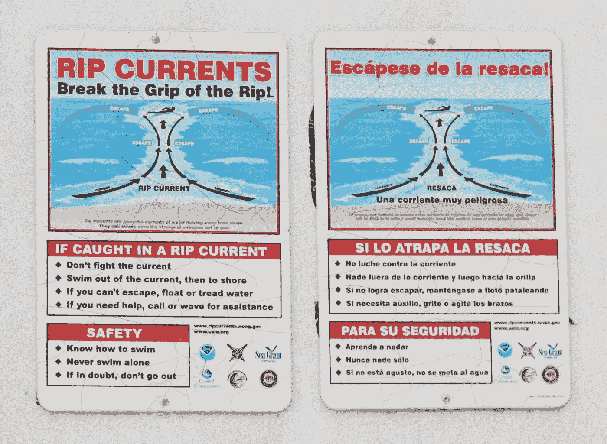

# 开发者和 Rip 电流效应

> 原文：<https://betterprogramming.pub/developers-and-the-rip-current-effect-5b8d4b8a8d67>

## 你可以呆在里面，但是只有一个办法出去

由 [Unsplash](https://unsplash.com?utm_source=medium&utm_medium=referral) 上的 [Mael BALLAND](https://unsplash.com/@mael_balland?utm_source=medium&utm_medium=referral) 拍摄的照片

# 铅字铸造

与程序员对类型化的理解相反，在类型化的理解中，某些东西被制作成暂时不同的东西来行动和出现，好莱坞对类型化的定义是完全相反的。

想想[马修·佩里](https://www.imdb.com/name/nm0001612/)，电视节目[的朋友](https://www.imdb.com/title/tt0108778/)的名气。在他的许多长片中，他基本上还是钱德勒·宾。

除了穿着背心的拉丁坏蛋，你还能想象米歇尔·罗德里格兹是什么样子吗？

塞斯·罗根怎么样？同样的人，同样的角色，不同的电影。同样的道理也适用于杰森·斯坦森、丹尼·特雷霍以及更多的电视和电影明星。

基本上，这些演员被定型为角色，这些角色定义了我们观众对他们的看法。我们看不到他们出演任何其他角色。雇用他们的选角导演也不能。制片厂知道，如果米歇尔·罗德里格兹在一部浪漫喜剧中扮演主角，我们就无法停止怀疑。这并不是因为这些戏剧是一维的；是因为我们只愿意在非常有限的范围内接受他们。

这些演员基本上都是一遍又一遍地扮演同一个角色。只要能付得起账单就行，对吧？

# 这种循环很早就开始了，并且持续了很长时间

虽然类型演员可能看起来是一维的，但从某种意义上来说，软件开发人员确实变成了“只会一种把戏的小马”

“一招小马”这个词太苛刻了。开发人员通常在他们各自的领域拥有广泛的技能。将它们称为“一招”是不公平的。我所指的独特技巧是他们目前正在使用的技术堆栈。

系统程序员将从事另一项系统编程工作。游戏开发者会从一个工作室到另一个工作室，追求或多或少相同的“游戏开发者”角色。通常，这些变动是为了追求更高的工资、津贴、头衔等。

网站开发人员通常会从一个网站开发人员的工作到下一个。再深入一点，这位开发人员可能会从主要使用 React 的角色转变为另一个也需要 React 的角色。Angular 开发者将寻找机会继续使用 Angular。前端开发人员会试图继续从事前端技术的工作，选择不去应聘侧重于后端开发的工作，反之亦然。

更不用说，对于一个拥有某种技能的程序员来说，很少会很难或很有挑战性地从事另一项编程工作，即使对于外行来说，也是“仍然在用计算机编程和工作，对吗？”

Web 开发人员通常不会申请系统编程工作，游戏开发人员通常也不会参与 SQL 开发人员的竞争。

## 如果是你在招聘呢？

将自己置于招聘经理、人才筛选员或招聘人员的角色中。你会让一个有十年 C#和 web 开发经验的开发者去做游戏开发吗？就算游戏工作室用了 C#，有十年游戏编程 C#的候选人不是更合适吗？web 开发人员可以带着备受赞誉的“全栈开发人员”的徽章进入，但在 Unity 或 OpenGL 领域，了解 JavaScript 和数据库开发可能并不那么重要。

更不可能让一个 Java 开发人员扮演一个需要 C++的角色。尽管语言相似，但通常会有很多求职者的技能和经验更加一致。

## 作为一名开发人员，你希望得到什么？

当你寻找现在的工作时，你没有寻找那些要求或多或少与你的技能相匹配的工作吗？

如果你要寻找其他机会离开你现在的工作，你不会寻找类似的角色吗？

如果你是一个 C#开发者，你不会在搜索栏中输入“C#开发者”吗？

我敢打赌你会的，原因很简单:

1.  你知道你最有机会申请你有经验的工作。你知道可能会有技术面试部分；你清除这轮障碍的最好机会是在你选择的语言/平台中。
2.  你知道，如果你的技术与他们的不一致，筛选人员可能会拒绝你的申请。

作为开发人员，我们将自己归类或定型为同一个“一招”，因为这是最有意义的。

## 什么样的技术让你迈出了第一步？

你知道有多少开发人员大学毕业后声称他们想成为 SharePoint 开发人员？我甚至断言，许多大学生甚至从未听说过 SharePoint。然而，当然，有许多 SharePoint 开发人员已经在他们的岗位上工作了很多年。

你的“类型化”可能始于你离开大学或训练营的时候。作为一名应届毕业生，你可能会接受第一份或第二份工作。

为什么不呢？我知道我做到了。

你不顾一切，渴望进入“真实世界”你很兴奋，迫不及待地想投入专业编程。你想迈出第一步。

即使你认识到给你提供工作的公司并没有真正激发你的编程兴趣，当你走出学术领域时，你也不会太在意。你只是想成为一名程序员。

你告诉自己，你是在利用这家公司作为获得一些经验的垫脚石，为你的简历添加一些真正的编程，并为做你喜欢的事情获得报酬。

然而，岁月很快就会流逝。实际上，你可能会意识到，这种你不屑一顾的技术组合，或者仅仅被看作是一时的“就业冲动”，终究是一个不错的选择。你的报酬实际上与你的努力和个人满意度相称。你对自己的角色感到舒适和愉快。这段经历在你的简历上凝固了，现在你陷入了激流之中。

# 撕裂电流效应

我称之为撕裂电流效应。

当一个开发人员在他们职业生涯的大部分时间里被困在一个角色或技术栈中时，他们就被困在了一个激流中。

## 什么是裂流？

通常被错误地称为“撕裂潮”，撕裂流是一种穿过波浪的狭窄水体。被困在激流中的游泳者通常会通过直接在激流中向相反的方向游泳来耗尽自己的体力。摆脱激流的推荐方法是从自然水流中垂直游出。

来源于[维基百科](https://en.wikipedia.org/wiki/Rip_current)。

摆脱激流的唯一方法是脱离它的自然路线，转向一边。

# 是什么让开发人员保持领先

在 Rip 流中，将程序员留在同一个堆栈或他们的专业领域的力量是以下一些或全部的组合:

## 经济性和实用性

*   增加你的工作年限会让你的工资北移。你可以要求在你所选择的团队中拥有数年或数十年专业知识的人加薪。
*   软件技术发展很快。通过不断学习来保持当前的知识更容易。切换到一个完全不同的堆栈需要精神能量、时间和有意识的努力。
*   待在同一个岗位上，获得新工作的机会更大。你不太可能在薪酬相同的情况下跳槽到不同的岗位。
*   竞争可能会很激烈。当你进入一个新的堆栈时，已经有经验丰富的开发人员在技术面试中胜过你。

# 如何走出激流

如果你想摆脱你的技术堆栈呢？

如果你别无选择只能离开呢？想想 COBOL、Delphi、ColdFusion、ActionScript 等程序员。随着消费领域的平台变化，这些开发人员被迫学习新技能，或者将简历重新放入类似但不同的编程角色中。

就像真正的、自然的激流一样，生存的唯一方法是垂直离开。

作为一名想要走出去的活跃开发人员，您可以做以下事情:

1.  让自己保持新鲜感——尝试、学习和接触其他技术，最好是在你的目标堆栈中。提醒自己，你不想陷在你个人的激流中；在非工作时间积极改变，为退出做准备。
2.  愿意接受较低的工资，接受初级或入门级的角色——即使你是一个经验丰富的开发人员，在一个全新的团队中，你将是一个新手。接受吧。
3.  写一封出色的求职信——你的简历将会在新的一堆简历中缺少任何真实的经历。你必须在求职信中解释你为什么要做出改变。然后，希望招聘经理能够在你展示自己的时候接受你。
4.  准备一个作品集——对于应届大学毕业生来说，展示概念证明可能是个好主意，你在某个特定的堆栈中有多年的经验，在你想要的新堆栈中有一些工作产品。这又回到了需要推销自己的问题上。

如果你怀疑自己的专长所在的领域可能会在行业中耗尽，那么开始准备退出策略就完全取决于你了。如果你只是厌倦了你目前的角色，想要改变，那么准备和教育自己的责任就完全在你身上了。

请特别注意上面的第二点——这是你摆脱旧的进入新的最好方法。

# 投票

## 堆栈溢出的开发人员调查

随着 Stack Overflow 在开发人员中的广泛应用，我希望他们能在年度开发人员调查中包含这个主题。上一次我看的时候，我没有看到这个想法的探索。

Pinging 堆栈溢出…