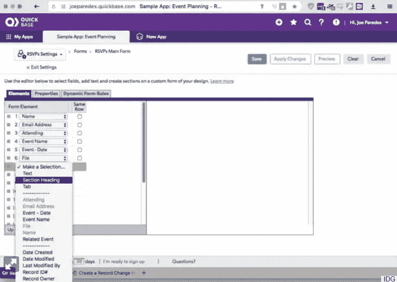

# 开发者:不写代码，后果自负

> 原文：<https://betterprogramming.pub/developers-go-no-code-at-your-peril-b50816311c82>

## 不要把无代码这个锚系在你的开发生涯上


杰森·黑眼在 [Unsplash](https://unsplash.com/s/photos/sinking?utm_source=unsplash&utm_medium=referral&utm_content=creditCopyText) 上的照片

在任何技术工作中，你得到的报酬中最有价值的是你在工作中学到的技能。

你的薪水很重要，但技能的增长会带来新的更具挑战性的机会，让你明天能拿到更高的薪水。不断学习，你的事业和薪水必然随之而来。

低代码/无代码软件工具对于快速构建商业应用程序来说是惊人的。不幸的是，这些工具中的专业知识不是一项基础或可转移的技能。这个专业知识不值钱。

它不是基础的，因为它不能帮助你更快地学习其他东西。学习编程语言理论是基础，因为一旦你掌握了它，学习任何新的编程语言都相对容易。

它是不可转让的，因为它使你成为在特定平台上开发无代码应用程序的专家。不是其他无代码平台，更不是定制软件开发。

这是所有低代码和无代码开发平台的致命弱点——虽然使用它们可能符合公司的最佳利益，但学习它们并不符合开发人员的最佳利益。

如果您是一名开发人员或正在努力成为一名开发人员，使用这些工具可能不会使您成为一名更好的开发人员。花时间学习这些工具可能会冻结你的成长。当其他开发人员从你身边驶过时，你将会像踩水一样，静止在巨大的开发海洋中。

让我们明确一下:

相比之下，有抱负的开发人员花了一年时间在无代码框架中为 Acme Inc .构建应用程序。他们学习术语、菜单系统、快捷方式、数据模型、集成等。这是我们有抱负的开发人员可能会使用一年的时间:



许多无代码开发平台中的一个

一年后，这位开发人员可能学到了很多关于无代码框架的知识。Acme Inc .甚至可能愿意付给他们更多的钱。

现在考虑一个类似的有抱负的开发人员，他在同一年使用 JavaScript、GIT、Node、Express.js、React、AWS 等常见技术的组合构建定制应用程序。这位开发人员可能也学到了很多东西——关于编程语言、框架、干净的代码结构、设计模式、FE 和 BE 开发、应用程序架构、CI/CD、基础设施和测试自动化等等。

如果这两个开发商都决定重新进入就业市场，你认为会发生什么？你认为谁会处于更有利的位置？你认为谁现在有资格获得更多的工作，谁拥有更好的谈判地位，谁现在有新的职业道路和新的机会？显然，第二个。

是的，如果第一个人可以找到另一家公司使用他们以前使用的相同的无代码框架，他们可能就没事了。然而，这是他们现在更有资格从事的唯一一种工作。他们在某一类工作上有所改进，第二个开发人员在数千项工作上有所改进。第二个开发人员提高了基本技能(例如编程)，这些技能是可以转移的。

如果你完全确定你只想在一个无代码框架中构建商业应用程序，那就去做吧。这样做你可能会赚很多钱，因为这些类型的工具对于某些类型的开发是有价值的。

但是，要认识到，只有无码平台有市场份额，你职业生涯的安全性才是安全的。如果你选择的平台走了渡渡鸟的路，你可能会回到起点，没有比街上闲逛的人更多的市场价值。

觉得我夸张了？下面是对低代码/无代码框架的两分钟搜索:

```
[AirTable](https://www.airtable.com/) [AppyPie](https://www.appypie.com/app-builder/appmaker) [Automa8](https://autonom8.com/) [Clappia](https://www.clappia.com/) [Claris FileMaker](https://www.portagebay.com/filemaker-low-code) [Domo](https://www.domo.com/platform/build) [Google AppSheet](https://about.appsheet.com/home/) [Kintone](https://www.kintone.com/) [Microsoft PowerApps](https://powerapps.microsoft.com/en-us/low-code-platform/) [Pega](https://www.pega.com/) [Oracle Apex](https://apex.oracle.com/en/) [Salesforce Lightning](https://www.salesforce.com/form/demo/platform-lightning-demo-sem) [QuickBase](https://www.quickbase.com/) [Zoho](https://www.zoho.com/)
```

我停下来是因为我厌倦了。十年后会有多少这样的平台？我敢打赌“不是全部。”赌博风险自担。

在我被指责为狂热的反无编码者之前，我确实认为这些平台是整个软件行业中有价值和重要的发展。为什么？因为它们允许几乎任何人快速开发商业软件，解放了专家(和昂贵的)开发人员来解决困难的问题，这些困难的问题有并且将永远是无限的。

值得重复的是:有无限多的硬软件问题仍然需要解决，定制软件需要创建，软件本质上不能在无代码 GUI 中粘合在一起。当网飞着手改革流媒体行业，Airbnb 着手改革住宿，或者优步着手改革出租车行业时，他们无法将这些应用程序与无代码平台结合在一起。他们需要专业开发人员来开发只有专业开发人员才能开发的东西。

因此，我们将商品开发卸载到无代码平台上至关重要。这些平台，无论是专注于 web 应用、移动应用、数据可视化、CRM，还是其他什么，都非常适合这一点，它们绝对扮演着重要的角色。

然而，如果你是一个具有开发技能的开发人员，或者试图建立开发技能以便有一天你可以创建革命性的软件的人，不要浪费时间学习专门为没有这些技能的人设计的无代码框架。你不会更接近你的目的地。

不要在你的软件开发生涯中绑上无代码的锚——即使有公司愿意为此付钱给你。