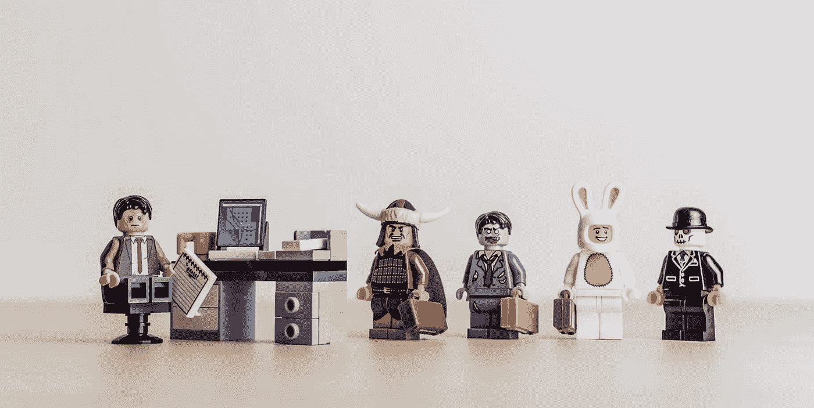

# 开发人员应该把工作面试当成第一次约会

> 原文：<https://betterprogramming.pub/developers-should-treat-job-interviews-like-a-first-date-78d0c6f020d9>

## 性格不是写在简历上的——你必须真实地展现出来

图片由 [Slon Pics](https://pixabay.com/users/www_slon_pics-5203613/) 提供

> 死亡将是一种巨大的解脱。不再接受采访
> 
> —凯瑟琳·赫本

每天都有开发人员在面试中被拒绝，不是因为他们的开发技能，而是因为他们的面试技能。

外表(技术技能)创造了最初的吸引力，但在长期的关系中，个性更重要。在面试中，你必须展现你的个性。

留下良好的第一印象，展示你的软技能和性格，和技术技能一样重要。一个开发人员的性格不会在他们的简历上体现出来，你必须在面试中表现出来，这就是把面试当成约会的好处。

[技术面试](https://thehosk.medium.com/why-the-hiring-process-doesnt-identify-talent-b1a8a360c58c)是一种不可靠的评估开发者的方式，因为它偏向于你喜欢的人。

[如果一个开发人员不会写软件](https://itnext.io/knowledge-cvs-and-certifications-are-no-guarantee-a-developer-can-create-software-9f4d640e0ca2)，知识、简历和证书都不能保证——这就是为什么要进行面试来了解他们的经历。

开发人员应该像约会一样对待面试，留下良好的第一印象，并通过以下步骤让面试官想要雇用他们:

*   准备妥当
*   留下良好的第一印象
*   自信地行动，不要紧张
*   不要穷
*   让它私人化
*   没有混蛋规则
*   难伺候
*   听一听，问一些开放性问题
*   不要做一个淘金者
*   不要当玩家
*   房间里的大象

每个部分都分为日期部分和采访部分，因此我们可以了解不同的观点。

# **做好准备**

做好准备，利用约会或面试前的时间进行调查。

## **日期**

*   做你的家庭作业，找出你的约会对象喜欢什么或不喜欢什么，并了解一些这方面的知识来提问
*   做好旅行安排，给自己足够的时间

## **面试**

*   做你的功课，研究公司网站和互联网
*   阅读人们的博客帖子
*   看看你在 LinkedIn 上有没有其他联系人，你可以问一下这家公司
*   仔细阅读职位描述，将你的经验与所需技能联系起来
*   根据职位描述制作一份量身定制的简历
*   准备与工作相关的经历的答案。你想要在项目中运用这些技能的例子
*   努力回答你不具备技能的领域，获得这些技能的计划是什么，为什么这不是问题

# **留下良好的第一印象**

你有一次机会留下第一印象，所以要留下好印象。

## **日期**

*   准时，早点离开，如果出现问题，给自己时间
*   聪明点
*   很高兴见到他们
*   赞美他们身上你喜欢的东西
*   问一个关于地点、时间、衣服的开放性问题

## **面试**

*   准时
*   职业着装
*   坚实的握手(没有湿鱼)
*   放松，自信地行动

# **行动自信，不紧张**

自信地行动，就像这是一件值得享受的事情。如何自信地行动，第一步是避免看起来紧张。要做到这一点，思考你所看到的演示，在这些演示中，人们表现出紧张的行为，分散了对信息的注意力。

## **紧张的行为**

*   轻拍或坐立不安，
*   关闭，奇怪的坐姿
*   无力的握手
*   仓促的回答
*   说得太多了
*   没有眼神交流

## **自信的行为**

*   挺直腰杆，挺胸抬头，昂首阔步
*   放松、直立地坐着
*   坐在椅子上向前学习，看起来很感兴趣
*   与面试官或约会对象进行眼神交流
*   不要说得太快，使用停顿(给他们时间思考)

# 不要穷

当你不顾一切地想要这样做的时候，你就会变得有需求

不要在面试或约会时表现得很差。没有人想和一个需要帮助的人约会，因为他们身上散发着绝望的味道。

不变得贫穷正在改变你的心态。你必须向他们展示他们需要你，而不是相反。

## **日期**

*   如果你看起来很穷，约会对象会认为你很绝望，其他人都不感兴趣
*   要有你是独一无二的心态。外面有很多漂亮的人，但只有一个你

## **面试**

*   改变心态，让公司需要你。你是一个伟大的开发人员，他们需要雇用你
*   向面试官展示你有多牛逼。让他们想要雇佣你，让他们击败其他公司来雇佣你

# 让它私人化

不要做股票日期或面试，要做得特别和量身定做。

## **日期**

*   想想如何为这个人量身定制约会？
*   选择一个你的约会对象喜欢的地点

## **面试**

*   根据职位描述修改你的简历
*   给出具体答案

# 没有混蛋规则

## **日期**

*   没有人想和一个混蛋约会，和他们在一起很痛苦，这个人必须为他们道歉。
*   不要对别人表现得像个混蛋，因为这种行为表明你必须通过让别人感觉不好来让自己感觉好。向他人表示尊重

## **面试**

*   面试的一个关键部分是通过“不允许有混蛋”或“不允许有混蛋”政策
*   没有人愿意雇佣一个混蛋或者和他一起工作。他们扰乱了整个团队。
*   举例说明尊重你的同事和团队精神。
*   不管你的技术如何，如果你是一个混蛋，那么你不会被选中，因为你会比你的价值更麻烦。

# 难伺候

不要高保养，好累。

你是否和同事发生争执，提出 HR 抱怨，在群里人们是否无法和你一起讨论和决定？

## **日期**

*   避免争论和讲述与他人冲突的故事
*   高维护是不合理的

## **面试**

*   难伺候的人不讲道理，你不能和他们讲道理
*   他们只能从自己的角度看待问题，团队合作能力很差

# **边听边问开放式问题**

大家最喜欢的话题就是自己。他们说得越多，面试就越顺利。控制面试的不是说话的人，而是问开放式问题的人。

要问开放性问题，先从“如何”和“什么”开始。

当你问一个开放性的问题时，它会让对方想到答案，避免简单的是或否的回答，这会造成尴尬的沉默。

让别人说话，不要被你打断，不要用你自己的经历胜过他们。

为了让对方继续说下去，你可以模仿他们回答的最后三个词，这就像是在提示他们多说。点点头，说一些鼓励的话，比如是的，嗯，真的，表明你在听。

使用[标签和镜子](https://www.youtube.com/watch?v=pHHHg7PWz48)或[用两种简单而强大的 FBI 策略](https://www.inc.com/carmine-gallo/win-people-over-with-2-simple-powerful-fbi-tactics.html)赢得人们的好感。

一个类似于镜像的工具是标记，你标记他人的感受或立场。你可以给一种情绪贴上标签，说:“听起来像……”或“看起来像”。

## **日期**

如果你想给你的约会对象留下好印象并参与其中，问他们一些开放性的问题，允许他们谈论自己。你会让你的约会对象感觉良好，并了解他们的有趣信息。

*   就他们感兴趣的话题询问如何提问或什么问题
*   用镜子(大约最后三个词)来继续对话
*   对你的约会对象感兴趣，尽可能多地了解他们，然后你就会知道你们是否合适

## **面试**

仔细听被问到的问题。澄清问题很好，可以确保你回答的是正确的问题。

提出开放式问题，了解他们如何进行开发，例如:

*   您实施了哪些最佳实践
*   你认为什么样的新技术会是大的
*   这个角色的职业道路是什么？
*   你是如何让开发者开心的？

如果你不知道某个技术问题的答案，就说你不知道，然后问他们想要什么答案。说你不知道并没有错，把它变成一个积极的方面，表现出你很想学习。以下是一些您可以使用的镜像和标签示例:

## **镜像示例 1** (用于日期)

*   约会——我是伊普斯威奇镇足球俱乐部的球迷，观看每一场主场比赛
*   你——你每场主场比赛都去看？

## **镜像示例 2** (用于日期)

*   约会——我喜欢旅行。我去过 50 个不同的国家。
*   你——50 个不同的国家？

## **贴标**(用于日期)

*   约会——我今天收到了一张停车罚单。这让我很生气。
*   你——听起来你好像疯了。

## **镜像示例 1(用于面试)**

*   面试官——职业发展很重要。每个开发人员每年接受 80 小时的培训。
*   你——一年 80 小时？

## **镜像示例 2(用于面试)**

*   采访者——ALM 和 DevOps 是确保我们交付高质量软件的关键部分
*   您—交付高质量的软件

# 不要做一个淘金者

## **日期**

*   不要仅仅为了钱而对其他人感兴趣
*   生活中有比金钱更多的东西

## **面试**

*   不要仅仅为了钱而跳槽，因为如果你跳槽是为了得到更多的钱，当另一份薪水更高的工作出现时，你还会再次跳槽

# 不要表现得像个玩家

*   你不想要一个太容易相处并且有很多伴侣的伴侣
*   员工不想雇佣经常搬家的人，因为这意味着你会再次搬家

# **房间里的大象**

*   永远不要忘记指出房间里是否有一头大象
*   不要把大象留在房间里让面试官注意和提及。如果有不好的事情，那么你必须给它贴上负面的标签
*   当你提到房间里的大象时，它就会缩小。如果他们提到它，它的规模和重要性就会增加，因为你似乎在试图隐藏它
*   如果你有一个弱点，那就把它提出来，正面地框定它

享受面试，如果你没有得到第一份工作，那就利用它来学习和提高。

感谢阅读。