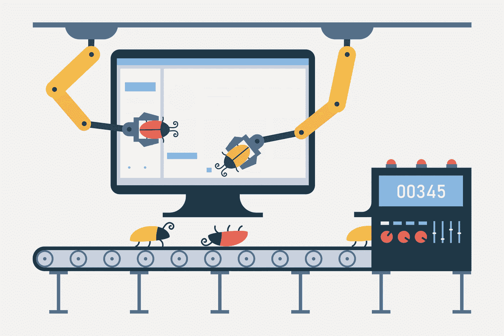

# 开发人员——把错误报告当成机会，而不是批评

> 原文：<https://betterprogramming.pub/developers-take-bug-reports-as-opportunities-not-criticisms-58db51f75d96>

## 当你违反代码时，如何改变你的心态

伊莲娜·皮姆科娃

我最近发布了我正在开发的一个 web 应用程序的重大更新。此次更新包括许多新功能以及对应用程序中使用的大多数库的升级。自然，这种规模的更新在发布后会有一些客户报告的错误。在我处理这些问题的时候，我反思了我对现在被报告的错误的态度，与几年前我对它们的看法形成对比。

我过去常常认为 bug 是对我职业生涯和我脆弱的胜任感的威胁。在过去的几年里，我已经取得了很大的进步，无论是我的理解水平还是我处理 bug 的心态。我想写一篇我希望几年前就能写的文章，那时我还是一名初级开发人员。

# 以前的我

当我第一次开始发布前端代码时，每当我开发的一个特性出现错误报告时，我都会变得很有防备心。我认为这个问题是对我作为开发人员能力的控诉。我没有安全感，不想面对批评。我担心我不适合做开发人员。bug 感觉就像一个小确认，说“看，你不太擅长这个。”

我会找借口解释为什么这个 bug 不是我的错。我告诉自己这个 bug 是愚蠢的，客户不知道他们在做什么，或者由于一些我无法控制的原因，有问题的代码质量很低。这从来都不是我的错。我觉得每一只针对我的虫子都是一个闪烁的广告牌，宣传我自己的愚蠢。简而言之，我个人认为 bug。

我会不情愿地接受报告，进入我的代码，并解决这个问题。当我的修复被合并并且一切顺利时，我会松一口气，希望下一个修复会很漫长。

# 记分板

我担心每当有新的 bug 被报告时，我的老板会减少对我的评价。在我的脑海中，我觉得我失去了一个“点”，或者我对他们的总体“分数”下降了。我担心的是，如果有足够多的错误被报告，我的分数下降到某一点，我会被解雇。每当一个新的错误报告出现在我面前，我都会感到一阵焦虑，不知道这份报告会不会是最后一根稻草。

我花了一段时间才明白没有记分牌。没有积分制。bug 是软件开发的正常部分。即使是最有经验的开发人员也会犯这些错误。每个高级开发人员都记得在他们的职业生涯中犯过一些错误。就我自己而言，有时候当我在外面走来走去，我会想起我引起的一个愚蠢的错误。

如果你需要更多的保证，看看任何流行的 GitHub 回购的问题部分。如果在你写的代码中发现了 bug，你就在一个好公司里。

# 公共

我注意到我培训的一些初级开发人员也有同样的心态。我认为这是你刚开始时的一种自然感觉。软件开发很难。要解决的问题很难，学习曲线很高，客户对软件产品的期望也很高。这份工作的高压力和长时间工作会让你回避批评。

如果你觉得你经历了一个类似的防御机制，记住这是开发过程中的正常部分。重要的是你认识到你在做什么，并采取措施摆脱它。

# 机会

提出的每一个 bug 都是一个机会。如果在遇到 bug 时，你很难摆脱“记分牌”的思维模式，那么下次你遇到 bug 时，想想这一点。如果你觉得你的上级在每一个 bug 上扣了你一分，那就毫无怨言地抓住下一个 bug，进入你的代码，修复它，并以积极的态度向你的团队汇报。

做到这一点，我保证你会得到两分。软件中的错误是必然的；拥有良好态度的天才问题解决者则不然。

如果你能以良好的心态及时修复 bug，你作为开发者的股票就会上涨。其他人会注意到并开始寻求你的帮助来解决他们自己的问题。不要逃避修复 bugs 将它们作为过程的一部分。

作为一名软件开发人员，我得到的最好的赞美之一是我面对问题或挑战时坚持不懈的乐观和积极。我把我的乐观归功于上面的实践。我觉得报告的 bug 是机会，不是批评。