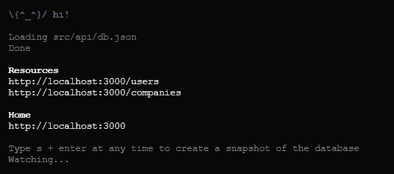
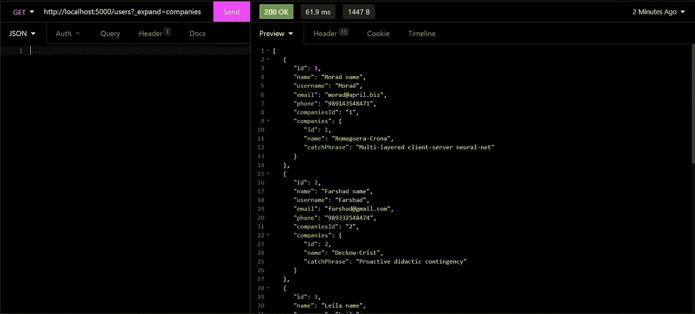
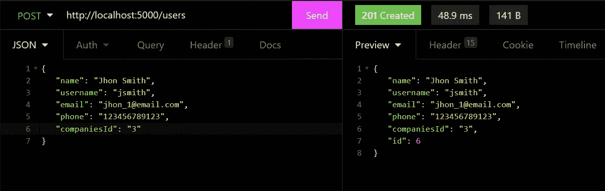
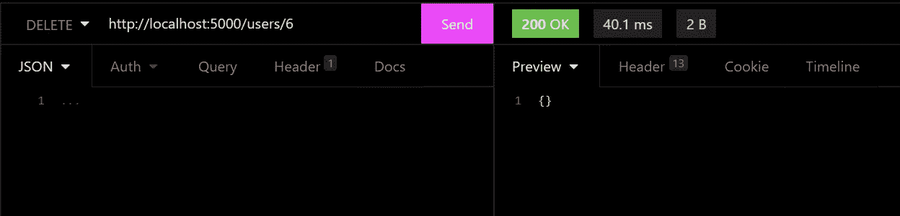
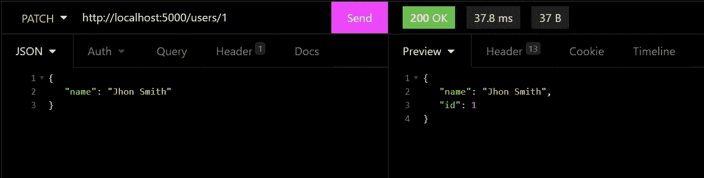
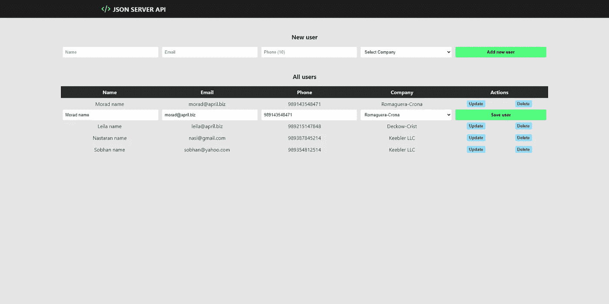

# 用 json-server 模拟一个后端 REST API，用于 React 中的 CRUD 开发

> 原文：<https://betterprogramming.pub/developing-a-crud-app-in-react-js-with-a-fake-api-rest-9f401bad5f04>

## 用 json-server 快速搭建一个 React 开发的伪 REST API


由 [Safar Safarov](https://unsplash.com/@codestorm?utm_source=medium&utm_medium=referral) 在 [Unsplash](https://unsplash.com/?utm_source=medium&utm_medium=referral) 上拍摄的照片

我们前端开发人员面临着一个共同的任务，就是模拟一个 REST 服务或者后端 REST API，以 JSON 格式向前端应用程序交付一些数据，并确保一切按预期工作。

这是因为很多时候，当前端团队开始开发时，后端服务还没有准备好。由于时间的原因，我们不能等待，我们必须开始向客户端显示信息，即使它是模拟的。

当然，我们可以设置一个完整的后端服务器，例如，使用 Node.js、Express 和 MongoDB。然而，正如我们之前所说的，我们没有时间，这就产生了以下问题:

如何在不创建后端服务的情况下实现 CRUD 功能？

在本教程中，我们将看到如何使用 json-server 设置和使用一个假的 REST API 服务器。我们可以在用 react 开发 web 应用程序时使用它。

# json-server 是什么？

`json-server`提供了一个完全假的 REST API，不需要任何配置或编码来设置。在它的帮助下，我们可以快速轻松地建立一个用于原型和模拟的后端，而不用担心底层逻辑。

这样，我们可以更专注于开发前端，而不是配置后端。

[在这里了解关于 json-server 的所有信息](https://github.com/typicode/json-server)。

# 用 React 开发 CRUD 应用程序

## 设置 json-server

为了开始使用`json-server`，我们用下面的命令安装这个包:

```
npm install -g json-server
```

我们创建了一个名为`db.js`的 JSON 文件，其中包含一些你需要的数据。例如，在我的例子中，我需要一些带有用户信息的 JSON 数据，如`id`、`name`、`username`等。像下面这样:

现在，要从终端启动服务器，请运行以下命令:

```
json-server --watch db.json
```

这样，我们应该在`http://localhost:3000`准备好服务器。现在，我们可以向该端点发出 REST 请求，如下图所示:



json-server

我们将要创建的 REST API 将具有完美的功能，也就是说，它将对我们的数据执行所有可能的操作(读取、修改、插入和删除)，并将数据存储在 JSON 文件中。

数据的持久性是在 JSON 文本文件本身中完成的。通过这种方式，在将来访问 web 应用程序时，API 将记住它的状态，保存所有已经完成的活动。

## 设置 React 应用程序

我们使用以下命令创建我们的应用程序:

```
npx create-react-app myApp
```

之后，我们为项目创建以下结构:

```
src/
├── api/
│   └── db.json
├── components/
│   └── CrudUSer.js
│   └── DropCompanies.js
│   └── Form.js
│   └── Table.jsx
├── helpers/
│   └── httpHelper.js
├── styles/
│   └── App.css
├── App.js
└── index.js
```

现在我们已经创建了一个 react 应用程序，我们需要将我们的服务器移动到另一个端口，因为 react 应用程序已经占用了`port 3000`。

我们使用下面的命令来完成这项工作，我们将利用这个机会在清单文件脚本中创建一个自定义命令。

```
"server": "json-server --watch src/api/db.json --port 5000"
```

## 向假 API 发出请求

在发出任何请求之前，我们需要提升我们的服务器，为此，我们执行以下命令:

```
npm run server
```

## 获取请求

让我们首先向 REST URL 发出一个 GET 请求。在 JSON 文件中，我们定义了一个包含用户相关信息的用户端点。通过向 URL `http://localhost:5000/users`发出 GET 请求，它应该会显示现有的信息。

对于本教程，我们添加了一个用户和公司的关系，每个用户都属于一个拥有 json-server 的公司。我们可以进行如下查询:



获取请求

## 发布请求

为了向现有信息中添加新信息，我们将向 URL `http://localhost:5000/users`发送一个 POST 请求。下面是 POST 请求的样子:

尝试发出一个 GET 请求，您应该在`db.json`文件中有新添加的信息。



发布请求

## 删除请求

要从 json-server 数据中删除一个条目，您需要用用户 id 向 API 端点发送一个删除请求。例如，要删除 id 为 1 的用户，需要向端点`[http://localhost:5000/users/7](http://localhost:5000/users/7.)` [发送删除请求。](http://localhost:5000/users/7.)



删除请求

一旦它被删除，尝试发出一个 GET 请求，id 为 7 的用户不应该出现在返回的 JSON 中。

## 更新请求

要更新现有条目，您需要发送一个 PATCH / PUT 请求，其中包含需要为该特定条目更新的详细信息。例如，为了更新 id 为`1`的用户的详细信息，我们将向 URL `http://localhost:5000/users/1`发送一个 PUT 请求，如下所示:



上传/修补请求

## 创建 HTTP 助手

我已经创建了助手`helpers/httpHelper.js`，用它我们可以发出我们需要的不同的 HTTP 请求。想法是有一个迷你库，允许我们简化来自 react 组件的请求。

您可以在任何 js 框架的项目中使用这个助手，或者只使用普通 js。

1.  `customFetch()`功能。它是一个异步函数，接收发出请求的 URL 和 options 对象作为参数。如果我们没有收到 options 参数，这将是一个空对象，我们将把默认值指定为方法和头。

否则，我们用默认值替换或连接接收到的值。

此外，我们有另一个名为`AbortController`的属性，如果服务器没有给我们响应，它将允许我们在一段时间后中止请求。

最后，我们用要查询的 URL 和生成的选项发出获取请求，并返回答案。

2.现在我们有了一个自定义函数，允许我们发出任何类型的请求，我们将为我们需要的每个 HTTP 动词创建一个函数，我们将发送它来调用我们的`customFetch(`。

3.最后，我们从 react 组件中导出使 HTTP 查询能够使用它们的函数。

## 使用 react 的假 API

为了方便地使用这个假 API，在本教程中，我创建了一个组件，它将包含所有要发出的请求及其状态，并将与其他组件共享它们。您可以根据您的应用程序的工作方式来调整或创建自己的组件，或者将其添加到全局状态。

1.  我们导入并执行我们的助手`httpHelper()`

2.为每个请求创建一个函数，传递必要的参数。这些参数将从前端获得，例如，从表单中创建一个用户。

3.我们将把这些函数和状态传递给需要它们的组件，在这种情况下，我们只有用于创建用户和更新用户的`<Form/>`组件和显示用户列表的`<Table/>`组件。

您可以在下面的共享存储库中找到这些组件，没有太多关于这些组件的解释，因为我们感兴趣的是如何创建和使用 REST API。

就是这样！我们有简单的 CRUD 工作，它看起来像这样:



JSON-服务器 CRUD 应用

## **项目回购:**

[](https://github.com/ljaviertovar/jsonserver-api-rest) [## GitHub-ljaviertovar/jsonserver-API-REST:用 JSON Server 开发的 API REST

### 这个项目是用 Create React App 引导的。在项目目录中，您可以运行:在…中运行应用程序

github.com](https://github.com/ljaviertovar/jsonserver-api-rest) 

# 结论

在本教程中，我们学习了如何创建一个后端，在本例中是一个 REST API，以供快速使用。有了这个，我们不需要等待后端团队能够开始我们的开发，并开始在我们的应用程序中显示信息。

我们看到了如何在 json-server 中使用 REST APIs 来创建一个虚拟数据库。我们学习了如何请求添加、更新、修改和删除数据。我们还创建了一个助手来发出 HTTP 请求，我们可以在任何项目中使用它。

## **阅读更多**

[](https://medium.com/geekculture/create-instagram-filters-with-react-and-css-f42a658ac438) [## 用 React 和 CSS 创建 Instagram 滤镜

### 使用 CSS 过滤器属性创建自定义过滤器

medium.com](https://medium.com/geekculture/create-instagram-filters-with-react-and-css-f42a658ac438) [](https://javascript.plainenglish.io/why-should-you-use-cleanup-functions-in-reacts-useeffect-hook-bdff48bd9b3) [## 为什么要在 React 的 useEffect 钩子中使用清理函数？

### React 的 useEffect 钩子中的清理函数——用例子解释。

javascript.plainenglish.io](https://javascript.plainenglish.io/why-should-you-use-cleanup-functions-in-reacts-useeffect-hook-bdff48bd9b3) 

```
**Want to Connect?** Love connecting with friends all around the world on [Twitter](https://twitter.com/ljaviertovar).
```