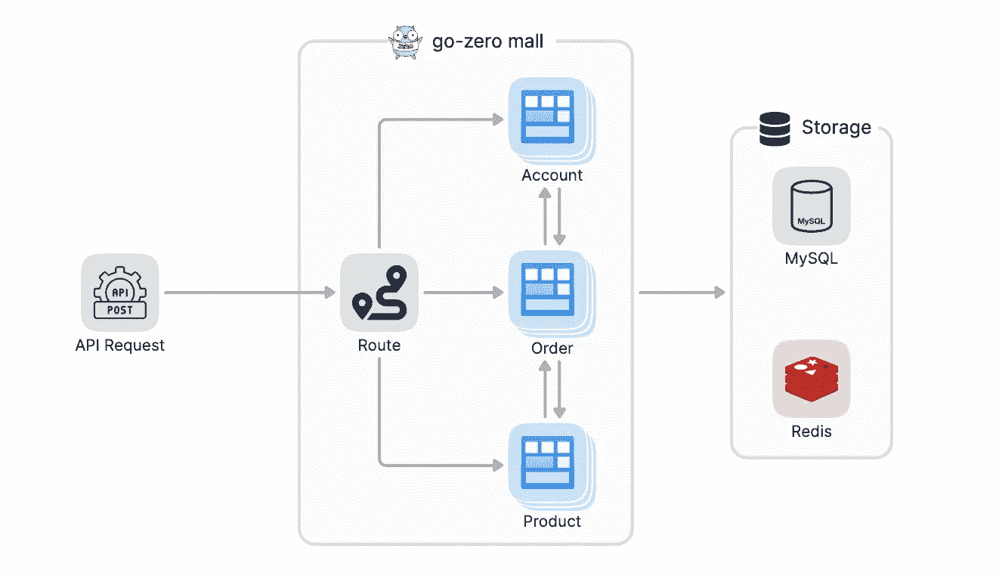

# 用 Go 开发 RESTful API

> 原文：<https://betterprogramming.pub/developing-a-restful-api-with-go-b5150f693277>

## 看看我的归零项目如何让它变得更简单


道格拉斯·洛佩斯在 [Unsplash](https://unsplash.com?utm_source=medium&utm_medium=referral) 上的照片

# 何时使用 RESTful API

对于大多数初创公司来说，我们应该更多地关注在业务的早期阶段交付产品。单体服务具有架构简单、易于部署、开发效率高等优点，可以帮助我们快速实现产品需求。当我们使用单体服务快速交付产品时，我们还需要保留业务增值的可能性，因此我们通常在单体服务中清晰地划分不同的业务模块。

# 购物中心整体服务架构

我们以商城为例，构建一个整体服务。商城服务一般比较复杂，由多个模块组成，比较重要的模块有账户、产品、订单等模块。每个模块都有自己独立的业务逻辑，并且每个模块都依赖于其他模块。例如，订单模块和产品模块将依赖于帐户模块。在单片应用程序中，这种依赖通常是通过模块间的方法调用来实现的。单体服务一般共享存储资源，比如`MySQL`和`Redis`。

单体服务的整体架构相对简单，这也是单体服务的优势。顾客的请求通过`DNS`进行解析，并通过`Nginx`转发给商场的后端服务。商城服务部署在云主机上。为了实现更大的吞吐量和高可用性，服务一般会部署多个副本。如果优化得当，这种简单的架构可以实现高吞吐量。


例如，对订单详细信息接口`/order/detail`的请求被路由到订单模块，订单模块依靠帐户模块和产品模块将完整的订单详细信息返回给用户，单个服务中的多个模块通常共享数据库和缓存。



# 整体服务

下一节将描述如何基于`go-zero`快速实现一个商城单体服务。用过`go-zero`的 Devs 都知道，我们提供了一个`API`格式的文件来描述`Restful API`，然后用一个命令就可以通过`goctl`生成相应的代码，我们只需要在`logic`文件中填入相应的业务逻辑即可。商城服务包含几个模块，为了使模块相互独立，不同的模块由单独的`API`定义，但是所有的`API`都是为同一个`service (mall-api)`定义的。

在`api`目录下创建`user.api`、`order.api`、`product.api`和`mall.api`，其中`mall.api`是聚合的`api`文件。其他`api`文件通过`import`指令导入。

```
api
|-- mall.api
|-- order.api
|-- product.api
|-- user.api
```

# 商城 API 定义

`mall.api`定义如下，其中`syntax = "v1"`表示这是`zero-api`的`v1`语法。

```
syntax = "v1"import "user.api"
import "order.api"
import "product.api"
```

# 帐户模块 API 定义

*   查看用户详细信息
*   获取用户的所有订单

```
syntax = "v1"**type** (
    UserRequest {
        ID **int64** `path:"id"`
    } UserReply {
        ID      **int64**   `json:"id"`
        Name    **string**  `json:"name"`
        Balance **float64** `json:"balance"`
    } UserOrdersRequest {
        ID **int64** `path:"id"`
    } UserOrdersReply {
        ID       **string** `json:"id"`
        State    **uint32** `json:"state"`
        CreateAt **string** `json:"create_at"`
    }
)service mall-api {
    @handler UserHandler
    get /user/:id (UserRequest) returns (UserReply) @handler UserOrdersHandler
    get /user/:id/orders (UserOrdersRequest) returns (UserOrdersReply)
}
```

# 订单模块 API 定义

*   获取订单详细信息
*   生成订单

```
syntax = "v1"**type** (
    OrderRequest {
        ID **string** `path:"id"`
    } OrderReply {
        ID       **string** `json:"id"`
        State    **uint32** `json:"state"`
        CreateAt **string** `json:"create_at"`
    } OrderCreateRequest {
        ProductID **int64** `json:"product_id"`
    } OrderCreateReply {
        Code **int** `json:"code"`
    }
)service mall-api {
    @handler OrderHandler
    get /order/:id (OrderRequest) returns (OrderReply) @handler OrderCreateHandler
    post /order/create (OrderCreateRequest) returns (OrderCreateReply)
}
```

# 产品模块 API 定义

*   查看产品详情

```
syntax = "v1"**type** ProductRequest {
    ID **int64** `path:"id"`
}**type** ProductReply {
    ID    **int64**   `json:"id"`
    Name  **string**  `json:"name"`
    Price **float64** `json:"price"`
    Count **int64**   `json:"count"`
}service mall-api {
    @handler ProductHandler
    get /product/:id (ProductRequest) returns (ProductReply)
}
```

# 生成整体服务

有了已经定义的`API`，用`API`生成服务变得非常简单，我们使用`goctl`来生成整体服务代码。

```
$ goctl api go -api api/mall.api -dir .
```

生成的代码结构如下。

```
.
├── api
│ ├── mall.api
│ ├── order.api
│ ├── product.api
│ └── user.api
├── etc
│ └── mall-api.yaml
├─ internal
│ ├── config
│ │ └── config.**go**
│ ├── handler
│ │ ├── ordercreatehandler.**go**
│ │ ├── orderhandler.**go**
│ │ ├── producthandler.**go**
│ │ ├── routes.**go**
│ │ ├── userhandler.**go**
│ │ └─ userordershandler.**go**
│ ├─ logic
│ │ ├─ ordercreatelogic.**go**
│ │ ├── orderlogic.**go**
│ │ ├── productlogic.**go**
│ │ ├── userlogic.**go**
│ │ └── userorderslogic.**go**
│ ├── svc
│ │ └── servicecontext.**go**
│ └── types
│ └── types.**go**
└── mall.**go**
```

我们来解释一下生成的文件。

*   `api`:保存`API`描述文件
*   `etc`:用于定义项目配置，所有配置项都可以写入`mall-api.yaml`
*   `internal/config`:服务的配置定义
*   `internal/handler`:对应于`API`文件中定义的路线的`handler`的执行
*   `internal/logic`:用于放置每条路由对应的业务逻辑，区分`handler`和`logic`的原因是为了尽量减少业务处理部分的依赖性，将`HTTP requests`从逻辑处理代码中分离出来，便于后续拆分成`RPC service`
*   `internal/svc`:用于定义业务逻辑处理的依赖关系，我们可以在`main`函数中创建依赖资源，并通过`ServiceContext`传递给`handler`和`logic`
*   `internal/types`:定义`API`请求和响应数据结构
*   `mall.go`:函数`main`所在的文件，与`API`定义中的`service`同名，但去掉了`-api`后缀

生成的服务无需任何修改即可运行:` 1

```
$ go run mall.go
Starting server at 0.0.0.0:8888...
```

# 实现业务逻辑

接下来，让我们实现业务逻辑。出于演示目的，该逻辑将是简单的，而不是真正的业务逻辑。

首先，让我们实现为用户获取所有订单的逻辑。由于用户模块中没有订单相关的信息，我们需要依靠订单模块来查询用户的订单，所以我们在`UserOrdersLogic`中增加了对`OrderLogic`的依赖。

```
**type** UserOrdersLogic **struct** {
    logx.Logger
    ctx        context.Context
    svcCtx     *svc.ServiceContext
    orderLogic *OrderLogic
}**func** **NewUserOrdersLogic**(ctx context.Context, svcCtx *svc.ServiceContext) ***UserOrdersLogic** {
    **return** &UserOrdersLogic{
        Logger:     logx.WithContext(ctx),
        ctx:        ctx,
        svcCtx:     svcCtx,
        orderLogic: NewOrderLogic(ctx, svcCtx),
    }
}
```

在`OrderLogic`中实现一个方法，根据`user id`查询所有订单

```
**func** (l *OrderLogic) **ordersByUser**(uid **int64**) ([]*types.OrderReply, error) {
    **if** uid == 123 {
        // It should actually be queried from database or cache
        **return** []*types.OrderReply{
            {
                ID:       "236802838635",
                State:    1,
                CreateAt: "2022-5-12 22:59:59",
            },
            {
                ID:       "236802838636",
                State:    1,
                CreateAt: "2022-5-10 20:59:59",
            },
        }, **nil**
    } **return** **nil**, **nil**
}
```

调用`UserOrdersLogic`的`UserOrders`方法中的`ordersByUser`方法。

```
**func** (l *UserOrdersLogic) **UserOrders**(req *types.UserOrdersRequest) (*types.UserOrdersReply, error) {
    orders, err := l.orderLogic.ordersByUser(req.ID)
    **if** err ! = **nil** {
        **return** **nil**, err
    } **return** &types.UserOrdersReply{
        Orders: orders,
    }, **nil**
}
```

此时，我们重启`mall-api`服务，并在浏览器中请求用户的所有订单。

```
[http://localhost:8888/user/123/orders](http://localhost:8888/user/123/orders)
```

返回的结果如下，正如我们所料

```
{
    "orders": [
        {
            "id": "236802838635",
            "state": 1,
            "create_at": "2022-5-12 22:59:59"
        },
        {
            "id": "236802838636",
            "state": 1,
            "create_at": "2022-5-10 20:59:59"
        }
    ]
}
```

接下来，我们将实现创建订单的逻辑。要创建订单，我们首先需要查看库存中的商品是否足够，因此我们需要依赖订单模块中的商品模块。

```
**type** OrderCreateLogic **struct** {
    logx.Logger
    ctx          context.Context
    svcCtx       *svc.ServiceContext
    productLogic *ProductLogic
    productLogic *ProductLogic
}**func** **NewOrderCreateLogic**(ctx context.Context, svcCtx *svc.ServiceContext) ***OrderCreateLogic** {
    **return** &OrderCreateLogic{
        Logger:       logx.WithContext(ctx),
        ctx:          ctx,
        svcCtx:       svcCtx,
        productLogic: NewProductLogic(ctx, svcCtx),
    }
}
```

创建订单的逻辑如下。

```
**const** (
    success = 0
    failure = -1
)**func** (l *OrderCreateLogic) **OrderCreate**(req *types.OrderCreateRequest) (*types.OrderCreateReply, error) {
    product, err := l.productLogic.productByID(req.ProductID)
    **if** err ! = **nil** {
        **return** **nil**, err
    } **if** product.Count > 0 {
        **return** &types.OrderCreateReply{Code: success}, **nil**
    } **return** &types.OrderCreateReply{Code: failure}, **nil**
}
```

从属产品模块的逻辑如下。

```
**func** (l *ProductLogic) **Product**(req *types.ProductRequest) (*types.ProductReply, error) {
    **return** l.productByID(req.ID)
}**func** (l *ProductLogic) **productByID**(id **int64**) (*types.ProductReply, error) {
    **return** &types.ProductReply{
        ID: id,
        Name: "apple watch 3",
        Price: 3333.33,
        Count: 99,
    }, **nil**
}
```

以上说明使用`go-zero`开发单片服务非常简单，有助于我们快速开发。而且我们还把模块分开了，这也为以后改做微服务提供了可能。

# 摘要

上面的例子表明，使用`go-zero`开发单体服务非常简单。你只需要定义`api`文件，然后`goctl`工具就可以自动生成项目代码。我们只需要填写逻辑包中的业务逻辑代码。在本文中，我们刚刚演示了如何快速开发基于`go-zero`的整体服务，这不涉及数据库。实际上，`goctl`也可以用一条命令生成`CRUD`和`cache`代码。

并且针对不同的业务场景，还可以通过定制模板来实现定制。定制的模板可以通过远程`git`存储库在团队内部共享，这对于团队协作来说非常有效。

[](https://github.com/zeromicro/go-zero) [## GitHub - zeromicro/go-zero:一个具有 cli 工具的云原生 go 微服务框架，用于…

### 具有 cli 工具的云原生 Go 微服务框架可提高工作效率。- GitHub - zeromicro/go-zero:一个云原生…

github.com](https://github.com/zeromicro/go-zero) 

```
**Want to Connect?**Welcome to use go-zero and star to support us!
```