# 使用 Remix IDE 编写您的第一个智能合同

> 原文：<https://betterprogramming.pub/developing-a-smart-contract-by-using-remix-ide-81ff6f44ba2f>

## 让我们学习如何在以太坊上写智能合约


[Remix](https://remix-project.org/) logo

在这个故事中，我们将研究如何通过使用 [Remix IDE](https://remix.ethereum.org/) 来开发一个具有可靠性的智能合约，Remix IDE 是专门用于实现以太坊网络合约的工具之一。

我们将为基本银行业务开发一个智能合约，并尽可能确保它包含 Solidity 提供的所有功能和能力。此外，我们将了解如何在任何帐户和我们开发的合同之间发送 ETH(从帐户到合同或从合同到帐户)，以及如何限制可以使用智能合同相关功能的人员。

在开始编写契约代码之前，坚实的知识对于理解我们将在下面实现的所有内容是必不可少的。作为本文的一部分，我不会提到以太坊和坚固性的基础，但在下面链接的文章中，你可以找到关于什么是以太坊和坚固性的详细信息，以太坊建立的原则和思想，以及组成坚固性的元素。

[](https://medium.com/better-programming/overview-of-ethereum-solidity-d7a0ea5fbf00) [## 以太坊和固体概述

### 一本关于以太坊区块链、Solidity 编程语言和智能合约的有用入门书

medium.com](https://medium.com/better-programming/overview-of-ethereum-solidity-d7a0ea5fbf00) 

# 入门指南

假设我们现在熟悉以太坊和 Solidity，我们可以开始开发一个智能合约，它包括 Solidity 提供的所有功能和能力，或者至少尽可能多。有几种方法可以开发智能合同。在这些方法中，我们将使用 Remix IDE，这是一个强大的开源工具，它提供了从浏览器开发智能合同的能力。

首先，让我们从浏览器打开 Remix IDE，创建一个扩展名为`.sol`的新文件。我们将在这里使用它作为我们的可靠性代码。

# 声明合同

我们应该在我们想要使用的可靠版本旁边声明一个契约。

```
pragma solidity ^0.6.6;contract BankContract { }
```

# 定义状态变量、数据类型和数据结构

我们创建一个客户机对象来保存客户机的信息，它将通过使用`struct`元素来加入契约。它在合同中保留客户的 ID、地址和余额。然后我们创建一个`client_account`类型的数组来保存我们所有客户的信息。

```
pragma solidity ^0.6.6;contract BankContract {
    **struct client_account{
        int client_id;
        address client_address;
        uint client_balance_in_ether;
    }** **client_account[] clients;**
}
```

每当客户加入契约时，我们都应该给他们分配一个 ID，所以我们定义了一个`int`计数器，并在契约的构造函数中将它设置为`0`。

```
pragma solidity ^0.6.6;contract BankContract {
    struct client_account{
        int client_id;
        address client_address;
        uint client_balance_in_ether;
    } client_account[] clients; **int clientCounter;
    constructor() public{
        clientCounter = 0;
    }**
}
```

此外，我们需要为经理定义一个`address`变量和一个`mapping`变量来保存每个客户的最后利息日期。因为我们希望限制再次向任何帐户发送利息所需的时间，所以它将用于检查是否已经过了足够的时间。

```
pragma solidity ^0.6.6;contract BankContract {
    struct client_account{
        int client_id;
        address client_address;
        uint client_balance_in_ether;
    } client_account[] clients; int clientCounter; **address payable manager;
    mapping(address => uint) public interestDate;** constructor() public{
        clientCounter = 0;
    }
}
```

# 实现修饰符

在智能协定中，您可能需要限制可以调用相关方法的人员，或者您可能希望只允许在特定情况下执行该方法。在这种情况下，`modifier`会检查您已经实现的条件，并决定是否应该执行相关的方法。

在实现我们需要组织智能契约的所有方法之前，我们必须实现两个修饰符。这两种方法都将检查调用相关方法的人以及使用了哪个修饰符。其中一个确定发送者是否是管理者，另一个确定发送者是否是客户。

```
pragma solidity ^0.6.6;contract BankContract {
    struct client_account{
        int client_id;
        address client_address;
        uint client_balance_in_ether;
    } client_account[] clients;

    int clientCounter;
    address payable manager;
    mapping(address => uint) public interestDate; constructor() public{
        clientCounter = 0;
    } **modifier onlyManager() {
        require(msg.sender == manager, "Only manager can call!");
        _;
    }

    modifier onlyClients() {
        bool isClient = false;
        for(uint i=0;i<clients.length;i++){
            if(clients[i].client_address == msg.sender){
                isClient = true;
                break;
            }
        }
        require(isclient, "Only clients can call!");
        _;
    }**
}
```

# 实现回退功能

`fallback`函数对于使契约从任何地址接收以太网是必不可少的。`receive`关键字是 Solidity 0.6.x 中新增的，它被用作`fallback`函数来接收以太。

因为我们将从客户那里收到以太作为押金，所以我们需要实现`fallback`函数。

```
pragma solidity ^0.6.6;contract BankContract {
    struct client_account{
        int client_id;
        address client_address;
        uint client_balance_in_ether;
    } client_account[] clients;

    int clientCounter;
    address payable manager;
    mapping(address => uint) public interestDate; constructor() public{
        clientCounter = 0;
    }modifier onlyManager() {
        require(msg.sender == manager, "Only manager can call!");
        _;
    }

    modifier onlyClients() {
        bool isClient = false;
        for(uint i=0;i<clients.length;i++){
            if(clients[i].client_address == msg.sender){
                isClient = true;
                break;
            }
        }
        require(isclient, "Only clients can call!");
        _;
    } **receive() external payable { }**
}
```

# 开发方法

在声明契约、定义变量、实现修饰符和回退函数之后，我们将开始开发我们将使用的方法。

在本合同中，我们将开发以下方法:

*   `setManager`方法将用于将管理器地址设置为我们已经定义的变量。`managerAddress`作为一个参数使用，并转换为 payable 以提供发送以太网。

```
function setManager(address managerAddress) public returns(string memory){
     manager = payable(managerAddress);
     return "";
}
```

*   将使用`joinAsClient`方法来确保客户加入合同。每当客户加入联系人时，他们的利息日期将被设置，并且客户信息将被添加到`client`数组中。

```
function joinAsClient() public payable returns(string memory){
     interestDate[msg.sender] = now;
     clients.push(client_account(clientCounter++, msg.sender, address(msg.sender).balance));
     return "";
}
```

*   将使用`deposit`方法将 ETH 从客户帐户发送到合同。我们希望这个方法只能被加入契约的客户调用，所以这个限制使用了`onlyClient`修饰符。

**注意:**`transfer`方法属于契约，专用于在地址间发送指定数量的 ETH。`payable`关键字使得接收 ETH 转账成为可能，因此`msg.value`中指示的 ETH 金额将被转账到合同地址。

```
function deposit() public payable onlyClients{
     payable(address(this)).transfer(msg.value);
}
```

*   `withdraw`方法将用于将 ETH 从合同发送到客户账户。它将`amount`参数中指示的 ETH 单位从合同发送到发送交易的客户端。我们希望这个方法只能被加入契约的客户调用，所以这个限制使用了`onlyClient`修饰符。

**注意:**发送者的地址保存在`msg.sender`变量中。

```
function withdraw(uint amount) public payable onlyClients{
     msg.sender.transfer(amount * 1 ether);
}
```

*   将使用`sendInterest`方法将 ETH 作为合同的利息发送给所有客户。我们希望这个方法只能被管理器调用，所以这个限制使用了`onlyManager`修饰符。这里，将为所有客户端检查相关客户端获取利息的最后日期，如果特定时间段已经过去，将发送利息。最后，如果发送了新的利息，则相关客户的新利息日期将被重置到`interestDate`数组中。

```
function sendInterest() public payable onlyManager{
     for(uint i=0;i<clients.length;i++){
          address initialAddress = clients[i].client_address;
          uint lastInterestDate = interestDate[initialAddress];
          if(now < lastInterestDate + 10 seconds){
               revert("It's just been less than 10 seconds!");
          }
          payable(initialAddress).transfer(1 ether);
          interestDate[initialAddress] = now;
     }
}
```

*   `getContractBalance`方法将用于获取我们部署的契约的余额。

```
function getContractBalance() public view returns(uint){
     return address(this).balance;
}
```

# 智能合约的最终状态

在所有这些改进之后，下面是我们的银行应用程序的最终状态。

# 编译智能合同

在完成智能合约的开发之后，我们将把它编译到 Remix IDE 上。如下图所示，我们有了`BankContract.sol`文件，还有两个我们将使用的部分:


混音 IDE

*   用`I`表示的部分是 Solidity 编译器，我们在这个部分中使用它来测试我们的智能契约。
*   用`II`表示的部分是 Deploy & Run Transactions，我们将在编译它之后在下面的部分使用它。

我们应该编译我们从上图中用`I`表示的部分开发的智能契约。下图显示了当我们转到 Solidity 编译器部分时所面临的情况。我们根据之前指定的版本选择编译器版本，然后单击该部分底部的按钮。

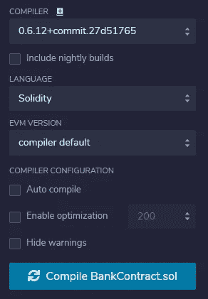

可靠性编译器部分

一旦我们没有任何问题地编译了智能合约，我们就可以继续部署智能合约和运行事务了。

# 部署智能合同

我们应该部署我们从上图中用`II`表示的部分开发的智能契约。下图显示了当我们转到部署&运行事务部分时所面临的情况。

Remix IDE 提供了将智能合约部署到各种环境中的各种机会。在这里，我们可以使用我们选择的配置在任何我们想要的环境中部署智能合约。此外，我们可以使用这里设置的参数运行任何调用智能契约方法的事务。

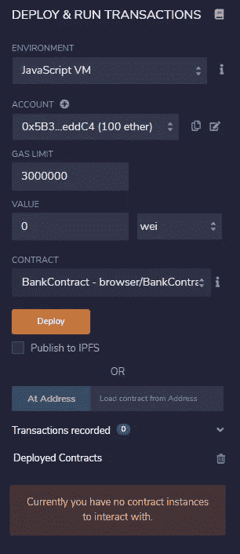

*部署&运行事务部分*

在本文中，我们将在 JavaScript VM 环境中部署我们的契约，因此我们将在以下环境中选择它。


环境列表

在 accounts 组合框中，我们将能够在部署和测试智能合约期间使用许多帐户。在 Remix IDE 提供的这些帐户中，我们将选择第一个帐户来部署联系人。

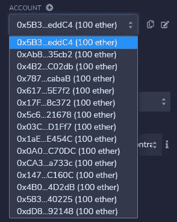

帐目

设置好环境和帐户后，我们就可以部署它了，所以我们单击 deploy 按钮。在 terminal 部分，事务结果如下图所示。


交易结果

**注:**合同地址是从我们客户账户发送的 ETH 将被保存的地址。

根据上述交易结果，智能合约已成功部署到所选账户。部署智能合约操作会给部署它的发送方带来成本。`transaction cost`代表我们部署契约所需的成本——`transaction cost`中的金额来自账户——如下图所示。

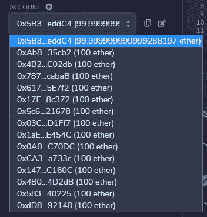

帐目

另一方面，可以在左侧的已部署合同子部分中看到已部署的智能合同。


# 运行交易

现在，我们准备调用复合智能合约开发的函数。当我们在 Deployed Contract 小节中展开相关的契约时，所开发的方法就会出现。

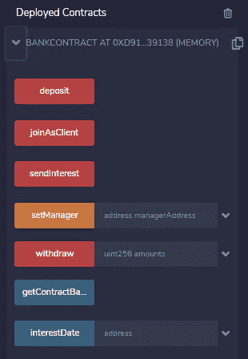

这些方法

## setManager 方法

我们开始通过调用这些方法来模拟一个小的过程。首先，我们应该设置一个经理。因此，我们键入一个从帐户组合中选择的地址，然后单击黄色的`setManager`按钮。


setManager 方法

终端中会出现以下输出。解码后的输出显示了从该方法返回的消息，这是一个空字符串消息——正如我们所预期的。

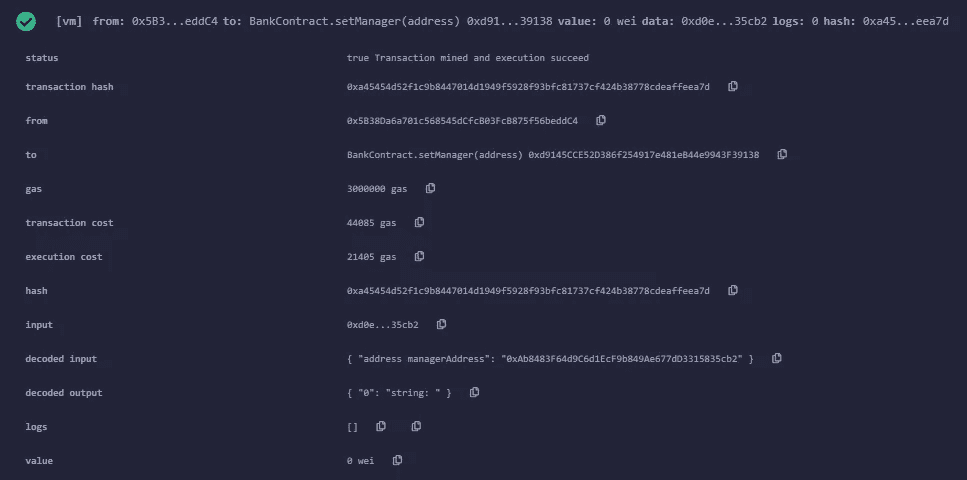

setManager 方法的结果

## joinAsClient 方法

我们将继续作为从 account 组合中确定的三个客户端的客户端加入，并为每个客户端调用`joinAsClient`方法。

此时——这与上一次不同——我们应该在选择相关帐户时调用该方法，因为我们从这里获取了`msg.sender`值。

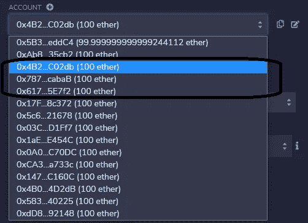

客户的账户

这三个账户被选作客户端，我们分别点击了红色的`joinAsClient` 按钮。完成这些操作后，终端会显示以下信息，这意味着这三个帐户在合同中被设置为客户。此外，还从客户账户中扣除了运行该方法的特定费用。

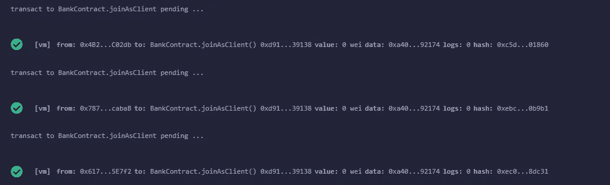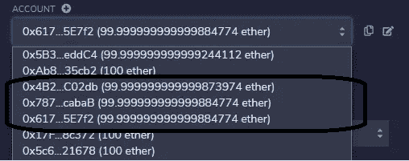

joinAsClient 方法的结果

## 存款方法

现在，我们将通过存款方式从客户账户中向合同发送 10 ETH。在存款方法中，我们从发送方获取在`msg.value`中声明的金额，该金额在`msg.sender`变量中表示。

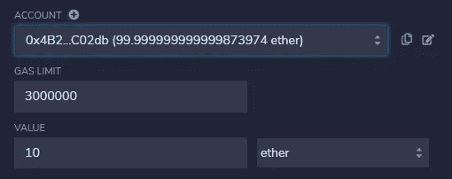

因此，我们设置 10 ETH，并通过为每个客户端帐户单击红色的存款按钮来调用存款方法，就像我们之前对`joinAsClient`方法所做的那样。完成这些操作后，终端显示以下信息，这意味着这三个帐户从他们的帐户向合同地址发送了 10 ETH。此外，帐户余额的最终状态如下所示:

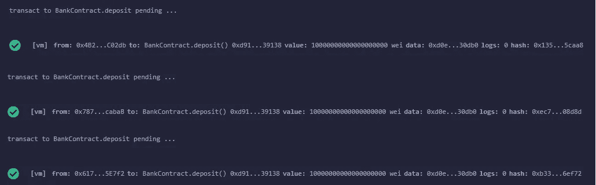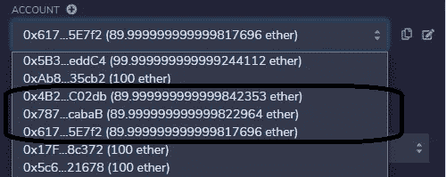

存款方法的结果

## getContractBalance 方法

现在，我们调用`getContractBalance`方法来检查从客户端发送的第 30 个 ETH 是否存在于合同帐户中。因此，我们单击蓝色的 getContractBalance 按钮，它返回一个对应于 30 ETH in Wei 的金额。


getContractBalance 方法

与我们目前应用的方法不同，这个方法只是返回一个值，而不改变任何状态变量。因此，它是免费执行的，终端中的警告似乎有点不同。

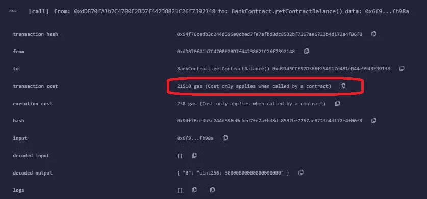

getContractBalance 方法的结果

## sendInterest 方法

在检查合同不再为空之后，我们可以通过调用`sendInterest`方法向客户发送利息。我们选择之前设置为经理帐户的帐户，然后单击红色的 sendInterest 按钮。

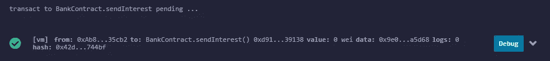

*send interest*方法的结果

在终端中调用方法后，会出现上图中的消息。此消息意味着第一次成功发送到每个客户的帐户。我们可以看到，在此操作之后，每个客户端的余额从 89 增加到 90。

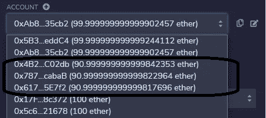

客户的账户

我们实现了一个限制，检查自调用`sendInterest`方法以来是否已经过了 10 秒。为了检查这个控件，我们在 10 秒钟内再次调用相同的方法。交易按预期进行，终端出现了`"It’s just been less than 10 seconds!"`消息，如下图所示。

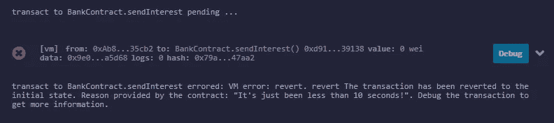

*“才过了不到 10 秒！”消息*

## 该提取方法

现在，我们调用我们开发的最后一个方法，从合同中提取一笔金额到客户的账户。在取款方法中，我们将在`msg.value`中声明的金额从账户转移到在`msg.sender`变量中表示的发送方。

在这一点上，有一个问题被意识到了，那就是没有作为客户加入契约的人也可以调用这个方法。我们使用`onlyClient`修改器来避免这个问题。

当我们选择一个属于任何未加入合同的客户的账户，然后通过红色的取款按钮调用取款方法时，会显示`"Only clients can call this!"`:

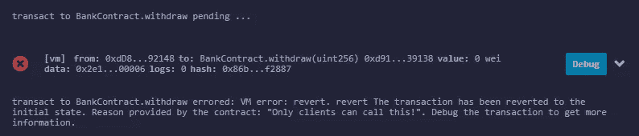

*“只有客户才能调用这个！”消息*

如果我们选择任何加入合同的人并点击红色的撤回按钮，我们预计发送者的金额将从 90 增加到 99 ETH。


该提取方法

在调用该方法后，我们看到 ETH 的数量如我们预期的那样增加了。


发送方的余额

但如你所见，最后一笔金额少了 31，830 魏，这相当于执行交易应从汇款人账户中提取的交易成本。如果我们在终端中查看交易细节，我们可以看到与交易成本完全相同的金额。

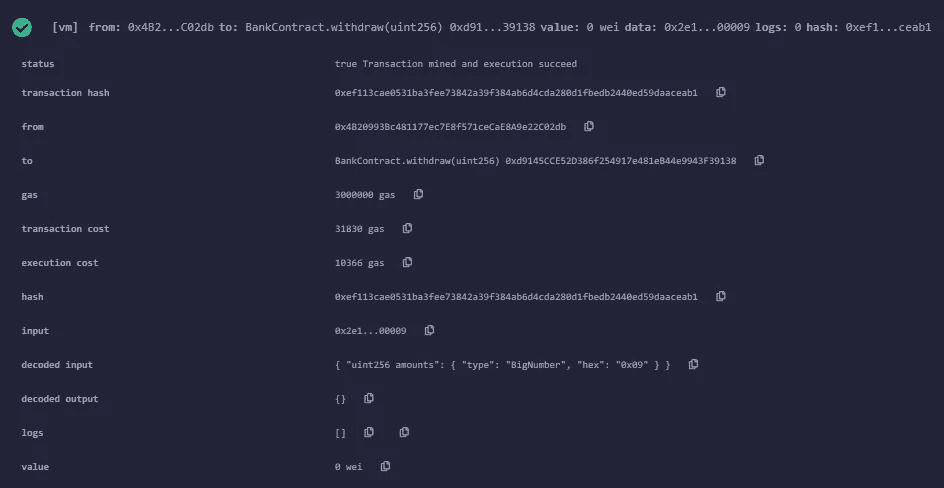

*撤回*方法的结果

在这些操作之后，合同地址中应该只剩下 18 个 ETH，因为合同中总共发送了 12 个 ETH(3 个 ETH 作为利息，9 个 ETH 作为提款)。

如果我们调用`getContractBalance` 方法，我们会看到下面的结果:


getContractBalance 方法

# 结论

仅此而已！在本文中，我们开发了一个智能契约，它允许尽可能多地实现复合稳固性的所有元素。然后我们在 Remix IDE 上编译并部署了它。最后，我们通过模拟一个流程的方法测试了它提供的所有功能。