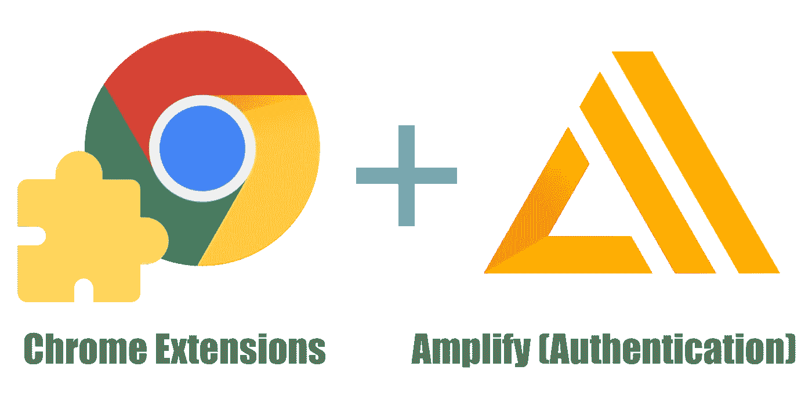
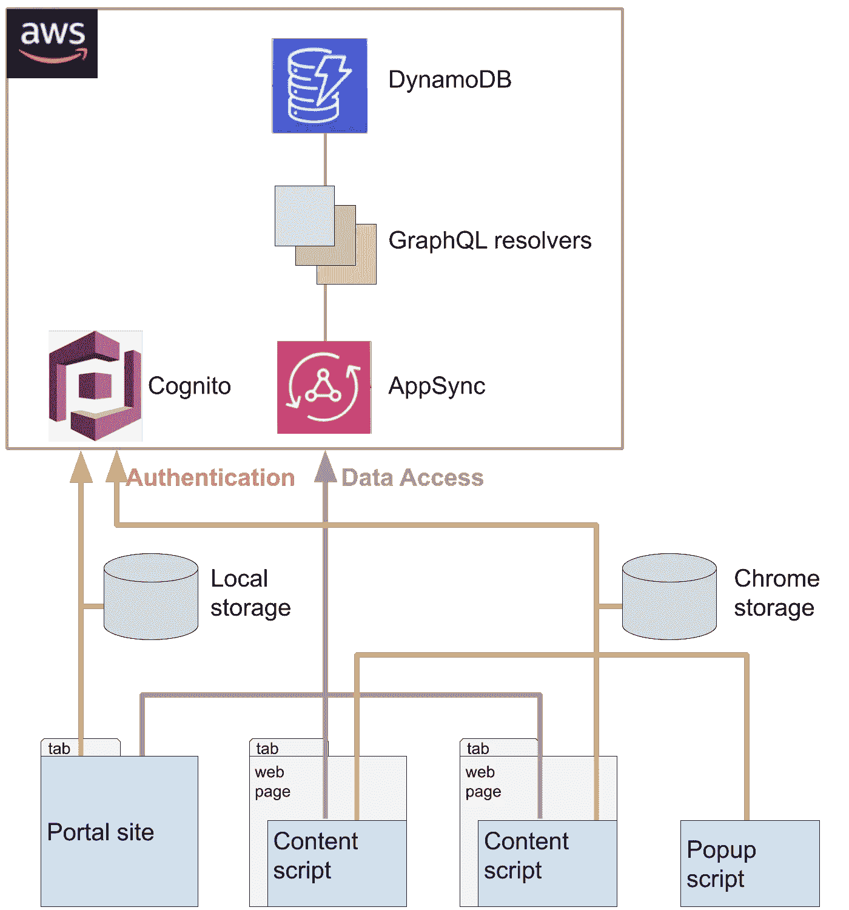
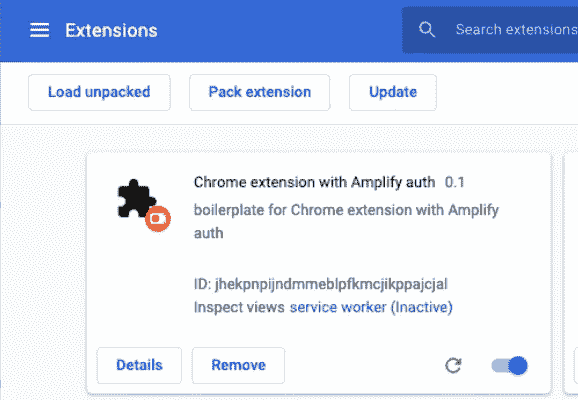
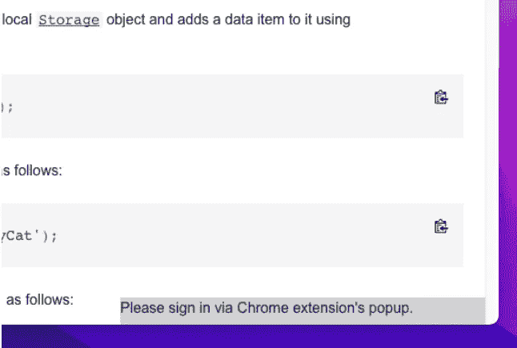
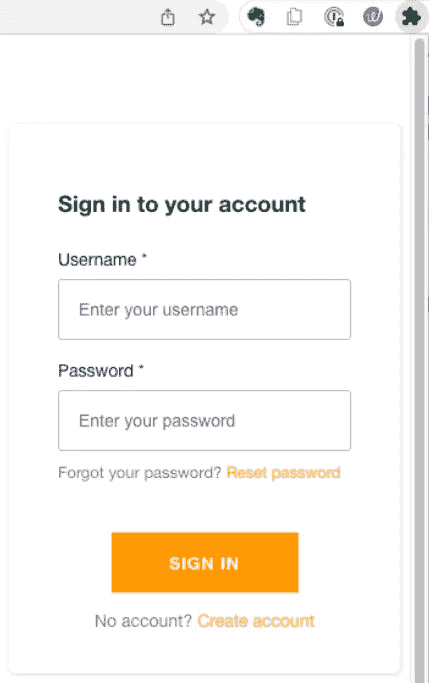
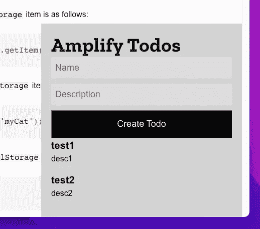
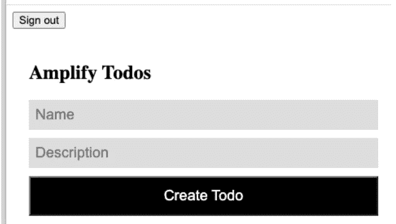
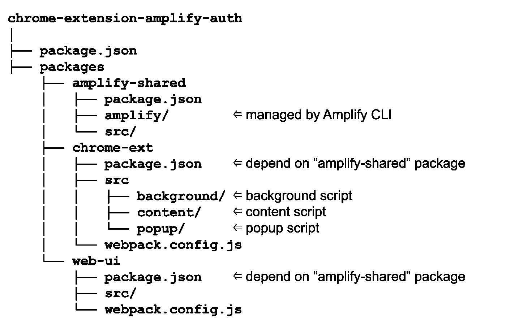
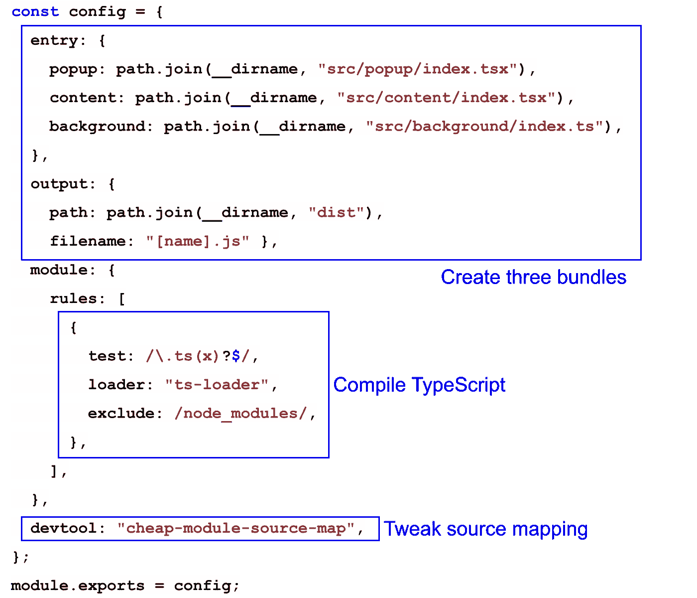

# 使用 AWS Amplify 认证开发 Chrome 扩展

> 原文：<https://betterprogramming.pub/developing-chrome-extensions-with-amplify-authentication-be9b9e496a06>

## 构建惊人的 Chrome 扩展



Chrome 扩展是允许用户定制他们的浏览体验的小程序。用户可以用它们以多种方式定制 Chrome 的功能和行为。例如，扩展可以覆盖与当前显示的网页相关的信息。

创建 Chrome 扩展时，可能需要个性化的行为。例如，根据用户的偏好显示信息。在这种情况下，你的 Chrome 扩展必须在你的服务器上管理用户特定的数据。现在该介绍 AWS Amplify 了。AWS Amplify 提供了一套工具和功能，使前端 web 和移动开发人员能够快速轻松地在 AWS 上构建全栈应用，并随着您的用例变化灵活地利用全方位的 AWS 服务。

本文解释了如何结合以下技术创建 Chrome 扩展。

*   反应
*   以打字打的文件
*   AWS 放大器
*   AWS 认知(认证)
*   AWS AppSync (GraphQL)

我在这里创建了一个样板 git 存储库，展示了一个工作示例。

[](https://gitlab.com/kmiyashita/chrome-extension-amplify-auth) [## 肯·宫下/chrome-扩展-放大-授权

### 带有放大认证 Chrome 扩展的样板文件

gitlab.com](https://gitlab.com/kmiyashita/chrome-extension-amplify-auth) 

# 先决条件

下面的基础知识不在本文的讨论范围之内，您应该对它们比较熟悉。由于这些技术提供了全面的教程，我建议您先浏览一下。

## [镀铬扩展](https://developer.chrome.com/docs/extensions/mv3/getstarted/)

*   什么是(1)后台脚本(2)弹出脚本，以及(3)内容脚本。
*   这些脚本是如何分段的，以及它们是如何相互通信的。

## [网络包](https://webpack.js.org/guides/getting-started/)

*   为什么捆绑是必要的。
*   什么是(1)入口点，(2)包，和(3)加载器。

## [AWS 放大器(带 react)](https://docs.amplify.aws/start/q/integration/react/)

*   如何用 Amplify 开发 React 应用程序？
*   如何整合 Amazon Cognito 作为主要的认证提供者？
*   如何将 API 和数据库连接到您的应用程序。

# 有哪些挑战？

如果你想用 Amplify 创建简单的 Chrome 扩展或独立的 web 应用程序，你可以在网上找到许多教程和工作示例。

然而，如果您想结合上述技术，您会遇到以下挑战。读完这篇文章后，解决方案似乎显而易见。

但是我花了几周时间试图将它们结合起来，以获得一个稳定的代码库，我相信我的样板文件对初学者是有帮助的。

## 文件夹结构

多个小脚本(应用)协同工作，共享 Amplify 自动生成的代码。最适合他们的文件夹结构是什么？

## 带有 react 的 Chrome 扩展的 Webpack 配置

通常，在创建 react 应用程序时会用到 [*create-react-app*](https://create-react-app.dev/) 。这是一个很好的工具，为您开发成熟的 react 应用程序提供了一个坚实的起点。

但是你不能将`create-react-app`的结果原样用于你的 Chrome 扩展。

尽管我们需要创建多个包(后台脚本、弹出脚本、内容脚本)，`create-react-app`不支持这个用例。

## 管理 AWS 身份验证的安全令牌

默认情况下，AWS Amplify 将安全令牌存储在浏览器的`localStorage`中。但如果你想登录你的 Chrome 扩展的弹出窗口，让内容脚本访问个性化数据，这种默认行为是不方便的。您需要建立管理弹出脚本和内容脚本之间共享的安全令牌的方法。

# Chrome 扩展示例(样板文件)

## 概观

样板文件是一个功能齐全(但很少)的应用程序，具有以下特性。

*   **门户网站:**这是一个简单的 react 应用程序，用于访问 AWS 上的个性化数据(待办事项)。
*   **弹出脚本:**允许用户登录 AWS。安全令牌存储在 Chrome 存储器中。
*   **内容脚本:**通过 Chrome 存储中的安全令牌，内容脚本可以访问 AWS 上的个性化数据。



## 设置

克隆[样板文件](https://gitlab.com/kmiyashita/chrome-extension-amplify-auth.git)，并安装依赖项。

```
$ git clone [https://gitlab.com/kmiyashita/chrome-extension-amplify-auth.git](https://gitlab.com/kmiyashita/chrome-extension-amplify-auth.git)
$ cd chrome-extension-amplify-auth
$ yarn
```

移动到 Amplify 项目的子文件夹并初始化项目。

```
$ cd packages/amplify-shared
$ amplify init
? Choose your default editor: Visual Studio Code
? Select the authentication method you want to use: AWS profile
? Please choose the profile you want to use:  default
```

最后，使用 amplify 目录中的配置文件提供后端资源。

```
$ amplify push
```

## 运行 Chrome 扩展

构建 Chrome 扩展:

```
$ yarn build
```

打开 Chrome 浏览器的扩展管理，加载`chrome-extension-amplify-auth/packages/chrome-ext/dist`内置的扩展



当您打开任何网页时，您会注意到您的内容脚本在右下角显示了一个小的覆盖图。



点击 Chrome 扩展图标，可以打开一个弹出窗口。创建一个新的用户帐户，然后登录。



现在，内容脚本的覆盖图会自动更新并显示待办事项。



## 运行门户网站

运行门户网站的 web 服务器。

```
$ yarn start-web
```

在 Chrome 浏览器中打开`http://localhost:8080`，观察待办事项。



# 文件夹结构

关于文件夹结构，我们有以下两个要求。

*   应该在 Chrome 扩展(内容脚本、弹出脚本)和门户网站的多个包之间共享 Amplify 代码。
*   需要为 Chrome 扩展创建多个包(内容脚本、弹出脚本、背景脚本)。

为了满足这些要求，我们采取以下方法。

*   单回购结构。
*   Amplify 项目在 monorepo 结构中形成一个独立的包(`amplify-shared`)。这个包由两个包共享:`chrome-ext`和`web-ui`。
*   包"`chrome-ext`有三个子文件夹，分别用于背景脚本、内容脚本和弹出脚本。Webpack 从这些子文件夹中创建包。



# Chrome 扩展的 Webpack 配置

Webpack 是现代 JavaScript 应用程序的静态模块捆绑器。在大多数情况下，从版本 4.0.0 开始，webpack 不需要配置文件来捆绑您的项目。但是为了以下目的，我们将引入最小配置文件`[webpack.config.js](https://gitlab.com/kmiyashita/chrome-extension-amplify-auth/-/blob/main/packages/chrome-ext/webpack.config.js)`。

*   创建多个包(后台脚本、弹出脚本、内容脚本)
*   将类型脚本代码编译成 JavaScript。
*   禁止使用`eval`进行源映射，因为 Chrome extension 的 CSP(内容安全策略)不允许。



# 证明

当您使用 AWS Amplify 认证登录时，默认情况下，安全令牌存储在 [*localStorage*](https://developer.mozilla.org/en-US/docs/Web/API/Window/localStorage) 中。登录后，Amplify 函数使用存储的安全令牌访问数据。

不幸的是，在我们的场景中，这种机制并没有像预期的那样工作。弹出脚本在扩展的上下文中运行，而内容脚本在网页而不是扩展的上下文中运行。由于 *localStorage* 是按上下文分段的，因此内容脚本无法访问弹出脚本存储的安全令牌。

但是 Amplify 设计得很好，它允许我们定制安全令牌的存储位置。为了解决这个问题，我们使用[*chrome . storage . local*](https://developer.chrome.com/docs/extensions/reference/storage/)。它提供了与 localStorage API 相同的存储功能，但有以下主要区别:

*   扩展的内容脚本可以访问与弹出脚本共享的用户数据。
*   它与批量读写操作是异步的，因此比阻塞和串行 localStorage API 更快。

这是为安全令牌实现自定义存储的`[SharedAuthStorage.ts](https://gitlab.com/kmiyashita/chrome-extension-amplify-auth/-/blob/main/packages/chrome-ext/src/common/SharedAuthStorage.ts)`。

**在弹出的脚本中**

*   `setItem()` 被调用，安全令牌存储在 *chrome.storage.local* 中。

**在内容脚本中**

*   谓之`Amplify.configure()`。它填充内存缓存，扫描`chrome.storage.local`。
*   一旦内存缓存被填充，`getItem()`可以同步返回值(安全令牌)。

您可以如下配置 Amplify 使用该自定义存储[。通过这种方式，您可以将自己的定制与 Amplify CLI 管理的各种 AWS 配置参数(`awsExports`)结合起来。](https://gitlab.com/kmiyashita/chrome-extension-amplify-auth/-/blob/main/packages/chrome-ext/src/content/Overlay.tsx#L8)

```
Amplify.configure({
    ...awsExports,
    Auth: {storage: SharedAuthStorage}
});
```

本文解释了如何在 Chrome 扩展中使用带认证的 Amplify。希望样板文件对你的发展有所帮助。