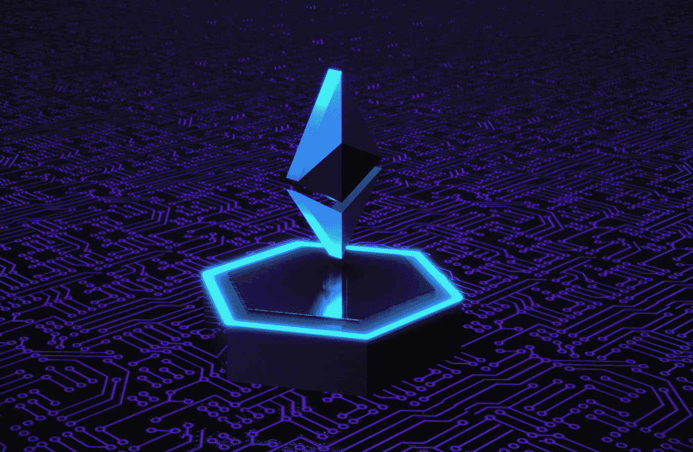
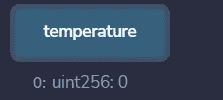
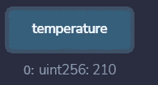
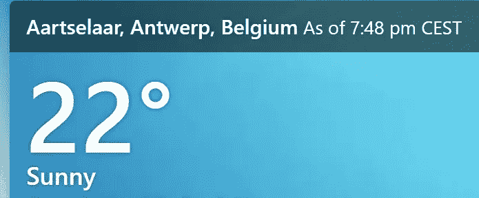
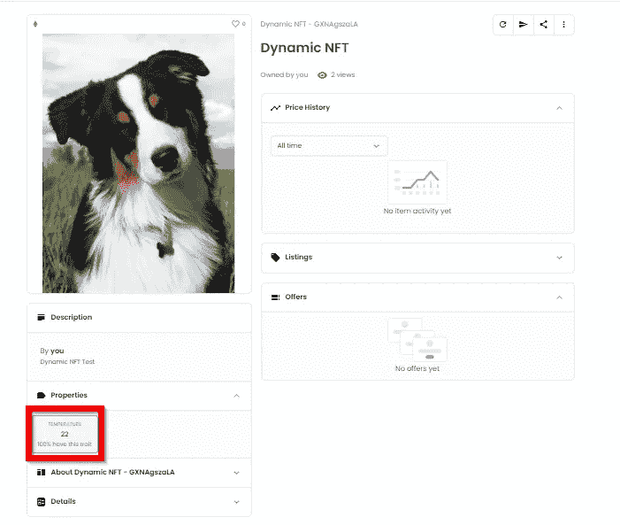

# 开发动态 NFTs

> 原文：<https://betterprogramming.pub/developing-dynamic-nfts-9fb5dc9520e9>

## 曾经想要创建一个对现实世界的事件和数据做出反应的 NFT 吗？现在你可以了，有了链节神谕。让我们来看看如何做到这一点！



照片由[钟登祥](https://unsplash.com/@dengxiangs?utm_source=medium&utm_medium=referral)在 [Unsplash](https://unsplash.com?utm_source=medium&utm_medium=referral) 上拍摄

备注:不幸的是，Chain Link Oracle 只安装在 Kovan testnet 上，而 OpenSea testnet 安装在 Rinkeby 上。所以开发和测试都是在两个网络上完成的，这并不理想。

# **什么是连锁甲骨文？**

第一代 NFT，像 BAYC，CryptoPunks，…本质上是静态的。他们的图像和元数据通常存储在静态文件中，比如 IPFS 或者云服务器。有时，通过将 NFT 从一组静态文件切换到另一组静态文件，可以对 NFT 进行某种程度的更改。

[Chain Link Oracle](https://docs.chain.link/docs/request-and-receive-data/)提供了一个实用程序，您可以通过它将以太坊智能合约与任何 API 连接起来。这很酷，这意味着你可以获得任何通过 API 提供给你的智能合约的数据，你可以找到任何东西的 API:股票价格，体育数据，天气，…

# **链上元数据**

我们需要做的第二个改变是我们的 NFTs 元数据可以是动态的。因此，我们现在将在链上生成元数据，而不是将元数据存储在链外 JSON 文件中。

## **第一步:使用链环 Oracle**

在这个例子中，我们将通过来自[WeatherAPI.com](http://WeatherAPI.com)的 API 检索一个城市的温度。

让我们来看一些代码:

```
// SPDX-License-Identifier: MIT
pragma solidity ^0.8.7;import "[@openzeppelin/contracts](http://twitter.com/openzeppelin/contracts)/token/ERC721/ERC721.sol";
import '[@chainlink/contracts](http://twitter.com/chainlink/contracts)/src/v0.8/ChainlinkClient.sol';
import '[@chainlink/contracts](http://twitter.com/chainlink/contracts)/src/v0.8/ConfirmedOwner.sol';
import "./Base64.sol";
import "[@openzeppelin/contracts](http://twitter.com/openzeppelin/contracts)/access/Ownable.sol";
import "[@openzeppelin/contracts](http://twitter.com/openzeppelin/contracts)/utils/Counters.sol";
import "[@openzeppelin/contracts](http://twitter.com/openzeppelin/contracts)/utils/Strings.sol";contract DynamicNFT is ERC721, ChainlinkClient, Ownable {
    using Chainlink for Chainlink.Request;
    using Counters for Counters.Counter;uint256 public temperature;
    bytes32 private jobId;
    uint256 private fee;
    Counters.Counter private _tokenIdCounter;
    bool public paused = false;event RequestTemperature(bytes32 indexed requestId, uint256 temperature);/**
     * [@notice](http://twitter.com/notice) Initialize the link token and target oracle
     *
     * Kovan Testnet details:
     * Link Token: 0xa36085F69e2889c224210F603D836748e7dC0088
     * Oracle: 0x74EcC8Bdeb76F2C6760eD2dc8A46ca5e581fA656 (Chainlink DevRel)
     * jobId: ca98366cc7314957b8c012c72f05aeeb
     *
     */
    constructor() ERC721("Dynamic NFT", "DNFT") {
        setChainlinkToken(0xa36085F69e2889c224210F603D836748e7dC0088);
        setChainlinkOracle(0x74EcC8Bdeb76F2C6760eD2dc8A46ca5e581fA656);
        jobId = 'ca98366cc7314957b8c012c72f05aeeb';
        fee = (1 * LINK_DIVISIBILITY) / 10; // 0,1 * 10**18 (Varies by network and job)
        temperature=0;
    }function buildMetadata(uint256 _tokenId)
        private
        view
        returns (string memory)
    {
        return
            string(
                abi.encodePacked(
                    "data:application/json;base64,",
                    Base64.encode(
                        bytes(
                            abi.encodePacked(
                                '{"name":"Dynamic NFT", "description":"Dynamic NFT Test","image": "[https://gateway.pinata.cloud/ipfs/QmeAKDXvQyGUdvwRSvazCyj4CYeN6qrcpQr4Lmgf7Cc2UC](https://gateway.pinata.cloud/ipfs/QmeAKDXvQyGUdvwRSvazCyj4CYeN6qrcpQr4Lmgf7Cc2UC)", "attributes": ',
                                "[",
                                '{"trait_type": "Temperature",',
                                '"value":"',
                                Strings.toString(temperature),
                                '"}',
                                "]",
                                "}"
                            )
                        )
                    )
                )
            );
    }function requestTempData() public returns (bytes32 requestId) {
        Chainlink.Request memory req = buildChainlinkRequest(jobId, address(this), this.fulfill.selector);// Set the URL to perform the GET request on
        req.add('get', '[http://api.weatherapi.com/v1/current.json?q=Aartselaar&Key=30e737e440484fd18a5134039221006'](http://api.weatherapi.com/v1/current.json?q=Aartselaar&Key=30e737e440484fd18a5134039221006'));req.add('path', 'current,temp_c'); 
        // Multiply the result by 1000000000000000000 to remove decimals
        int256 timesAmount = 10;
        req.addInt('times', timesAmount);// Sends the request
        return sendChainlinkRequest(req, fee);
    }/**
     * Receive the response in the form of uint256
     */
    function fulfill(bytes32 _requestId, uint256 _temperature) public recordChainlinkFulfillment(_requestId) {
        emit RequestTemperature(_requestId, _temperature);
        temperature = _temperature;
    }/**
     * Allow withdraw of Link tokens from the contract
     */
    function withdrawLink() public onlyOwner {
        LinkTokenInterface link = LinkTokenInterface(chainlinkTokenAddress());
        require(link.transfer(msg.sender, link.balanceOf(address(this))), 'Unable to transfer');
    }//ERC721 functions
    function safeMint(uint minttimes) external payable {

  require(!paused);

        for(uint i=0;i<minttimes;i++){
   _safeMint(msg.sender, _tokenIdCounter.current()); 
   _tokenIdCounter.increment();

  }          

 }function tokenURI(uint256 tokenId)
    public
    view
    virtual
    override(ERC721)
    returns (string memory)
 {
  require(
  _exists(tokenId),
  "ERC721Metadata: URI query for nonexistent token"
  );

        return buildMetadata(tokenId);
 }

 //Return current counter value
 function getCounter()

  external
        view
        returns (uint256)
    {
        return _tokenIdCounter.current();
    }function setTemp(uint256 newTemp) external{
        temperature = newTemp;
    }
}
```

首先，我们需要导入 Chain Link 客户端库，并使用该库创建我们的契约。

让我们看看构造函数:

```
constructor() ERC721(“Dynamic NFT”, “DNFT”) {setChainlinkToken(0xa36085F69e2889c224210F603D836748e7dC0088);setChainlinkOracle(0x74EcC8Bdeb76F2C6760eD2dc8A46ca5e581fA656);jobId = ‘ca98366cc7314957b8c012c72f05aeeb’;fee = (1 * LINK_DIVISIBILITY) / 10; // 0,1 * 10**18 (Varies by network and job)}
```

设置这些变量(`setChainlinkToken`、`setChainlinkOracle`和`jobid`)将我们的合同与 Kovan 上的链接 Oracle 链接起来。

使用 Oracle 的费用是每个 API 调用 0.1 个链接。所以你需要确保你的合同总是有足够的链接来完成预期数量的 API 调用！

使用 Oracle 定义了两个函数:`requestTempData`和 fulfill。

```
function requestTempData() public returns (bytes32 requestId) {Chainlink.Request memory req = buildChainlinkRequest(jobId, address(this), this.fulfill.selector);// Set the URL to perform the GET request onreq.add(‘get’, ‘http://api.weatherapi.com/v1/current.json?q=Aartselaar&Key=30e737e440484fd18a5134039221006');req.add(‘path’, ‘current,temp_c’);// Multiply the result by 1000000000000000000 to remove decimalsint256 timesAmount = 10;req.addInt(‘times’, timesAmount);// Sends the requestreturn sendChainlinkRequest(req, fee);}
```

`requestTempData`构建 API 请求(get)并指定它将从 JSON 答案中获取哪些数据(path)。因为我们期望一个整数，而温度是用一个小数检索的，所以我们将答案乘以 10。最后，在支付链接费的同时进行 API 调用。

Fulfill 检索 API 答案并将其存储在本地温度变量中:

```
function fulfill(bytes32 _requestId, uint256 _temperature) public recordChainlinkFulfillment(_requestId) {emit RequestTemperature(_requestId, _temperature);temperature = _temperature;}
```

让我们在科万身上试试:

在 API 调用之前:



执行 API 调用后:



这里实际上大约是 21 摄氏度:



## **步骤 2:带有链上元数据的 NFT**

使 NFT 成为动态的意味着我们必须用从 API 中获得的变量在链上构建元数据。我们通过调用`tokenURI`函数中的以下函数来实现这一点:

`function buildMetadata(uint256 _tokenId)`

```
function buildMetadata(uint256 _tokenId)
        private
        view
        returns (string memory)
    {
        return
            string(
                abi.encodePacked(
                    "data:application/json;base64,",
                    Base64.encode(
                        bytes(
                            abi.encodePacked(
                                '{"name":"Dynamic NFT", "description":"Dynamic NFT Test","image": "[https://gateway.pinata.cloud/ipfs/QmeAKDXvQyGUdvwRSvazCyj4CYeN6qrcpQr4Lmgf7Cc2UC](https://gateway.pinata.cloud/ipfs/QmeAKDXvQyGUdvwRSvazCyj4CYeN6qrcpQr4Lmgf7Cc2UC)", "attributes": ',
                                "[",
                                '{"trait_type": "Temperature",',
                                '"value":"',
                                Strings.toString(temperature),
                                '"}',
                                "]",
                                "}"
                            )
                        )
                    )
                )
            );
    }
```

让我们在 Rinkeby 上测试一下:


在生成之后，API 调用之前，该值被初始化为 0。现在我们运行 API 调用并再次检查该值。



值更新为当地温度！不错！

# **结论**

如图所示，您可以通过使用 Chain Link Oracle 外部 API 调用来获取数据，并在链上生成元数据，从而使您的 NFT 成为动态的。

缺点是每个 API 调用都要花费链接和金钱，并且动态契约更复杂，因此花费更多的汽油。可惜没有免费的午餐。真正烦人的是，在 Kovan 上可以获得用于测试的 Chain Link 工具，但在 Rinkeby 上却有 Opensea。

Chain Link 还提供智能合同自动化工具，因此您也可以自动化 API 调用。

我希望你喜欢这篇文章！