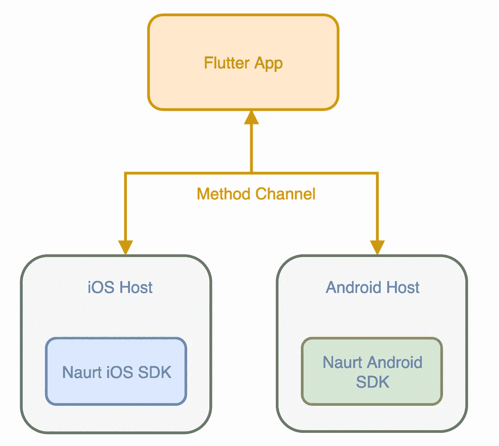
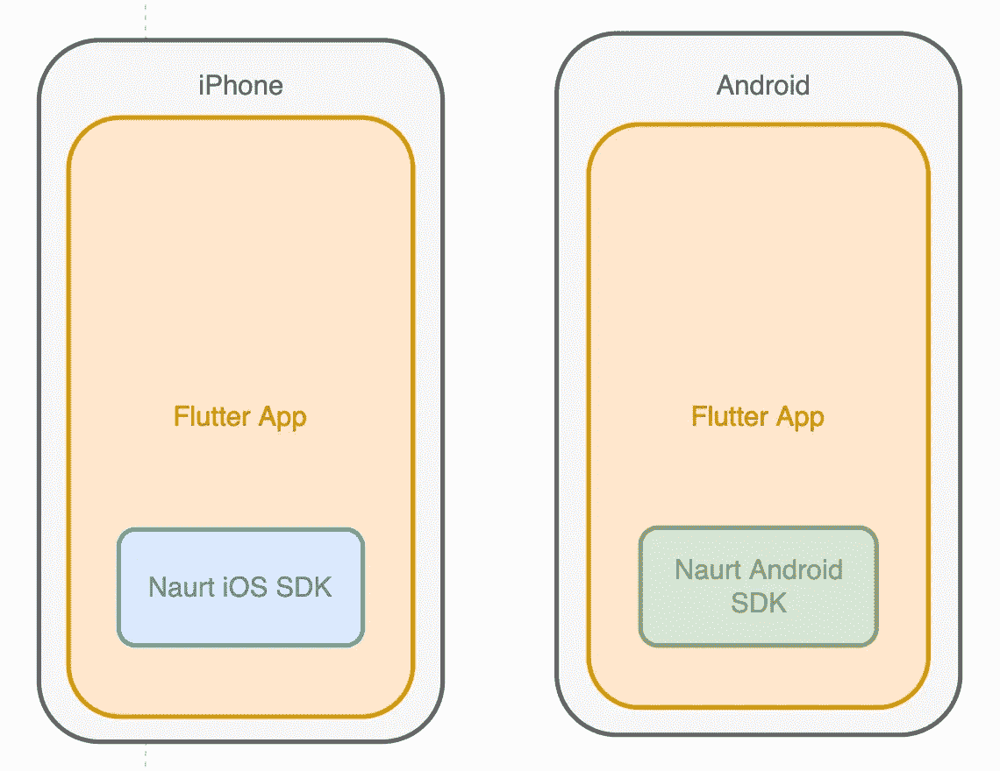
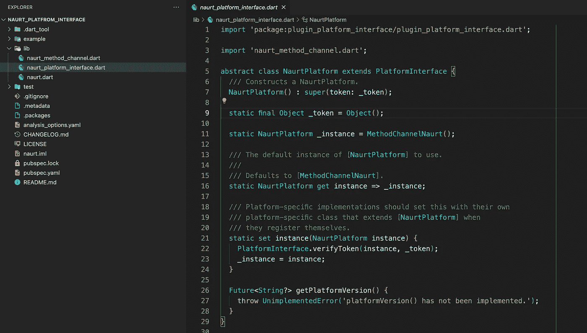
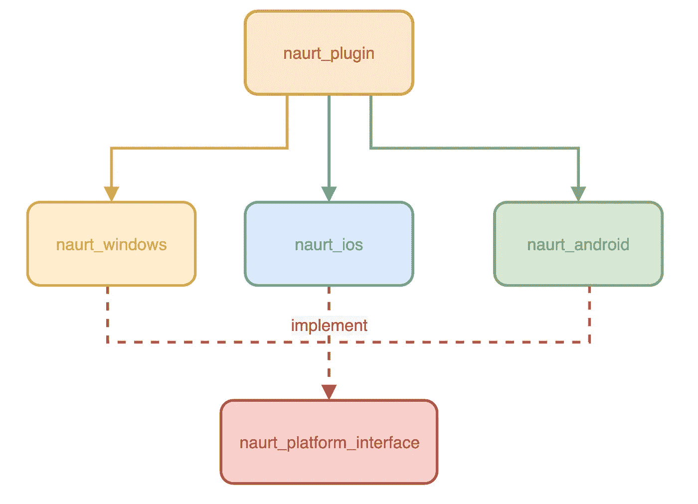
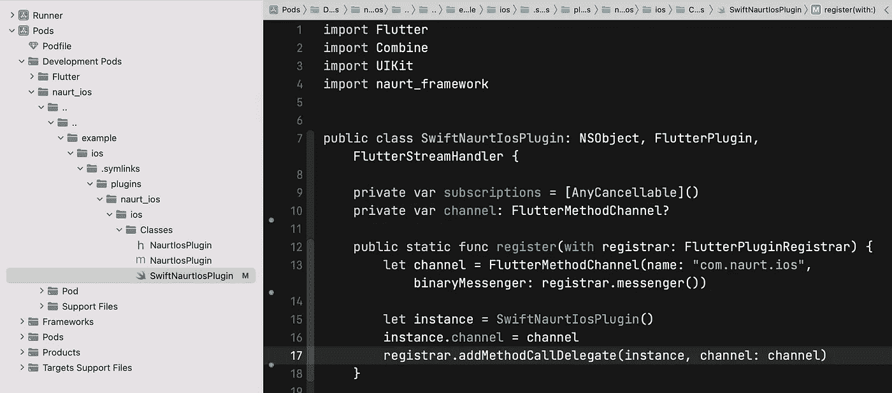
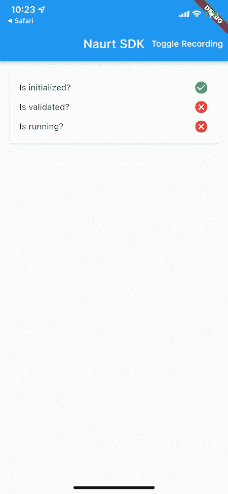
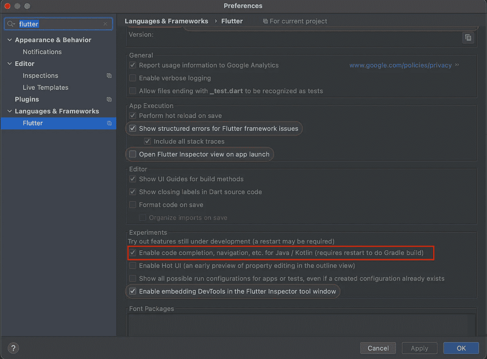
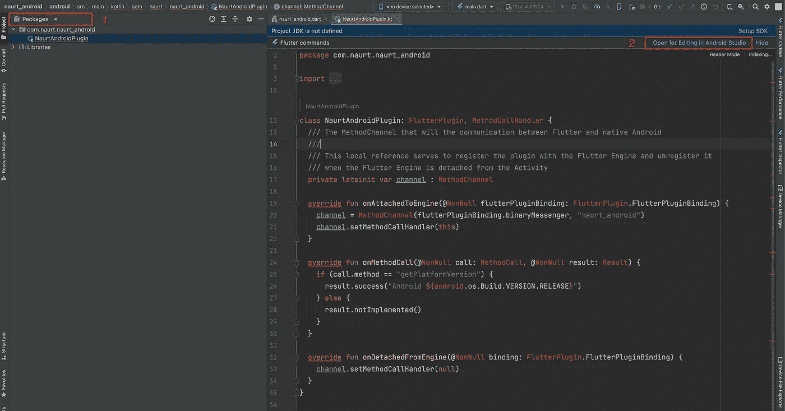
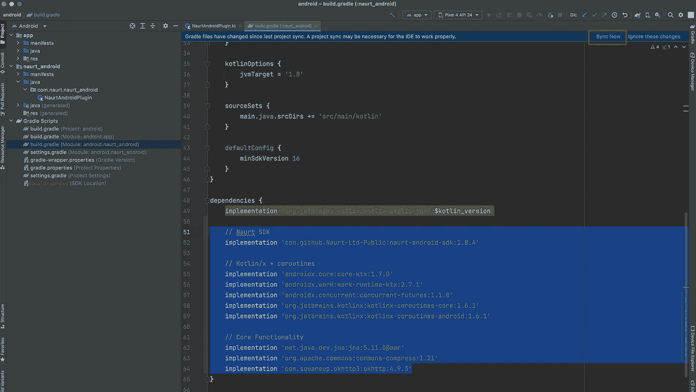
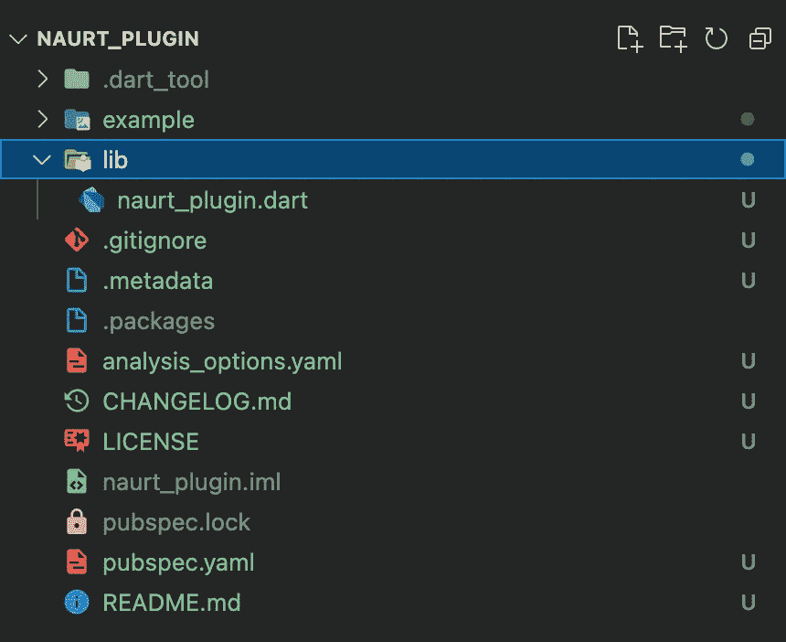

# 开发一个 Flutter 原生插件——一个真实的场景

> 原文：<https://betterprogramming.pub/developing-flutter-native-plugin-a-real-world-scenario-f062bcdcda9f>

## 在 Xcode 和 Android Studio 中编写原生代码与 Flutter 通信


Artur Shamsutdinov 在 [Unsplash](https://unsplash.com?utm_source=medium&utm_medium=referral) 上拍摄的照片

你有没有想过和 iOS / Android OS 对话，做一些 Flutter 没有的特定动作？也许你的团队为 iOS 和 Android 平台准备了单独的*内部*包，你现在需要在 Flutter 中使用它。但是怎么做呢？

我遇到了一个来自 Naurt 团队的请求，为他们的 iOS 和 Android SDK 创建一个 Flutter 插件。他们的产品是位置优化 SDK 所以他们希望他们的 SDK 也能用于 Flutter 应用。

# **你将学到什么**

1.  创建颤振插件
2.  从平台实现中分离插件行为([联合包](https://docs.flutter.dev/development/packages-and-plugins/developing-packages))
3.  向本机平台发送消息。
4.  接收来自本机平台的响应。
5.  从本地到 Flutter 的流事件
6.  从本机调用 dart 方法
7.  为 SDK 演示一个可运行的示例应用程序
8.  用 Xcode 编写与 dart 代码通信的 iOS 本地代码
9.  在 Android Studio 中编写与 dart 代码通信的 Android 本机代码

# 解决办法

Flutter 使用**方法通道**来调用特定于平台的 API。

方法通道是一个灵活的消息传递系统，允许在应用程序的 Flutter 部分和非 Dart 部分之间进行双向通信。



方法通道架构概述

1.  Flutter app 可以向主机发送消息，主机接收消息并调用特定于平台的 API——用本地语言。
2.  主机可以将响应发送回 Flutter 应用程序

您可以将方法通道视为 HTTP 方法。*我们不使用它们来调用服务器上的函数*，而是捆绑信息，以服务器可以理解的格式发送，并回复一个响应。

因此，当 Flutter 应用程序为 Android 开发时，它将 Android SDK 嵌入到 Android 应用程序捆绑包中，而当它为 iOS 开发时，它将 iOS SDK 嵌入到 iOS 应用程序捆绑包中。



嵌入平台二进制文件的 SDK

# 步骤 1 —创建一个新的插件项目

为了创建一个 Flutter 插件，打开 VSCode，然后`View > Command Palette > Flutter: New Project`选择`Plugin Template` 并命名为 *naurt* 。项目创建后，将文件夹重命名为`naurt_platform_interface.`，注意`package`和`plugin`的区别。包只包含 dart 代码。而是用来与底层平台通信的插件。



`naurt_platform_interface`只包含抽象类，这些抽象类定义了插件包对特定于平台的实现的要求。所以方法没有实现。

`PlatformInterface`是一个帮助类，确保`NaurtPlatform`的子类扩展这个类，而不是实现它。这有助于您以后向接口添加任何方法，它不会破坏所有平台特定的实现。

删除`naurt`文件、`example`文件夹和`getPlatfromVersion()`。

目标文件夹结构:

*   `Naurt`
    –`naurt_platform_interface`
    –`naurt_ios`
    –`naurt_android`
    –`naurt_plugin`

`naurt_ios`和`naurt_android`是`naurt_platform_interface`的平台特定实现。`naurt_plugin`引用了所有这些包，在 Flutter 应用程序中，我们将`naurt_plugin`设置为依赖。所以以后如果需要一个 windows 插件，它需要创建另一个专门为 windows 实现接口的包。



# **定义平台接口方法和属性**

看两个[iOS](https://gist.github.com/AnBowell/8a44250b1f2490df4230ba20c7b28295#file-naurt_object_properties-swift)/[Android](https://gist.github.com/AnBowell/3e62482ee813fcfa734ea71d5a746ecf#file-naurt_object_properties-kt)SDK 方法。它们几乎完全相同，只是有一点不同。第一步是创建一个所有平台都应该使用的公共接口。此外，该团队提到，特定于平台的 SDK 中的属性是可见的，用户可以听到它们的变化。这意味着，例如在 iOS / Android 中，如果客户端想要监控位置更新，他们需要监听`lastNaurtPoint`属性。

让我们转换一个方法和一个属性。其余的都一样。

**iOS** : `Naurt.shared.initialise( apiKey: String, precision: Int)`

**安卓** : `Naurt.initialise( apiKey: String, context: Context, precision: Int): CompletableFuture<NaurtTrackingStatus>`

并检查 SDK 是否正确初始化，有可观察的`isInitialised` 属性。

**iOS:**

**安卓:**

通过观察特定于平台的语言(Swift、Kotlin)中的`isInitialised`，片刻之后，SDK 会通知您它是否被正确初始化。我们并不寻求判断它们的实现。我们需要在 Dart 中定义一个简单的接口，以适应我们在 Flutter 应用程序中的用例。

**建议镖法:** `Future<bool> initialize({required String apiKey, required int precision})`

正如你所看到的，我们已经将上述两个方法和属性结合在一个统一的 Dart 方法中，并使用 bool 返回值来简化我们在 Flutter 应用程序中的插件使用。

目标是:

1.  正确地与团队沟通，理解他们的意思
2.  提出一个好的解决方案。

在我们如何映射到 dart 时，有两个有趣的属性:

```
/** Is Naurt's Locomotion running at the moment? */
@Published isRunning: Bool/** Most recent naurt point for the current journey* nil if no data is available */
@Published naurtPoint: NaurtLocation?
```

## **飞镖方法**

在 Dart 中，我们可以使用`Stream`或`callBacks`来观察变化。我更喜欢用流来改变位置，因为我可以用、`map`、`reduce`来操作流数据，但不能用回调。Boolean 的回调比`Stream` s 要方便得多。

您可以在此查看平台接口方法:

[](https://github.com/haashem/flutter-native-plugin-tutorial/blob/35188521c5e55407a562302da8ab1ff577f42b9e/naurt_platfrom_interface/lib/naurt_platform_interface.dart) [## flutter-native-plugin-tutorial/naurt _ platform _ interface . dart at…

### 此时您不能执行该操作。您已使用另一个标签页或窗口登录。您已在另一个选项卡中注销，或者…

github.com](https://github.com/haashem/flutter-native-plugin-tutorial/blob/35188521c5e55407a562302da8ab1ff577f42b9e/naurt_platfrom_interface/lib/naurt_platform_interface.dart) 

# 步骤 2:创建 iOS 实现

创建另一个插件项目，命名为`naurt_ios`，并保存在`naurt`目录中。打开`pubspec.yaml`并添加`naurt_platfrom_interface`作为依赖:

```
naurt_platfrom_interface:
  path: ../naurt_platfrom_interface/
```

此外，在文件顶部添加`publish_to: 'none'`——对于本教程，我们不会发布到 pub . dev——否则所有的依赖项都必须上传到`pub.dev`。

将`naurt_ios_method_channel`重命名为`naurt_ios`，将其类重命名为`NaurtIOS`，删除`lib`文件夹中的其他文件。也删除`example`和`test`文件夹。

## **创建一个丢失的 iOS 文件夹**

在终端中运行下面的命令，用`iOS`文件夹重新创建插件项目。我们将在 iOS 文件夹中编写 Swift 代码，以处理来自 Flutter 应用程序的消息:

```
flutter create --template=plugin --org=com.naurt --platforms=ios .
```

打开`pubspec.yaml`文件，在 flutter 部分设置 iOS 的插件类:

```
plugin:
  platforms:
    ios:
      dartPluginClass: NaurtIOS
      pluginClass: NaurtIosPlugin
```

`NaurtIOS`是实现该接口的 Dart 类的名称，

`NaurtIosPlugin`是方法通道将消息传输到的 iOS 类的名称。你可以在`ios/classes`路径上找到这个类。Flutter 自动生成 Swift 版本，名称为`SwiftNaurtIosPlugin`:


打开`NaurtIOS`文件，从`NaurtPlatform`扩展它并覆盖方法:

我们定义了一个名为`com.naurt.ios`的方法通道来向 iOS 发送消息。

`registerWith`将在启动时被`naurt_plugin` 包调用，注册已经实现平台接口的 dart 类，并与原生平台通信。我们稍后将讨论这一点。

在最初的 Naurt SDK 自述文件中，也提到了 SDK 应该是单例的。所以 dart 中的 singleton 就是用`_`添加命名构造函数那么简单。

在`initialize`方法中，方法通道调用用`apiKey`和`precision`参数向项目的 iOS 端发送一个要初始化的消息名。我们用“发送消息”这个词，因为 iOS 端可以忽略这个消息，什么都不会发生。

## **添加 Naurt iOS SDK 依赖关系**

打开`iOS/naurt_ios.podspec`，添加 Naurt iOS SDK 依赖:

```
s.dependency 'naurt_cocoapod', '0.6.0'
s.xcconfig = { 'ENABLE_BITCODE' => 'NO', }
s.platform = :ios, '13.4'
```

我们还禁用了依赖项的位代码，因为 SDK 文档中提到应该禁用它。

如果在您的情况下，依赖项在`cocoapods`上不可用，并且您将它作为框架，导航到平台实现路径，如:`naurt_ios/ios/Frameworks`将框架移动到文件夹中，并更新 podspec，如下所示:

```
s.vendored_frameworks = 'Frameworks/FaceTecSDK.framework'
```

然后在 termnial 中导航到`naurt_ios/example/iOS`并键入`pod install`以将依赖关系与项目集成。

那我们如何处理 iOS 中的方法通道消息呢？我们应该在哪里写 Swift 代码？

我们将在`SwiftNaurtIosPlugin.swift`编写所有 Swift 代码。

# Xcode 中的 iOS 插件实现

右键点击`example/iOS`，在 Xcode 中打开。是时候编写 Swift 代码并处理来自 Flutter 端的消息了。

导航到`SwiftNaurtIosPlugin.swift`。该文件的路径是深层嵌套的，但您可以通过查看下图来找到它:



导入`naurt_framework`并构建项目以验证一切工作正常。

那么`SwiftNaurtIosPlugin`如何从方法通道接收消息呢？

如果你记得我们在`naurt_ios` `pubspec.yaml`中设置`NaurtIosPlugin`为 iOS 插件类。

在`register`方法中，创建了一个名为`com.naurt.ios`的方法通道。你可以认为`binaryMessenger`是一个编码和解码消息的工具。为了处理通道中的消息，我们需要覆盖:

```
func handle(_ call: FlutterMethodCall, result: @escaping FlutterResult)
```

处理方法调用

## **从 Dart 中调用本机方法**

在方法内部，我们检查是否调用了`initialize`方法——然后我们从调用中提取方法参数，并将其传递给 iOS SDK initialize 方法。

如果我们看一下`NaurtPlatform` `initialize`方法，它期望一个 bool 返回值。

为了找出初始化结果，我们需要观察`isInitialized` Naurt iOS SDK 属性并将该值传递给`handle(_ :FlutterMethodCall, result: @escaping FlutterResult)` `result`参数。

`result`用于将返回值传递给调用者。现在您已经了解了如何在本机中调用方法并向 dart 返回值。因为 Naurt iOS SDK 内部使用了 Combine 框架，所以我们需要保留订阅列表，否则我们无法观察到变化。

## **从本机调用 Dart 方法**

如果您还记得，我们在名为:

```
ValueChanged<bool>? onRunning;
```

我们使用这个回调来观察 SDK 的运行状态。你在原生版中看到了我们如何在 channel 上使用`invokeMethod`用 status 值调用 Dart 中的`onRunning`。

在 Dart 中，我们以同样的方式处理方法调用。下面是我在`NaurtIOS`初始化器中的 Dart 方法调用处理:

```
NaurtIOS() {
  methodChannel.setMethodCallHandler((call) async {
    if (call.method == 'onRunning') {
      onRunning?.call(call.arguments);
    }
  });
}
```

## **将事件从本机流式传输到 Dart**

与方法通道相同，您需要一个事件通道来打开，并使用事件接收器将事件流放入通道中。对于每个特定的事件，您需要一个特定的事件接收器。在 Flutter 中，我们需要监听位置变化。

首先，我们需要创建一个事件通道:

```
static const EventChannel _eventChannel = EventChannel('com.naurt.ios');
```

然后我们以这种方式监听位置变化，并将其映射到`NaurtLocation`:

```
@override
Stream<NaurtLocation> get onLocationChanged {
  return eventChannel
  .receiveBroadcastStream()
  .where((location) => location != null)
  .map((dynamic location) =>
     NaurtLocation.fromMap(Map<String, dynamic>.from(location)));
}
```

并且在 iOS 中我们用`register`方法创建了一个具有相同标识符的事件通道:

```
let eventChannel = FlutterEventChannel(name: "com.naurt.ios", binaryMessenger: registrar.messenger())
eventChannel.setStreamHandler(instance)
```

我们创建一个名为`locationUpdateEventSink`的属性，专门用于 sinking 位置更新。

```
private var locationUpdateEventSink: FlutterEventSink?
```

然后，我们在事件通道打开时设置事件接收器，并在它关闭时清除它:

```
public func onListen(withArguments arguments: Any?, eventSink events: @escaping FlutterEventSink) -> FlutterError? {
  locationUpdateEventSink = events
  return nil
}public func onCancel(withArguments arguments: Any?) -> FlutterError? {
  locationUpdateEventSink = nil
  return nil
}
```

通过观察`naurtPoint`的更新，我们将更新传递给事件接收器:

```
subscriptions.append(Naurt.shared.$naurtPoint.sink { [weak self ]   value in
  self?.locationUpdateEventSink?(value?.encode())
})
```

`encode`是对`NaurtLocation`对象的扩展，将它转换成地图。

我们只能在方法和事件通道中传递原始数据类型。

```
private extension NaurtLocation {
  func encode() -> [String: Any]{
    return ["latitude": latitude, "longitude":longitude, "timestamp": timestamp]
  }
}
```

为了验证插件的正确性，我在`naurt-ios`插件文件夹中添加了一个例子，它只是测试 SDK 的基本行为:



[在 Github 查看完整的 iOS 插件源代码](https://github.com/haashem/flutter-native-plugin-tutorial/tree/7bd60c8455fdf65a09de777b1cc11a560ee133bc)

# 步骤 3:创建 Naurt Android 插件项目

创建一个新的插件项目，命名为`naurt_android`。

删除`pubspec.yaml`文件。我们现在将重新创建它。

运行以下命令在`naurt_android`目录下创建`android`和`example`文件夹。

```
flutter create --template=plugin --org=com.naurt --platforms=android .
```

`pubspec.yaml`用正确的类和包名重新创建。

```
flutter:
  plugin:
    platforms:
      android:
        package: com.naurt.naurt_android
        pluginClass: NaurtAndroidPlugin
        dartPluginClass: NaurtAndroid
```

`NaurtAndroidPlugin`是我们编写 android 原生代码的 Kotlin 文件。另外，在依赖关系部分添加`naurt_platfrom_interface`:

```
naurt_platfrom_interface:
  path: ../naurt_platfrom_interface/
```

删除我们不需要的`naurt_android_platform_interface.dart`和`naurt_android_method_channel.dart`文件。

接口的 Dart 实现与 iOS 相同。

但是它可以基于需求而不同。灵活性是实现分离的好处。

这意味着两个不同的团队可以以他们喜欢的任何方式实现相同的接口。

# Android Studio 中的 Android 插件实现

在 Android Studio 中打开整个`naurt_android`文件夹—通过打开 Android Studio: `File > Open > “path to naurt_android project"`

然后安装 Android Studio 的 Flutter 插件:`Android Studio > Preferences > Plugins > Flutter`并安装。然后重启 Android Studio。它加载了原生 Android 项目所需的所有 Flutter 包。通过这样做，我们能够编辑本机插件的 Kotlin 文件。

要为 Flutter 启用代码完成，您需要再次打开首选项，在`preferences`中搜索 Flutter 并启用代码完成:



在 Android Studio 中为 Flutter 启用代码完成

然后从左侧栏选择`Packages`模式，选择`NaurtAndroidPlugin`，然后在右侧选择`Open for Editing in Android Studio`



最后，我们可以使用代码完成功能编辑 Android 插件 Kotlin 文件。

## **配置 Android 依赖关系**

为`naurt_android`打开`build.gradle`并添加 [Naurt Android SDK 依赖项](https://docs.naurt.net/android_sdk)，并将 JitPack 添加到存储库列表列表中:

```
rootProject.allprojects **{** repositories **{** google()
        mavenCentral()
        maven **{** url 'https://jitpack.io' **}
    }
}**
```

然后点击 IDE 右上角的`Sync Now`来安装依赖项。



添加 Android 依赖项

将[所需权限](https://docs.naurt.net/android_sdk)添加到 AndroidManifest.xml 中，现在可以在`NaurtAndroidPlugin.kt`中导入以下内容，并开始在 Android Studio 中编写插件的 Android 实现。

```
import  com.naurt_kotlin_sdk.Naurt.*INSTANCE* as Naurt
```

我已经写了完整的 android 实现。大部分和 iOS 一样。你可以在这里浏览一下[的 Android 实现](https://github.com/haashem/flutter-native-plugin-tutorial/tree/5137a0b8c8e2ed6379dfcbae6e9e78d32b30bd89)。

# 步骤 4:创建 Naurt 插件项目

在这里，我们引用了所有 iOS、Android 和其他平台的`NaurtPlatform`接口实现，并创建了一个示例项目，可以使用适当的实现插件运行所有平台。

创建一个新的插件项目，命名为`naurt_plugin`。

运行以下命令，在`naurt_plugin`目录下创建一个`example`文件夹。

```
flutter create --template=plugin --org=com.naurt --platforms=iOS, android .
```



打开`pubspec.yaml`文件，在依赖项部分添加`naurt_platform_interface`、`naurt_ios`和`naurt_android`:

```
dependencies:
  naurt_platfrom_interface:
    path: ../naurt_platfrom_interface/
  naurt_android:
    path: ../naurt_android/
  naurt_ios:
    path: ../naurt_ios/
```

然后添加`naurt_ios`为 iOS 平台实现，分别为 android:

```
flutter:
  plugin:
    platforms:
      ios:
        default_package: naurt_ios
      android:
        default_package: naurt_android
```

将`main.dart`复制到`naurt_ios`或`naurt_android`示例文件夹中，并在`naurt_plugin`示例 app 中重复使用。

运行`naurt_plugin`应用中的示例应用，查看在 Android 和 iOS 设备上的运行情况。

从现在开始，如果你想在任何 Flutter 应用程序中使用该插件，只需在`pubspec.yaml`中引用`naurt_plugin`。

因为基于上面的配置，插件可以理解要查找哪个平台实例。

# 结论

这是一个很沉重的话题，但是我们可以提起它🏋️‍♀️.

您学习了如何从 Flutter 端与底层平台通信，反之亦然——用 Xcode 和 Android Studio 编写本机代码来与 Flutter 通信。此外，您还练习了联邦插件包，这是 Flutter 团队推荐的方法。

你可以在 Github 上查看完整的源代码。