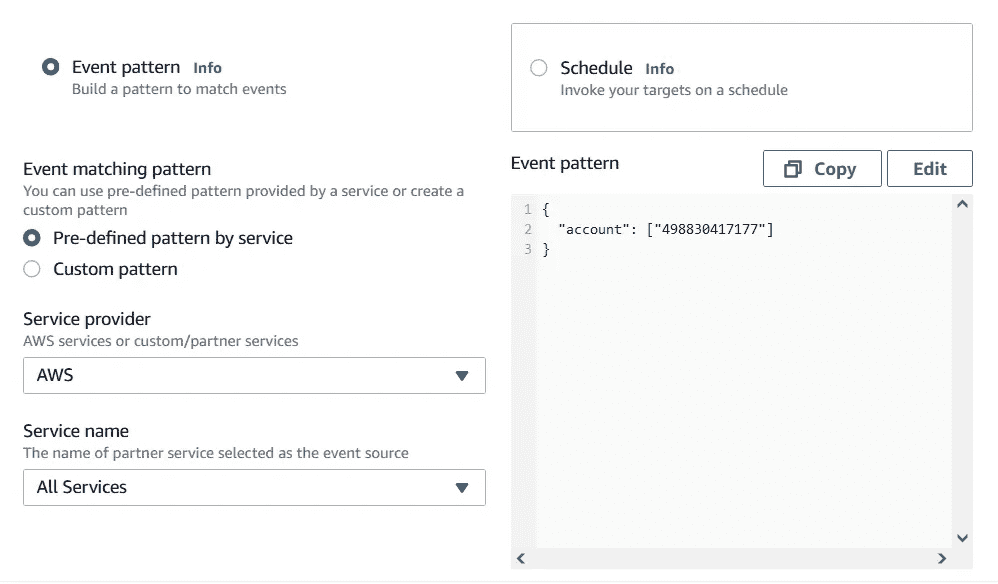
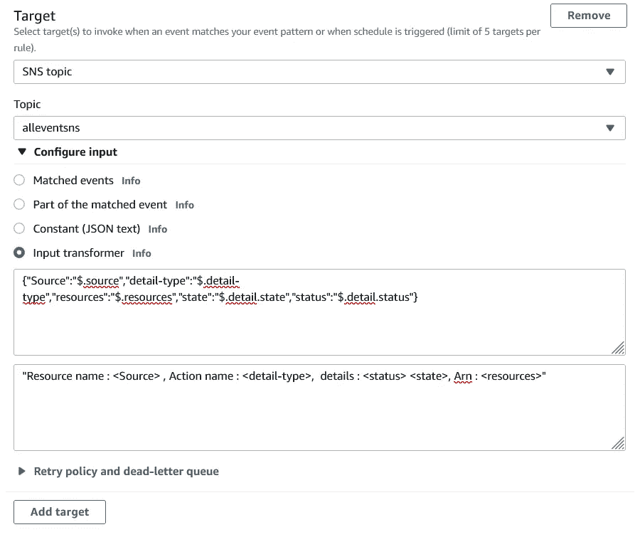
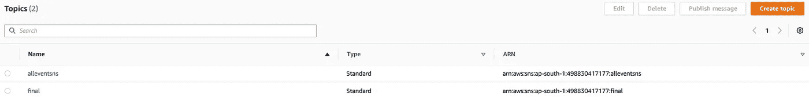
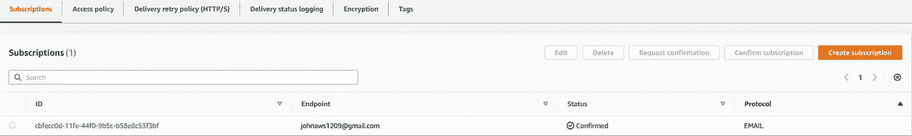
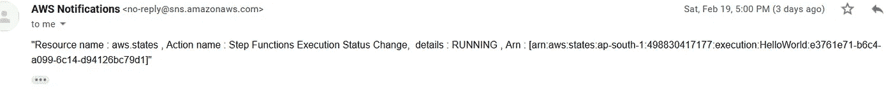

# 使用 Terraform 在 AWS 上开发通过电子邮件的实时资源监控

> 原文：<https://betterprogramming.pub/developing-real-time-resource-monitoring-via-email-on-aws-using-terraform-a89fe79e366d>

## 使用这种技术节省监控成本


作为 SRE 工程师的主要任务之一是维护为应用程序的部署而开发的基础设施。由于每个服务以不同的方式公开日志，我们需要过多的 sns 和 lambdas 来监控基础设施。这增加了监控的成本，这将迫使管理层放弃这种监控系统。

但是如果我说，我们可以用不到 24 美分开发这个监控系统呢？如果我说您只需一个命令“Terraform apply”就可以部署整个监控系统，那会怎么样？听起来像是你想知道的事？跳上平台车！

## 构建基础设施的关键组件

为了创建一个发送电子邮件警报的监控系统，我们需要 3 个组件:

1.  事件桥
2.  社交网站（Social Network Site 的缩写）
3.  电子邮件订阅

通过组合所有这些组件，我们可以构建一个基本的监控系统。但是我们通过电子邮件获得的日志如下:

```
{“version”:”1.0",”timestamp”:”2022–02–01T12:58:45.181Z”,”requestContext”:{“requestId”:”a4ac706f-1aea-4b1d-a6d2–5e6bb58c4f3e”,”functionArn”:”arn:aws:lambda:ap-south-1:498830417177:function:gggg:$LATEST”,”condition”:”Success”,”approximateInvokeCount”:1},”requestPayload”:{“Records”:[{“eventVersion”:”2.1",”eventSource”:”aws:s3",”awsRegion”:”ap-south-1",”eventTime”:”2022–02–01T12:58:43.330Z”,”eventName”:”ObjectCreated:Put”,”userIdentity”:{“principalId”:”A341B33DQLH0UH”},”requestParameters”:{“sourceIPAddress”:”43.241.67.169"},”responseElements”:{“x-amz-request-id”:”GX86AGXCNXB5ZYVQ”,”x-amz-id-2":”CPVpR8MNcPsNBzxcF8nOFqXbAIU60/zQlNC6njLp+wNFtC/ZnZF0SFhfMuhLOSpEqMFvvPqLA+tyvaXJSYMXAByR5EuDM0VF”},”s3":{“s3SchemaVersion”:”1.0",”configurationId”:”09dae0eb-9352–4d8a-964f-1026c76a5dcc”,”bucket”:{“name”:”sddsdsbbb”,”ownerIdentity”:{“principalId”:”A341B33DQLH0UH”},”arn”:”arn:aws:s3:::sddsdsbbb”},”object”:{“key”:”[variables.tf](http://variables.tf)”,”size”:402,”eTag”:”09ba37f25be43729dc12f2b01a32b8e8",”sequencer”:”0061F92E834A4ECD4B”}}}]},”responseContext”:{“statusCode”:200,”executedVersion”:”$LATEST”},”responsePayload”:”binary/octet-stream”}
```

没那么容易读懂对吗？如果我们能改进它，让每个人都能清楚地理解正在发生的事情，会怎么样呢？

为了便于阅读，我们在事件桥中使用了名为**输入转换器**和**输入模板**的特性。这个特性帮助我们将日志转换成我们想要的格式**，而不需要**使用任何**λ函数。**

# 基础设施工作

我们的基础设施的工作方式如下:

1.  我们的事件桥将使用事件过滤器从 AWS 帐户收集所有事件的所有日志。



Eventbridge 规则的事件模式

2.一旦收集完毕，它们就被发送到 input transformer 来解析和读取我们想要的组件。

3.之后，我们使用这个解析的数据，通过输入模板创建我们想要的格式。



事件桥规则的输入转换器和输入模板

4.这个转换后的数据被发布到我们创建的 SNS 上。



正在创建 SNS 服务

5.我们通过电子邮件、短信或 HTTP 为该产品升级和技术支持服务创建订阅。



SNS 服务的电子邮件订阅

瞧啊。您的基础架构已经准备好更新这些更改了！



电子邮件通知截图

以下是完整的 terraform 代码:

```
terraform {
  required_providers {
    aws = {
      source  = "hashicorp/aws"
      version = "~> 3.0"
    }
  }
}# Configure the AWS Provider
provider "aws" {
  region = "ap-south-1" #insert your region code
}resource "aws_cloudwatch_event_rule" "eventtosns" {
  name = "eventtosns"
  event_pattern = jsonencode(
    {
      account = [
        var.account,#insert  your account number
      ]
    }
  )}resource "aws_cloudwatch_event_target" "eventtosns" {# arn of the target and rule id of the eventrule
  arn  = aws_sns_topic.eventtosns.arn
  rule = aws_cloudwatch_event_rule.eventtosns.idinput_transformer {
    input_paths = {
      Source      = "$.source",
      detail-type = "$.detail-type",
      resources   = "$.resources",
      state       = "$.detail.state",
      status      = "$.detail.status"
    }
    input_template = "\"Resource name : <Source> , Action name : <detail-type>,
      details : <status> <state>, Arn : <resources>\""
  }
}resource "aws_sns_topic" "eventtosns" {
  name = "eventtosns"
}resource "aws_sns_topic_subscription" "snstoemail_email-target" {
  topic_arn = aws_sns_topic.eventtosns.arn
  protocol  = "email"
  endpoint  = var.email
}# aws_sns_topic_policy.eventtosns:
resource "aws_sns_topic_policy" "eventtosns" {
  arn = aws_sns_topic.eventtosns.arnpolicy = jsonencode(
    {
      Id = "default_policy_ID"
      Statement = [
        {
          Action = [
            "SNS:GetTopicAttributes",
            "SNS:SetTopicAttributes",
            "SNS:AddPermission",
            "SNS:RemovePermission",
            "SNS:DeleteTopic",
            "SNS:Subscribe",
            "SNS:ListSubscriptionsByTopic",
            "SNS:Publish",
            "SNS:Receive",
          ]
          condition = {
            test     = "StringEquals"
            variable = "AWS:SourceOwner"
            values = [
              var.account,
            ]
          }Effect = "Allow"
          Principal = {
            AWS = "*"
          }
          Resource = aws_sns_topic.eventtosns.arn
          Sid      = "__default_statement_ID"
        },
        {
          Action = "sns:Publish"
          Effect = "Allow"
          Principal = {
            Service = "events.amazonaws.com"
          }
          Resource = aws_sns_topic.eventtosns.arn
          Sid      = "AWSEvents_lambdaless_Idcb618e86-b782-4e67-b507-8d10aaca5f09"
        },
      ]
      Version = "2008-10-17"
    }
  )
}
```

这整个基础设施可以使用上述代码上的 *Terraform apply* 进行部署。

喜欢我的内容吗？请随意访问我的 LinkedIn[获取有趣的内容和富有成效的讨论。](https://www.linkedin.com/in/krishnadutt/)