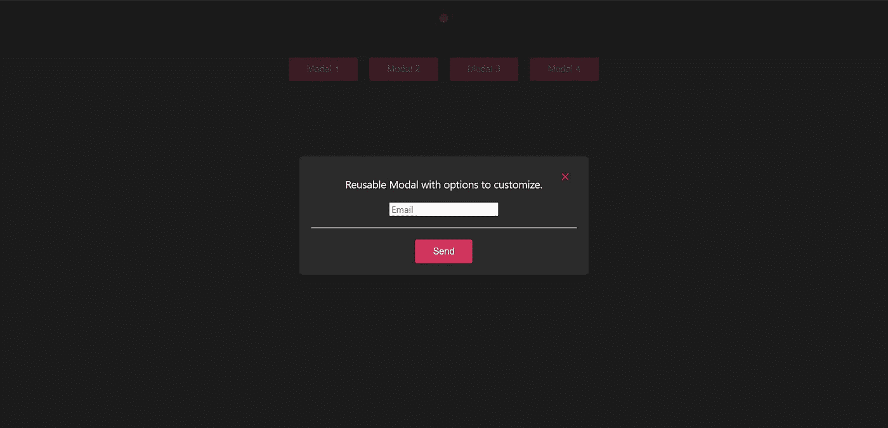
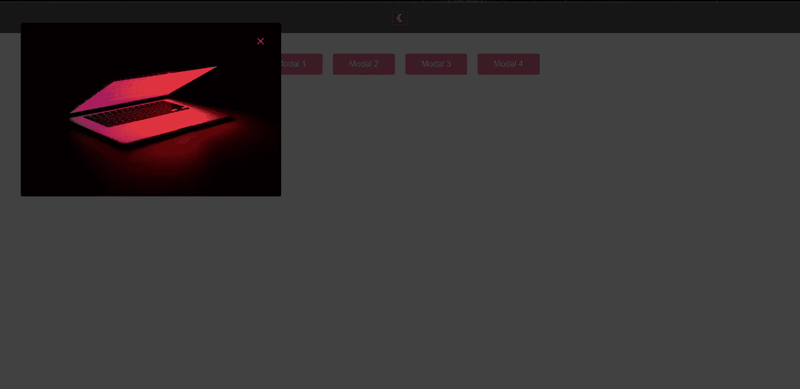
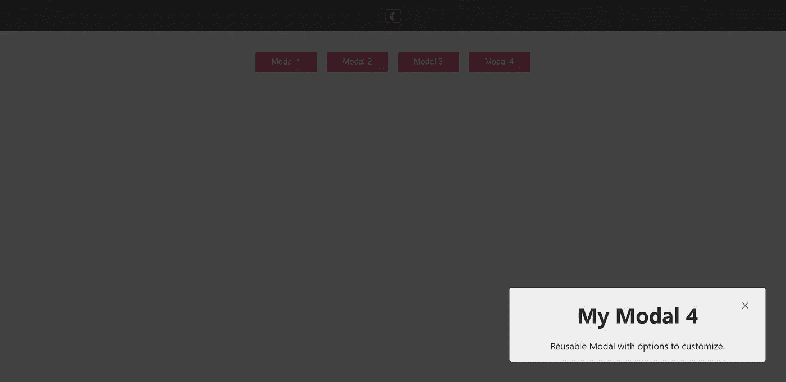

# 用 React 和 TypeScript 开发可重用和可定制的模型

> 原文：<https://betterprogramming.pub/developing-reusable-and-customizable-modals-with-react-and-typescript-9f6217c76f07>

## 如何使用 React 门户和样式化组件创建完整的模型


由[文森特·吉尔施](https://unsplash.com/@gierschv?utm_source=medium&utm_medium=referral)在 [Unsplash](https://unsplash.com?utm_source=medium&utm_medium=referral) 拍摄的照片

作为一名前端开发人员，你可能不止一次地需要构建一个模态窗口。这种类型的元素不同于典型的弹出窗口，因为它不会自动出现，而是用户必须单击网站上的某个位置(通常是一个按钮)才能使它出现。

在本教程中，您将学习如何使用 TypeScript 在 React 项目中开发和实现模态组件。它可以在应用程序的任何部分重用，您可以定制它并添加任何类型的内容。

# 什么是模态窗口？

模态毫无疑问是 web 上使用最多的组件之一，因为它们可以在不同的上下文中使用，从消息到用户输入。他们在屏幕上放了一张覆盖图。因此，它们在视觉上优先于所有其他元素。

像 React 中的许多其他组件一样，可以安装一个依赖项来帮助这个过程。然而，我们总是在几个方面受到限制，其中之一就是造型。

我们可以在 DOM 层次结构中调用它的元素的内部或外部创建一个模态，但是为了满足模态的定义，它应该与 React 中用作根的元素处于同一级别，为了实现这一点，我们将使用门户。

# React 中的门户是什么？

门户提供了一种快速简单的方法来将子组件呈现给位于父组件的 DOM 层次结构之外的 DOM 节点。

在 React 中，默认行为是在单个 DOM 节点(应用程序的根节点)下呈现整个应用程序，但是如果我们想要在根 DOM 节点之外呈现子节点呢？你想让孩子在视觉上出现在容器的顶部。

可以使用`ReactDOM.createPortal(child, container)`创建一个门户。这里的子元素是 React 元素、片段或字符串，容器是门户应该注入的 DOM 位置(节点)。

下面是一个使用上述 API 创建的模态组件的例子。

尽管门户呈现在父 DOM 元素之外，但它的行为类似于应用程序中的普通 React 组件。它可以访问 props 和上下文 API。

这是因为门户位于 React 树层次结构中，门户只影响 HTML DOM 结构，不影响 React 组件树。

# React 中的开发模式

## 安装

我们用下面的命令创建了带有 [vite](https://vitejs.dev/guide/#scaffolding-your-first-vite-project) 的应用程序:

```
yarn create vite my-modals-app --template react-ts
```

我们安装项目中需要的依赖项:

```
yarn add styled-components @types/styled-components
```

之后，我们为项目创建以下结构:

```
src/
├── components/
│   ├── layout/
│   │   ├── Header.tsx
│   │   └── styles.tsx
│   ├── modals/
│   │   ├── Buttons.tsx
│   │   ├── Modal.tsx
│   │   ├── PortalModal.tsx
│   │   ├── index.ts
│   └── └── styles.ts
├── hooks/
│   └── useOnClickOutside.tsx
├── styles/
│   ├── modal.css
│   ├── normalize.css
│   └── theme.ts
├── ts/
│   ├── interfaces/
│   │   └── modal.interface.ts
│   ├── types/
│   └── └── styled.d.ts
├── App.tsx
├── main.tsx
└── config-dummy.ts
```

# 成分

正如我们在文件夹结构中看到的，我们为这个应用程序提供了几个功能和样式组件，但是为了不使本教程太长，我们将只关注主要组件。

在这个组件中，我们有一些如何使用自定义模态的例子。我们有显示不同配置的模态的按钮，让我们了解我们可以用这个模态实现什么。

在这个组件中，我们还为我们的模态定义了主题，添加了一个`ThemeProvider`，并用`styled-components`的`createGlobalStyle`创建了一个全局样式。

App.tsx

`Modal.tsx`:该组件根据用户执行的动作决定是否显示。它被包装在叠加在屏幕上的样式组件中。

这个组件接收配置作为属性，在那里我们将定义我们的模态如何被看到，也就是说，它将被显示的位置，模态的标题，填充等等。

它还接收 children，children 包含将在 modal 中显示的所有内容。它可以是任何类型的`tsx`内容。

此外，在这个组件中，我们有几个功能，用于关闭模型。

`useOnClickOutside`:这是一个自定义的钩子，当它检测到用户在模态之外点击时，它将关闭模态。

这个钩子接收我们想要检测的元素的引用作为参数，以及一个回调，它是我们想要在检测到点击时进行的动作。

这个钩子添加了一个`EventListener`，它将响应`mousedown`和`touchstart`事件，之后，它将评估点击是在元素内部还是外部。

`handleKeyPress`:这是一个回调函数，当它检测到用户按下 ESC 键关闭模态时，就会执行这个函数。

它通过向`keydown`事件添加一个`EventListener` 来评估哪个键被按下。

Modal.tsx

`PortalModal.tsx`:这个组件使用 React 门户，我们之前已经提到过。

它接收将成为我们的模态的子元素和一个 id，我们将使用该 id 将它分配给一个 HTML 元素。

在这个组件中，我们使用钩子`useLayoutEffect`。这个钩子与`useEffect`有一点不同，因为这个钩子是在检测到虚拟 DOM 中的变化而不是状态中的变化时执行的，这正是我们在 DOM 中创建新元素时所做的。

在`useLayoutEffect`中，我们寻找并验证元素是否已经用我们传递的 id 创建，然后我们设置这个元素。否则，我们用函数`createWrapperAndAppenToBody`在 DOM 中创建一个新元素。

有了这个函数，我们可以创建最适合我们的元素。在这种情况下，它是在与主体中的根元素相同的级别上创建的。

一旦我们创建了要插入模态的元素，我们就用`createPortal`创建门户。

PortalModal.tsx

`configDummy.ts`:这是我们将用作模板来生成不同模态的文件，在本例中是 4。

如您所见，您可以进行许多组合来生成彼此不同的模态，如果您愿意，还可以添加更多配置。

配置-虚拟. ts

就是这样！我们有很酷的模式，它看起来像这样:



[参见在线演示](https://resusable-customizable-modals.netlify.app/)。

# **项目资源库**

[](https://github.com/ljaviertovar/reusable-modals-react-ts) [## GitHub-ljaviertovar/Reusable-modals-React-ts:在 React with…

### 此时您不能执行该操作。您已使用另一个标签页或窗口登录。您已在另一个选项卡中注销，或者…

github.com](https://github.com/ljaviertovar/reusable-modals-react-ts) 

# 结论

在本教程中，我们创建了一个可重用的组件，因为我们可以在应用程序的任何地方使用它。使用 React Portals，我们可以将它插入 DOM 中的任何地方，因为它将创建一个带有我们分配给它的`id`的新元素。

我们也有不同的样式选项，除了实现了我特别喜欢的黑暗模式，我们还可以添加我们能想到的样式。

我希望这篇教程对你有用，并且你在开发这个应用程序的过程中学到了新的东西。

```
**Want to connect?**Love connecting with friends all around the world on [Twitter](https://twitter.com/ljaviertovar).
```