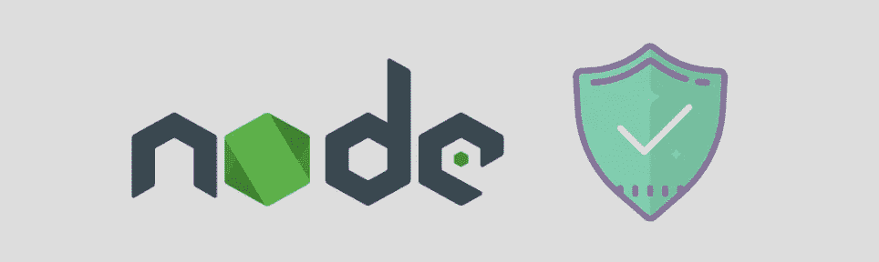
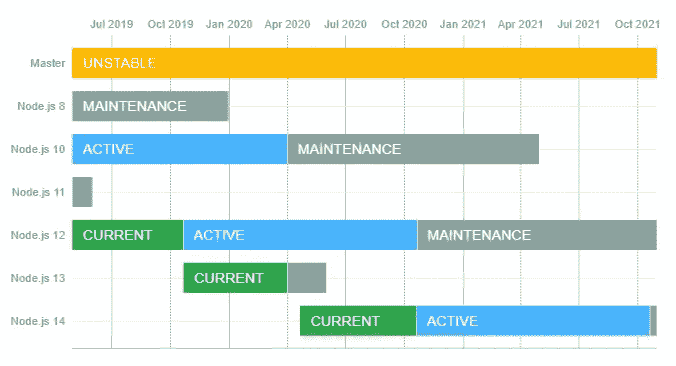
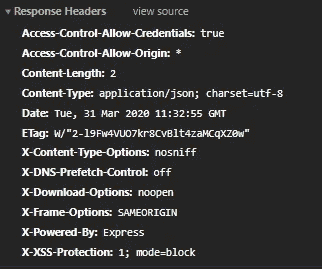

# 如何在 Node.js 中开发更安全的应用

> 原文：<https://betterprogramming.pub/developing-safer-applications-in-nodejs-f645788f9c65>

## 使我们的节点应用更加安全的措施



作者照片。

此外，可从以下链接获得 API-Rest 的模板以及实现的安全选项:

[](https://github.com/antonioalfa22/Node-Secure-Rest-Template) [## Antonio alfa 22/Node-Secure-Rest-模板

### 节点 JS 安全 API-Rest 模板。为 Antonio alfa 22/Node-Secure-Rest-Template 开发做出贡献，创建一个…

github.com](https://github.com/antonioalfa22/Node-Secure-Rest-Template) 

在开始开发任何类型的应用程序之前，无论是在 Node.js 中还是在任何其他编程环境中，我们都必须确保我们已经将所有将要使用的库和框架更新到它们的最新稳定版本(除了那些我们需要特定版本的库和框架)。

定期更新我们的工作环境至关重要，因为链条的强度取决于其最薄弱的环节。

# 使用 NPM 管理包版本

为了确保我们没有使用 Node.js 的未使用版本，我们可以使用[他们的官方网站](https://nodejs.org/es/about/releases/)。



图片来自 [Node.js](https://nodejs.org/es/about/releases/) 。

要管理我们在项目中使用的包，我们可以使用 NPM:

# 使用 TLS(传输层安全性)

HTTPS 协议是 TLS 加密在 web 服务和应用程序中使用的 HTTP 协议上的直接实现。

为了能够在 Node.js 和 Express 的应用程序中使用 HTTPS，我们需要一个证书来验证我们的作者身份。

[让我们加密](https://letsencrypt.org/about/)是一个开放的认证机构(CA)，我们可以免费使用(大部分是付费的)。

在 Express.js 中使用 HTTPS:

# 当心 HTTP 默认头

用 Node.js 和 Express 做应用时，增加了一个名为`X-Powered-By: Express` 的 HTTP 头。它可能成为攻击我们应用程序的媒介，因为知道使用了哪些技术会使攻击者的工作变得容易得多。



HTTP 默认头。

Express 有一个名为[头盔](https://helmetjs.github.io/) 的包，它允许我们修改我们希望我们的应用程序显示的标题，并删除默认的`X-Powered-By`标题。

首先，运行:

```
npm i helmet
```

默认情况下，头盔启用了以下选项:

*   [dnsPrefetchControl](https://helmetjs.github.io/docs/dns-prefetch-control) 控制浏览器 DNS 预取。
*   [框架保护装置](https://helmetjs.github.io/docs/frameguard/)用于防止点击千斤顶。
*   [被](https://helmetjs.github.io/docs/hide-powered-by)隐藏电源，移除`X-Powered-By`割台。
*   [hsts](https://helmetjs.github.io/docs/hsts/) 用于 HTTP 严格的传输安全。
*   [ieNoOpen](https://helmetjs.github.io/docs/ienoopen) 为 IE8+设置 X-Download-Options。
*   [noSniff](https://helmetjs.github.io/docs/dont-sniff-mimetype) 防止客户端嗅探 MIME 类型。
*   xssFilter 增加了一些小的 XSS 保护。


HTTP 用头盔更新了标题。

# 限制请求以避免暴力攻击

暴力攻击和 DDoS 攻击在网络上非常常见，会影响我们的应用程序。

对于 Express 和 Node.js，有几个包允许我们限制某个 IP 地址或用户对某些路由产生的访问次数，并在一段时间内阻止它们的访问。

在这种情况下，我们将解释快速限速套餐是如何工作的。

首先，运行:

```
npm i express-rate-limit
```


默认极限响应。

# 代币和饼干

如果我们要开发一个 API-Rest，我们建议使用 [JWT](https://jwt.io/) (JsonWebToken)来代替 cookie，因为 API 现在也被比传统的不支持 cookie 的浏览器简单得多的 HTTP 客户端使用。

如果我们的应用程序需要使用 cookie 进行会话管理，为了确保 cookie 不会打开应用程序进行攻击，请不要使用默认的会话 cookie 名称，并正确设置 cookie 安全选项。

对于 Node.js，有两个主要的 cookie 会话模块:

*   [快速会议](https://www.npmjs.com/package/express-session)
*   [cookie 会话](https://www.npmjs.com/package/cookie-session)

这两个模块的主要区别在于它们如何从 cookies 中保存会话数据。快速会话中间件将会话数据存储在服务器上。它只在 cookie 本身中存储会话 ID，而不是会话数据。

另一方面，cookie 会话中间件实现了基于 cookie 的存储:它序列化 cookie 中的整个会话，而不仅仅是一个会话密钥。

下面是一个使用 express-session 重命名会话 cookie 的示例:

# 其他考虑

*   安全正则表达式:【https://www.npmjs.com/package/safe-regex】
*   https://www.npmjs.com/package/csurf[CSRF 保护:](https://www.npmjs.com/package/csurf)

# 参考

*   [https://express js . com/es/advanced/best-practice-security . html](https://expressjs.com/es/advanced/best-practice-security.html)
*   【https://www.sitepoint.com/how-to-use-ssltls-with-node-js/ 
*   [https://blog.risingstack.com/node-js-security-checklist/](https://blog.risingstack.com/node-js-security-checklist/)
*   [https://www.npmjs.com/advisories](https://www.npmjs.com/advisories)
*   [https://letsencrypt.org/about/](https://letsencrypt.org/about/)