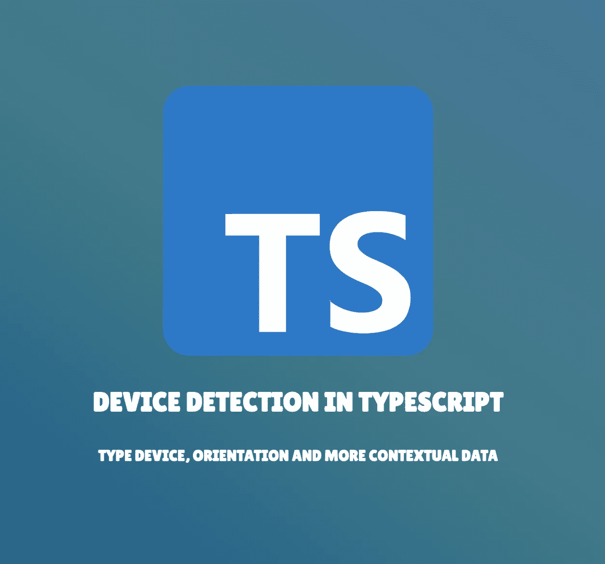
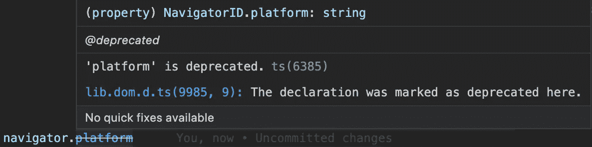

# TypeScript 中的设备检测

> 原文：<https://betterprogramming.pub/device-detection-in-typescript-198f76a7061a>

## 测试应用兼容性的更简单方法

在 web 开发的许多方面中，设备检测看起来很容易。阅读[用户代理](https://developer.mozilla.org/en-US/docs/Web/HTTP/Headers/User-Agent)提供了大量关于浏览上下文的信息。多亏了这个信息字符串和适当的[正则表达式](https://developer.mozilla.org/en-US/docs/Web/JavaScript/Guide/Regular_Expressions)，您可以检索设备种类、操作系统等等。

使用 TypeScript 意味着我们必须键入所有这些类型的数据。然而，这些类型在所有项目中并不总是一致的。

在本文中，您将看到一个有点固执己见的解决方案来收集设备信息并在整个应用程序中重用它们。

> 这个解决方案是框架不可知的，这意味着你可以将它应用于任何 Angular、React、Svelte、Vue 或任何你正在做的项目，并且集成了 Typescript。
> 
> 有些浏览器 API 会被查询，所以要确保这里公开的解决方案符合应用程序的执行环境。

我们的最终目标是构建一个符合以下接口的对象:

该对象将保存在 composer 中，composer 是一个可重用的 TypeScript 模块，您可以在项目的每个部分调用它。

# 设备检测

检索关于设备的信息并不十分困难。正如引言中所讨论的，用户代理[请求头](https://developer.mozilla.org/en-US/docs/Glossary/Request_header)提供了大量数据来识别设备、浏览器和许多其他系统数据。

 [## 用户代理 HTTP | MDN

### 有关基于 Firefox 和 Gecko 的用户代理字符串的更多信息，请参阅 Firefox 用户代理字符串参考。的 UA 字符串…

developer.mozilla.org](https://developer.mozilla.org/en-US/docs/Web/HTTP/Headers/User-Agent) 

因此，只需要构建完美的正则表达式来匹配您需要的信息。

## 设备类型

在这里，类型意味着设备的种类，无论是移动设备、平板电脑还是台式机。

**用例**

了解设备类型有很多好处。您可以隐藏仅在特定设备上可用而在其他设备上不可用的功能，反之亦然。例如，您可以考虑以下情况:

*   阻止访问特定页面
*   阻止页面上的编辑或功能(按钮、输入、布局等)。)
*   将手机或平板电脑墙添加到您的应用中。用户被迫下载移动应用程序，以继续探索您的解决方案所提供的功能。

## **代码实现**

上面的代码片段显示了确定设备类型的基本函数。他们将是我们以后作曲家的支柱。

## 操作系统

**用例**

对当前操作系统的了解允许您向用户提供上下文信息。这里有几个例子:

*   显示适当的应用商店徽章(Google Play 或应用商店)
*   根据操作系统显示当前元键(众所周知的`Ctrl + Enter`或`⌘ + Enter`)

**代码实现**

再次，为了检索操作系统，我们将利用`navigator.userAgent`。当然，正则表达式会根据我们想要检索操作系统的设备类型而有所变化。

作为旁注，注意不要使用`navigator.platform`。事实上，你会在网上读到很多建议这种替代方案的解决方案。然而，`platform`有点过时了，如下图所示:

 [## navigator . platform-Web API | MDN

### 应该尽量避免使用 navigator.platform 来支持特性检测。

developer.mozilla.org](https://developer.mozilla.org/en-US/docs/Web/API/Navigator/platform) 

来自 Visual Studio 代码的反对说明(来源:作者)

总之，我们可以创建两个枚举和函数来检测操作系统，每种设备一个:

## **移动和平板设备**

## **桌面设备**

> 您会注意到两个方法——`getMobileOS()`和`getDesktopOS()`——可能会返回一个`undefined`值。这是一种有意的行为，用于识别这些方法的错误调用，或者当设备不“相关”时这适用于:
> 
> `*getMobileOS()*`在桌面设备上
> `*getDesktopOS()*` 在手机上

然后用一个联合类型和一个`getDeviceOS`函数将它们合并，结果如下:

# 设备方向

处理设备方向是一个更棘手的问题。它将只涉及移动和平板设备。我们必须编写额外的代码来管理方向变化(当用户旋转设备时)。

## **用例**

了解设备方向的主要用例是调整 UI 和布局。

此外，你还可以把它和墙结合起来，以确保用户以正确的方向浏览你的网站。

## **代码实现**

Web API 提供了很多信息，尤其是属性。尽管如此， [Safari 浏览器兼容性](https://developer.mozilla.org/en-US/docs/Web/API/Screen/orientation#browser_compatibility)并没有得到很好的处理，我们必须添加特定的代码来确保这个浏览器得到支持。

您可能已经注意到，为了处理 Safari 特性(L4)，已经做了一些调整。此外，还可以订阅方向改变活动。这将有助于确保`screenOrientation`变量是最新的。

## 把所有东西放在一起

然后，在深入研究每个特定的检测之后，我们可以将所有的代码放在一起，创建一个可以在整个项目中重用的`useDevice` composer。代码如下:

# 测试呢？

## 单元测试

当处理设备检测时，单元测试是一个敏感的话题。事实上，单元测试是在一个无头浏览器中运行的，在这个特定的上下文中没有呈现 UI。这意味着我们目前使用的几个浏览器 API 现在已经`undefined`或者没有公开。因此，我们需要模拟数据，以确保测试不会不可靠。

例如，我们可以通过使用 Jest 提供一个模拟实现来模拟来自`window`对象的`matchMedia` API:

## 端到端测试(E2E)

在某种程度上，E2E 测试更容易处理。许多 E2E 框架支持浏览器和设备的变化。您定义执行上下文(浏览器、设备、方向、网络速度等。).

下面，你可以找到一个使用[剧作家](https://playwright.dev/)及其[仿真](https://playwright.dev/docs/test-configuration#emulation)特性的例子。

如果你更喜欢[柏树](https://www.cypress.io/)，那么可以考虑下面这篇文章:

 [## 使用 Cypress 测试移动、平板和桌面设备

### 更新(2019 年 12 月 12 日):Cypress CLI 现在有一个- config-file 参数，可以提供更简单的…

maxschmitt.me](https://maxschmitt.me/posts/cypress-testing-mobile-tablet-desktop/) 

[Max Schmitt](https://maxschmitt.me/) 解释了如何通过 [Cypress 模块 API](https://docs.cypress.io/guides/guides/module-api) 指定浏览器和设备上下文来定义特定的视口和用户代理。

## 转向跨浏览器兼容性(CBC)测试

正如您在前面的片段中可能已经注意到的，现在执行跨浏览器兼容性测试非常容易。

这种测试非常有趣，可以确保 web 应用程序在不同的环境下(浏览器、设备、方向等)都能正常工作。).然后，您可以截图([剧作家文档](https://playwright.dev/docs/screenshots))并进行视觉对比([剧作家文档](https://playwright.dev/docs/test-snapshots))以检查视觉退化。

作为用例，CBC 测试将允许您检查以下内容:

*   响应式布局
*   设备墙(手机墙、平板电脑墙)
*   方向相关显示
*   特定 CSS 属性的浏览器兼容性

# 结论

这个作曲家的目标是尽可能做到框架不可知。然后，无论你需要一个角度服务，一个反应钩，一个 Vue 计算，或任何适合你的需求，随时根据你的项目来调整它。

# 参考

 [## 用户代理 HTTP | MDN

### 有关基于 Firefox 和 Gecko 的用户代理字符串的更多信息，请参阅 Firefox 用户代理字符串参考。的 UA 字符串…

developer.mozilla.org](https://developer.mozilla.org/en-US/docs/Web/HTTP/Headers/User-Agent)  [## window . screen-Web API | MDN

### 窗口属性屏幕返回对与窗口相关联的屏幕对象的引用。屏幕对象…

developer.mozilla.org](https://developer.mozilla.org/en-US/docs/Web/API/Window/screen)  [## screen . orientation-Web API | MDN

### 屏幕界面的 orientation 只读属性返回屏幕的当前方向。

developer.mozilla.org](https://developer.mozilla.org/en-US/docs/Web/API/Screen/orientation)  [## 快速可靠的现代网络应用端到端测试|剧作家

### 现代网络应用的跨浏览器端到端测试

剧作家 dev](https://playwright.dev/)  [## JavaScript 端到端测试框架

### npm 安装 cypress 安装 Cypress for Mac、Linux 或 Windows，然后开始。完整的端到端测试…

www.cypress.io](https://www.cypress.io/)