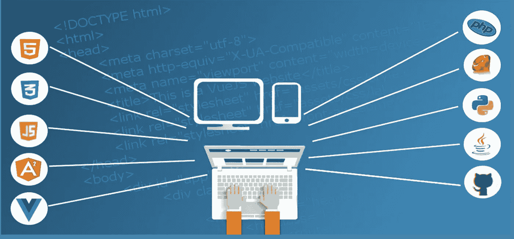

# DevOps 死了，NoOps 万岁

> 原文：<https://betterprogramming.pub/devop-noops-difference-504dfc4e9faa>

## 了解为什么 DevOps 还不够

福图迪[奥拉勒坎奥拉迪普奥](https://pixabay.com/it/users/lakexyde-2489063/?utm_source=link-attribution&utm_medium=referral&utm_campaign=image&utm_content=1935737)达[皮克斯拜](https://pixabay.com/it/?utm_source=link-attribution&utm_medium=referral&utm_campaign=image&utm_content=1935737)

抱歉写了这个 clickbait 标题。我讨厌用这些伎俩，但我需要引起你的注意。在 IT 潮流中，DevOps 是时下的热门词汇。这发生在几年前的前端，当时 SPA(单页应用程序)变得猖獗。

我认为这在技术采用中很常见。有那么一个时刻，一项新技术正在突破，被开明的人采用，变得人人可及，并且传播开来。

过去几年里 DevOps 就遇到过这种情况。在接下来的几年里，你会听到一个新的流行词:NoOps。

# DevOps 和 NoOps 有什么区别？

DevOps 是开发和运营的融合，是开发和运营工程师共同协作定义驱动服务生命周期(从设计到交付)的流程的实践。

NoOps 表示*无操作*。它的理念是去除所有的平台管理部分，减少开发者和基础设施之间的摩擦。

# 我们为什么需要 DevOps？

技术和业务需求更具挑战性，IT 服务变得越来越复杂。这就是交付如此重要的原因，也是我们需要协调整个过程的原因。

有了云，我们不需要更多的系统管理员，但 DevOps 技术和业务技能需求很大。要实现 DevOps 并进入一个利益流动的地方，您需要超越技术交付来思考。

# 为什么我们之前没有 DevOps？

这个问题有很多答案。你可能会说没有必要，因为场景更简单或者没有足够的文化。

我可以认同这些论点，但我认为根本原因是另一个。根据我的经验，更大的问题是由于技术。交付的自动化很难实现。

十年前，大多数系统都没有一步到位的构建，也没有像 git-flow 这样定义良好的工作流。当时还没有更便宜的 CI 解决方案，所以难实现的就不实现了。

我记得 2009 年，我打算部署一个. net 门户。这是我最初的作品之一。我花了一个周六的早上，试图使用开源工具创建一个自动部署系统，最终，我放弃了。

我知道维护这样一个系统比手动部署更昂贵。如今，使用 [Azure DevOps](https://azure.microsoft.com/en-us/services/devops/) ，我只用一个网页浏览器就能在十分钟内完成。时代变了。

# 为什么我们需要的不仅仅是 DevOps？

很容易理解，为什么在你的公司花了很大力气引入 DevOps 之后，你可能会觉得自己很好。问题是，在 IT 世界里，事情变化比你快。

现在市场的要求越来越高，你不能简单地说:“我厌倦了改变，请让我休息一下。”

云的到来让事情变得更加复杂。它允许我们实施复杂的解决方案，解决许多挑战，但需要更多的技能。

你的云的所有部分都是可扩展的，但是它总是需要一些开发操作来设置。这意味着您总是需要一些手工操作。你仍然有一个人在这个过程的大部分背后。这意味着用老方法工作。

NoOps 的目的是定义一个过程，在这个过程中，不需要将开发的部分与操作结合起来就能使事情运转起来。NoOps 有一个目标:让一切都可以通过设计来部署，不需要任何人的努力。

基本上，NoOps 方法如下:开发人员将代码提交到存储库中，然后一切都部署好了。这看起来完全像是持续交付，但它不仅仅如此。这里，对于部署，我们不仅指应用程序，还指基础设施。

# NoOps 怎么可能？

至于 DevOps，NoOps 是技术使能的。这里有许多选择，但基本上，我们可以总结如下:

*   PaaS 解决方案，比如 [Heroku](https://www.heroku.com/) ，或者托管在 [Azure](https://azure.microsoft.com/en-us/) 、 [AWS](https://aws.amazon.com/) 以及所有其他厂商上的云服务。
*   从大型供应商(AWS、Azure)购买的无服务器计算。
*   创建可复制的基础设施(是的，这几乎是第一次需要操作)。

此类解决方案有利于解决基础架构部分，而传统的部署工具可以推动流程并交付应用程序。

# 并非所有闪光的都是金子

我承认取消基础设施管理的想法很诱人。就像拔掉一颗坏牙。基础设施是一项巨大的管理成本，会在开发人员和运营人员之间产生摩擦。一直都是。

但重点是另一个。基础设施不是问题。问题正在处理中。如果流程设计得好，你就不会有摩擦，不会有延迟，一切都会正常工作。

你害怕管理成本吗？只考虑整体成本，不仅仅是管理。也许您的非 PaaS 基于云的基础架构在管理方面成本更高，但最终成本是一样的。看情况。迷茫？

我在告诉你一个秘密。有些应用程序可以部署在 PaaS 上，有些则不能。仅此而已。

如果您的应用程序很简单，PaaS 是一个很好的解决方案，DevOps 人员会很乐意减少工作量。如果你要推出下一个网飞，也许你需要更多的控制。

这就是为什么，最后，没有 DevOps 和 NoOps。只有一个驱动因素:以尽可能少的维护工作创建智能基础设施，并实现一切自动化。使用大型云服务，如 [Google Cloud](https://medium.com/u/4f3f4ee0f977?source=post_page-----504dfc4e9faa--------------------------------) 或其他，你会找到适合你的场景的最佳解决方案。

那么，从这个角度来看，NoOps 是什么呢？这只是云转型趋势中的又一个流行词。

*喜欢这篇文章吗？成为* [*中等会员*](https://daniele-fontani.medium.com/membership) *继续无限制学习。如果你使用下面的链接，我会收到你的一部分会员费，不需要你额外付费。*

觉得这篇文章有用？在 Medium 上关注我( [Daniele Fontani](https://daniele-fontani.medium.com/subscribe) )并查看我在下面 DevOps 上最受欢迎的文章！不要忘记👏这篇文章分享一下吧！

*   [DevOps，NoOps，现在 FinOps？](https://medium.com/better-programming/devops-noops-finops-64e0df91bcb8)
*   [如何使用 Kubernetes 部署 Web 应用程序](https://medium.com/swlh/how-to-deploy-an-asp-net-application-with-kubernetes-3c00c5fa1c6e)