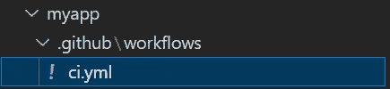
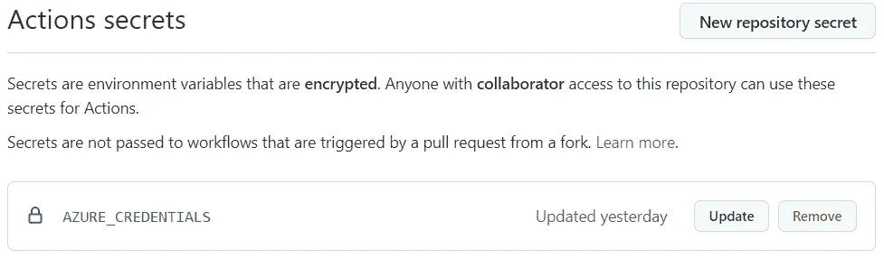
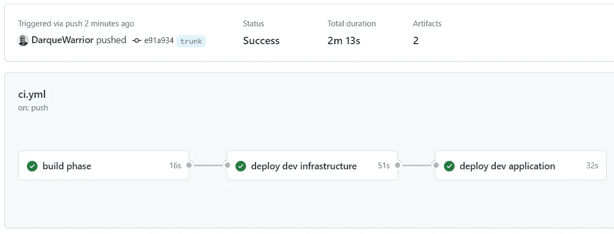
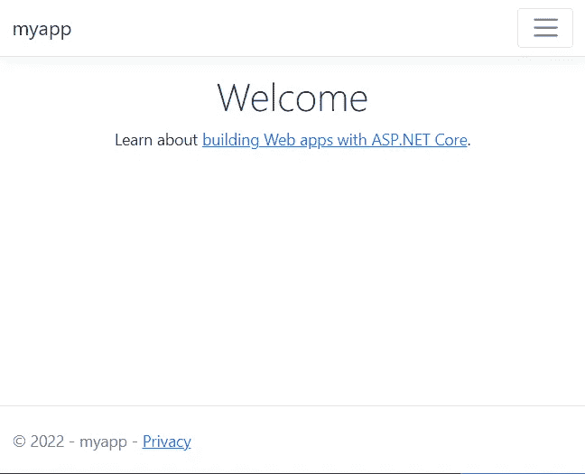

# DevOps for。NET 6.0

> 原文：<https://betterprogramming.pub/devops-for-net-6-0-7fae47cec014>

## 展开。使用 GitHub 操作将. NET Web 应用程序转换为 Azure 应用程序服务


照片由 [Max Duzij](https://unsplash.com/es/@max_duz?utm_source=medium&utm_medium=referral) 在 [Unsplash](https://unsplash.com?utm_source=medium&utm_medium=referral) 上拍摄

在这篇文章中，我将向您展示如何使用 Bicep for Infrastructure 作为代码，通过 GitHub Actions 将. NET 6 Web App 部署到 Azure App Service。

要跟进，您需要:

*   [GitHub 账户](https://github.com/)
*   [GitHub CLI](https://cli.github.com/)
*   [。Net 6 SDK](https://dotnet.microsoft.com/)
*   Azure CLI
*   [PowerShell](https://github.com/PowerShell/Powershell) (所有命令都在 PowerShell 中运行)

首先，创建要部署的应用程序。

```
dotnet new webapp --output myapp
```

切换到文件夹并添加一个. gitignore 文件。

```
cd myapp
dotnet new gitignore
```

在 *myapp* 文件夹下创建一个名为 *infra* 的新文件夹来存放 Bicep 文件。当我使用 Bicep 时，我创建了一个模块来保存我的基础设施的不同部分。我总是创建一个 *main.bicep* 来调用其他模块并收集任何输出。除了 main.bicep 之外，我还会有一个 webapp.bicep。将这两个文件放在下面的*文件夹中。*

在第 1 行，我将这个部署限定为订阅。这将允许部署创建任何需要的资源组，我在第 6 行做了这些。资源组需要两个值`name`和`location`，这两个值都由第 3 行和第 4 行定义的参数提供。

在第 11 行，我调用了`webapp.bicep`文件，我们稍后将讨论这个文件。在第 12 行，我设置了名称，在第 13 行我限定了它的范围，所以所有的东西都是在提供的资源组中创建的。`webapp.bicep`文件还定义了第 15 行提供的位置参数。

最后，在第 19 行，我收集并传播 Web 应用程序名称作为输出。

接下来，我创建了`webapp.bicep`文件。

要在 Azure App Service 中创建 Web 应用，您首先必须创建一个托管计划。因为应用程序是使用。Net 6 它可以在任何平台上运行。对于这个例子，我们将部署到 Linux。

第 3–13 行定义了托管计划。必须将*保留*属性设置为 true，并将*种类*属性设置为‘Linux’。您可以根据需要选择任何 sku。

第 15–27 行定义了 web 应用程序并设置了。Net 版本到 6.0 第 24 行。

代码准备就绪后，我们可以初始化存储库，并在添加 GitHub 工作流之前将其推送到 GitHub。

```
git init
git add *
git commit -a -m 'Init'
```

随着存储库的初始化，我们可以使用 GitHub CLI 创建一个公共存储库，并将我们的代码推送到那里。

```
gh repo create myAppRepo --public --source .
git push --set-upstream origin trunk
```

随着存储库的创建和代码的推送，我们可以创建 GitHub 工作流了。在根文件夹下创建一个`.github`文件夹，里面有一个`workflows`文件夹。最后，在`workflows`文件夹中创建一个`ci.yml`文件。



项目中的工作流文件

下面是`ci.yml`文件。

这个工作流程有三个任务`build`、`deployDevInfrastructure`和`deployDevApp`。

在`build`作业中，我只是运行我在开发机器上运行的相同命令来发布我的应用程序以进行部署。

应用程序发布后，我创建了两个工件，一个用于应用程序，一个用于基础设施。

这份工作有趣得多。该作业使用 Azure CLI 和 PowerShell 来部署 Bicep 文件，并存储输出供其他作业使用。

来自二头肌部署的输出在线 75 上被收集。该值与发布简档一起作为输出存储在线路 83 和 84 上。第 46–48 行定义了这一步的输出。

这些值用于第 104 和 106 行的`deployDevApp`作业。

要使用 Azure CLI，我们必须创建一个存储 Azure 凭据的 GitHub secret。你可以在 GitHub 的[上阅读如何在 GitHub 动作工作流程](https://github.com/Azure/actions-workflow-samples/blob/master/assets/create-secrets-for-GitHub-workflows.md)中设置秘密。我使用下面的命令来创建凭证。确保用您的值替换`{appName}`和`{subscriptionId}`。

```
az ad sp create-for-rbac --name {appName} --role Contributor --sdk-auth --scopes /subscriptions/{subscriptionId} --output json >> azurecreds.json
```

这个命令将创建所需的凭证，并将它们存储在一个 JSON 文件中，我们将使用 GitHub CLI 来创建所需的密码。

使用 GitHub CLI 运行以下命令来创建保存 Azure 凭据的密码。

```
Get-Content .\azurecreds.json | gh secret set AZURE_CREDENTIALS
```

**现在删除 *azurecreds.json* 文件，这样*而*就不会被签入 GitHub。**

```
del .\azurecreds.json
```

在运行这些命令之后，GitHub 中有一个秘密，所以这个管道可以执行。



Azure 凭据另存为 GitHub 操作机密

最后添加 *ci.yml* 文件，推送到 GitHub。

```
git add .\.github\workflows\ci.yml
git commit -m "added pipeline"
git push
```

将这段代码推送到 GitHub 将启动工作流，并成功地将您的应用程序部署到 Azure。



GitHub 操作工作流程

你可以查看工作流的日志，或者访问 Azure 门户来获得新 web 应用的链接。



感谢阅读。下次见！