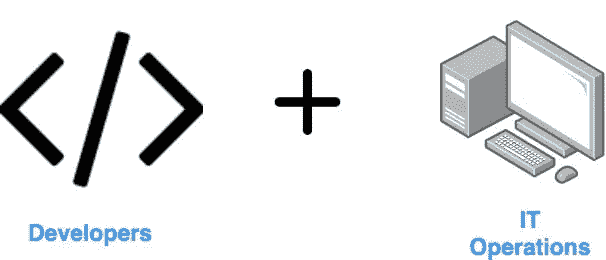
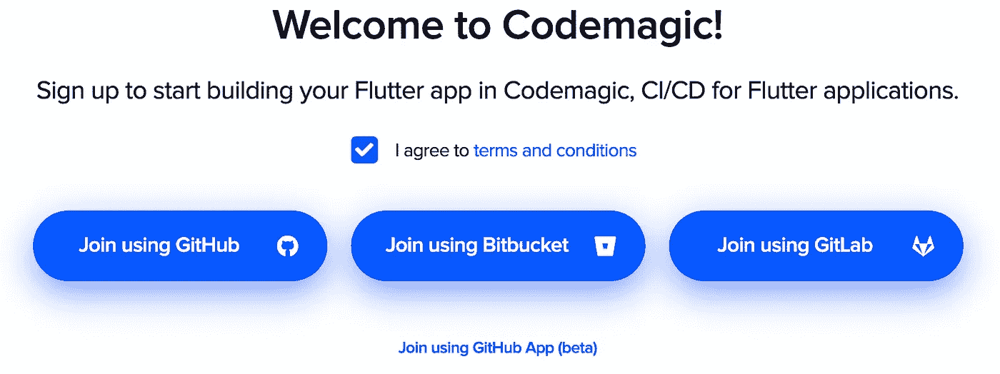
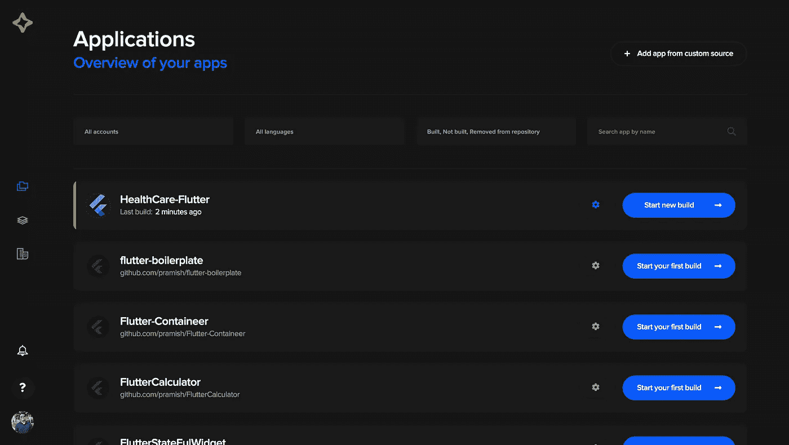
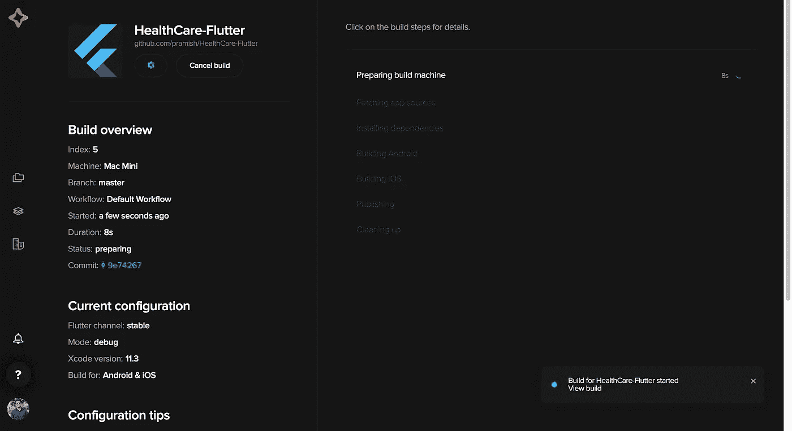
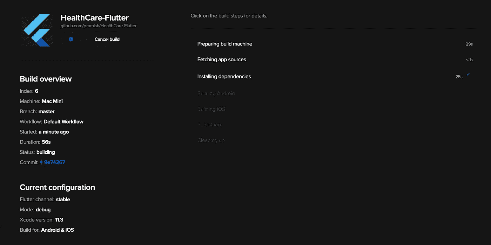
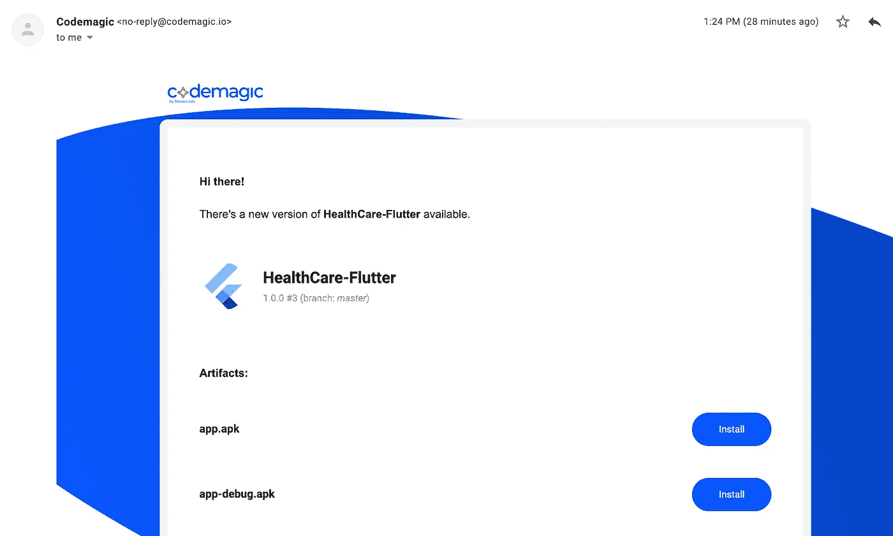

# 使用 Codemagic 在 Flutter 中设置 CI/CD

> 原文：<https://betterprogramming.pub/devops-in-flutter-734cb268d7db>

## 每一次推动都会产生奇迹


图一。DevOps 建筑([https://www.netsparker.com/devops-security-tools/](https://www.netsparker.com/devops-security-tools/))

你好，Flutter 开发者们。很久没有发布关于移动应用开发的文章了。这是一篇关于 Flutter 中持续集成和持续部署(或交付)(CI/CD)的新文章。众所周知， [Flutter](https://flutter.dev/) 是一项新兴技术，用于为 Android 和 iOS 构建移动应用。你可以去 Flutter 网站了解更多关于 [Flutter for web apps](https://flutter.dev/docs/get-started/web) 的信息。

我是什么时候碰到 CI/CD 的？答案是当我在大学做[高级软件开发](https://handbook.uts.edu.au/subjects/details/41026.html)的时候。我们有一个重要的项目(ServiceGo ),我们必须建立整个 DevOps 管道。当我建立 DevOps 管道时，我总是在 Slack 中得到通知，我发现这非常有趣。在完成 DevOps 设置后，我喜欢上了软件开发行业的 DevOps 实践。



图二。DevOps 如何工作(图片来源:作者)

现在，我们来谈谈 Flutter 的 CI/CD。当我在互联网上搜索有关 Flutter 的 CI/CD 的信息时，我无法获得足够的资源来开始配置。我为 fletcge 找到了[，但是我不喜欢文档。(如果我说错了，请指正。)然后我找到了](https://mmcc007.github.io/fledge/#getting-started) [Codemagic](https://codemagic.io/start/) ，这是专门为颤振设计的。它确实有很好的文档和较少的颤振项目配置。

> "作为开发人员，我们拥有的最强大的工具是自动化."——[斯科特·汉瑟曼](http://www-new.studiob.com/index.php/scott-hanselman/)

# 如何使用 Codemagic 设置 DevOps 管道

## 第一步。在你的本地机器上安装 Flutter

如果您已经在本地机器上安装了 Flutter，那么您可以跳过这一步，进入第二步来创建 Flutter 项目。要在您的本地机器上安装 Flutter，请前往 [Flutter 官方网站](https://flutter.dev/docs/get-started/install)，选择首选操作系统，然后按照安装步骤进行操作。步骤非常简单。

接下来是创建 Flutter 项目。


图 3。飘扬的标志([https://www.youtube.com/channel/UCwXdFgeE9KYzlDdR7TG9cMw](https://www.youtube.com/channel/UCwXdFgeE9KYzlDdR7TG9cMw))

## 第二步。在本地机器上创建 Flutter 项目

如果您已经在本地机器上安装了 Flutter，那么在终端上，导航到您想要的文件夹来创建新的项目并键入`flutter create fluttercicd`。您可以使用其他名称来命名项目。完成该过程需要几分钟时间。几分钟后，我们的项目就可以开始了。请注意，在步骤 1 中。，你必须安装 iOS 模拟器或 Android 模拟器，还必须用 Flutter 配置首选文本编辑器。当该过程完成时，在您首选的文本编辑器中打开项目，并开始在任何虚拟设备(iOS 模拟器或 Android 模拟器)上运行该应用程序。

## 第三步。在 Github 中创建新的 repo

导航到 [GitHub](https://github.com/) 的官方页面，为这个项目创建一个新的回购协议。我们还将在本地机器上设置新创建的 GitHub repo。创建新的回购协议非常容易，所以我将向您展示如何在我们的本地机器上设置回购协议。下面的代码将有助于设置回购。

```
git init git add .git commit -m "write your first commit messages"git remote add origin 'remote url'git push -u origin master
```

通过这样做，您可以在您的 GitHub repo 中看到您的最新代码。

第四步。是可选的。如果你不想写一些颤振代码，那么你可以跳到第 5 步。

## 第四步。编写一些构建 UI 的代码

虽然配置 CI/CD 管道不需要您构建 UI，但我更喜欢构建一些 UI 并将其推送到 GitHub。我们简单 UI 的代码如下所示:

```
import 'package:flutter/material.dart';**void** main() => runApp(MyApp());**class** MyApp **extends** StatelessWidget {**@override**Widget build(BuildContext context) {**return** MaterialApp(home: Scaffold(appBar: AppBar(title: Text('Welcome to Flutter CI/CD Demo'),),body: Center(child: Text('Hello World'),),),);}
}
```

如果您想了解 Dart，请访问 [Dart 开发网站](https://dart.dev)。有一篇文章教你理解 Flutter 使用的 Dart 语言的最简单方法。

## 第五步。在 Codemagic 中设置帐户

为了构建我们的 Flutter 项目的管道，我们使用 Codemagic，它的名字暗示着魔法，在我们将一些代码推送到 GitHub 后，它确实向我们展示了魔法。我们可以使用 GitHub、GitLab 或 BitBucket 登录 Codemagic。我将使用 GitHub。



图 4。登录 code magic([https://codemagic.io/signup](https://codemagic.io/signup))的选项

点击“使用 GitHub 加入”，系统会提示您登录 GitHub 帐户。输入凭证，您将被重定向到 Codemagic 的主页，如下所示。



图 5。Codemagic 的仪表盘([https://codemagic.io/apps](https://codemagic.io/apps))

您必须选择或搜索首选 git repo 来配置 CI/CD 管道，并选择漂亮的“Start new build”按钮。

您将看到一个漂亮的对话框来指定分支和虚拟机。当主分支准备部署时，将分支指向`Master`。保持工作流程不变，选择“开始新构建”开始构建 Flutter 应用程序。

您将看到另一个窗口，在这里您可以看到构建过程正在运行。



图 6。运行构建颤振应用程序([https://codemagic.io/app/5e4342e878accc4ce55ff639](https://codemagic.io/app/5e4342e878accc4ce55ff639))。

我们希望这个构建自动运行。要在将代码推送到主分支时构建 Flutter 应用程序，您必须对代码进行一些更改，并将其推送到主分支。只要您推送代码，Codemagic 就会触发构建设置并开始构建项目。下一步是对我们的`main.dart`文件进行一些修改。

## 第六步。对我们的 main.dart 文件进行一些更改

让我们开始对代码进行一些修改。我添加了一个`RaisedButton`小工具。

删除`Center`小部件，添加`RaisedButton`小部件:

```
RaisedButton(padding: EdgeInsets.all(20),onPressed: () {print("Raised Button is pressed");},child: Text("Press Me!!"),
```

完整的代码如下所示:

```
import 'package:flutter/material.dart';**void** main() => runApp(MyApp());**class** MyApp **extends** StatelessWidget {**@override**Widget build(BuildContext context) {**return** MaterialApp(home: Scaffold(appBar: AppBar(title: Text('Welcome to Flutter CI/CD Demo'),),body: RaisedButton(padding: EdgeInsets.all(20),onPressed: () {print("Raised Button is pressed");},child: Text("Press Me!!"),),),);}}
```

打开`terminal`并导航到项目工作区，代码已经准备好将其推送到主分支。

推送到 GitHub repo 的代码是:

```
**git add .** //This adds all the changed files and folders to the staging area.
**git commit -m "add a raised button widget."** //Specifying the git commit message before pushing.
**git push** //this will directly push your changes to your master branch.
```

将您的代码推送到 GitHub repo 后，就该看看 Codemagic 网站的神奇之处了。

## 第七步。开始在 Codemagic 网站上观看神奇的事情吧

一旦我们将代码推入 GitHub，Codemagic 就会触发构建并开始构建 Flutter 项目。建设这个项目需要一些时间。



图 7。从 Codemagic 网站开始构建。([https://code magic . io/app/5e 4342 e 878 accc4 ce 55 ff 639/build/5e 444949000 Fe 000097 a 6637](https://codemagic.io/app/5e4342e878accc4ce55ff639/build/5e444949000fe000097a6637))

当这个过程完成后，你会收到一封电子邮件，告诉你最新的版本已经发布到你注册的 GitHub 邮箱里了。这是一个很棒的功能，我喜欢它。



图 8。Codemagic 在我的电子邮件中发送的电子邮件通知

万岁！我们已经为我们的颤振项目建立了 CI/CD 管道。这只是设置 CI/CD 管道的开始。

在下一篇文章中，我将展示我们如何在 Flutter 中编写我们的第一个测试，在 Code Magic 中通过测试，并准备好从主分支进行部署。敬请关注。

到 GitHub 项目的链接是: [Flutter CI/CD 管道](https://github.com/pramish/HealthCare-Flutter)。

永远不要忘记:永远不要停止学习，因为这将在许多领域帮助你。

感谢阅读！祝你有愉快的一天。