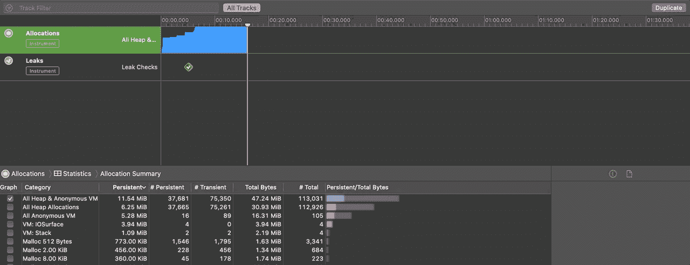
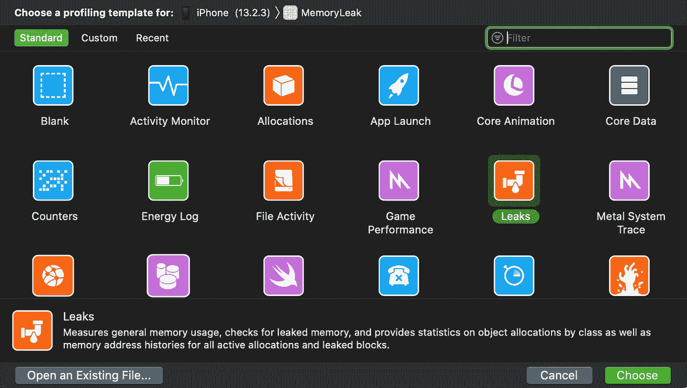
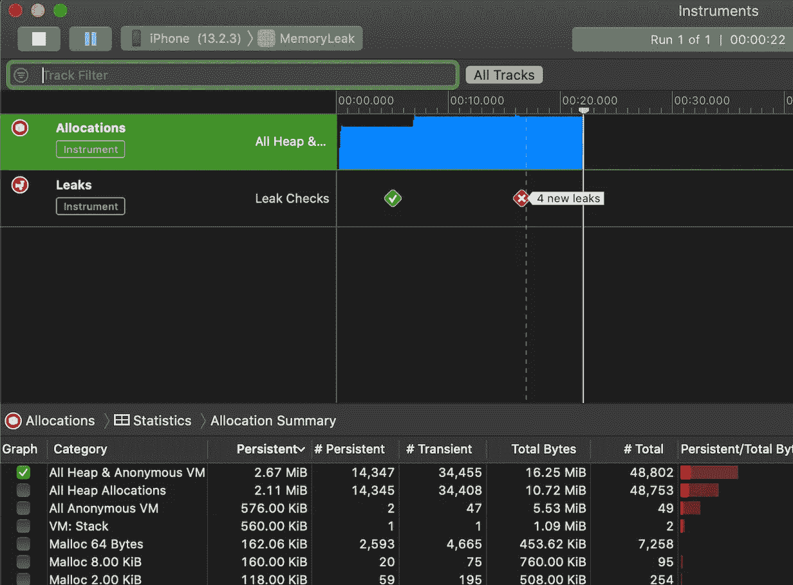
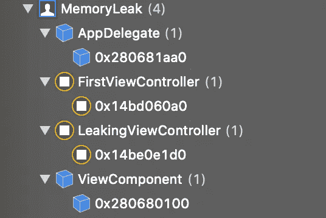

# 使用 Xcode 工具诊断内存泄漏

> 原文：<https://betterprogramming.pub/diagnose-memory-leaks-using-xcode-instruments-5692a6458020>

## 面临记忆问题时，leaks 仪器可能会成为你最好的朋友

在这个简短的教程中，我们将学习如何使用 Xcode 的调试内存图和泄漏工具来产生并准确识别内存泄漏。

示例应用程序显示了两个屏幕。在第一个屏幕上，点击一个按钮，让我们导航到第二个屏幕，在那里我们使用一个保留周期故意创建一个内存泄漏。

这是我们的工作流程:

*   我们首先打开 Xcode leaks 仪器，按下 record 按钮
*   当应用程序自动启动时，我们按下导航按钮，显示我们泄漏的视图控制器
*   我们只需使用导航项目的后退按钮弹出它
*   最后，我们在泄漏仪器和内存图中观察效果。

GitHub 上有[源代码](https://github.com/zivaev462/memory-leak)。

# 我们开始吧

假设我们有一个简单的`UIViewController`子类:

它所做的只是呈现我们的目标泄漏视图控制器:

为了创建一个保留循环，我们有一个将`UIViewController`作为参数的`ViewComponent`类:

因此，我们有以下关系:

`LeakingViewController` ➼ `ViewComponent`

`ViewComponent` ➼ `LeakingViewController`

对于一个要从内存中释放的对象，不应该有其他对象指向或持有它，当然，在我们的例子中不是这样。

# 诊断内存泄漏

现在，是时候打开测漏仪了:

*   选取屏幕左上角的“Xcode”
*   展开“打开开发者工具”，并选择“工具”
*   现在选择“Leaks”，并确保您已经在顶部选择了您的目标应用程序和设备(“为…选择一个分析模板”):

*   最后，按下录制按钮

现在我们的应用程序启动了，我们需要做的就是点击导航按钮，然后点击`LeakingViewController`的后退按钮。

我们有以下结果:

红色图标意味着我们在某个地方泄漏了内存。要查看实际的未分配对象，我们将使用 Xcode 的内存图工具:

我们可以看到，即使我们提出并放弃了`LeakingViewController`，它仍然和`ViewComponent`一起出现在内存图中:

# 包扎

Xcode 的 leaks 函数是一个非常方便的工具。我们只需按下记录按钮，在一个大型应用程序中导航和执行操作，仪器就会在报告中记录新的泄漏。我们还有一种保存录音并在将来查看的方法:

非常感谢您的阅读！