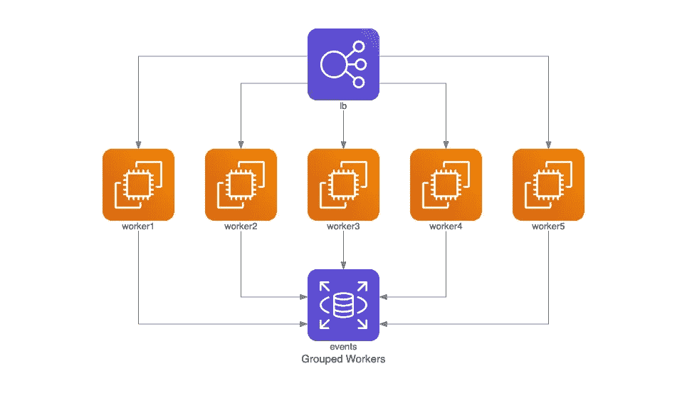
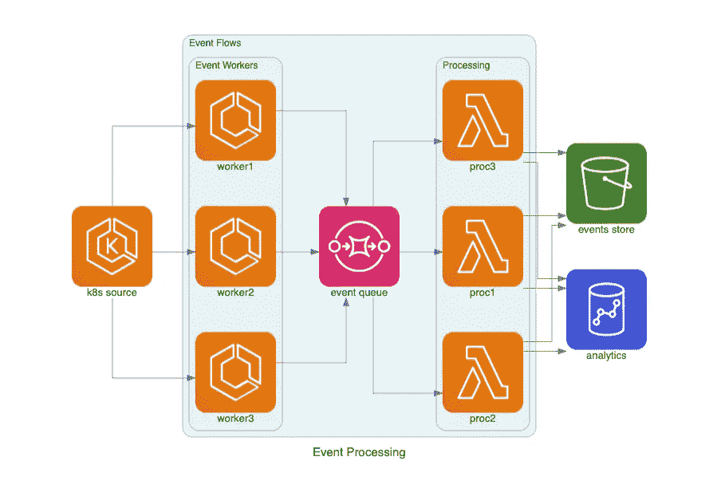

# 介绍图:作为代码的图

> 原文：<https://betterprogramming.pub/diagrams-diagram-as-code-56fec222cdf6>

## 在不离开 IDE 的情况下构建云架构图

唐娜躺在[的 Unsplash](https://unsplash.com/s/photos/diagram?utm_source=unsplash&utm_medium=referral&utm_content=creditCopyText) 上

我已经建立了一个基础结构图绘图库。你可以在 [GitHub](https://github.com/mingrammer/diagrams) 和这个[网站](https://diagrams.mingrammer.com/)上看到。

图表允许您用 Python 代码绘制云系统架构。它的诞生是为了在没有任何设计工具的情况下原型化一个新的系统架构设计。

您还可以描述或可视化现有的系统架构。Diagrams 目前支持这五大提供商:AWS、 [Azure](https://azure.microsoft.com/en-us/) 、 [GCP](https://cloud.google.com/) 、Kubernetes 和[阿里云](https://us.alibabacloud.com/)。

Diagram as Code 还允许您在任何版本控制系统上跟踪架构图的变化。

**注**:它不控制任何实际的云资源，也不生成云形成或地形代码，仅用于绘制云系统架构图。

可以从这个[快速入门](https://diagrams.mingrammer.com/docs/getting-started/installation)开始。您可以查看[指南](https://diagrams.mingrammer.com/docs/guides/diagram)了解更多详情。

以下是一些例子:

你可以在[示例](https://diagrams.mingrammer.com/docs/getting-started/examples)页面找到所有的示例。

谢谢大家！