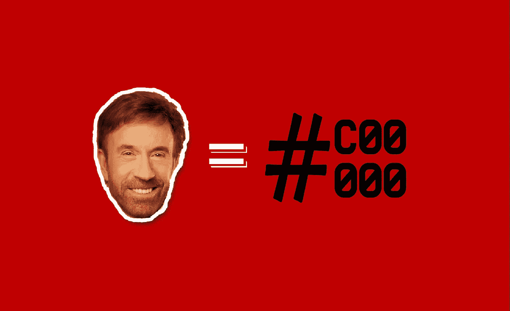
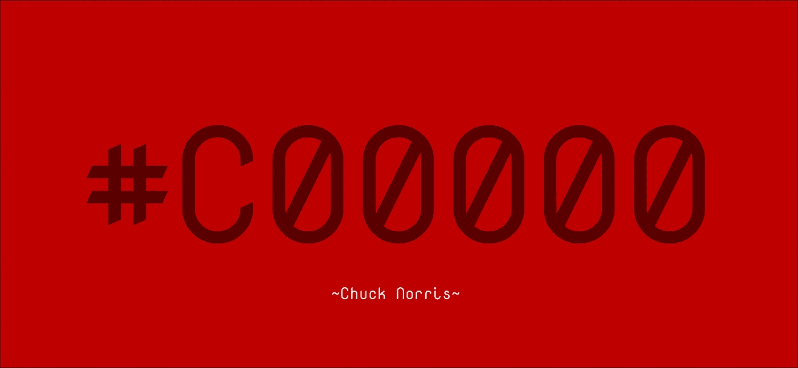

# 你知道 HTML 认为查克·诺里斯是一种颜色吗？

> 原文：<https://betterprogramming.pub/did-you-know-html-thinks-chuck-norris-is-a-color-9f67edf4c34>

## 很奇怪，不是吗？原因如下



嗨，我是查克·诺里斯，我是瑞德。

在每一种编程语言中，都有一些对人类来说非常难以置信和有趣的微妙之处，但对计算机来说并非如此不合逻辑。如果你已经读过一段时间的编程，我相信你已经听过很多关于 JavaScript 的荒谬概念，但是今天我们有了一个新的客人:HTML。

# 什么是 HTML？

HTML 是一种标记语言，是专门为 web 环境开发的。你在互联网上看到的每个网站都有一个代表其内容和层次的标记。如果你想看到一个网站的标记，你只需点击右键，然后点击*检查。*这里可以阅读更多[。](https://developer.mozilla.org/en-US/docs/Web/HTML)

# HTML 中的颜色属性是怎么回事？

自从 CSS 出现以后，HTML 的样式属性就变得过时，一个个被弃用。但是，浏览器仍然可以识别和运行这些属性。其中，`bgcolor`和`color`属性是本文的重点。

这里有一个有趣的事实。下面的 HTML 代码完全有效，输出不只是黑屏——而是暗红色。

```
<body bgcolor="chucknorris"> I am valid. </body>
```

你可能会觉得这是它的创造者隐藏在语言内部的玩笑，只是为了好玩。这将是一个伟大的复活节彩蛋，但不幸的是，它只是上级(！)HTML 的智能。`bgcolor`和`color`属性期望它们的值是颜色名称、十六进制值或 RGB 值。它检查该值是否是一个颜色名称。如果不是，就该检查 RGB 了；如果这个值也不是，它应该是一个十六进制值。

HTML 是如此强大的(！)语言，如果您忘记了，它会自动在值前面加上一个`#`。所以，`FF00FF`和`#FF00FF`在 HTML 中都是一样的。此外，它可以使用一种算法将任何字符串值转换为十六进制，我将在后面解释这种算法。嗯，查克·诺里斯的整个故事都源于这种转换算法。

# 算法——为什么查克·诺里斯是红色的

在现代 HTML (HTML5)中，`bgcolor`和`color`属性已被弃用，但浏览器仍然能够识别和运行这些属性。这些属性通常需要一个颜色值。因此，如果您将一个字符串传递给这些属性，HTML 将尝试将其转换为十六进制代码，并将其作为值应用。这种转换的算法有七个步骤，它可以将任何非十六进制字符串转换为十六进制代码。

1.  浏览器试图识别颜色。
2.  如果它不能识别颜色，它定位十六进制字符。
3.  浏览器将所有非十六进制字符替换为 **0** 。
4.  如果字符数不是 3 的倍数，浏览器添加**0**s**直到它变成 3 的倍数。**
5.  浏览器将上一步的输出分成三个相等的部分。
6.  通过删除除了前两个字符之外的字符，每个片段被截断成两个字符。
7.  被截断的部分被一个接一个地合并，得到的字符串是十六进制代码。

这是把查克·诺里斯变成红色的算法。所以，我们试着一个一个的应用算法，看看查克·诺里斯是不是真的红了。

# 1.属性识别

浏览器开始解释 HTML，形成网站的内容。它一直到 body 元素，看到有一个定义 body 元素背景颜色的`bgcolor`属性。

```
<body bgcolor="chucknorris"> ... </body>
```

# 2.颜色识别

在`bgcolor`属性中，浏览器遇到了不是颜色名称或 RGB 值的`chucknorris`。然后，它认为传递的值必须是一个十六进制值，但以加密的方式，浏览器开始应用转换算法。

# 3.字符替换

十六进制值由 16 个不同的字符组成，分别是 0–9 和 A-F。除此之外的字符都是非十六进制的。在这一步，浏览器用一个 **0，一个**十六进制字符替换所有非十六进制字符。

在`chucknorris`中唯一的十六进制字符是`c`。因此，除了`c`之外的所有字符都将为 0。

```
chucknorris => c00c0000000
```

# 4.零的加法

数字世界中的颜色由三种成分组成，即红色、绿色和蓝色(RGB)。这就是为什么我们必须从上一步创建的字符串中提取三个片段。但是，正如您注意到的，输出字符串有 11 个字符，不能分成三等份。因此，根据算法，浏览器必须在字符串末尾多加一个 **0** 。

```
c00c0000000 => c00c00000000
```

# 5.三个颜色通道(RGB)的提取

现在字符串有 12 个字符长，浏览器可以把它分成 3 等份。每一块都代表一个颜色通道，从左到右:红色、绿色和蓝色。

```
c00c00000000 => c00c 0000 0000
```

# 6.子字符串的截断

每个子串有四个字符；但是，浏览器需要每个通道两个字符来组成十六进制颜色代码。在这一步中，子字符串将被截断成两个字符，以便它们满足要求。为此，除了前两个字符之外，所有字符都被删除。

```
c00c 0000 0000 => c0 00 00
```

# 7.十六进制代码形成

现在，是时候形成十六进制代码，并用查克·诺里斯(Chuck Norris)绘制背景了。我们分别有红色、绿色和蓝色频道。为了创建一个十六进制代码，我们应该添加一个`#`并将它们从左到右一个接一个地放置。

Tadaaa！我们刚刚从`chucknorris`中提取了十六进制代码，是`#C00000`，深红色。



“chucknorris”经过算法转换成#C00000。

# 结论

使用这种算法，您可以很容易地猜出任何字符串的十六进制等值。现在，是时候让你尝试一下，看看你自己能想出什么。有许多有趣而有效的字符串可以生成不同的颜色。但是请注意，这只适用于 HTML，不适用于 CSS。因此，使用带有自定义字符串的样式来设置颜色将不会产生任何结果。此外，`bgcolor`和`color`属性在 HTML5 中已被弃用。因此，避免在实际项目中使用它。

[](https://mailchi.mp/a45f8fb96cc9/subscribe)

加入我的时事通讯，获取您的**免费订户专属**故事。

这就是这个故事。我希望你喜欢它。如果你喜欢它，一定要鼓掌，如果有你想分享的观点，不要犹豫，留下回应。请继续关注接下来的报道。