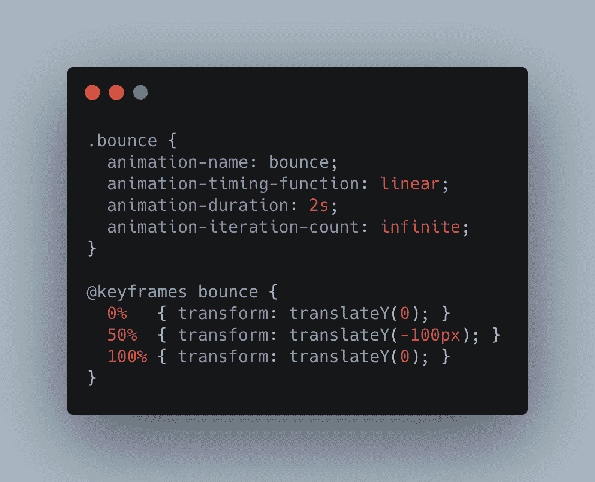
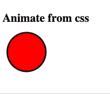
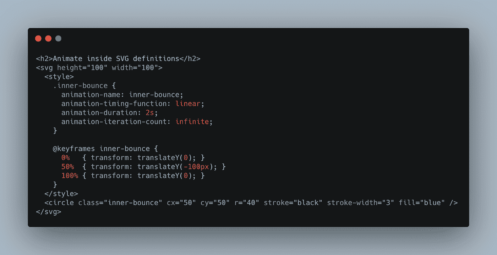
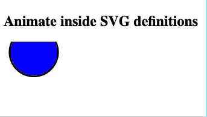
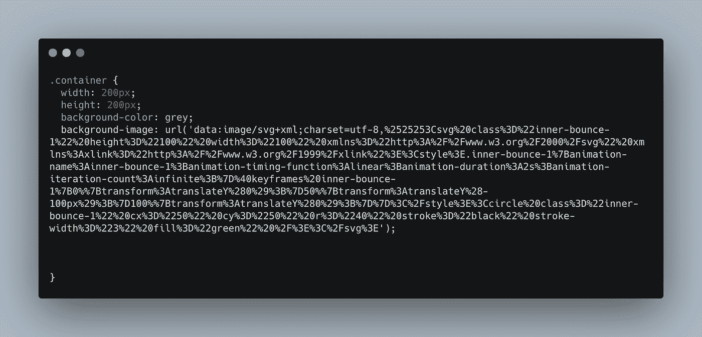
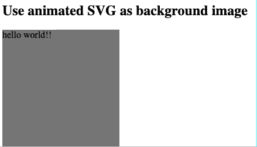
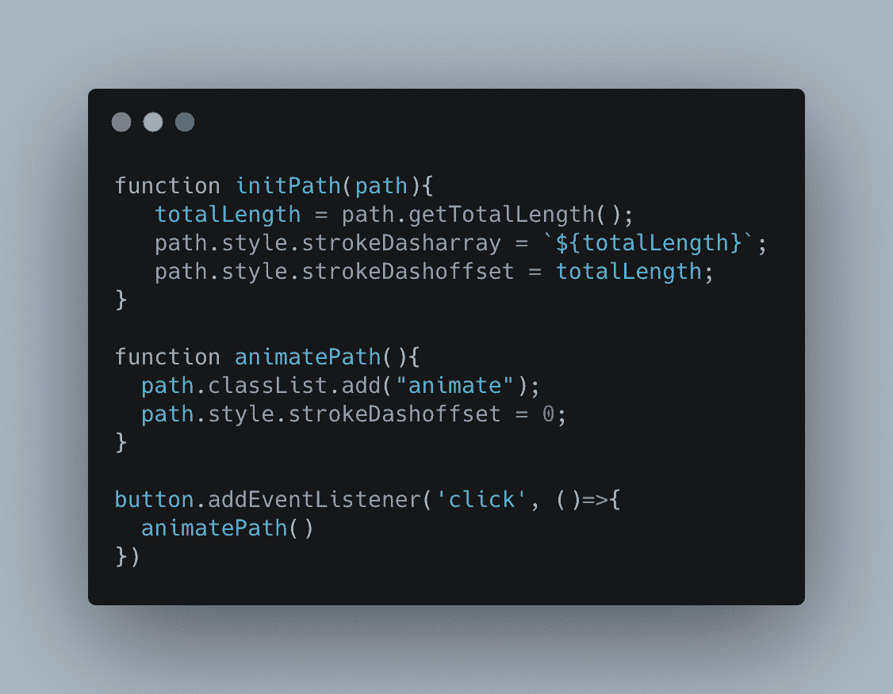

# 你知道可以像这样制作 SVG 动画吗？

> 原文：<https://betterprogramming.pub/did-you-know-you-could-animate-an-svg-like-this-f606528bf06a>

## 将您的 SVG 带入生活

照片由周在 [Unsplash](https://unsplash.com?utm_source=medium&utm_medium=referral)

如果您是一名前端开发人员，您可能遇到过这样的情况:您需要在页面上制作动画元素，以创建您的设计师想要的惊人体验。为了制作动画，我们可以使用`[transform](https://css-tricks.com/almanac/properties/t/transform/)` [属性](https://css-tricks.com/almanac/properties/t/transform/)或`[animate](https://css-tricks.com/almanac/properties/a/animation/)` [属性](https://css-tricks.com/almanac/properties/a/animation/)来移动元素。

当谈到动画元素时，我们经常使用 SVG 图像，因为它们允许我们在不损失质量的情况下放大和缩小。在这里，我将与你分享一些我最近发现的用于制作 SVG 动画的很酷的技巧。

# 基础动画

让我们从基础开始。我们将使用关键帧创建一个简单的反弹动画，并将 SVG 直接放在 HTML 上。

弹跳动画的 CSS 代码

结果，我们会得到一个漂亮的弹跳球。很好——但是你可能已经知道了！

带弹跳动画的 SVG

# SVG 代码中的动画

现在让我们来看看一些很酷的东西。您知道可以在 SVG 中添加样式吗？这些风格不仅仅局限于颜色或背景。我们可以在里面添加整个动画。

这也适用于[符号](https://css-tricks.com/svg-symbol-good-choice-icons/)，这样你就可以拥有一个动画 SVG，并且可以很容易地将它导入到你的站点中。您可以轻松地将它用于循环加载程序映像。

插入 SVG 的 HTML 代码。动画是在“style”标签中定义的。

带内嵌动画的 SVG 动画

# 作为背景图像的动画 SVG

这有点疯狂。您可以使用数据 URI 将动画 SVG 用作背景。

这样，你可以使用所有的背景属性——比如`background-repeat`、`background-color`、`background-size`等等——来创建你需要的动画。

如果要以这种方式使用 SVG，一定要正确编码。

使用 SVG 作为背景图像的 CSS 代码

作为背景图像的动画 SVG

上述所有示例的代码都可以在下面的 CodePen 中找到。

# 动画 SVG 路径

我们来看看一些很酷的东西。你知道`stroke-dashoffset`和`stroke-dasharray` 的属性吗？直到@ [LinkStrifer](https://twitter.com/linkstrifer?lang=en) 做了一个关于它们以及如何在动画中使用它们的精彩演示，我才知道。我将带你浏览这里的主要思想。

要求是当用户向下滚动时动画显示一行。该线可以是直的、弯曲的或具有奇怪的形状。

为了创建这种效果，我们将使用一个 SVG，其中包含一个或多个路径。每条路径应该代表一条线。

路径有几个有用的属性，正如在 [CSS-Tricks](https://css-tricks.com/svg-line-animation-works/) 中提到的。我们将使用`stroke`和`stroke-width`来定义线条的颜色和粗细。到目前为止没什么令人兴奋的，对吧？

有趣的部分来了！我们将使用属性`stroke-dasharray` 来将线条分成线段。然后，如果我们用`stroke-dashoffset`、**、**来玩，我们可以填充或清空该行。如果我们设置`stroke-dashoffset` 等于`stroke-dasharray`，该行将为空，如果我们设置`stroke-dashoffset` 为`0`，该行将被填充。

我用一点 JS 来定义`stroke-dasharray`等于路径的长度和一个简单的按钮来触发动画。您可以在下面的 CodePen 上查看代码。

JS 代码初始化路径并触发动画

路径的动画。通过按下按钮来触发。

# 让我们在卷轴上制作动画

现在我们知道了如何填充路径的魔法，我们需要在用户滚动时填充它。为此，我们需要更多的 JS 代码。

这样做的主要思想是给滚动事件附加一个函数，该函数使用一些数学方法来设置`stroke-dashoffset` **的值。**我在用`requestAnimationFrame`让动画更流畅。提高性能的一个好方法是只在屏幕上显示 SVG 时使用`IntersectionObserver`来制作动画。

请查看下面 CodePen 上的完整代码。

卷轴上路径的动画

# 资源

*   [“转换”通过 CSS-Tricks](https://css-tricks.com/almanac/properties/t/transform/)
*   [“动画”通过 CSS-Tricks](https://css-tricks.com/almanac/properties/a/animation/)
*   [“使用 SVG(可缩放矢量图形)的好处”，TBH 创意](https://blog.tbhcreative.com/2017/06/benefits-of-using-svg.html#:~:text=SVG%20stands%20for%20scalable%20vector,choice%20for%20responsive%20web%20design.)
*   [“SVG ' symbol '图标的好选择”通过 CSS-Tricks](https://css-tricks.com/svg-symbol-good-choice-icons/)
*   [“SVG 线条动画如何工作”通过 CSS-Tricks](https://css-tricks.com/svg-line-animation-works/)