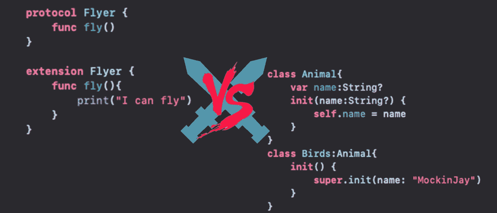

# Swift 中面向协议编程(POP)和面向对象编程(OOP)的区别

> 原文：<https://betterprogramming.pub/difference-between-protocol-oriented-programming-pop-and-object-oriented-programming-oop-in-swift-2dc3048b4fd>

## 为什么我们需要协议，什么时候我们应该使用它们



面向对象与面向协议的编程

# 介绍

我参加过很多面试，有初创公司的，也有大公司的，他们都问我这样的问题:

*   协议和类有什么区别？
*   为什么不用超类代替协议呢？

本文将为您提供这类问题的答案，并可能向您介绍 Swift 编程的一个新方面。

读完这篇文章后，你会明白为什么要制定协议，什么时候我们可以使用它们，为什么我们应该选择它们而不是超类，以及它们的优缺点。

让我们停止谈话，开始做吧！

# 继承问题

当来自面向对象的编程语言时，继承通常用于在多个类之间共享代码。但是这种解决方案并不总是最好的，并且存在一些问题。

假设你有一个应用程序，里面有很多具有相同行为的`UIViewController`类——例如，它们都有一张个人资料图片。当然，你不希望在应用程序的每个视图控制器中重新实现配置文件图片逻辑——设置`leftBarButtonItem`，点击按钮时打开和关闭编辑配置文件`ViewController`，等等。

解决方法很简单。只需创建一个`MainViewController`，实现所有这些行为`UIViewController`的子类，然后让所有的`ViewController`从`MainViewController`继承，而不是直接从`UIViewController`继承。这样，它们都继承了那些方法，并以同样的方式运行——没有必要每次都重新实现所有的东西。

但是后来在开发过程中，你意识到你需要一个`UITableViewController`或者`UICollectionViewControlle`。不幸的是，您不能使用`MainViewController`，因为它继承了`UIViewController`，而不是`UICollectionViewController`或`UITableViewController`。

怎样才能做出一个`MainTableViewController`实现和`MainViewController`一样的东西，但是继承自`UITableViewController`而不是`UIViewController`？那会有很多代码重复，对吗？

# 作文来了

当然，典型且容易回答的是作文。

这意味着`UIViewController`不是利用继承，而是包含提供行为的内部类，或者由提供行为的内部类组成。

在我们的例子中，我们可以想象一个`ProfileManager`类，它提供所有需要的方法来设置个人资料图片图像并与之交互。各种`UIViewControllers`将会有一个*属性*持有一个`ProfileManager`，并可以用它来与剖面栏按钮交互:

你可以看到事情会变得多么复杂。每次都需要显式引用中间对象`ProfileManager`。在某种程度上，这也是一种重复，你可能需要更长的时间来实现。

# 多重继承

继承的另一个问题是许多面向对象语言不允许多重继承——这是有充分理由的，尤其是钻石问题。

这意味着一个类不能继承多个超类。

假设你是上帝，你想实现代表生物的模型类。你有`Bird`、`Fly`、`Human`、`Monkey` ——它们之间是如何联系的？有的能走，有的能飞，有的两者兼而有之；有些会说话有些不会，有些是动物有些不是。

类`Mockingbird`和类`Mosquito`都可以飞行，所以我们可以想象一个`Flyer`超类，它提供了`func fly()`方法的实现。但是`Mockingbird`和`Eagle`都是鸟，所以我们也可以想象一个`Birds`超类，而`Mosquito`和`Bees`将是`Flies`类的子类。那么`Mockinbird`既继承了`Flyer`又继承了`birds`？这在 Swift(以及很多 OOP 语言)中是不可能的。

我们应该选择其中之一吗？但是如果我们创建一个`Icarus`或者说`Human` 的子类`Superman`——那么`func fly()`方法的实现呢？我们不能在`Human`实现它，因为不是每个人都能飞，但是`Superman`和`Icarus`也需要那个方法，我们不想复制它。

因此，我们可以在那里使用组合，比如让`class Icarus`成为由`var flyingOption: Flyer`属性的组成的*。但是不得不写`Icarus.flyingOption.fly()`而不是仅仅写`Icarus.fly()`并不好看。*

# 拯救混合和特性

这就是混合和特性的概念发挥作用的地方。

*   通过继承，你可以定义你的类是什么。例如，每个`Dog`都是一个`Animal`。
*   有了 traits，你就定义了什么类*可以做什么*。例如，每个`Animal`都可以`eat()`人类、鸟类和所有其他生物也可以。

继承让你描述一个对象是什么，特征让你描述一个对象能做什么。

继承是你的对象身份，但是特征将定义你的对象能够做什么。

最好的是，一个类可以采用多个`Traits`，因为它可以做多件事，而它只能做一件事(只继承一个超类)。这意味着我们有一个身份，人类，但我们有多种能力:走路，说话，吃饭，有时甚至飞行。但是其他一些生物也能做到这些，所以它们不是人类独有的。

那么，我们如何在 Swift 中做到这一点呢？

# 协议是答案

在 Swift 2.0 中，协议可以有一个默认实现。当您定义一个`protocol`时，您可以使用该协议的一个`extension`为该协议的一些或所有方法提供默认实现。它看起来是这样的:

当您创建一个符合那个`Flyer`协议的类或结构时，它会免费获得一个`fly()`方法的实现！

这仍然是一个默认的实现——如果需要的话，你可以自由地重新定义那个方法，但是如果你不这样做，你仍然会有一个默认的方法:

默认实施协议的这一特性对很多事情都有好处——包括将“traits”概念引入 Swift。

# 一个身份，多种能力

特性的伟大之处在于，它们不依赖于你应用它们的对象的身份。他们不关心这个类是什么，它继承了什么，他们只是在这个类上定义了一些函数。

这就解决了我们的问题，伊卡洛斯既是人又能飞，而嘲鸟是鸟也能飞。

你是什么样的人并不能决定你能做什么。

现在让我们利用特征来实现我们的模型类。首先，让我们定义各种特征:

那么让我们给他们一些默认的实现:

此时，我们仍将使用继承来定义我们的生物的身份(它们是什么)，所以让我们有一些父类:

现在，我们可以通过身份(通过继承)和能力(特征/协议一致性)来定义我们的角色:

现在，`Icarus`、`IronMan`和`Bee` 都使用相同的`fly()`实现，即使它们从不同的超类继承而来(一个是`Insect`，另一个是`Human`),即使一个是人类，另一个是昆虫，蜘蛛和伊卡洛斯都知道如何进食:

# 时空冒险

现在让我们介绍一个新的太空旅行能力/特性:

```
**protocol** SpaceTraveler {
     **func** travelTo(location: String)
}
```

并给它一个默认实现:

```
**extension** SpaceTraveler {
    **func** travelTo(location: String) {
         print("Let's go to \(location)!")
    }
}
```

然后，我们可以使用 Swift 的`extensions`将协议一致性添加到现有的类中，所以让我们将这些能力添加到我们已经定义的生物中:

```
**extension** Superman: SpaceTraveler {}
```

是的，这就是将这个能力/特质添加到现有职业的全部内容！就这样，他们现在可以`travelTo()`任何地方！

```
clark.travelTo(location: "Trenzalore") // prints "Let's go to Trenzalore!"
```

# 让我们邀请更多的人来参加聚会吧！

现在让我们引入更多的人来混合，这一次我想使用更多的科幻生物来使它更加不现实和不合理，并以更不可能的方式来创建模型:

我们这里有个问题。莱卡不是人类，朱伊也不是，斯波克是半人半瓦肯人，所以那些定义都是相当错误的。

你看到这里的问题了吗？我们已经理所当然地认为`Human`和`Alien`是相同的——我们又被遗传咬了一口。一些类被迫成为某种类型，或者从一些父类继承，然而事实上，这并不总是现实——尤其是在科幻小说中。

这也是为什么在 Swift 和 protocols default 实现中使用协议有助于消除那些通过继承强加在您的类上的约束。

如果`Human`和`Alien`是`protocols`而不是`classes`，我们会有很多好处:

*   我们可以定义一个`MilleniumFalconPilot`类型，而不强迫它成为一个`Human`，从而允许朱伊驾驶它。
*   我们可以把拉卡定义为一个`Astronaut`，即使她不是`Human`。
*   我们可以将`Spock`定义为`Human`和`Alien`。
*   我们甚至可以完全摆脱继承，将类型定义为`structs`而不是`classes`。A `struct`不支持继承，但是仍然可以符合你想要的任意多的协议。

# 到处都有协议！

因此，解决这个问题的一个办法是让一切都成为协议，摆脱继承。毕竟，我们不在乎*我们的生物是什么*，定义英雄和生物的是它们拥有的*能力*！

我已经包含了一个 Swift Playground，你可以在这里下载，它包含了本文中显示的代码。它还展示了作为解决方案的另一个平台，其中所有东西都由协议和结构组成，完全没有继承。看一看！

当然，这并不意味着你必须不惜一切代价摆脱继承。继承仍然有用，仍然有意义。a `UILabel`是`UIView`的*子类*感觉还是符合逻辑的。但是这让您体会到默认实现的 mixins 和协议可以提供什么。

# 结论

练习 Swift 时，您会意识到它实际上是一种面向协议的语言，并且在 Swift 中使用协议比在 Objective-C 中更常见、更强大。毕竟，Swift 标准库中的`Equatable`、`CustomStringConvertible`和`-able`中的任何协议实际上都可以被视为 Mixins！

甚至许多内置 Swift APIs 都在使用诸如`UITableViewDelegate`、`UITableViewDataSource`等协议。

使用 Swift 协议和协议默认实现，您可以实现 mixins 和 traits，并使您的代码更加灵活。

mixins 和 traits 方法允许您通过类型能做什么来描述类型，而不是它们是什么，更重要的是，允许您选择类型的功能。这就像你购物并为你的类型选择你想要的功能，不管它们继承了什么类，如果有的话。

回到第一个例子——你可以用默认实现创建一个`protocol ProfilePictureManager`,然后简单地让你的视图控制器(不管它们是`UIViewController`、`UITableViewController`还是什么)符合那个协议。然后它会自动从`ProfilePictureManager`免费获得那些能力和特性，而不用担心`UIViewController`的父类！

感谢您阅读我的文章。我希望你喜欢它。使用协议和协议扩展，我们可以做更多令人惊奇的事情，但是这篇文章已经够长了。

# 给我买杯咖啡☕️:

[](https://www.paypal.com/donate/?hosted_button_id=FRY432D75E4Q2) [## 捐给艾玛德·拜拉米

### 通过捐赠或与朋友分享来帮助支持艾玛德·拜拉米。

www.paypal.com](https://www.paypal.com/donate/?hosted_button_id=FRY432D75E4Q2)  [## DonateCrypto

### 通过捐赠加密货币或与您的朋友分享来帮助支持艾玛德·贝拉米…

nowpayments.io](https://nowpayments.io/donation/emad) 

提前感谢大家的支持！

# 参考资料和资源

*   [https://github.com/EmadBeyrami/OOP-Vs-POP](https://github.com/EmadBeyrami/OOP-Vs-POP)
*   [https://www.appcoda.com/pop-vs-oop/](https://www.appcoda.com/pop-vs-oop/)
*   [https://tsh.io/blog/protocol-oriented-programming-swift/](https://tsh.io/blog/protocol-oriented-programming-swift/)
*   [https://alisoftware . github . io/swift/protocol/2015/11/08/mixins-over-inheritance/# fn:diff](https://alisoftware.github.io/swift/protocol/2015/11/08/mixins-over-inheritance/#fn:diff)