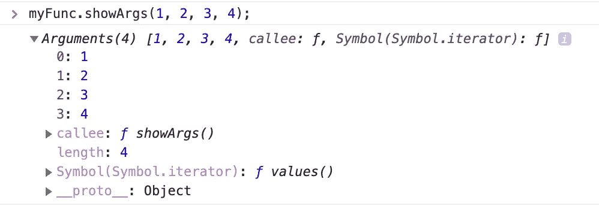
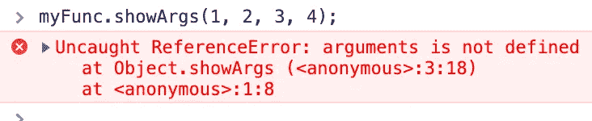
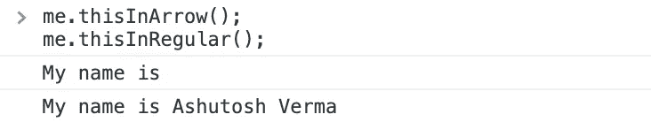
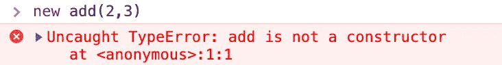

# 常规函数和箭头函数的区别

> 原文：<https://betterprogramming.pub/difference-between-regular-functions-and-arrow-functions-f65639aba256>

## 探索 ES6 中的粗箭头特性


Arrow function —也称为 fat arrow function—是 ES6 中引入的新功能，它是一种用于编写函数表达式的更简洁的语法。虽然常规的 JavaScript 函数和 arrow 函数的工作方式相似，但它们之间还是有一些不同之处。

## 1.句法

上面的 arrow 函数示例允许开发人员用更少的代码行和大约一半的输入完成相同的结果。

如果只有一个表达式，则不需要花括号。上面的例子也可以这样写:

```
let add = (x, y) => x + y;
```

如果只有一个参数，也不需要括号:

```
let squareNum = x => x * x;
```

如果没有争论呢？

```
let sayHi = _ => console.log(“Hi”);
```

## 2.参数绑定

箭头函数没有`arguments`绑定。但是，它们可以访问最近的非箭头父函数的 arguments 对象。很大程度上依赖于命名参数和 rest 参数来捕获传递给箭头函数的参数。

在常规函数的情况下:

```
let myFunc = {  
 showArgs(){ 
  console.log(arguments); 
 } 
}; 
myFunc.showArgs(1, 2, 3, 4);
```



在箭头功能的情况下:

```
let myFunc = {  
  showArgs : () => { 
  console.log(...arguments); 
 } 
}; 
myFunc.showArgs(1, 2, 3, 4);
```



## 3.此关键字的使用

与常规函数不同，箭头函数没有自己的`this`。箭头函数中`this`的值在函数的整个生命周期中保持不变，并且总是绑定到最近的非箭头父函数中`this`的值。



## 4.使用新关键字

使用函数声明或表达式创建的正则函数是可构造和可调用的。因为常规函数是可构造的，所以可以使用`new`关键字调用它们。

然而，箭头函数只可调用，不可构造，也就是说，箭头函数永远不能用作构造函数。因此，永远不能用关键字`new`调用它们。

```
let add = (x, y) => console.log(x + y);new add(2,3);
```



## 5.没有重复的命名参数

无论是在严格模式还是非严格模式下，箭头函数都不能有重复的命名参数。

这意味着以下是有效的 JavaScript:

```
function add(x, x){}
```

然而，在使用严格模式时却不是这样:

```
'use strict';
function add(x, x){}
// SyntaxError: duplicate formal argument x
```

对于 arrow 函数，无论是严格模式还是非严格模式，重复的命名参数总是无效的。

```
(x, x) => {}
// SyntaxError: duplicate argument names not allowed in this context
```

**希望这对^_^有所帮助**