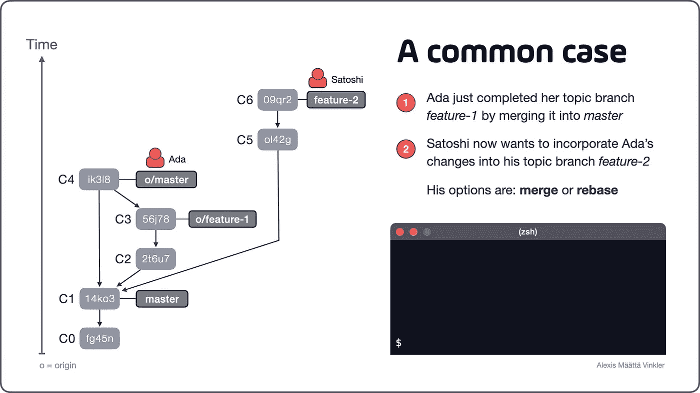
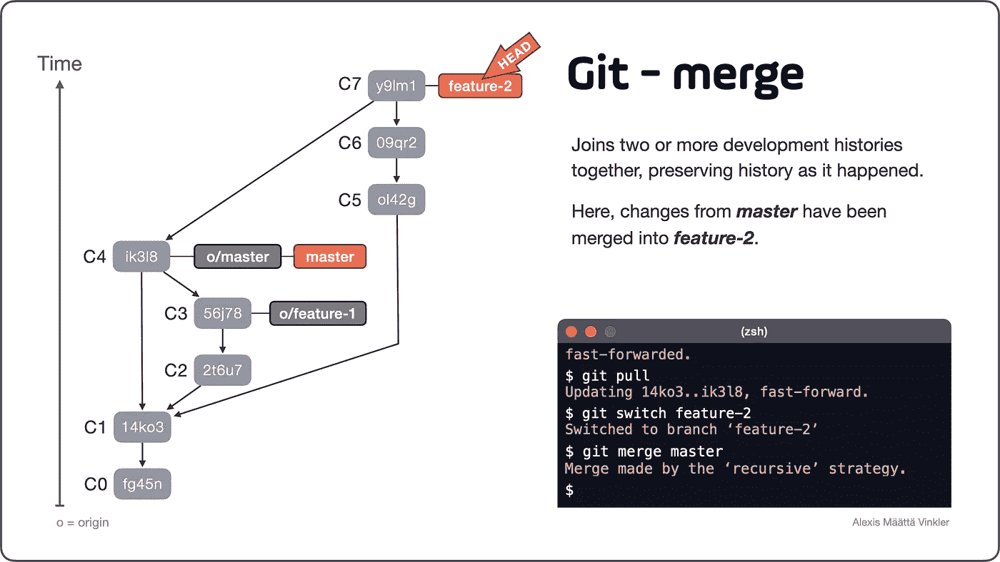
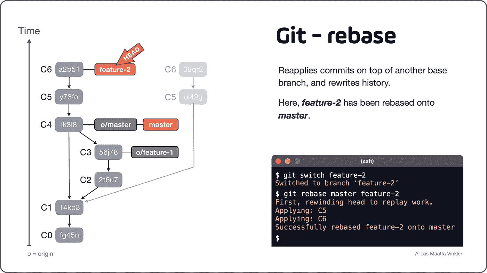
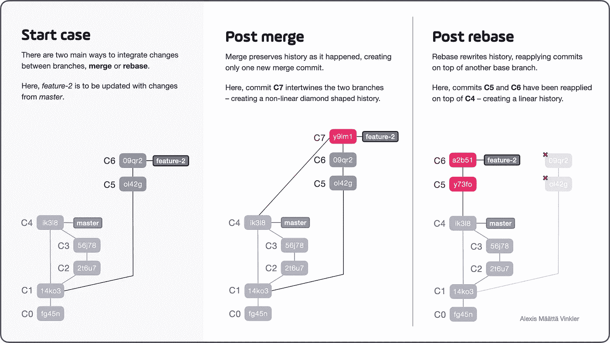

# Git Merge 和 Rebase 之间的区别——以及您应该关注的原因

> 原文：<https://betterprogramming.pub/differences-between-git-merge-and-rebase-and-why-you-should-care-ae41d96237b6>

## git merge 和 rebase 命令的比较以及何时使用它们

Joey Kyber 在 [Unsplash](https://unsplash.com/s/photos/traffic?utm_source=unsplash&utm_medium=referral&utm_content=creditCopyText) 上拍摄的照片

不管您的项目使用哪种分支策略，在分支之间集成代码变更是您几乎每天都需要做的事情。有两个主要的选择，要么你选择 T1，要么你选择 T2。

在本文中，我将说明并强调这两个选项之间的区别，并指出在执行这些操作时需要注意的事项。

首先，我将使用动画单独演示这两个操作，最后以并排比较结束。如果您已经熟悉了这些操作的工作方式，请随意跳到比较部分。

阅读官方 Git 手册，它指出`rebase` *“在另一个基础分支之上重新应用提交”*，而`merge` *“将两个或更多的开发历史结合在一起”*。换句话说，merge 和 rebase 的主要区别在于, *merge 保留了发生的历史，而 rebase 重写了它。在我们仔细研究它们各自的内部工作方式以理解这到底意味着什么之前，让我们先来看一个例子。*

从 Satoshi 的角度看历史树，为了方便起见，远程“原点”别名为“o”。还要注意，本地“主”分支(C1)目前落后于远程对应的“o/master”(C4)。

看上面的例子，我们看到开发人员 Ada 和 Satoshi 最初创建了两个主题分支(`feature-1`和`feature-2`)，源自`master`分支上的同一个提交(`C1`)。然后 Ada 通过将`feature-1`合并到`master`中来完成`feature-1`(创建合并提交`C4`)。Satoshi 现在有两个选择来将 Ada 的改变整合到他的分支`feature-2`——合并或重定基础。

# 合并

让我们从集成变更最常见的工作流程开始:合并。在 Satoshi 准备好将 Ada 的更改合并到`feature-2`之前，他必须首先更新他的本地`master`引用，因为它目前落后了。一旦`master`和`o/master`同步，Satoshi 就准备好将所有内容合并到他的主题分支中。

请看这个 30 秒钟的动画演示过程:

演示合并工作流的动画。(只有视频，没有音频)

随着所有的变化都被合并到`feature-2`中，Satoshi 现在可以继续开发这个分支，每当它完成时，通过将其合并回`master`来完成它。

下面是合并操作的最终结果。正如您所看到的，开发历史被保留了下来，只是添加了`C7`。

通过将来自“主”的改变合并到“特征-2”中，历史被保留为它发生时的样子，并且仅引入合并提交“C7”。

> 被移动的头部指针搞糊涂了？检查我关于这个主题的另一个帖子！

 [## Git 中的 HEAD 是什么？

### HEAD 回答了这个问题:我现在在存储库中的什么位置？它是一个指向当前检出分支的指针…

blog.git-init.com](https://blog.git-init.com/what-is-head-in-git/) 

# 重定…的基准

记住了基本的合并工作流，现在是时候从 rebase 的角度来看同一个例子了。就像合并的情况一样，在 Satoshi 开始整合变更之前，他必须首先确保他的本地和远程分支同步。但是，Satoshi 可以使用 rebase 来整合所有的更改，因此*“重写历史”*，而不是进行常规的合并“*保留发生的历史*”。

通过将`feature-2`重置到`master`上，Git 将一个接一个地回卷并重新应用提交`C5`和`C6`,**将**直接重置到`C4`上，使得`feature-2`看起来像是最初从 Ada 的已完成变更的顶端分支出来的。

观看这个 30 秒钟的动画，了解实际操作过程:

演示重设基础工作流的动画。(只有视频，没有音频)

随着所有的变化再次整合，Satoshi 准备继续他的主题分支工作。

下面是 rebase 操作的最终结果。注意提交`C5`和`C6`是如何被直接重新应用到`C4`上的，重写了开发历史并完全删除了旧的提交！

请注意 C5 和 C6 的散列是如何变化的，原因很简单，因为它实际上是新创建的提交(尽管内容可能仍然相同)。

既然我们知道了 merge 和 rebase 的区别，是时候更详细地考察这两种结果了。

# 合并和重设基础有何不同

最终状态的并排图示，最左边是开始情况。

正如我们在上面看到的，合并操作通过创建一个新的单个合并提交(`C7`)将分支缠绕在一起，产生了一个菱形的非线性历史——本质上是*保留了发生的历史。*通过将这个结果与 rebase 动作的结果进行比较，我们看到没有创建合并提交，相反，两个提交`C5`和`C6`只是被倒带并直接应用到`C4`之上，保持了历史的线性。如果我们进一步仔细检查这两个重新应用的提交，我们可以看到散列已经改变，这表明 rebase 真正地重写了历史。

**因此，以前的提交最终将从历史中完全删除。**

# 权力越大，责任越大

我们已经看到 rebase 如何重写历史，而 merge 如何保存历史。但这在更广泛的意义上意味着什么呢？以及这两种操作带来了哪些可能性和潜在的弊端？

## **冲突变更**

比方说，你在试图整合变更时遇到了一些令人讨厌的冲突。在合并场景中，您只需要解决一次冲突，直接在`C7`提交中。另一方面，使用 rebase，您可能不得不在每次提交(`C5`和`C6`)时解决类似的冲突，因为它们被重新应用。

如果冲突不那么容易解决，这可能表明你和你的同事没有进行足够的沟通，因为你已经在同一个文件上工作了太长时间。

## **出版分支**

另一个与重定基础相关的潜在问题发生在当你重定基础的分支已经被远程发布，并且其他人已经基于它工作的时候。然后，你的重定基础的分支会给所有相关方带来严重的混乱和头痛，因为 Git 会告诉你你的分支同时超前和滞后。如果发生这种情况，使用 rebase 标志(`git pull --rebase`)提取远程更改通常可以解决问题。

此外，无论何时，当你重新构建一个已经发布的分支时，不管是否没有其他人基于它工作，你仍然需要*强制推送*它来获得你对远程服务器的更新——完全覆盖现有的远程引用。

## **数据丢失(对您有利)**

最后，由于 rebase 重写了历史，而 merge 保留了历史，因此在 rebase 时实际上可能会丢失数据。当重新应用新的提交时，旧的提交将被删除(最终，在垃圾收集之后)。事实上，同样的特性也是 rebase 如此强大的原因——它允许您在公开发布之前整理开发历史！使用一个*交互式 rebase* (下一篇文章的主题)，你可以删除不想要的提交，压缩变更，或者简单地更新提交消息。

# **重设基本经验法则**

为了避免与重定基数相关的最常见问题，我建议坚持以下规则:

*   不要改变远程发布的分支的基础…
*   …除非你知道只有你一个人在做这件事(并感到安全用力)
*   在重定基础之前，从你要重定基础的分支的顶端创建一个备份分支，因为它将允许你容易地比较结果(一旦完成)并且在必要时跳回到重定基础之前的状态。

# 更高级的重定基础案例

rebase 还有许多更高级的用例，这些都超出了本文的范围，但将是后续文章的一部分。正如已经提到的，其中一个比较突出的特性是*交互式 rebase* ，它允许你定制每个提交应该如何被重新应用。

这种模式可以用来分割提交、压缩提交、重新排序提交，甚至完全删除提交，这只是其中的几种可能性。

# 结论

许多开发人员倾向于只使用`merge`而不使用`rebase`，通常的评论是“至少我知道我不会丢失任何工作。”从某种意义上说，不使用您不习惯使用的工具是一种可靠的方法。但是没有学会充分利用强大的功能，即使你知道它们的存在，也不是一个好方法！

这有点像说，“我知道我有一辆很棒的车，但我更喜欢坚持第一档，因为我知道速度会致命，”而不是学习如何换高档，并在更高的速度下安全行驶。

以我的经验来看，学习如何使用`rebase`尤其会加深你对 Git 的理解，从总体上提高你作为一个整体开发人员的能力——尤其是在源代码管理方面！

最后，在我职业生涯的早期，我从一位高级开发人员那里得到的最好的建议之一是:“放弃源代码树中的按钮攻击，转而学习如何从终端使用 Git 命令！否则，您将永远无法获得使用 Git 的全部好处，并且以后也无法编写任何自动化管道。”

从那以后，我只用 [GitK](https://git-scm.com/docs/gitk) 作为查看历史树的视觉辅助。我在终端输入所有命令。建议你也这样做！

现在你知道了合并和重定基础的不同之处，我希望你在开始使用它们的时候更有信心。

感谢您的阅读，祝您好运，提高您的源代码管理技能！