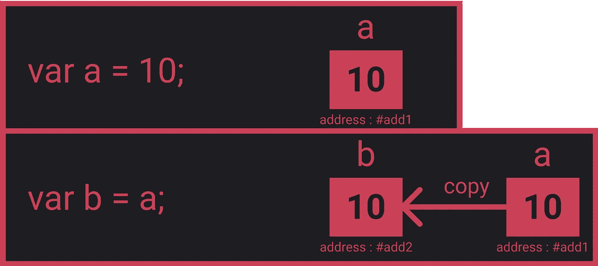
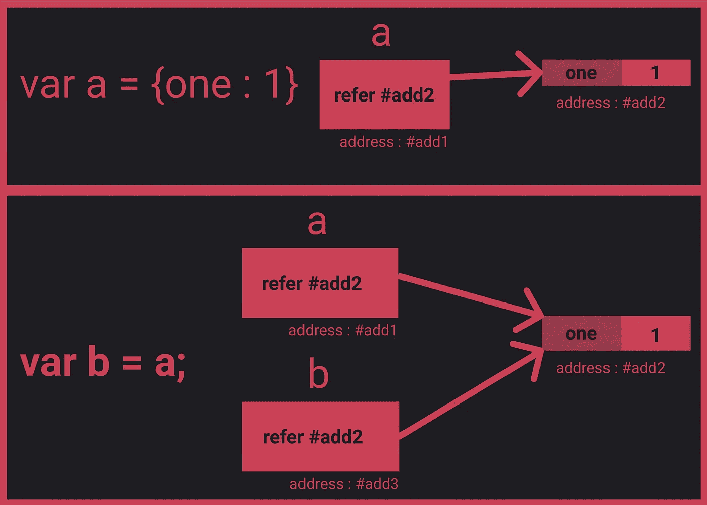
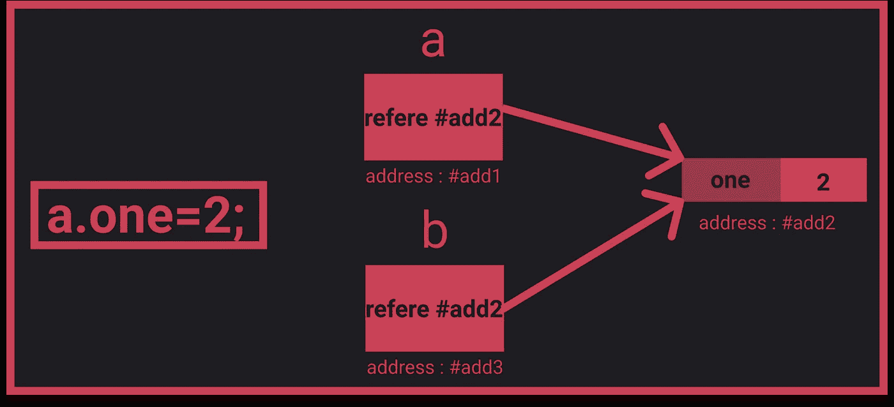
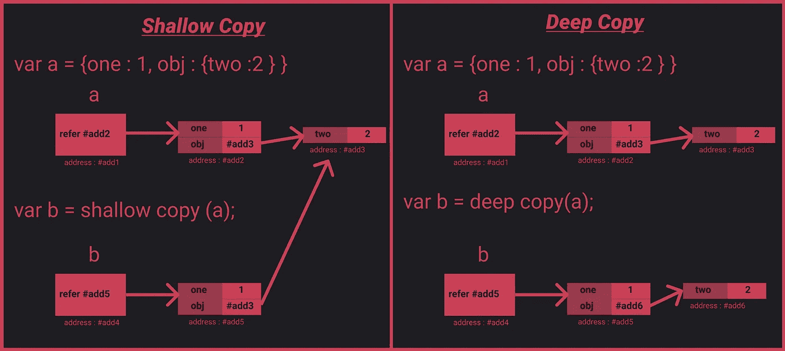

# 在 JavaScript 中复制对象的不同方法

> 原文：<https://betterprogramming.pub/different-ways-to-duplicate-objects-in-javascript-c199be34ecb7>

## 原来复制物体有很多不同的方法


詹姆斯·奥尔在 [Unsplash](https://unsplash.com/s/photos/multiple?utm_source=unsplash&utm_medium=referral&utm_content=creditCopyText) 上拍摄的照片

在 JavaScript 中，变量可以存储两种类型的数据:

*   原始的
*   参考

当我们复制原始值时，只有值会被复制。

```
var a = 10;var b = a;console.log(a, b); // 10, 10b = 20;console.log(a, b); // 10, 20
```



当我们复制原始值时，只复制值。

但是当我们复制引用值时，对象的内存地址是共享的。

```
var a = { one : 1};var b = a;a.one = 2;console.log(b.one); // 2b.one = 3;console.log(a.one); //3
```



当我们将对象赋给其他变量时，只复制内存地址。

一旦我们改变了`a`或`b`的属性，我们就改变了对象地址的值。



当对象的属性更改时，这些更改会反映在指向该对象的所有变量中。

如果我们想要复制一个原始值，我们可以使用`assignment operator (=)`，但是对于对象我们不能使用赋值操作符。

复制对象时，有两种类型:

*   浅拷贝
*   深层拷贝

当我们将一个源对象浅层复制到一个目标对象时，如果源对象的属性值是原始的，那么该值将被复制到目标对象。但是如果源对象的属性值是 reference，那么这个引用在源对象和目标对象之间共享。

在深度复制中，源对象的所有属性(包括引用)都作为值复制到目标对象。源对象和目标对象之间不共享引用。



浅层拷贝和深层拷贝的区别

# 浅拷贝

## 使用扩展运算符

spread 操作符将把`obj`的所有可枚举属性复制到`copiedObj`。

## 使用循环

上面的代码将遍历对象的所有属性，并将值复制到目标对象。

## 对象.分配

```
var source = {one : 1, nested: {two : 2}};**var target = Object.assign({}, source);**
```

# 深层拷贝

使用`JSON.stringify`和`JSON.parse`

`JSON.stringify`和`JSON.parse`只处理数字、字符串和对象文字，不支持函数或符号属性。

同样，如果对象中属性的值是`Date`，那么使用`JSON.stringify`将把`Date object`转换成一个字符串。

```
var a = { d : new Date() };var b = JSON.parse(JSON.stringify(a));b ; // {d: "2019-11-26T00:28:18.775Z"}
```

## 什么是圆形物体？

```
var a = {}; a.a = a;
```

圆形对象是具有引用自身的属性值的对象。

当我们执行循环对象的深度复制时，它会无休止地继续下去。`JSON.stringify/parse`在循环对象上执行深度复制时会抛出异常错误。

我们可以使用`Object.assign`来复制一个圆形对象——但是首先要避免创建一个圆形对象。

# 实现自定义克隆

在`deepClone`方法中，我们将遍历对象的所有属性。如果对象的值是基元的，就复制它。如果值是引用，调用`deepclone`方法。

纯 JavaScript 的深度克隆

以上方法都只关注对象，不关注数组。它们可能不适用于数组。

感谢阅读，我希望你喜欢这篇文章。

赞助我一杯[☕️咖啡](https://www.buymeacoffee.com/Jagathish)。