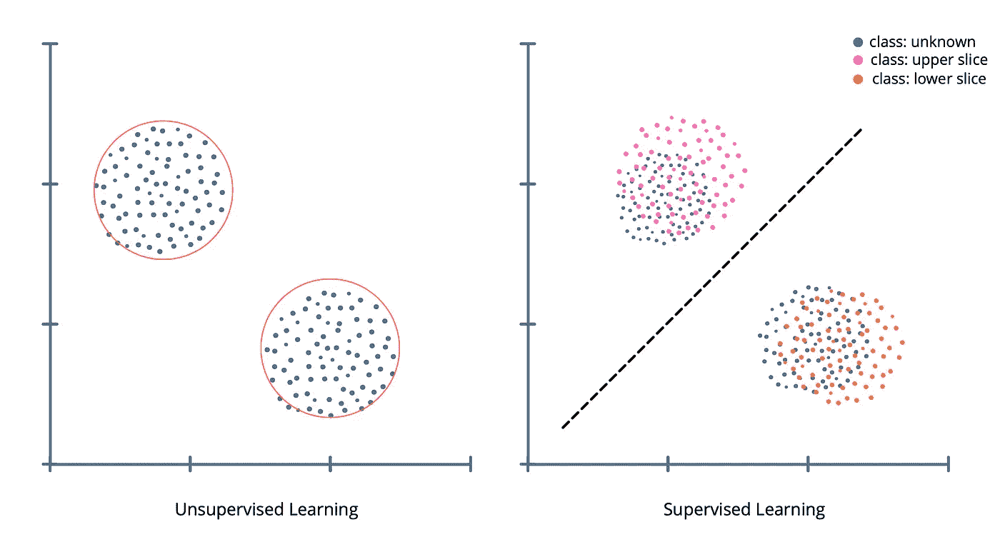
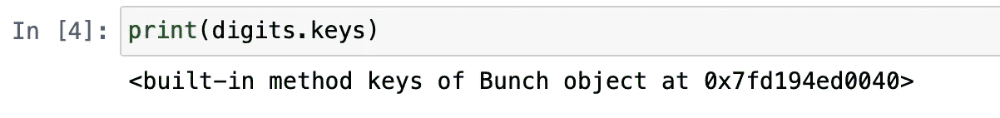
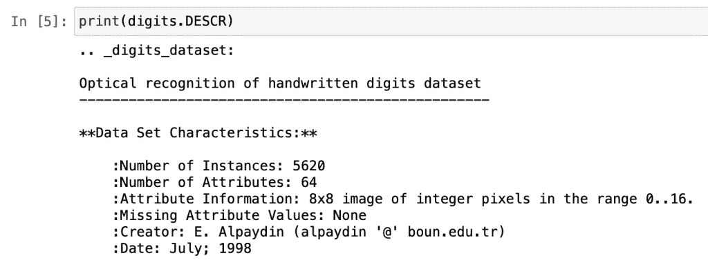
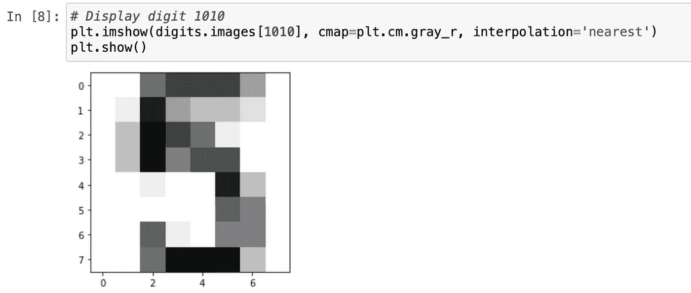
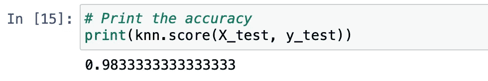
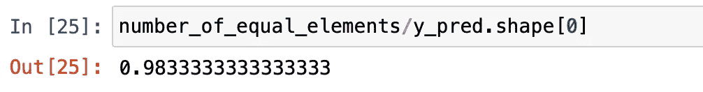
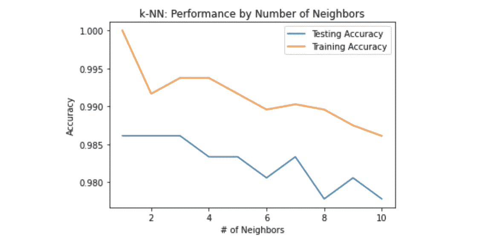
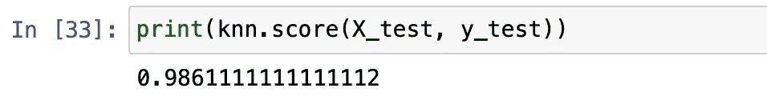

# 使用 Scikit-learn 深度学习模型的数字识别

> 原文：<https://betterprogramming.pub/digit-recognition-using-scikit-learn-deep-learning-model-ec2b1fd21411>

## 一个简单的初学者监督学习项目


[附身摄影](https://unsplash.com/@possessedphotography?utm_source=unsplash&utm_medium=referral&utm_content=creditCopyText)在 [Unsplash](https://unsplash.com/s/photos/robotics?utm_source=unsplash&utm_medium=referral&utm_content=creditCopyText) 上拍照

在这篇文章中，我将向你介绍一种叫做*监督学习*的机器学习方法。我还将向您展示如何使用 [Scikit-learn](https://scikit-learn.org/stable/) 构建和改进 KNN(k-nearest neighborhood)分类器模型。这将是一次实践演练，我们将能够在实践知识的同时进行学习。作为我们的分类器模型，我们将使用 k-NN 算法模型，这将在简介部分详细介绍。作为一种编程语言，我们将使用 Python。

完成本教程后，您将更好地理解深度学习以及如何实现监督学习分类器模型。如果你准备好了，让我们开始吧！

# 内容

*   监督学习
*   第一步。图书馆
*   第二步。理解数据
*   第三步。KNN 分类器模型
*   奖励步骤:过度拟合和欠拟合
*   结论

# 监督学习

深度学习是一门科学，它赋予计算机在没有显式编程的情况下学习从数据中得出结论的能力，例如学习预测一封电子邮件是否是垃圾邮件。另一个很好的例子是通过观察花卉的图片将它们分成不同的种类。这里有两个图表显示了监督学习和非监督学习之间的比较。



作者图片

在监督学习中，数据被分成两部分:*特征*和*目标*变量。任务是通过查看特征变量来预测目标变量。监督学习可以用于两种不同的模型:分类和回归:

*   当目标变量是分类数据集时，可以应用分类模型。
*   当目标变量是连续值时，可以应用回归模型。

# 第一步。图书馆

在这一步中，我们将安装本教程所需的库。正如简介中提到的，我们将使用的深度学习库名为 Scikit-learn。除此之外，我们将安装两个简单的库，它们是 [NumPy](https://numpy.org/) 和 [Matplotlib](https://matplotlib.org/) 。使用 PIP 安装这些库很简单，PIP 是一个 Python 包管理器。

## 安装库

让我们转到终端窗口，写下下面几行开始安装过程:

```
pip install scikit-learn
```

现在让我们在一行中安装另外两个库:

```
pip install numpy matplotlib
```

## 导入库

完美！现在让我们将它们导入到我们的程序中，以便我们可以使用它们。在本教程中，我将使用 [Jupyter 笔记本](https://jupyter.org/)。我创建了一个新的笔记本，并导入了以下模块的库。随着我们在接下来的步骤中开始使用它们，您将会了解它们中的每一个。

```
from sklearn import datasets 
from sklearn.neighbors import KNeighborsClassifier 
from sklearn.model_selection import train_test_splitimport matplotlib.pyplot as plt 
import numpy as np
```

# 第二步。理解数据

在这个练习中，我们将使用数字数据库，也称为 [MNIST](http://yann.lecun.com/exdb/mnist/) 。这是一个著名的数据库，用于开始构建监督学习模型。这些数据的好处是我们不需要下载任何东西；它带有我们之前安装的 sklearn 模块。以下是我们加载数据集的方式:

```
digits = datasets.load_digits()
```

现在，让我们通过运行几行代码来理解数据集。

```
print(digits.keys)
```



作者图片

[Bunch](https://pypi.org/project/bunch/) 是一个提供属性风格访问的 Python 字典。Bunch 就像一个对象和一个字典。

```
print(digits.DESCR)
```



作者图片

```
plt.imshow(digits.images[1010], cmap=plt.cm.gray_r, interpolation='nearest') 
plt.show()
```



作者图片

# 第三步。k 近邻分类器

在库步骤中，我们已经导入了 KNN 分类器模块，所以我们要做的就是在我们的数据集上使用它。这一步是在项目中使用现成的 sklearn 模块的一个很好的练习。既然是在做监督学习，数据集就要有标签。这意味着在训练数据的同时，我们也在教授结果。

## k-最近邻算法

> “k-最近邻算法(k-NN)是由 Thomas Cover 提出的用于分类和回归的非参数方法。在这两种情况下，输入由特征空间中 k 个最接近的训练示例组成。输出取决于 k-NN 是用于分类还是回归。”— [维基百科](https://en.wikipedia.org/wiki/K-nearest_neighbors_algorithm)

在开始实现该算法之前，我想分享一篇由[X_train, X_test, y_train, y_test = train_test_split(X, y, test_size = 0.2, random_state=42, stratify=y)](https://medium.com/u/502d63083812#test size is the ratio that will be the test data, and the rest will be train data</span><span id=)

## [定义分类器](https://medium.com/u/502d63083812#test size is the ratio that will be the test data, and the rest will be train data</span><span id=)

```
knn = KNeighborsClassifier(n_neighbors = 7)
```

## [符合模型](https://medium.com/u/502d63083812#test size is the ratio that will be the test data, and the rest will be train data</span><span id=)

```
knn.fit(X_train, y_train)
```

## [准确度分数](https://medium.com/u/502d63083812#test size is the ratio that will be the test data, and the rest will be train data</span><span id=)

```
print(knn.score(X_test, y_test))
```

[](https://medium.com/u/502d63083812#test size is the ratio that will be the test data, and the rest will be train data</span><span id=)

[作者图片](https://medium.com/u/502d63083812#test size is the ratio that will be the test data, and the rest will be train data</span><span id=)

[我给你演示一下这个分数是怎么算出来的。首先，我们使用 KNN 模型对`X_test`特征进行预测，然后将其与实际标签进行比较，这就是`y_test`。下面是在后台实际计算精度的方法:](https://medium.com/u/502d63083812#test size is the ratio that will be the test data, and the rest will be train data</span><span id=)

```
y_pred = knn.predict(X_test)number_of_equal_elements = np.sum(y_pred==y_test)
number_of_equal_elements/y_pred.shape[0]
```

[](https://medium.com/u/502d63083812#test size is the ratio that will be the test data, and the rest will be train data</span><span id=)

[作者图片](https://medium.com/u/502d63083812#test size is the ratio that will be the test data, and the rest will be train data</span><span id=)

[](https://medium.com/u/502d63083812#test size is the ratio that will be the test data, and the rest will be train data</span><span id=)

# [奖励步骤。过度拟合和欠拟合](https://medium.com/u/502d63083812#test size is the ratio that will be the test data, and the rest will be train data</span><span id=)

[这一节的重点是改进您的模型，并找到合适的参数来创建完美的监督学习模型。这是我在亚马逊机器学习文档中找到的关于模型过度拟合和欠拟合的一个很好的解释:](https://medium.com/u/502d63083812#test size is the ratio that will be the test data, and the rest will be train data</span><span id=)

> [当模型在训练数据上表现不佳时，模型对训练数据拟合不足。这是因为模型无法捕捉输入示例(特征)和目标值(标签)之间的关系。当您看到模型在训练数据上表现良好，但在评估数据上表现不佳时，模型会过度拟合您的训练数据。这是因为该模型正在记忆它所看到的数据，而无法推广到看不见的例子。”—](https://medium.com/u/502d63083812#test size is the ratio that will be the test data, and the rest will be train data</span><span id=) [模型拟合:欠拟合与过拟合](https://docs.aws.amazon.com/machine-learning/latest/dg/model-fit-underfitting-vs-overfitting.html)

现在，让我们编写一个`for`循环，它将帮助我们了解我们的数据在不同邻居值中的表现。该函数还将帮助我们分析模型如何表现最佳，这意味着更准确的预测。

现在让我们用图表显示结果:



作者图片

这个图证明了邻居越多并不总是意味着性能越好。当然，这主要取决于模型和数据。在我们的例子中，正如我们所看到的，一到三个邻居的测试精度最高。早些时候，我们用七个邻居训练了我们的 KNN 模型，我们得到的准确度分数是 0.983。所以现在我们知道我们的模型在有两个邻居的情况下表现得更好。让我们重新训练我们的模型，看看我们的预测将如何变化。

```
knn = KNeighborsClassifier(n_neighbors = 2) 
knn.fit(X_train, y_train)print(knn.score(X_test, y_test))
```



作者图片

# 结论

完美！您已经使用 Scikit-learn 模块创建了一个监督学习分类器。我们学习了如何检查分类器模型的性能。我们还学习了过度拟合和欠拟合，这使我们能够改进预测。深度学习是如此有趣和令人难以置信。如果你今天学到了新东西，我会很高兴的。如果您在实现代码时有任何问题，请随意写评论。

# 动手深度学习项目

[](https://towardsdatascience.com/step-by-step-guide-building-a-prediction-model-in-python-ac441e8b9e8b) [## 分步指南-用 Python 构建预测模型

### 使用长短期记忆预测模型的动手练习

towardsdatascience.com](https://towardsdatascience.com/step-by-step-guide-building-a-prediction-model-in-python-ac441e8b9e8b)