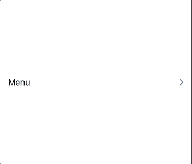

# SwiftUI 中的披露组

> 原文：<https://betterprogramming.pub/disclosuregroup-in-swiftui-868739aedf77>

## 可以把它想象成一个下拉菜单。最好的部分是你可以在下拉列表中包含任意多的下拉列表


由[克里斯多夫·高尔](https://unsplash.com/@cgower?utm_source=medium&utm_medium=referral)在 [Unsplash](https://unsplash.com?utm_source=medium&utm_medium=referral) 上拍摄。

最近在 WWDC 2020 上推出的这种行为可以用 UIKit 中的 StackView 重现，但制作过程有点乏味。用几行代码就能解决这个问题。

> *“根据披露控件的状态显示或隐藏另一个内容视图的视图。”—* [*苹果的文档*](https://developer.apple.com/documentation/swiftui/disclosuregroup)

# 先决条件

要学习本教程，您需要了解以下方面的一些基本知识:

*   迅速发生的
*   至少 Xcode 12+

*注意:这只支持 iOS 14+。*

# 披露小组

您首先必须创建一个`State`来控制下拉菜单，但是请放心，剩下的事情会处理好的。在这里，您将创建一个包含食物和饮料的下拉菜单。

所以你至少需要三个`States`，每个都连接到各自的下拉菜单上:

```
@State private var topExpanded: Bool = false
@State private var foodExpanded: Bool = false
@State private var drinkExpanded: Bool = false
```

接下来，使用`DisclosureGroup`:

瞧:

