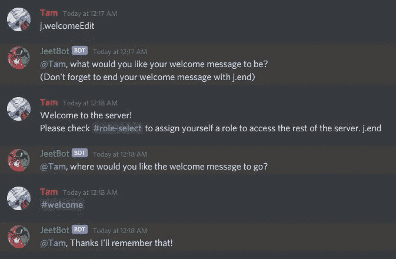
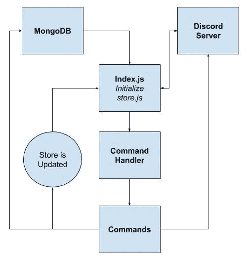
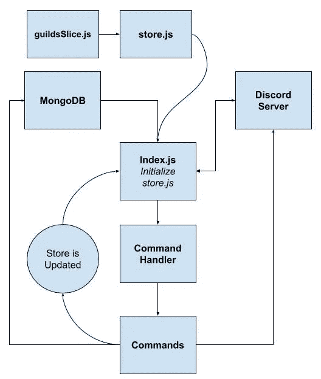
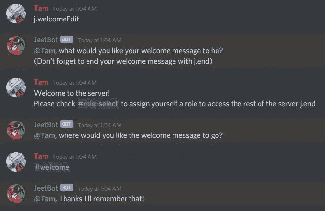
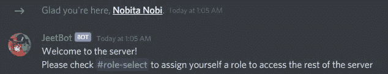

# 不和谐机器人和国家管理

> 原文：<https://betterprogramming.pub/discord-bots-and-state-management-22775c1f7aeb>

## 确保你的机器人可以随着你的用户扩展


由 [Unsplash](https://unsplash.com?utm_source=medium&utm_medium=referral) 上的 [chuttersnap](https://unsplash.com/@chuttersnap?utm_source=medium&utm_medium=referral) 拍摄

# **预警**

这篇文章不会只谈论不和谐的机器人，也不是要对他们进行适当的介绍。如果你正在寻找，或者甚至如何创建你自己的机器人，看看[https://discordjs.guide/](https://discordjs.guide/)或者看看这个 [Quora 主题](https://www.quora.com/What-is-a-discord-bot-What-is-a-discord-server)中的一些回复。

要完全理解本文，您需要对 JavaScript、MongoDB、Mongoose ODM、Node.js、Promises 和 Async/Await 有所了解，并且需要一些通用编程知识来理解所使用的一些语法。

我也不会真的触及 MongoDB 和 Mongoose 的设置。
如果你需要了解更多，这里有一些链接:

*   了解关于 [JavaScript](https://javascript.info/) 的更多信息
*   了解更多关于 [MongoDB](https://www.mongodb.com/) 和[mongose ODM](https://mongoosejs.com/)的信息

首先，我要深入谈谈我在创建[截拳道](https://www.jeetbot.com)时遇到的几个问题。

这是一个很长的阅读，所以我把一个 TL；博士在最后。

# **那么，有什么问题吗？**

在我为 Discord 用户和我自己创建一个有用的 Discord bot 的过程中，我从 MongoDB 数据库中检索数据的次数太多了。在一个快乐的、自由之地类型的互联网中，所有的读/写都不会花我一分钱。但是在互联网上来回传输数据有时需要钱，我想适当地扩展这个机器人，所以我需要在机器人内部本地保存一些数据。

机器人必须关注的事情之一是改变数据库的用户输入。这意味着用户正在主动变更/改变某些选项，这是与机器人所在的其他 Discord 服务器异步发生的。

## 这听起来并不难解决…

我认为我需要在 bot 初始化时建立一个哈希映射数据结构，并在数据库发生变化时对本地缓存进行更改。但是没那么容易。下面让我描述一下我在尝试这个过程中遇到的情况。

我有一个命令处理程序，它接收来自不和谐用户的消息并将其识别为命令:

```
client.on("message", async (msg) => {
  commandHandler(msg);
});
```

当一个消息被发送到机器人时，它通过`commandHandler`运行消息，然后在特定命令所在的地方结束。但是，它对发送的每条消息都是异步的。

因此，命令流如下所示:

**index.js → commandHandler →具体命令。**

当我最初设置 hashmap，即`[new Map()](https://developer.mozilla.org/en-US/docs/Web/JavaScript/Reference/Global_Objects/Map)`时，它将包含以下数据:

```
{
  guild.id: guildDataObject
}
```

*注:我交替使用“公会”和“不和服务器”。*

但是当我发送包含所有公会信息的`Map`对象时，它返回错误。数据没有按时返回，或者卡在栈上等着卸载承诺。

*注意:目前在 1.1.2 版本的 Jeetbot* 中，它被赋值为 j.edit 而不是 j.welcomeEdit。



例如:

1.  不和谐版主在不和谐频道输入`j.welcomeEdit`。
2.  机器人识别命令。
3.  Bot 会提示用户输入欢迎消息的新信息。
4.  Bot 等待新的欢迎消息，但是其他消息和新命令堆积在上面。
5.  Discord 版主发送响应以更改欢迎消息。
6.  Bot 接受消息，但承诺不立即按时返回使用。它在队列中等待其他承诺完成。


❌ `**Error: Not Returning The Right Welcome Message.**` ❌

为了让机器人真正使用新消息，我不得不多次调用`j.welcomeEdit`,新的欢迎消息才会回到正确的位置。

承诺越来越多，却没有一件事按时兑现。在生产环境中，这是不可接受的。

## 我有两个主要问题

1.  每次发送消息时，对数据库进行过多的读取/写入。
2.  我的机器人不会正确返回本地缓存，所以当用户更新他们的数据时，它不会立即更新。

我的直觉是我需要像 ReactJS 的`useState()`这样的东西。由于我没有在这个机器人中制作 web 应用程序，所以我唯一想到的就是尝试一下 Redux.js。

# Redux.js 来拯救

我的一位导师曾在[Code chrysis](https://codechrysalis.io/)教我如何编程，他曾经告诉我，“总有一天你会真正需要使用 Redux.js。”

当然，我曾经一起使用过 ReactJS 和 Redux.js。我熟悉 React 应用程序中的钩子和处理状态。但是这个机器人完全独立于 Jeetbot 团队为其构建的网页运行。因此，花时间看看关于 React 应用程序如何在 JavaScript 中构建的文章和架构，我觉得我可能必须用 Redux.js 做一些类似的事情，以同样的方式处理状态。

Redux 非常适合处理不断变化和异步的全局状态。

当我规划出我希望机器人如何工作时，控制流最终看起来是这样的:



我的 Jeetbot 条目从 index.js 开始，它将初始化 redux 存储，并将 MongoDB 上的所有现有数据存储在存储中。

Jeetbot 启动后，它开始监听 Discord 服务器上发送的事件或命令，而 Jeetbot 位于不同的服务器上。所有事件目前都在 index.js 中处理，所有命令都将传递给命令处理程序，然后再传递给命令。

**不和谐服务器→ Index.js → CommandHandler →命令**

当触发一个命令来更改存储中的当前数据时，本地存储会更新，MongoDB 数据库也会更新。

# **太好了——我们有了一个可行的想法**

但是，我如何编写实现这一目标所需的代码呢？我们需要了解 Redux 是如何工作的。我并不是在做一个 React-Redux 网站，也不是在试图做一个需要状态来呈现和显示在屏幕上的小应用程序。

在经历了许多痛苦和汗水之后，我找到了 Redux Toolkit **—** 的解决方案，这是一个官方的、固执己见的、包含电池的工具集，用于高效的 Redux 开发。

如果你知道口袋妖怪卡片，它本质上是一个预先设定的增强包，里面有你知道如果你正确使用它们会很有用的卡片。

# **高级视图**



## 冗余逻辑

这是我们处理所有突变逻辑的地方。在这里，我创建了一些通用的选择器和缩减器来导入程序的其余部分。您很快就会看到我是如何使用它们的。

我在遵循 Redux 建议的“[鸭子](https://github.com/erikras/ducks-modular-redux)”方法论。*(本质上将一个特征的所有冗余逻辑放入一个文件中)。*

**store.js** —这是我们配置商店的地方。它将包括我们的减速器和我们打算使用的任何中间件。

# **guildslice . js**

Redux 工具包带有漂亮的函数，比如`[createEntityAdapter](https://redux-toolkit.js.org/api/createEntityAdapter)`和`[createSlice](https://redux-toolkit.js.org/api/createSlice)`。这两个函数都使得创建适当的 Redux 逻辑更加容易。这里我们需要这两种功能，所以我将一起讨论它们。

本质上，`[createEntityAdapter](https://redux-toolkit.js.org/api/createEntityAdapter#crud-functions)`附带了针对 Redux 存储中的突变的 CRUD 操作(创建、读取、更新、删除),并且附带了`Selector`以便您可以在存储中获取数据。

首先，我创建了一个`createEntityAdapter`的实例或副本，并将其命名为`guildsAdapter`。现在，`guildsAdapter`可以访问`createEntityAdapter`中的其他功能。

我将使用的方法如下:

*   `guildsAdapter.[getSelectors()](https://redux-toolkit.js.org/api/createEntityAdapter#selector-functions)`
*   `guildsAdapter.[getInitialState()](https://redux-toolkit.js.org/api/createEntityAdapter#getinitialstate)`
*   `guildsAdapter.[addOne()](https://redux-toolkit.js.org/api/createEntityAdapter#crud-functions)`
*   `guildsAdapter.[removeOne()](https://redux-toolkit.js.org/api/createEntityAdapter#crud-functions)`

在 guildsSlice.js 的第 4 行，我创建了自己的`guildsSelector`来访问存储中的特定数据。我将这个函数从 guildsSlice.js 中导出，稍后再导入 index.js 中使用。

看一下第 6 行，我在那里做了一个`const guildsSlice = createSlice({});`。`[createSlice](https://redux-toolkit.js.org/api/createSlice)`功能需要以下输入才能正常工作:

```
// A name, used in action types
**name**: string,// The initial state for the reducer
**initialState**: any,// An object of "case reducers". 
// Key names will be used to generate actions.
**reducers**: Object<string, ReducerFunction | ReducerAndPrepareObject>
```

现在，我可以通过`guildsAdapter.`访问`createEntityAdapter`中的所有功能

我们正在处理 discord 服务器，它们被称为 Discord.js 中的公会。

`[initialState](https://redux-toolkit.js.org/api/createSlice#initialstate): guildsAdapter.getInitialState()`——记得我之前说过的`[getInitialState()](https://redux-toolkit.js.org/api/createEntityAdapter#getinitialstate)`方法。它为我们创建了以下数据结构:

```
{
  // The unique IDs of each item. Must be strings or numbers
  ids: [],
  // A lookup table mapping entity IDs to the corresponding entity
  // objects
  entities: {}
}
```

对于每个`id`，它将引用一个`entity.id`，并有一个对象连接到那个`entity.id`。

这是我在 index.js 中使用`store.getState()`时数据的样子:

```
{
  guilds: {
    ids: [
      '276775249180360704', // discord server ID
      '428518913144520704',
      // additional IDs
    ],
    entities: {
      '276775249180360704': [Object], // discord server ID
      '428518913144520704': [Object],
      // additional { IDs: Objects }
    }
  }
}
```

接下来，对于`createSlice`对象，我们需要我们的[减速器](https://redux-toolkit.js.org/api/createSlice#reducers)。

`guildAdded()`、`guildRemoved()`和`guildWelcomeMessageUpdated()`取当前状态和一个动作。在这个动作中，有一个`action.payload`,它实际上是我们在别处调用这个函数时发送的任何东西。*(稍后将详细介绍)*

在`guildAdded()`和`guildRemoved()`内有以下内容:

1.  我从有效载荷中析构了`_id`。
2.  我把它重新命名为`action.payload.id = _id`。
3.  我使用`guildsAdapter.addOne`(或`.removeOne`)以便在数据库中添加了新的 Discord 服务器(另一个用户添加了 Jeetbot)或从数据库中删除了 Discord 服务器(有人将 Jeetbot 踢出了他们的服务器)时，商店会更新。

在`guildWelcomeMessageUpdated()`中，我还分解了`_id`并寻找`const guild = state.entities[_id]`中引用的 discord 服务器。

之后，我应用我的逻辑来更新商店中的公会欢迎消息。

最后，我们将对我们的动作进行更多的分解，以便以后在我们的文件中使用它们。让我们`module.exports`一切准备就绪:

```
const {
    guildAdded,
    guildRemoved,
    guildWelcomeMessageUpdated,
} = guildsSlice.actions // destructure the actions to use latermodule.exports = {
    guildsSelector, // our selector to access the data
    guildsSlice, // our slice adding to the config of the store
    guildAdded, 
    guildRemoved,
    guildWelcomeMessageUpdated,
}
```

# **store.js**

这是我们设置配置的地方。大多数架构和逻辑工作都是在 guildsSlice.js 中完成的。当我们在 index.js 中设置商店时，它每次都会有这个商店配置。

我们来剖析一下这个。

从 Redux 工具包中，我得到了`[configureStore](https://redux-toolkit.js.org/api/configureStore)`和`[getDefaultMiddleware](https://redux-toolkit.js.org/api/getDefaultMiddleware)`函数。我从 guildsSlice.js 文件中导入`guildsSlice`。

这里最重要的部分是，我们为商场正确设置了减速器:

```
module.exports = configureStore({
  reducer: {
   guilds: guildsSlice.reducer
  },
  // other code
});
```

当在 Index.js 中初始化存储时，我们将从 guildsSlice.js 中导出 reducers，以便在存储*中识别。*

> guildslice . js→store . js→index . js 是流程。

出于开发的目的，`immutableCheck`、`serializableCheck`和`devTools`是很好的选择(你不必在那里写 false，因为如果你省略`getDefaultMiddleware()`和`devTools`，它们将默认为 true)。)因为它们为每个被分派的动作花费时间，所以我把它关掉，这样我的程序可以运行得更快。不过，戴上它们来检查你是否坚持 Redux 方法论还是不错的！

`module.exports`所有这些，我们准备开始在 JeetBot 的 index.js 中使用 Redux Toolkit。

# **index.js**

下面是 Discord.js 和 Redux.js 的有趣之处。

基本上，这段代码执行以下操作:

1.  Jeetbot 用 Discord 检查 Jeetbot 是否已经被添加到新的服务器中。
2.  如果有，新的公会信息被添加到数据库和本地`store`。
3.  如果 bot 发现服务器已经存在于数据库中，它会将信息从 MongoDB 缓存到本地`store`以备后用。

简单吧？但是这里有一条对我们商店来说很重要的线:

`store.dispatch(guildAdded(serverCache(guildInfo)));`

*注意:我的* `*serverCache*` *函数正在返回一个包含 Discord 服务器 ID 为* `*_id*` *的对象。这没什么特别的，只是我处理数据库的方式——它不是那里的主键。*

*   `store`是我们拥有一切的全球状态。
*   `store.dispatch`是商店上的一个方法，它说“嘿，我们想运行一个动作。”
*   是我在 guildsSlice.js 中创建的一个 reducer。
*   `guildInfo`是我收到的数据，正在传递给减速器。

从那里，对于我们的 bot 中发生的任何命令，我们可以使用我们的`guildsSelector`来检查`store`。

# `**guildAdded**`和`**guildRemoved**`的例子

这是我们添加一个不和谐公会到商店的另一个例子:

```
store.dispatch(guildAdded(serverCache(serverInfo)));
```

这是另一个公会被移除的例子:

```
store.dispatch(guildRemoved(serverCache(guildInfo)));
```

太好了，我们现在可以添加到 Redux 商店了！

# **能够从商店中阅读怎么样？**

这是第一种情况，我们将访问存储中的数据，而不仅仅是从存储中添加/删除数据。在 Redux Toolkit 文档中，您会看到我们在 guildsSlice.js 中创建了`guildsSelector`。请参考此处的[以查看可用的选择器方法。](https://redux-toolkit.js.org/api/createEntityAdapter#selector-functions)

在第 3 行，我们可以在商店里抓取一个不和谐公会的深层克隆。

```
guildsSelector.selectById(store.getState(), member.guild.id));
```

`guildsSelector` —我们之前从 guildsSlice.js 中导入的内容。它是 createEntityAdapter 的一部分，其中有一个方法叫做…

`.selectById(state, entity.id)` —它需要两个参数。我们想要获取的对象的当前状态和不一致服务器 ID。

`store.getState()`是我们检索商店当前状态的方式。

`member.guild.id`是一个 Discord.js 对象，用于查找成员的消息和他们发送消息的 Discord 服务器 ID。

在我获得特定 Discord 服务器的数据后，我可以运行我的逻辑来查看是否有 Discord 服务器的管理员或版主设置的欢迎消息。

太好了！现在，我可以从我的存储中读取我的机器人所在的所有 discord 服务器的欢迎消息。但是如果用户想要定制一条消息呢？

# 状态管理时间

继续下面的代码是 Redux.js 的真正魅力。如果不能管理全局状态，我将很难找到所有这些的解决方案。

如果你还和我在一起，让我们继续！

这是我最初的问题所在。在普通的 JavaScript 中，或者至少在我使用 Discord.js 的应用程序的当前结构中，我在之前存储变量的位置发送了一个对象。即使我这样做了`await commandHandler(msg, localStore)`，也无法及时返回以让新数据出现在本地。所以这一次，我将发送`async (msg)`和`store`。

**commandHandler 文件夹(index.js)**

机器人检查是否有正确的命令被发送到机器人。如果是，则继续执行此调用中发送的特定命令。

`PREFIX = j.`和`command = welcomeEdit`

用户在`j.welcomeEdit`中输入，这个流程将把用户带到代码的编辑命令。

*注意:在 1.1.2 版本的 Jeetbot* 中，它目前被指定为 j.edit 而不是 j.welcomeEdit。



## **edit.js**

在这一点上，我们离 index.js 文件有一点距离，除此之外，更多的消息正在飞向`commandHandler`文件，以检查它们是否是合法的命令。当我们等待用户输入消息时，其他服务器上的承诺正在建立，需要解决！

当我先前输入一个常规对象并试图返回它时，在用户完成输入新的欢迎消息的提示后，我的本地缓存没有更新。

这一次，我导入了动作`guildWelcomeMessageUpdated`，我们在商店上分派了动作，我们基本上完成了我们想要做的事情。

```
store.dispatch(guildWelcomeMessageUpdated(serverCache(guildInfo)));
```

这里有很多不同的事情在进行，但最重要的是，这个程序按预期工作！通过向我的商店发送一个动作，它更新了全局状态，我可以立即使用用户输入的新数据。



咻！

如果你已经到了这一步，我希望我能够传授一些知识或者重申一些你一直在思考的事情。

我非常感谢维护 [Discord.js](https://discord.js.org/#/) 和 [Redux ToolKit](https://redux-toolkit.js.org/) 的团队。还要特别感谢 Discord 上的[react flux](https://discord.gg/reactiflux)社区，特别是 phryneas#4779 和 acemarke#9340 在建立 Redux 商店时指引了我正确的方向。

不久前，我还不知道如何正确编码，但谢天谢地，在[代码蛹](https://www.codechrysalis.io/)和他们沉浸式编码训练营的帮助下。我能够找到自信和能力来批判性地思考我的代码，并在出现问题时迅速寻求解决方案。

为你的应用程序创建你自己的 redux 商店时，试着遵循 [Redux 风格指南](https://redux.js.org/style-guide/style-guide)。这是格式化 Redux 商店的好方法。一旦点击，它就会像盒子里的任何工具一样。需要的时候就用。

我希望这是一个教育职位的人需要它。

如果有另一种解决方案，我很乐意深入研究，再尝试一些。但是通过这次经历，我觉得我在成为一名更好的程序员的道路上又前进了一步。

# TL；博士——我有两个大问题

1.  对数据库的读取/写入太多。
2.  异步状态突变没有正确返回。

我用 Redux 工具包解决了这些问题。

我的机器人缓存本地数据并正确处理全局状态。