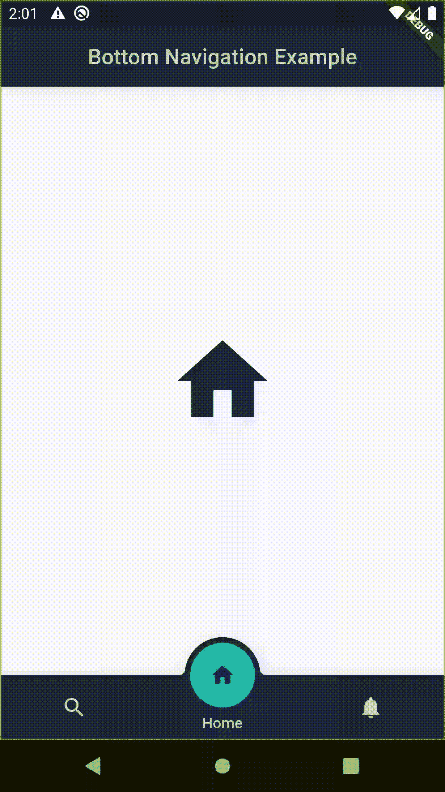
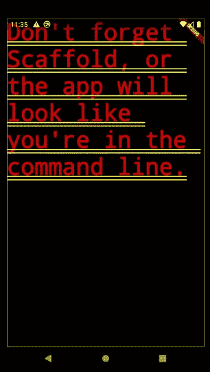
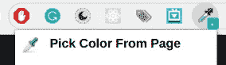

# 底部导航栏和 ColorZilla——用于生成十六进制颜色代码的插件

> 原文：<https://betterprogramming.pub/discover-flutter-bottom-navigation-bar-generate-hex-color-code-easily-d6d949dd860b>

## 发现颤动——第 5 周

史蒂夫·哈拉马在 [Unsplash](https://unsplash.com/?utm_source=unsplash&utm_medium=referral&utm_content=creditCopyText) 上拍摄的照片。

今天，我们将针对某个主题再制作一个迷你应用程序。这一次，底部的导航栏位于前景中。

考虑到几乎每个应用都有这个导航栏，我觉得不应该忽略。

如果你读过我关于制作 [intro sliders](https://medium.com/the-innovation/discover-flutter-how-to-create-sliders-how-to-create-cool-text-designs-8adb0e1feea3) 的文章，你就会知道我喜欢混合鸡尾酒，所以在这里我将混合前面提到的 navbar 和一个用于生成十六进制颜色代码的 Chrome 插件。

是时候投入到本周扑朔迷离的发现中了。

# 1.**花式 _ 底部 _ 导航**扑包

在我们的例子中，我们将使用 fancy_bottom_navigation Flutter 包。它吸引了我的眼球，因为它的设计很有趣。

 [## fancy_bottom_navigation |颤振包

### 添加插件(即将发布):依赖项:...fancy_bottom_navigation: ^0.3.2 目前这仅限于更多…

公共开发](https://pub.dev/packages/fancy_bottom_navigation) 

## 目标 1:创建三个选项卡

我们的底部导航栏将分为三个选项卡。要做到这一点，您需要做到以下几点:

*   安装软件包—安装方法在上面链接的安装部分中有所描述。
*   在`lib`文件夹中创建一个名为`start_screen.dart` 的 Dart 文件。
*   在上述文件中创建一个名为`StartScreen`的有状态小部件。
*   创建一个名为`tabs`的`TabData`列表，并用三个`TabData`对象填充它。对于每个`TabData`对象，选择`iconData`及其标题。
*   通过创建一个整数属性`currentTab`来选择哪个选项卡是主选项卡。

开始 _ 屏幕.镖

## 目标 2:在 Scaffold 小部件中应用底部导航栏

如果你忘记了 screen dart 文件中的 Scaffold，你会发现你的应用一点也不精彩:

*   这次没有绞刑架我们哪儿也不去。除了`AppBar`小部件，我们还将转发之前安装的底部导航栏。

开始 _ 屏幕.镖

*   `FancyBottomNavigation`栏是漂亮的红色，因为我们必须填写它的强制属性:

1.  `tabs` —将创建的`TabData`列表转发给它。

2.`onTabChangedListener`期待一个函数。我们传递一个匿名函数，在这个函数中，我们必须设置我们的`currentTab`属性来描述用户选择的选项卡的位置。因为我们的目标不仅仅是改变这个属性的值，还要重新呈现这个类的窗口小部件树(以修改显示)，我们需要在`setState`函数中改变这个属性的值。

开始 _ 屏幕.镖

## 目标 3:选择新标签后改变应用程序的外观

为了实现这一点，有必要将新屏幕转发到脚手架的`body`属性。请遵循以下步骤:

*   创建一个`_getBody`函数，它将接收所选选项卡的位置作为参数。
*   使用 switch case 语句返回所需的屏幕小部件。在我的例子中，我创建了一个 [Body Stateful Widget](https://github.com/jelenajjovanoski/bottom_navigation_example/blob/master/lib/body.dart) ，在其中我实现了[circular _ reveal _ animation](https://pub.dev/packages/circular_reveal_animation)Flutter 包。

开始 _ 屏幕.镖

*   将上面创建的函数转发给`body`参数。有必要将`currentTab`属性传递给跟随所选选项卡位置的函数。

开始 _ 屏幕.镖

# 2.Chrome 的 ColorZilla 插件

这个导航条的伟大之处在于它的颜色遵循了您在`MaterialApp`小部件的`themeData`属性中设置的主题。但是，它也提供个人定制。我将介绍如何轻松获得您需要的十六进制颜色代码。所以，步骤是:

*   在你的 Chrome 浏览器中安装 ColorZilla。有了这个，你可以从浏览器的任何一点得到一个颜色读数。

 [## Chrome 的 ColorZilla

### ColorZilla for Google Chrome 是一个扩展，可以帮助 web 开发人员和图形设计人员完成与颜色相关的任务…

www.colorzilla.com](https://www.colorzilla.com/chrome/) 

*   单击插件并选择“从页面选择颜色”选项。

*   将它放在你想要的颜色上，颜色十六进制代码将被复制到你的剪贴板中(例如`#1FBDA8`)。
*   在新的 dart 文件中创建一个`ColorConstants`类:`color_constants.dart` *。*
*   由于这个十六进制代码颜色永远不会改变，我们将为我们需要的每种颜色创建一个静态整数常量。
*   下一步很重要。你需要从十六进制代码(`#1FBDA8`)中删除`#`，并在前面加上`0XFF`。所以你会得到`0xFF1FBDA8`。

*注:* `*0xFF*` *是十六进制数* `*FF*` ***。***

颜色常数. dart

*   在颜色常量中使用该值，它需要一个整数。

开始 _ 屏幕.镖

如果您对 Body Stateful 小部件中的动画实现感兴趣，可以在下面找到完整的项目:

 [## jelenajjovanoski/bottom _ navigation _ example

### 一个新的颤振项目。这个项目是颤振应用的起点。一些帮助您入门的资源…

github.com](https://github.com/jelenajjovanoski/bottom_navigation_example) 

# 结论

如果你是涵盖各种颤振主题的简短有趣文章的粉丝，并且你想养成在接下来的 25 周内和我一起学习颤振的习惯，你可以每周二阅读我的文章。

如果你对这篇文章有任何问题或评论，欢迎在下面回复。

对于那些想加入我们的颤振之旅的人，可以在下面找到前几周的链接:

*   [第 1 周](https://medium.com/the-innovation/discover-flutter-roadmap-for-learning-flutter-why-textalign-property-does-not-work-aa055a469025)
*   [第 2 周](https://medium.com/@jelenajjovanoski/discover-flutter-how-to-create-sliders-how-to-create-cool-text-designs-8adb0e1feea3)
*   [第 3 周](https://medium.com/@jelenajjovanoski/discover-flutter-how-to-easily-generate-routes-how-to-flatten-deeply-nested-widget-trees-9c66dae99a73)
*   第四周

下周见。不要打破记录！