# Flutter 版本管理器介绍(FVM)

> 原文：<https://betterprogramming.pub/discover-flutter-flutter-version-manager-fvm-411dc2bff4b4>

## 发现颤动——第 9 周


照片由[阿齐兹·阿查基](https://unsplash.com/@acharki95?utm_source=medium&utm_medium=referral)在 [Unsplash](https://unsplash.com?utm_source=medium&utm_medium=referral) 上拍摄。

Flutter 版本管理器(或 FVM)是管理机器上 Flutter SDK 版本的最简单的方法。因此，我可以说它是一个本地发展的游戏规则改变者，就像 NVM 一样。

这意味着我们可以为每个项目定义一个特定的 Flutter 版本。此外，它们会被缓存，所以我们不必一直经历完整的安装过程。

以下是 FVM 在 Linux 操作系统上的安装和设置过程的说明。

# 1.在你的机器上安装 FVM

*   首先，确保安装了 Flutter。在命令行中，执行`flutter`命令:

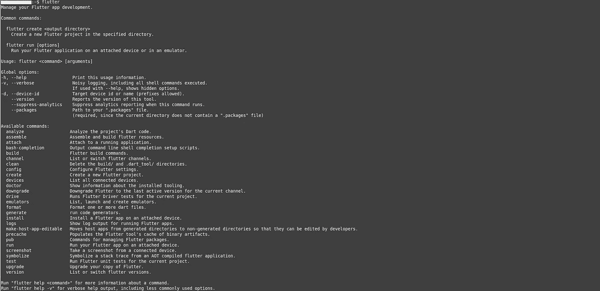

*   一旦我们确定安装了 Flutter，我们就可以执行`pub global activate fvm`命令:

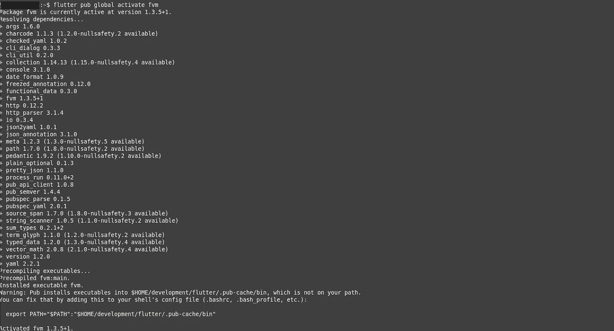

*   安装过程结束时会出现一条警告消息。所以下一步是将`fvm path`添加到我们 shell 的配置文件(`.bashrc`、`bash_profile`等)。).为了使`fvm`命令工作，有必要在文件中定义以下三行:

```
export PATH=”$PATH:`pwd`/flutter/bin”
export PATH=”$PATH:`pwd`/bin/cache/dart-sdk/bin”
export PATH=”$PATH:`pwd`/.pub-cache/bin”
```

*   执行`echo $PATH`确认您已经成功添加了一条到 FVM 的路径。
*   如果是这种情况，您可以执行`fvm`命令并查看该 CLI 提供的所有可用选项:

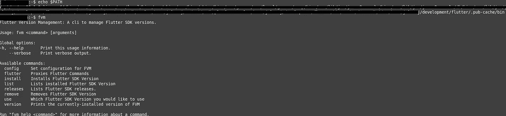

# 2.用 FVM 安装 Flutter SDK 版本

FVM 让您能够轻松安装许多颤振释放或渠道。

*   要安装稳定的 Flutter SDK 版本，执行`fvm install stable`。安装过程可能需要一段时间。

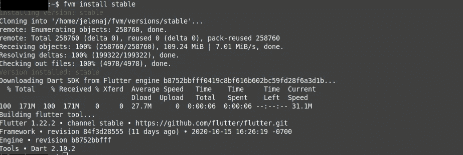

*   如果您想查看所有可以下载的 Flutter 版本，只需执行`fvm releases`:

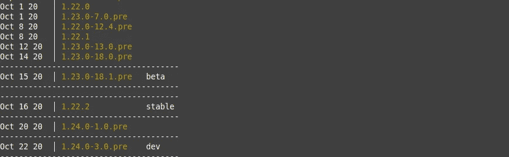

*   要安装具体版本(如 1.22.0)，只需执行`fvm install <version you want>`:

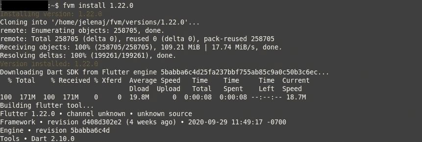

*   要列出所有已安装的 SDK 版本，请执行`fvm list`:

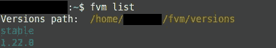

# 3.在您的项目中使用 FVM

目标是通过使用 FVM 将特定的 Flutter 版本应用到您的项目中。

*   通过执行`flutter create project_name`，在您的开发文件夹中创建一个 Flutter 项目:

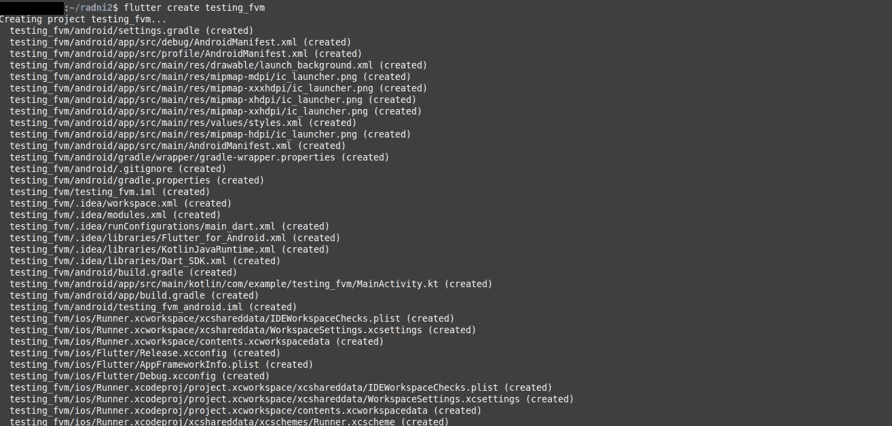

*   切换到您的项目目录，执行`fvm use [version.you.want]`:

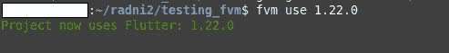

*   如果您再次运行`fvm list` ，您可以在项目中使用的版本旁边看到一个勾号:

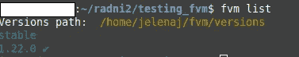

# 4.设置您的 IDE 以了解您正在使用的 SDK 版本

最后一步是配置您的 IDE。在我的例子中，我将向你展示如何在Android Studio 中完成设置过程。

*   在 Android Studio 中打开创建的项目。
*   在 IDE 中打开一个终端，导航到****`flutter_sdk`文件夹，使用`pwd`命令获取 SDK 的完整路径。复制路径:****

********

*   ****打开设置并搜索颤振。将出现下一个窗口。将路径粘贴到下面照片中标记的框架部分:****

****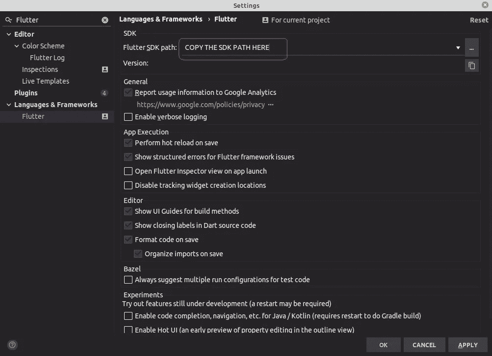****

*   ****单击“应用”并重新启动 IDE。瞧，你完了！****

****如果你想知道如何配置 VSC IDE，请参阅官方文档。****

# ****结论****

****如果你是涵盖各种 Flutter 主题的简短有趣文章的粉丝，并且你想养成在接下来的 21 周和我一起学习 Flutter 的习惯，你可以每周二阅读我的文章。****

****如果你对这篇文章有任何问题或意见，欢迎在下面回复。****

****对于那些想加入我们的颤振之旅的人，可以在下面找到前几周的链接:****

*   ****[第一周](https://medium.com/the-innovation/discover-flutter-roadmap-for-learning-flutter-why-textalign-property-does-not-work-aa055a469025) —学习颤振的路线图****
*   ****[第 2 周](https://medium.com/@jelenajjovanoski/discover-flutter-how-to-create-sliders-how-to-create-cool-text-designs-8adb0e1feea3) —如何创建简介滑块****
*   ****[第三周](https://medium.com/@jelenajjovanoski/discover-flutter-how-to-easily-generate-routes-how-to-flatten-deeply-nested-widget-trees-9c66dae99a73) —如何轻松生成路线****
*   ****[第 4 周](https://medium.com/datadriveninvestor/discover-flutter-great-packages-for-pdf-viewing-tagging-flush-bar-26066e3c0d3b)——某些颤振包的建议****
*   ****[第 5 周](https://medium.com/@jelenajjovanoski/discover-flutter-bottom-navigation-bar-generate-hex-color-code-easily-d6d949dd860b) —底部导航栏****
*   ****第六周——每个动画的神圣三位一体****
*   ****[第 7 周](https://medium.com/@jelenajjovanoski/discover-flutter-new-material-buttons-in-flutter-version-1-22-39b8f1887d8)—Flutter 版本 1.22 中的新材料按钮****
*   ****[第 8 周](https://medium.com/@jelenajjovanoski/discover-flutter-october-recommendation-for-flutter-packages-9d1b07f3490f)—10 月与颤振包相关的五大发现****

****下周见。不要打破记录！****