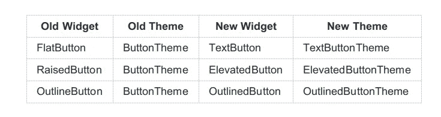
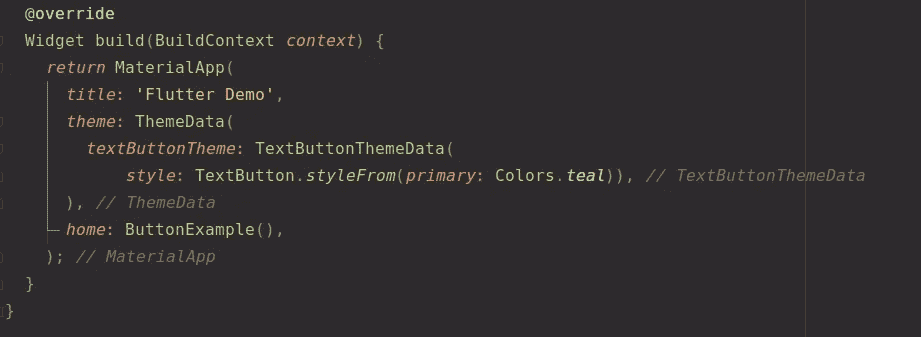
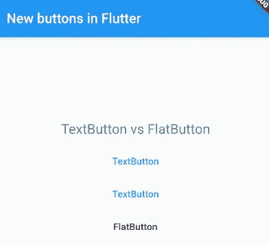
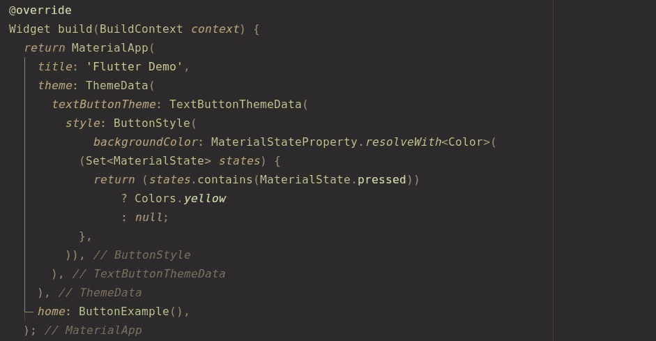
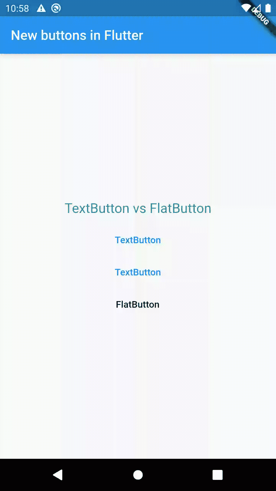
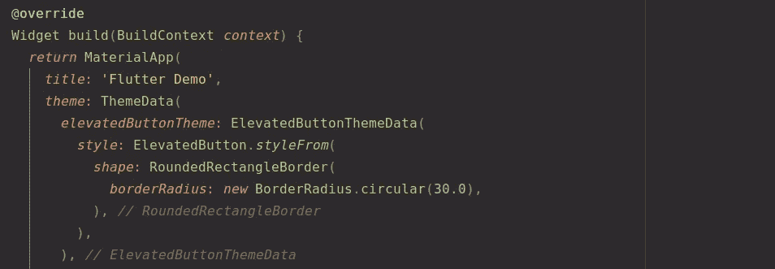
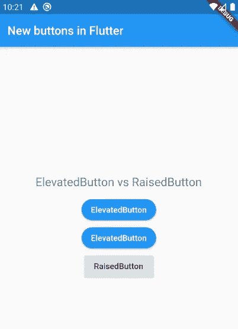
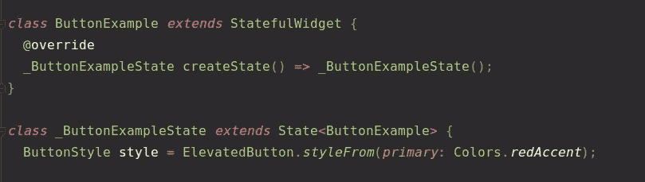
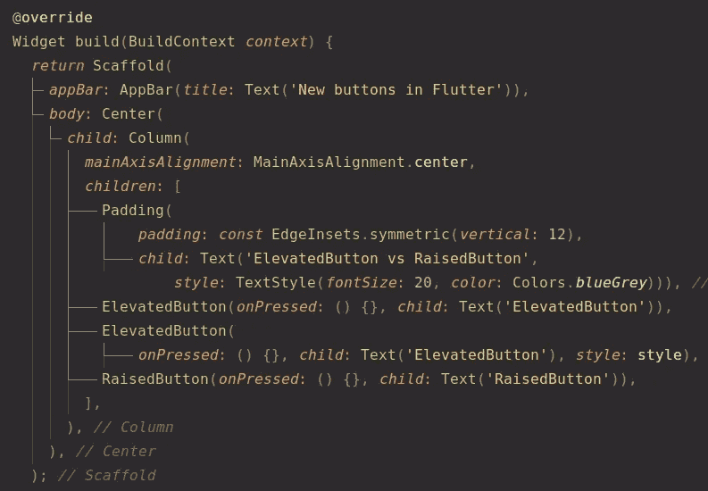
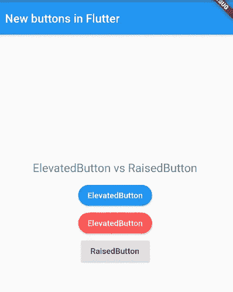

# Flutter 版本 1.22 中的新材质按钮

> 原文：<https://betterprogramming.pub/discover-flutter-new-material-buttons-in-flutter-version-1-22-39b8f1887d8>

## 发现颤动—第 7 周

## 你的 Flutter 应用程序中更好的按钮

Andreas Chu 在 [Unsplash](https://unsplash.com?utm_source=medium&utm_medium=referral) 上拍摄的照片。

随着新版 Flutter (1.22)的公布，新的按钮已经到来。虽然旧的仍然没有被弃用，但是新的好处肯定会导致人们去替换它们。

在开发应用程序时，将所有按钮调整为相同的外观可能很耗时。这基本上涉及到定制按钮和使用它们。

但是到了 1.22 版本，就不再是这样了。现在，您可以轻松地设置主题，该主题将全局应用于所选类型的所有按钮。

下面，您可以看到一个表格，显示哪些按钮及其主题替换了现有的按钮和主题:

通过一个简单的例子，我们将看到如何轻松地为某种类型的按钮设置主题。

# 1.使用 TextButton 代替 FlatButton

由于应用于整个应用程序的主题是在`MaterialApp`小部件的`theme`属性中设置的，所以按钮主题也是如此。

通常，我们将`ThemeData`传递给`theme`属性。在 1.22 版本中，`ThemeData`现在有了新的属性，其中之一就是与前述按钮`textButtonTheme`相关的`theme`属性。

它接受在主`style`属性中完成整个设置的`TextButtonThemeData`。通过这个例子，我们将根据按钮本身的状态来完成主要颜色和颜色的设置。

## 使用主题覆盖主要颜色属性—文本颜色

为相应的主题(`TextButtonThemeData`)创建一个新的`ButtonStyle`，并将按钮样式传递给它的`style`属性:

这样，我们将有效地全局覆盖`TextButton`的文本颜色:

`ButtonStyle`类包含了所有的公共属性。它是大多数按钮共有属性的简单容器。

## 根据按钮的状态使用主题来覆盖按钮的外观

假设只想改变具体状态的背景颜色。要仅在按钮被按下时覆盖按钮的背景颜色，在`MaterialStateProperty`的帮助下创建一个`ButtonStyle`，它将映射所选按钮状态的背景颜色:

所选规则将全局应用于所有`TextButtons`:

# 2.使用 ElevatedButton 而不是 RaisedButton

`TextButton`提供的功能也适用于`ElevatedButton`，它是`Raised`按钮的替代品(仅在适用于该按钮类型的属性中)。

## 使用主题全局更改形状

类似地，我们需要为相应的主题`ElevatedButtonThemeData`创建一个新的`ButtonStyle`:

通过以这种方式创建按钮的形状，这种类型的按钮的外观将被整体改变:

## **使用**按钮样式改变单个按钮的外观

除了全局改变按钮样式，你也可以单独改变，因为`TextButton`和`ElevatedButton`都有`style`属性。

为选择的按钮类型创建`ButtonStyle`属性(在我们的例子中，为`ElevatedButton`):

将创建的样式转发到要应用该样式的按钮:

现在我们可以看到个性化定制的结果:

这些按钮更加灵活，也更容易通过构造函数参数或主题进行配置。

# 结论

如果你是涵盖各种颤振主题的简短有趣文章的粉丝，并且你想养成在接下来的 23 周内和我一起学习颤振的习惯，你可以每周二阅读我的文章。

如果你对这篇文章有任何问题或意见，欢迎在下面回复。

对于那些想加入我们的颤振之旅的人，可以在下面找到前几周的链接:

*   [第一周](https://medium.com/the-innovation/discover-flutter-roadmap-for-learning-flutter-why-textalign-property-does-not-work-aa055a469025) —学习颤振的路线图
*   [第 2 周](https://medium.com/@jelenajjovanoski/discover-flutter-how-to-create-sliders-how-to-create-cool-text-designs-8adb0e1feea3) —如何创建简介滑块
*   [第三周](https://medium.com/@jelenajjovanoski/discover-flutter-how-to-easily-generate-routes-how-to-flatten-deeply-nested-widget-trees-9c66dae99a73) —如何轻松生成路线
*   [第 4 周](https://medium.com/datadriveninvestor/discover-flutter-great-packages-for-pdf-viewing-tagging-flush-bar-26066e3c0d3b) —某些颤振包的建议
*   [第 5 周](https://medium.com/@jelenajjovanoski/discover-flutter-bottom-navigation-bar-generate-hex-color-code-easily-d6d949dd860b) —底部导航栏
*   [第六周](https://medium.com/@jelenajjovanoski/discover-flutter-the-holy-trinity-of-every-animation-circular-reveal-animation-example-ea1b89904a5d)——每个动画的神圣三位一体

下周见。不要打破记录！