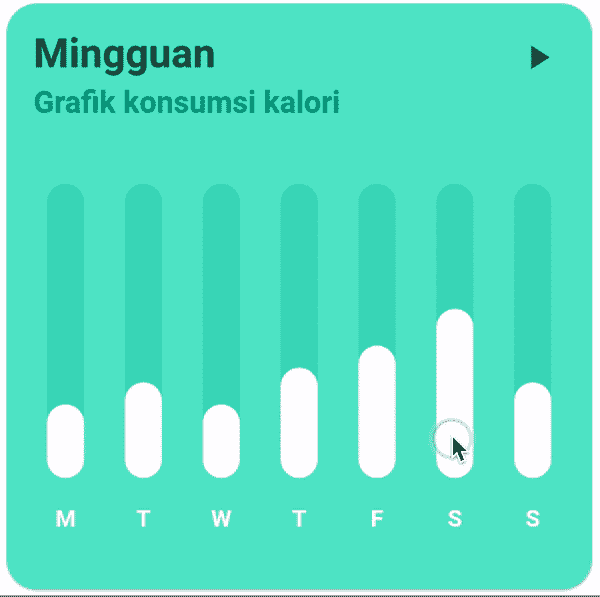
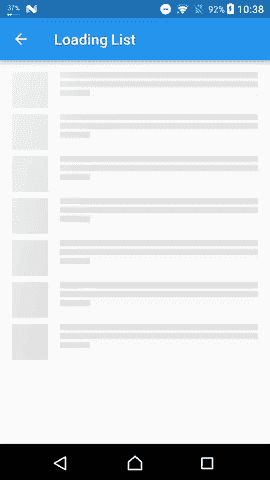
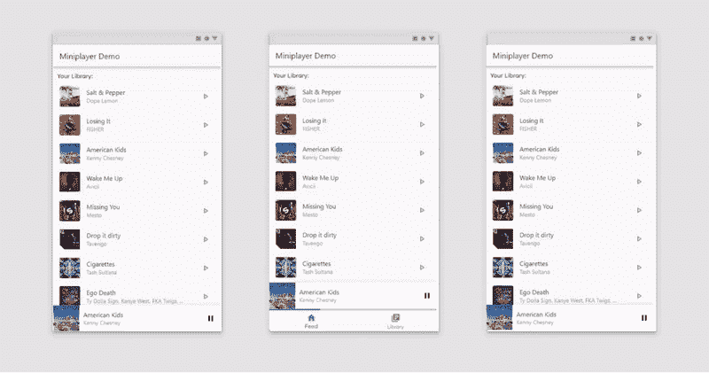

# 我 11 月份对颤振包的建议

> 原文：<https://betterprogramming.pub/discover-flutter-november-recommendation-for-flutter-packages-4b7cb2470323>

## 发现颤动——第 10 周

## 我在 2020 年 11 月发现的最好的包

由[费利克斯·林](https://unsplash.com/@feliixlam?utm_source=medium&utm_medium=referral)在 [Unsplash](https://unsplash.com?utm_source=medium&utm_medium=referral) 拍摄的照片。

是时候给我 11 月份的颤振包推荐了。以下是我与这个话题相关的五大发现。

# 1.图表胜过千言万语

在我决定彻底改变职业方向之前，我是“四大”公司之一的审计师。作为一个曾经的审计师，图表是一个非常重要的东西。就像一张图片胜过千言万语一样，图表也是如此。如果你的应用有这个功能，终端用户会很高兴的。

没有更好的库支持饼状图、条形图、折线图等。比*fi_chart* 。如果您的应用程序需要数据密集型特性，如绘制图形、过滤和分析，那么定制图形的外观也非常容易。

来源:[https://pub.dev/packages/fl_chart](https://pub.dev/packages/fl_chart)

 [## fl_chart |颤振包

### ikhoshabi.com 一个功能强大的颤振图表库，目前支持折线图，条形图和饼图。存储库…

公共开发](https://pub.dev/packages/fl_chart) 

# 2.从任何设备预览任何设备

如果你像我一样没有 Mac，这将是一个可靠的替代品，直到在真实设备上测试你的应用程序的时候。您可以在多种不同的设备和屏幕尺寸上轻松预览您的 Flutter 应用程序。

所以这意味着你不必为了测试你的应用程序的 UI 而下载各种各样的模拟器或仿真器。伟大的包由阿洛伊斯丹尼尔！

 [## 设备 _ 预览|颤振包

### 近似您的应用在另一台设备上的外观和性能。从任何设备预览任何设备更改设备…

公共开发](https://pub.dev/packages/device_preview) 

# 3.你的应用需要文本链接，有一个快速的解决方案

如果你需要将文本 URL 和电子邮件转换成文本中可点击的内联链接，有一个软件包可以实现。如果您正在使用这个包，强烈建议您也添加一个对`[url_launcher](https://pub.dartlang.org/packages/url_launcher)`的依赖，以便在浏览器/操作系统中打开链接。

来源:[https://pub.dev/packages/flutter_linkify](https://pub.dev/packages/flutter_linkify)

 [## flutter_linkify | Flutter 包

### 将文本 URL 和电子邮件转换为文本中可点击的内嵌链接。Pub - API Docs - GitHub 通过添加…

公共开发](https://pub.dev/packages/flutter_linkify) 

# 4.微光是新的黑色

我的创意灵魂总是受到启发，去寻找有助于更好的应用程序设计的包，所以这里有一个包，它提供了一种简单的方法来为你的应用程序添加微光效果。

我认为使用这个包的一个非常方便的时间是用户等待数据加载的时候:

来源:https://pub.dev/packages/shimmer

 [## 微光|颤动套装

### 一个包提供了一个简单的方法来添加微光效果在颤振项目导入'包:微光/微光。飞镖'…

公共开发](https://pub.dev/packages/shimmer) 

# 5.开发媒体应用程序？看看这个玩家！

作为所有音乐收听应用程序的最大用户之一，我忍不住研究与播放器相关的软件包。迷你播放器通常用于媒体应用。这个迷你播放器可以放大和缩小，缩小后它会一直显示在屏幕上，直到用户将其关闭。

从视觉上看，它做得非常好，与 Deezer、YouTube Music、Spotify 等现有的现代播放器相匹配。

来源:https://pub.dev/packages/miniplayer

 [## 迷你播放器| Flutter 套装

### 一个轻量级的 flutter 包，通过提供一个生成器函数来简化迷你播放器的创建

公共开发](https://pub.dev/packages/miniplayer) 

# 结论

如果你是涵盖各种颤振主题的简短有趣文章的粉丝，并且你想养成在接下来的 20 周内和我一起学习颤振的习惯，你可以每周二阅读我的文章。

如果你对这篇文章有任何问题或评论，请在评论区告诉我。

对于那些想加入我们的颤振之旅的人，可以在下面找到前几周的链接:

*   [第一周](https://medium.com/the-innovation/discover-flutter-roadmap-for-learning-flutter-why-textalign-property-does-not-work-aa055a469025) —学习颤振的路线图
*   [第 2 周](https://medium.com/@jelenajjovanoski/discover-flutter-how-to-create-sliders-how-to-create-cool-text-designs-8adb0e1feea3) —如何创建简介滑块
*   [第 3 周](https://medium.com/@jelenajjovanoski/discover-flutter-how-to-easily-generate-routes-how-to-flatten-deeply-nested-widget-trees-9c66dae99a73) —如何轻松生成路线
*   [第 4 周](https://medium.com/datadriveninvestor/discover-flutter-great-packages-for-pdf-viewing-tagging-flush-bar-26066e3c0d3b) —某些颤振包的建议
*   [第 5 周](https://medium.com/@jelenajjovanoski/discover-flutter-bottom-navigation-bar-generate-hex-color-code-easily-d6d949dd860b) —底部导航栏
*   第六周——每个动画的神圣三位一体
*   [第 7 周](https://medium.com/@jelenajjovanoski/discover-flutter-new-material-buttons-in-flutter-version-1-22-39b8f1887d8)—Flutter 版本 1.22 中的新材料按钮
*   [第 8 周](https://medium.com/@jelenajjovanoski/discover-flutter-october-recommendation-for-flutter-packages-9d1b07f3490f)—10 月份与扁平包装相关的 5 大发现
*   [第 9 周](https://levelup.gitconnected.com/discover-flutter-flutter-version-manager-fvm-411dc2bff4b4) — Flutter 版本经理— FVM

下周见。不要打破记录！