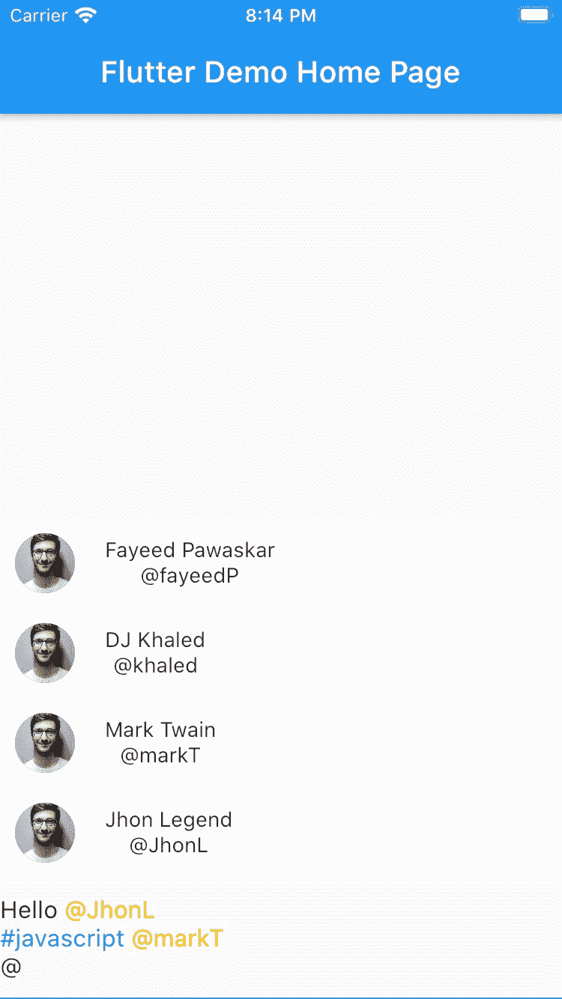
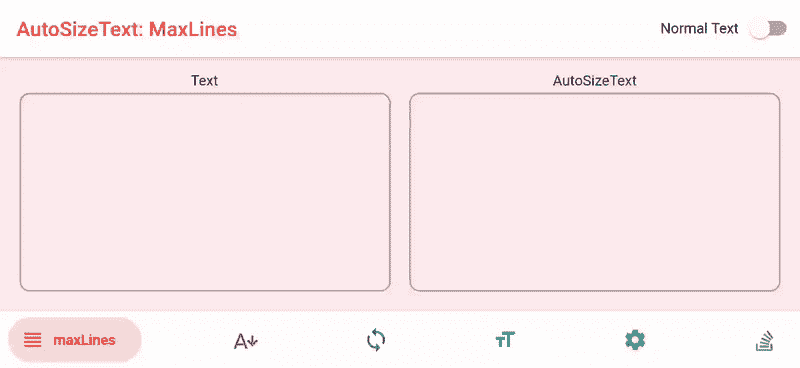

# 我 10 月份对颤振包的建议

> 原文：<https://betterprogramming.pub/discover-flutter-october-recommendation-for-flutter-packages-9d1b07f3490f>

## 发现颤动——第 8 周

## 我在 2020 年 10 月发现的最好的包

杰瑞米·阿劳什在 [Unsplash](https://unsplash.com/?utm_source=unsplash&utm_medium=referral&utm_content=creditCopyText) 拍摄的照片。

我决定每月写一篇文章，来分享我感兴趣的软件包。

定期研究这些软件包是非常必要的，因为它可以缩短开发应用程序所需的时间。然后，您可以将这些时间用于更重要的事情，例如如何提高应用程序的性能，或者选择在应用程序中提供哪些新功能。

所以下面是我十月份与 Flutter 包相关的五大发现。

# 1.漂亮和快速的替代标准的制作启动画面的方法

闪屏是每个应用程序不可或缺的一部分。此屏幕代表启动屏幕或加载移动应用程序时显示的屏幕。

除了在 Flutter 的[文档](https://flutter.dev/docs/development/ui/advanced/splash-screen)中描述的实现这种效果的方法之外，还有一个软件包可以让你更加轻松。

[https://pub.dev/packages/animated_splash](https://pub.dev/packages/animated_splash)

 [## 动画 _ 飞溅|颤动包

### 获取库环境:SDK:" > = 2 . 1 . 0<3.0.0" Add dependency in pubspec.yaml dependencies: animated_splash: ^1.0.0…

pub.dev](https://pub.dev/packages/animated_splash) 

# 2\. If Your App Needs @quoting, There Is a Package for That

【 is a feature that is often present in modern applications. Medium itself uses it. If your application involves any interaction between users, this is a must-have.

[https://pub.dev/packages/flutter_mentions](https://pub.dev/packages/flutter_mentions)

我一直在研究是否已经有一个包可以实现这一点，这就是:

 [## Flutter _ references | Flutter 包

### 一个简单的 flutter input 窗口小部件，为你的应用程序添加@ mentions 功能。

公共开发](https://pub.dev/packages/flutter_mentions) 

# 3.如果您不想担心文本是否会完全适合它的边界，有一个包解决方案

在某些情况下，TextOverflow 会让我们头疼——尤其是如果你在如何解决这个问题上不是很有经验的话。消除这些担忧的一个很好的选择是使用下面的包。

[https://pub.dev/packages/auto_size_text](https://pub.dev/packages/auto_size_text)

它是高度定制的，因此可以很容易地适应任何您需要的“文本匹配”情况。

 [## auto_size_text |颤振包

### Flutter 小部件，自动调整文本大小，以完全符合其边界。展示一些❤️，并开始回购…

公共开发](https://pub.dev/packages/auto_size_text) 

# 4.你很快就需要假数据——Faker 来了！

如果你像我一样，总是先专注于制作一个屏幕，然后处理获取真实数据，你会爱上这个生成虚假数据的包。

 [## 伪造者|飞镖包装

### Dart 的一个库，它生成假数据。faker 的灵感主要来自 Python 包 faker，而 Ruby……

公共开发](https://pub.dev/packages/faker) 

# 5.日志记录总是很流行，有一个软件包将日志记录提升到了一个新的水平

我觉得好的日志对于刚开始编程的人和有丰富经验的人来说，重要性是一样的。

当然，关于日志最重要的是日志中写了什么，但是这些日志是否容易被注意到也很重要。

如果你想打印漂亮的日志，试试这个包。

 [## 记录器| Dart 包

### 小，易于使用和可扩展的记录打印美丽的日志。受 Android logger 的启发。展示一些❤️和…

公共开发](https://pub.dev/packages/logger) 

# 结论

如果你是涵盖各种颤振主题的简短有趣文章的粉丝，并且你想养成在接下来的 22 周内和我一起学习颤振的习惯，你可以每周二阅读我的文章。

如果你对这篇文章有任何问题或意见，欢迎在下面回复。

对于那些想加入我们的颤振之旅的人，可以在下面找到前几周的链接:

*   [第一周](https://medium.com/the-innovation/discover-flutter-roadmap-for-learning-flutter-why-textalign-property-does-not-work-aa055a469025) —学习颤振的路线图
*   [第 2 周](https://medium.com/@jelenajjovanoski/discover-flutter-how-to-create-sliders-how-to-create-cool-text-designs-8adb0e1feea3) —如何创建简介滑块
*   [第三周](https://medium.com/@jelenajjovanoski/discover-flutter-how-to-easily-generate-routes-how-to-flatten-deeply-nested-widget-trees-9c66dae99a73) —如何轻松生成路线
*   [第 4 周](https://medium.com/datadriveninvestor/discover-flutter-great-packages-for-pdf-viewing-tagging-flush-bar-26066e3c0d3b) —某些颤振包的建议
*   [第 5 周](https://medium.com/@jelenajjovanoski/discover-flutter-bottom-navigation-bar-generate-hex-color-code-easily-d6d949dd860b) —底部导航栏
*   [第六周](https://medium.com/@jelenajjovanoski/discover-flutter-the-holy-trinity-of-every-animation-circular-reveal-animation-example-ea1b89904a5d)——每个动画的神圣三位一体
*   [第 7 周](https://medium.com/@jelenajjovanoski/discover-flutter-new-material-buttons-in-flutter-version-1-22-39b8f1887d8)—Flutter 版本 1.22 中的新材料按钮

下周见。不要打破记录！