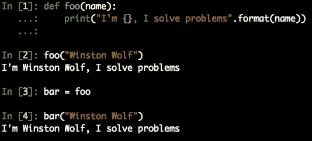
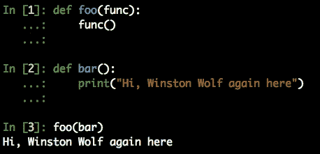

# Python 中的调度表

> 原文：<https://betterprogramming.pub/dispatch-tables-in-python-d37bcc443b0b>

## 如何使用快速字典查找来动态运行函数，而不是使用缓慢、冗长、乏味的 if-elif 语句

照片由[克里斯里德](https://unsplash.com/@cdr6934?utm_source=medium&utm_medium=referral)在 [Unsplash](https://unsplash.com?utm_source=medium&utm_medium=referral) 拍摄

你曾经需要根据一个变量的值运行不同的函数吗？想到的第一种方法可能是一长串类似于 C 风格开关案例的`if-elif`语句。

嗯，有一个更好的选择:一个调度表**。**

Python 中的调度表基本上是一个函数字典。这个概念不是 Python 特有的。事实上，这在计算机科学中很常见:

"调度表是指向函数或方法的指针表."(同前。: [*维基百科*](https://en.wikipedia.org/wiki/Dispatch_table) *)*

调度表是 OOP 中实现[后期绑定](https://en.wikipedia.org/wiki/Late_binding)最常见的方法之一。后期绑定是指通过名字查找你希望在运行时被调用的函数，而不是硬编码。

让我们看看使用调度表意味着什么，您应该如何以及为什么利用它们，以及一个示例可能是什么样子。

# if-elif 方法

让我们假设您有一个`Date`对象，您需要根据它的工作日执行一个特定的函数。这是你利用一组`if-elif`陈述的一种方式:

为了简单起见，让我们假设 do_*函数已经在其他地方正确定义了。

相当标准，普通，无聊，Python 代码。那有什么问题呢？

首先也是最重要的，这段代码是**丑陋和不优雅的**。更糟糕的是，写出来容易出错。除非你使用的是一个多插件的现代编辑器，否则你可能会复制粘贴第一个 if 语句，这很有可能会引入一个 bug。

还有，这个代码**不健壮**。各种情况的处理程序之间没有分离，整个逻辑被绑定到一大段代码中。

最后但同样重要的是，这段代码效率低下。一串`*if*`是一个 O(n)。不是世界上最糟糕的，但我们可以做得更好。

怎么会？嗯，通过使用字典和知道函数是 Python 中的一等公民

# 作为一等公民的职能

任何参与 Python 开发的人都听过这样的口头禅"*一切都是对象。*

这也适用于函数和方法，它们也是对象。一般来说，**函数是 Python** 中的一等公民。那是什么意思？该定义适用于支持其他实体通常可用的所有操作的编程语言的实体，例如:

*   它们可以存储在变量中。
*   它们可以作为参数传递给函数。
*   它们可以从函数和方法中返回。

正如你所想象的，这为程序设计打开了一扇巨大的可能性之门。让我们来看看这个例子，在这个例子中，我们摆弄函数，把它们当作普通变量来传递:

这里的关键点是第三行，我们将函数`foo`赋给变量`bar`，从这一点开始我们可以使用`bar()`作为`foo()`的别名。事实上，`foo()`和`foo`有着巨大的区别。前者是要求 Python 执行函数的函数调用。后者是内存中代表函数本身的对象。因此，我们甚至可以将一个函数作为另一个函数的参数来传递:

很酷，不是吗？我们将一个函数传递给另一个函数，并在被调用函数的范围内调用和执行它。顺便说一下，多亏了这个特性，装饰者的整个概念才成为可能。如果你想进一步了解这个话题，我推荐你阅读丹·巴德的这篇[优秀文章。](https://dbader.org/blog/python-first-class-functions)

# Python 中的调度表

那么，我们如何利用这一切来构建 Python 中的调度表呢？嗯，字典在这里派上用场了。让我们看看如何使用调度表编写与使用`if-elif`方法编写的算法完全相同的算法:

就像以前一样，我们假设 do_*函数已经在其他地方定义过了。

看出窍门了吗？我们将每个函数分配给一个我们认为方便的键，在本例中是对`Date`对象的`weekday()`方法的结果。然后，我们使用调度字典来检索与该函数相关联的对象。最后，我们要求 Python 通过添加`()`来执行这个函数。

由于一系列重要的原因，这种方法更可取。

**代码更少更干净**，可读性更好，而且不需要添加一长串`if-elif`语句。

代码是**的方式更加健壮**。各种类型的处理程序是适当分开的。整个调度机制不需要知道关于处理程序的任何具体信息。

作为前一点的直接结果，**分派机制独立于使用它的代码**。虽然对于我们的具体例子来说可能不是这样，但是如果您需要启用更多的功能或者禁用现有的功能，您只需要对调度字典做一点小小的修改，而不需要改变逻辑本身。这种松散耦合通常是软件工程中理想的设计模式。

像上面的樱桃一样，你正在**将一个 O(n)算法转换成 O(1)** 。Python 中的字典是散列表，所以查找过程需要一个恒定的时间，而`if-elif`复合需要对整个语句集进行线性扫描。