# 显示:Flex 及其背后的数学

> 原文：<https://betterprogramming.pub/display-flex-understanding-flex-grow-and-shrink-mathematics-behind-them-ddedf45fb434>

## 更深入地了解 Flexbox

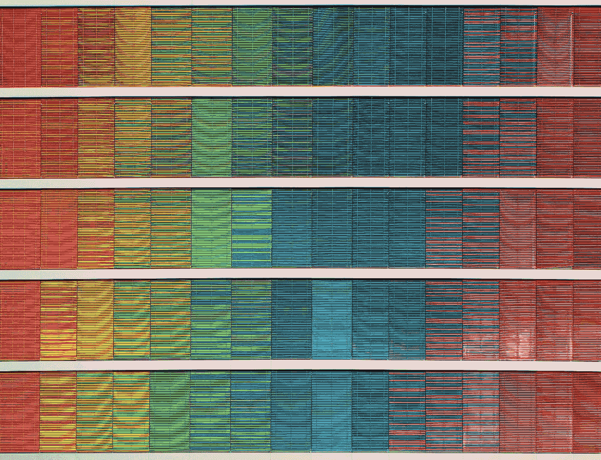

里卡多·戈麦斯·安吉尔在 [Unsplash](https://unsplash.com/s/photos/colors?utm_source=unsplash&utm_medium=referral&utm_content=creditCopyText) 上拍摄的照片

自从`display: flex`到来，使用 CSS 编码布局已经变得轻而易举。理解`flex-grow`和`flex-shrink`如何工作一直是一件棘手的事情。它们背后的底层数学是什么？这是我简化它们的尝试。

# 第一部分。介绍

我们将从一个基本页面开始，一个父 div，包含三个 div 元素:一个、两个和三个。一、二、三的高度为 100px，宽度为 50px。看下图(代码随后)。

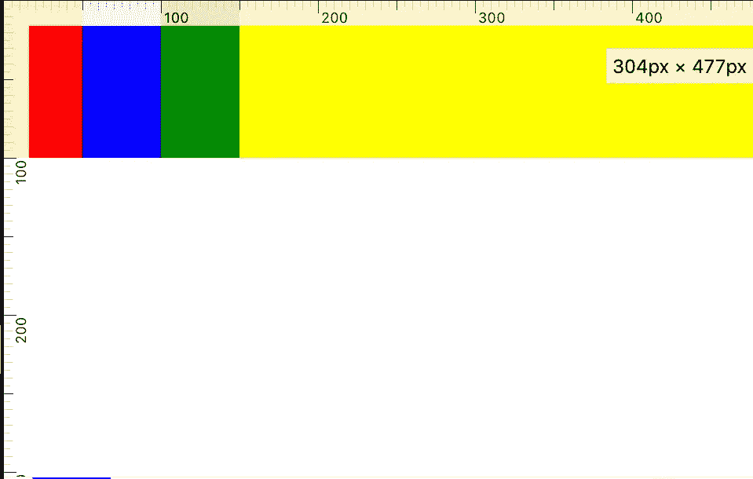

图像被放大。标尺使用 Firefox 标尺显示

正如我们所看到的，我们有一个父 div 和三个子 div，颜色分别是红色、蓝色和绿色。父 div 的颜色为黄色。

对于上面的布局代码，父级的宽度默认为 100%。

上述文件将构成我们文章的基础。我只会显示布局和相应的 CSS。代码的其余部分将保持不变。

# 第二部分。灵活增长

让我们给每个子 div 一个属性`flex-grow` 1。

布局如下所示。正如预期的那样，所有三个 div 都增长相等，在它们之间划分了父 div 中留下的空间。

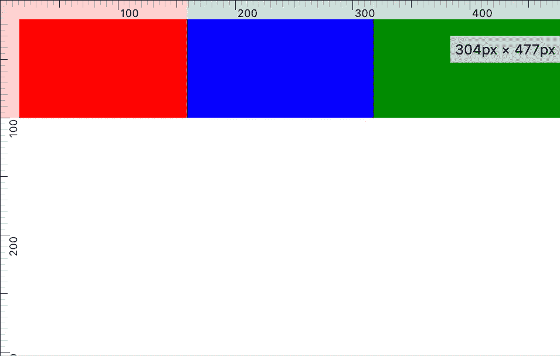

所有三个子 div 大小相等。他们增加宽度以占据剩余的空间。

在下一个例子中，让我们分别给红色、蓝色和绿色赋值 1、2 和 3。

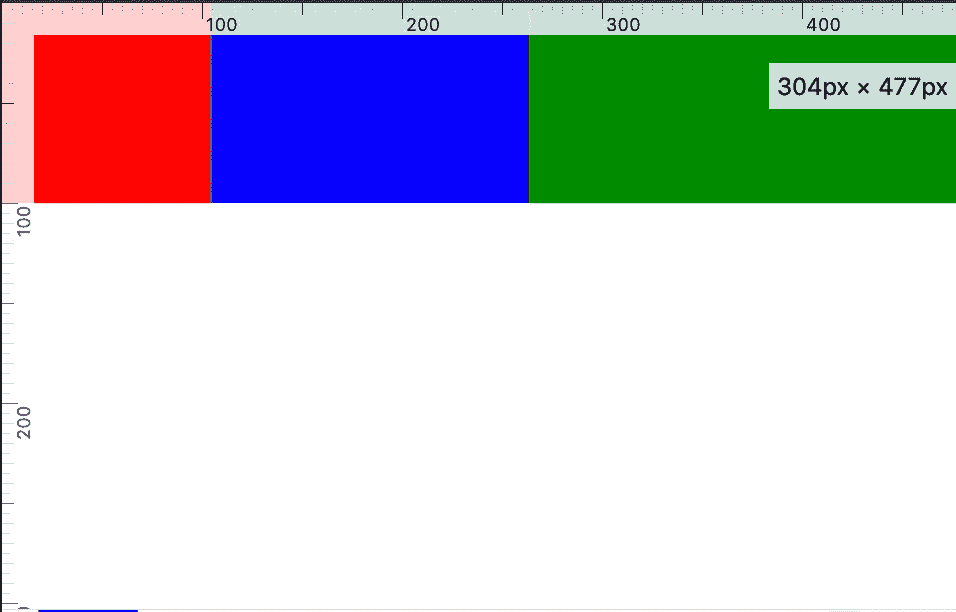

如我们所见，三者的增长幅度不同。它们的尺寸是:

*   红色:104.5(增长了 54.5)
*   蓝色:159(增长了 109)
*   绿色:213.5(增长了 163.5)
*   父大小:477(使用`flex-grow`占用的空闲空间为 227)

我们可以看到，子 div 可用的空间是根据`flex-grow`值按比例划分的。

*   红色:277 * (1/6) = 54.5
*   蓝色:277 * (2/6) = 109
*   绿色:277 * (3/6) = 163.5

注意:根据您的屏幕大小，您的值会有所不同。默认`flex-grow`为零。

`flex-grow`的公式为:

*可用空间*(子节点的* `*flex-grow*` *值/所有* `*flex-grow*` *值之和)*

# 第三部分。弯曲收缩

我们来做一个有趣的事情，把母体的宽度值做成 100px。这将使父值比其子值的总值少 50px。

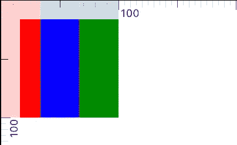

我们可以看到，三个孩子的体型都缩小了。它们现在都是 33.33 码。`flex-shrink`的默认值为 1。由于没有可用的空间，他们缩小到在太空中释放 50px。

让我们为孩子分别设置`flex-shrink`值为 1、2 和 3。

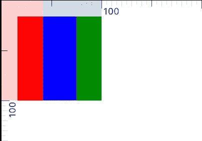

三个缩小了，现在大小不同了。

正如我们所看到的，三个都缩小了，现在大小不同。红色的`flex-shrink`值最小(缩水最少)，绿色的`flex-shrink`值最高(缩水最多)。

让我们看看他们的尺寸。

*   红色:41.6667(缩水 8.3333)
*   蓝色:33.3333(缩水 16.6667)
*   绿色:25(缩小了 25)
*   家长大小:100px(孩子必须释放 50px 的空间)

正如我们所看到的，孩子们释放的空间与他们的`flex-shrink`值成正比:红色最小，所以它缩小得最少，绿色最大，缩小得最多。

*   红色:50 * (1/6) = 8.3333
*   蓝色:50 * (2/6) = 16.6667
*   绿色:50 * (3/6) = 25

尺寸缩减的公式为:

*要释放的空间*(子代的* `*flex-shrink*` *值/所有* `*flex-shrink*` *值的总和)*

有趣的是如果三个孩子的大小都不一样。让我们把它们分别定为 40、50 和 60。

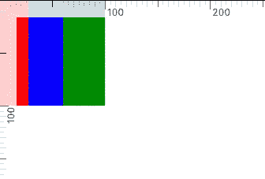

在这张图片中很难观察到，但我们可以看到绿色的孩子缩小了不到 25px，就像早先的情况一样。让我们看看他们的尺寸。

*   红色:26.6667(缩水 13.3333)
*   蓝色:33.3333(缩水 16.6667)
*   绿色:40(缩水 20)

正如我们所看到的，所有三个都有相同的`flex-shrink`值，但是都缩小了不同的值。很容易观察到它们的体积缩小了。红色缩水最少，因为它最小，绿色缩水最多，因为它最大。

*   红色:50 * (40/150) = 13.3333
*   蓝色:50 * (50/150) = 16.6667
*   绿色:50 * (60/150) = 20

现在让我们将它们的`flex-shrink`值改为 3、2 和 1，只是为了让事情变得更有趣一点，并将它们收敛到最终的公式。


尺寸为 40、50 和 60，伸缩值分别为 3、2、1。

让我们看看他们的尺寸。

*   红色:18.5667(缩水 21.4333)
*   蓝色:32.15(缩水 17.85)
*   绿色:49.2833(缩水 10.7167)

这三者都按照它们的大小和价值的比例缩小了。这次的公式有点不同。它们与`flex-shrink`值及其大小的倍数成比例缩小。

红色的倍数是 40 * 3，蓝色是 50 * 2，绿色是 60 * 1。

*   红色:50 * (120/280) = 21.43333
*   蓝色:50 * (100/280) = 17.85
*   绿色:50 * (60/280) = 10.7167

`flex-shrink`的公式为

*要缩减的总空间*【*`*flex-shrink*`*值*初始宽度/所有元素的总和(* `*flex-shrink*` *值*初始值】*

# 第四部分。更多的例子

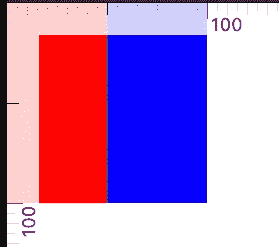

`flex-shrink`值分别为 0，0，1。红色和蓝色没有缩水，绿色也没有了(难过！)

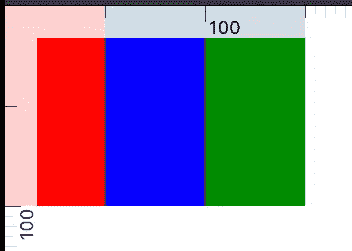

`flex-shrink`值分别为 0，0，0。没有一个缩水。

# 第五部分。柔性方向和柔性基础

在上面的例子中，所有东西都是以宽度计算的。这是因为，默认情况下，主轴是水平的，因为`flex-direction`是*行*。如果`flex-direction`是*列*，主轴变为垂直，`flex-grow`和`flex-shrink`改变元素的高度，而不是元素的宽度。

让我们看一个例子。父高度为 300px， `flex-direction`为列。红色、蓝色和绿色分别有 50px 的高度。

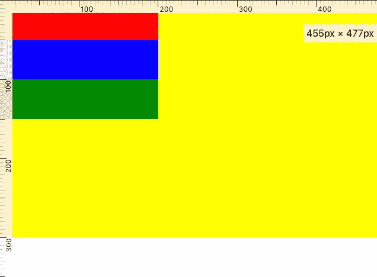

如果我给孩子添加 `flex-grow`属性，他们将在垂直方向上增长，因为`flex-direction`是列。

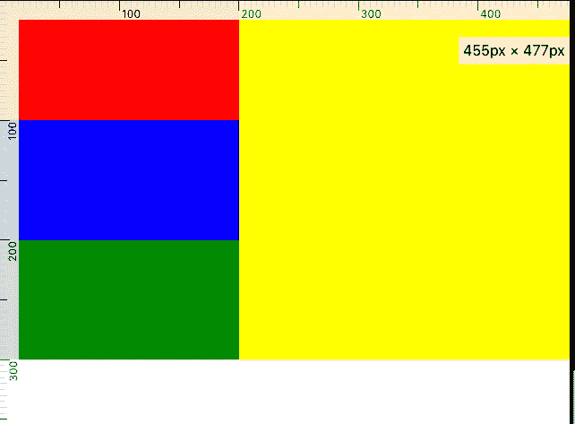

`flex-grow`是 1，1，1 `flex-direction`是列。

`Flex-basis`是宽度或高度的初始长度，取决于`flex-direction`。对于行，它是宽度。对于列，它是高度。

编写 flex 属性的简写方式是

```
flex: 1 1 100; # flex-grow flex-shrink flex-basis
```

还有四个属性可以用在子对象上。它们是`min-width`、`max-width`、`min-height`和`max-height`。子元素将在这四个元素中保持有界。

子元素被自动分配一个显示属性`flex-item`。

# **第六部分。结论**

我希望你喜欢这篇文章，并且它足够简单易懂。如果您有任何疑问，请留下您的评论。