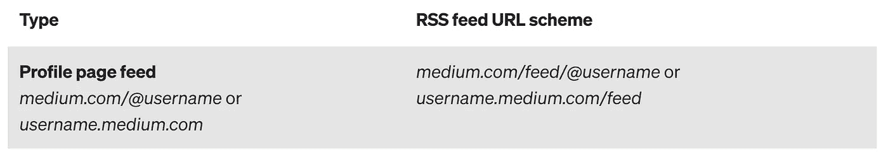
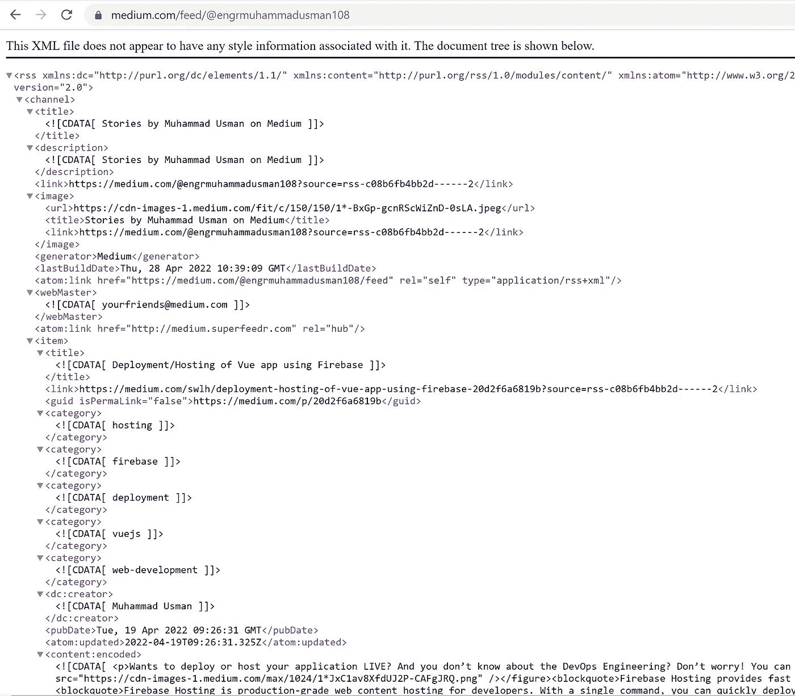
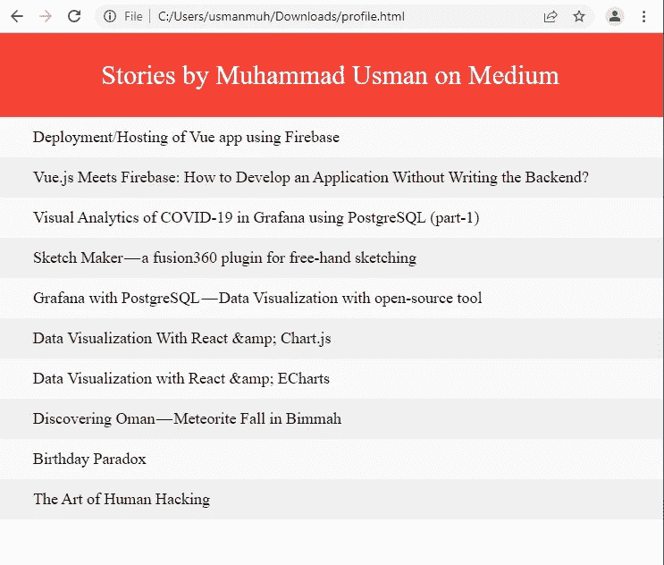

# 使用 RSS 源在您的个人网站上显示中型文章

> 原文：<https://betterprogramming.pub/display-medium-articles-on-your-personal-site-using-rss-feed-5f2d043a05d2>

## 你想在你的网站上展示你的媒体故事吗？或者你想把媒体平台和你的个人作品集网站动态整合？


照片由 [Unsplash](https://unsplash.com?utm_source=medium&utm_medium=referral) 上的[尼克·费因斯](https://unsplash.com/@jannerboy62?utm_source=medium&utm_medium=referral)拍摄

是的，Medium 支持不同的获取提要和获取您的媒体元数据的方式。

# 为什么我需要取一个中等的饲料？

Medium 是一个第三方平台，您可以在这里发布您的故事/文章。如果你想在你的网站或个人作品集上展示这些故事，你需要获取媒体故事并在你的网站上展示它们。它帮助你动态地将媒体与你的个人网站结合起来。因此，在未来，如果你发表任何新的文章，它会自动显示在您的网站上。两个平台都不需要做多余的工作。

# 我如何将媒体与我的个人投资组合相结合？

根据 [*官方文档的 Medium*](https://github.com/Medium/medium-api-docs) 和作者' [*Cndro*](https://medium.com/@cndro) '发表了他的文章' [*如何从 Medium API*](https://medium.com/@cndro/how-to-get-data-from-medium-api-ca3b3a660a81) 中获取数据。官方文档和文章都介绍了如何通过 API 获取媒体数据，这需要通过集成令牌对用户进行身份验证。另外，Stackoverflow 问题' [*如何从 API 中为用户检索媒体报道？*](https://stackoverflow.com/questions/36097527/how-to-retrieve-medium-stories-for-a-user-from-the-api)’解释了如何通过 API 获取媒体故事。

# 我们的目标

本文的目的是在没有用户认证的情况下获取媒体提要/数据，并在您的个人站点上显示它们。

# 连接没有介质 API 的介质

Medium 为[用户资料、出版物](https://help.medium.com/hc/en-us/articles/214874118-Using-RSS-feeds-of-profiles-publications-and-topics)和主题页面提供 RSS 提要。使用 RSS 订阅源 URL，您可以将自己的个人资料或媒体出版物的订阅源与自己的网站集成，以展示您的最新故事。

# 什么是 RSS？

[RSS](https://en.wikipedia.org/wiki/RSS#cite_note-powers-2003-1-2) (RDF Site Summary 或 Really Simple Syndication)是一种网络提要，允许用户和应用程序以标准化的计算机可读格式访问网站更新。订阅 RSS 源可以让用户在一个新闻聚合器中跟踪不同的网站，该聚合器不断监视网站的新内容，从而消除了用户手动检查它们的需要。网站通常使用 RSS 源来发布频繁更新的信息，如[博客](https://en.wikipedia.org/wiki/Blog)条目、新闻标题、音频和视频系列的剧集，或者用于分发播客。RSS 文档(称为“提要”、“web 提要”或“频道”)包括完整或摘要文本以及元数据，如出版日期和作者姓名。RSS 格式是使用通用 XML 文件指定的。

# 支持的 RSS 源

Medium 支持用户资料、出版物、主题等不同类型的 RSS 提要。您可以在 Medium 上的 [RSS 提要的官方文档中获得详细信息。在本文中，我只使用了个人资料页面提要。RSS 源网址:](https://help.medium.com/hc/en-us/articles/214874118-Using-RSS-feeds-of-profiles-publications-and-topics)`[https://medium.com/feed/@username](https://medium.com/feed/@username)`



进入你的媒体档案，复制你的用户名。我的用户名是`engrmuhammadusman108`。所以 RSS 提要 URL 变成了:

```
[https://medium.com/feed/@engrmuhammadusman108](https://medium.com/feed/@engrmuhammadusman108)
```

进入浏览器，输入上面的 URL，它将返回一个 XML 格式的 RSS 文档，如图 1 所示。



图 XML 格式的 RSS 文档

## 将 RSS 转换为 JSON

Rss 2 Json API 允许开发者通过提交 URL 将 RSS 提要转换成 JSON。提要中的项目可以按出版日期、标题或作者以升序或降序排序。

打开`Rss2Json.com`，放上你的 RSS 网址，点击转换按钮。它会给出 JSON 格式的输出，如图 2 所示。复制突出显示的 API 调用 URL，稍后将使用它从 JavaScript 代码调用 API 并获得 JSON 响应。


图 2: RSS 到 JSON

## 开发网页

让我们使用 CSS 和 JavaScript 开发一个简单的 HTML 页面。调用 API 并获取 JSON 数据，以将其显示在您的站点上。这里，我创建了一个虚拟应用程序。你可以在你现有的投资组合/个人网站中使用相同的东西。

我的个人资料的 API URL 如下所示。您可以用您的用户名替换我的用户名“engrmuhammadusman108 ”,并在下面的代码中输入相同的 URL。

```
API URL: [https://api.rss2json.com/v1/api.json?rss_url=https://medium.com/feed/@engrmuhammadusman108](https://api.rss2json.com/v1/api.json?rss_url=https://medium.com/feed/@engrmuhammadusman108)
```

下面的代码有注释文档。所以代码本身解释了一切。

我使用了来自 [W3Schools](https://www.w3schools.com/howto/tryit.asp?filename=tryhow_js_todo) 的示例代码，并相应地修改了代码。



我的网站上的中型故事

类似于在您的个人投资组合中显示中型文章，您还可以显示“**堆栈溢出**”个人资料数据(声誉、徽章、问题、答案等。).请查看我的文章“[在你的投资组合](https://engrmuhammadusman108.medium.com/displaying-stackoverflow-reputation-badges-on-your-portfolio-38df702d4c41)上展示 Stackoverflow 声誉&徽章”。

感谢您关注我的文章。祝您愉快！