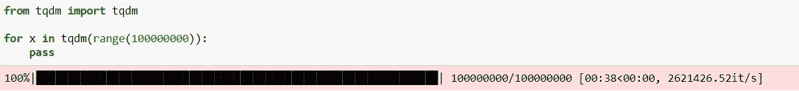
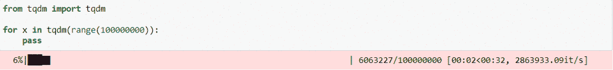
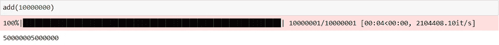
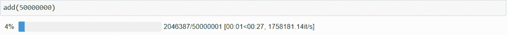
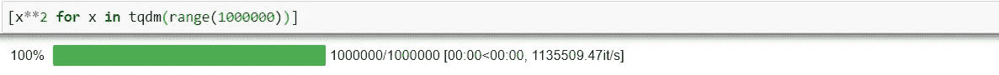
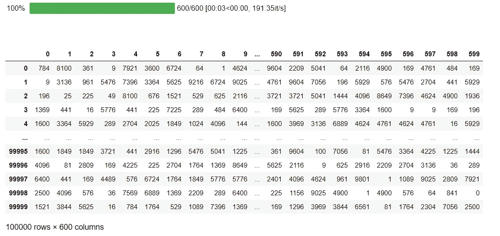

# 在 Python 中使用 tqdm 显示进度条

> 原文：<https://betterprogramming.pub/display-progress-bars-using-tqdm-in-python-c81484be9390>

## 使用流行的 Python 包添加智能进度条


保罗·卡罗洛在 [Unsplash](https://unsplash.com?utm_source=medium&utm_medium=referral) 上拍摄的照片

有没有想过你正在运行的 Python 代码还剩多少时间？事实证明，有一种简单的方法可以找到答案。怎么会？通过使用[tqdm*Python 库*](https://pypi.org/project/tqdm/)*给你的 Python 代码添加一个进度条。*

*在本教程中，我们将学习如何使用 tqdm 库在我们的代码运行时显示一个智能进度条(甚至在[熊猫](https://pandas.pydata.org/)中)。此外，我们将看到如何为 [Jupyter 笔记本](https://jupyter.org/)提供更具视觉吸引力的选项。*

# *tqdm*

*如果你熟悉阿拉伯语，那么你可能已经注意到, *tqdm* 的发音听起来像是表示进步的阿拉伯语单词，( *taqadum* ，تقدّم).因此，这绝对是一个适合这个进度条库的名字。*

*让我们看看如何使用 tqdm 来显示 Python 循环的进度条。*

# *安装 tqdm*

*首先，我们需要安装 tqdm。我们可以在命令提示符或终端中使用`pip install`,如下所示:*

```
*pip install tqdm*
```

*如果您有 Anaconda Python 发行版，那么您可能已经安装了 tqdm。如果没有，也可以使用[康达安装](https://anaconda.org/conda-forge/tqdm)。您可以使用`pip list`检查安装了哪些 Python 包。*

# *导入 tqdm*

*接下来，我们需要将 tqdm 库导入到代码中。具体来说，我们需要从 tqdm 库中导入`tqdm`函数，如下所示:*

```
*from tqdm import tqdm*
```

*我们也可以导入整个 tqdm 库，然后像这样访问`tqdm` 函数:`tqdm.tqdm(iterable)`。*

# *使用 tqdm*

*为了使用`tqdm`函数显示 Python 循环的进度条，我们只需用`tqdm(iterable)`包装任何 iterable。让我们来看一个朱庇特笔记本中的例子:*

**

*我们用`tqdm`函数包装了 iterable，在这个例子中是 range 对象。在 Jupyter 笔记本单元格下方可以看到进度条。当`for`循环运行时，它显示{elapsed time} < {remaining}时间，以及每秒的迭代次数。*

**

# *将 tqdm 与其他循环或函数一起使用*

*我们不仅可以将 tqdm 与`for`循环一起使用，还可以将它与其他迭代遍历 iterable 的函数一起使用。例如，我们可以将它与`map`、`filter`和`reduce`功能一起使用。*

*例如，如果我们编写一个函数，它接受一个数字，并返回从 0 到使用`reduce`函数传入的数字之间的所有整数的和，我们可以包含一个进度条，如下所示:*

```
*def add(num):
    return reduce(lambda x,y: x+y, **tqdm(**range(num+1))**)** if type(num) == int else 0*
```

*我们可以通过用`tqdm`函数包装我们的 iterable 对象，range 对象来显示一个进度条。`if`语句是检查输入是否是整数；否则，该函数返回 0。*

**

# *Jupyter 笔记本更好的选择*

*如果您在 Jupyter Notebook 中工作，您可以从 tqdm.notebook 子模块中导入`tqdm`函数，它提供了一个更具视觉吸引力的进度条，其中包括一些颜色提示(蓝色表示正常，绿色表示已完成，红色表示错误/中断，浅蓝色表示无预计到达时间) **:***

```
*from tqdm.notebook import tqdmdef add(num):
    return reduce(lambda x,y: x+y, tqdm(range(num+1))) if type(num) == int else 0*
```

**

*我们也可以在列表理解中使用 tqdm :*

**

# *对熊猫使用 tqdm*

*我们甚至可以对熊猫使用 tqdm！例如，我们可以用`dataframe .apply()`方法显示一个进度条。*

*首先，我们需要启动`.pandas()`方法:*

```
*tqdm.pandas()*
```

*然后，我们可以把`.apply()`换成`.progress_apply()`，就这样！*

```
*df = pd.DataFrame(np.random.randint(0, 100, (100000, 600)))tqdm.pandas()# Now we can use `progress_apply` instead of `apply`
# and `progress_map` instead of `map`df.progress_apply(lambda x: x**2)*
```

**

*更多关于使用 tqdm 处理熊猫的信息，请查看[文档](https://pypi.org/project/tqdm/#pandas-integration)。*

# *tqdm 的好处*

*tqdm 可以在任何平台上的任何控制台或 GUI 上工作，包括 Linux、Windows、Mac 等。正如我们在上面看到的，它适用于 Jupyter 笔记本。*

*此外，使用 tqdm 而不是不同的方法来显示进度条的一个巨大好处是，tqdm 几乎没有开销，每次迭代大约 60 纳秒，这意味着它应该不会对性能产生太大影响，相比之下，progress bar 每次迭代的开销为 800 纳秒。它通过使用复杂的算法来预测代码的剩余时间，跳过任何牺牲性能的不必要的迭代显示。*

*最后，tqdm 不需要任何依赖来工作。*

**如果你喜欢阅读这样的故事，并且想支持我成为一名作家，可以考虑注册成为一名媒体会员。每月 5 美元，你可以无限制地阅读媒体上的故事。如果你用我的* [***链接***](https://lmatalka90.medium.com/membership) *注册，我会赚一小笔佣金。**

*[](https://lmatalka90.medium.com/membership) [## 通过我的推荐链接加入媒体——卢艾·马塔尔卡

### 阅读卢艾·马塔尔卡的每一个故事(以及媒体上成千上万的其他作家)。您的会员费直接支持…

lmatalka90.medium.com](https://lmatalka90.medium.com/membership)* 

# *摘要*

*在本教程中，我们研究了一种跟踪 Python 代码剩余时间的方法。我们学习了如何使用 tqdm 库通过用`tqdm`函数包装 iterable 来显示代码中循环的智能进度条。此外，我们看到，如果我们在 Jupyter Notebook 中工作，tqdm.notebook 子模块会提供一个更具视觉吸引力的进度条。最后，我们看到了如何使用 tqdm 在处理熊猫时显示进度条。*

*有关 tqdm 的更多信息，请查看[文档](https://pypi.org/project/tqdm/)。*