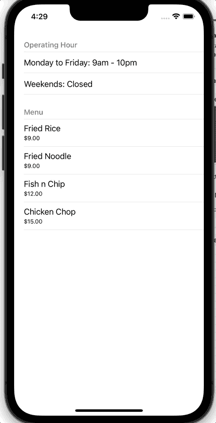

# 使用 RxSwift 显示不同的部分和行

> 原文：<https://betterprogramming.pub/displaying-different-sections-and-rows-with-rxswift-96a5f73ee8db>

## 通过反应式编程增强您的 iOS 应用


照片由 [Ricky Kharawala](https://unsplash.com/@sweetmangostudios?utm_source=medium&utm_medium=referral) 在 [Unsplash](https://unsplash.com?utm_source=medium&utm_medium=referral) 上拍摄

你接到一个项目，为你的客户制作一份食物菜单。这是一个相对简单的应用程序，它显示营业时间以及食物和价格。

然后，顾客可以从应用程序中购买食物。客户提出的唯一要求是，它需要在 RxSwift 中完成。

RxSwift 有一个陡峭的学习曲线，这对初学者来说可能很难，但你想交付，所以你继续挑战自己。

使用 RxSwift 的第一步当然是通过 Swift 包管理器(SPM)或 Cocoapods 导入它们。您决定采用后一种方法，并在`Podfile`中插入以下代码

# 入门指南

```
pod 'RxSwift'
pod 'RxCocoa'
pod 'RxDataSources'
```

你`pod install`他们，现在你已经准备好投入 RxSwift 之旅，永不回头。

# 模型类型

RxSwift 最重要的部分是知道如何定义您的**型号类型**。你知道需要有营业时间和有价格的食物。您将使用`enum`,因为它具有易于扩展的灵活性。我的意思是，如果需求增加，你将需要添加不同的部分，如图像，地图等。这种方法可以让您轻松做到这一点。

这段代码代表你的`UITableView`上的`**Section**`。您将有一个包含营业时间的部分和另一个包含食物和价格的部分。

```
enum HomeSectionModel {
    case informationSection(title: String, items: [HomeSectionItem])
    case foodSection(title: String, items: [HomeSectionItem])
}
```

接下来，您需要在这个部分中创建`Row`。每一种都由以下内容表示:

```
enum HomeSectionItem {
    case operatingHourItem(time: String)
    case foodItem(title: String, price: String)
}
```

最后，您的**型号类型**始终需要符合`SectionModelType`。这基本上是锅炉代码，你需要实现初始化你的模型。

# 创建您的模型类型

您的**模型类型**可以是硬编码的，也可以是来自 API 的响应。对于这个例子，它只是一个硬编码的模型。

创建一个新类，命名为`ViewModel.swift`；这是您创建模型的地方。

您需要导入以下内容:

```
import RxSwift
import RxCocoa
```

您将使用`BehaviorSubject`来存储您的模型，但是不能从任何类访问它。您还将创建另一个类型为`Driver`的变量，该变量可通过`ViewController`访问。

现在你已经准备好了所有的变量，让我们继续在`ViewModel`中硬编码我们的模型。在同一个文件中，创建一个允许您对模型进行硬编码的函数。

# 填充模型

返回到 **ViewController.swift** ，这是您将进行`UITableView`和绑定的地方。

您需要导入以下内容:

```
import RxDataSources
import RxSwift
```

我们将一个接一个地在`viewDidLoad`中创建相关的功能。

您需要实例化您的`ViewModel`。让我们这样做:

```
private func configureViewModel() {
   viewModel = ViewModel()
}
```

然后您将配置您的模型。

这段代码就是你设置单元格的地方。如果是信息模型，可以返回单元格 a。如果是食物模型，可以返回单元格 b。

您将需要数据源和模型来生成您在`UITableView`上的全部信息。

1.  这是您在`ViewModel`中手动生成模型的地方。
2.  您创建一个变量来获取数据源。
3.  本质上，您在这里所做的是，利用从模型中获得的信息，将这些信息填充到下面的单元格中。
4.  这允许你点击每个单元格，但我真正关心的是，如果用户点击食物，你会显示一个警告。按下信息不会做任何事情，因为它不在这里处理。

最后，您需要注册要使用的`TableViewCell`。以及显示警告的功能。

您已经准备好运行应用程序，并向您的客户展示它。

