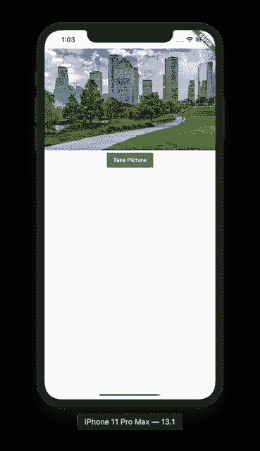
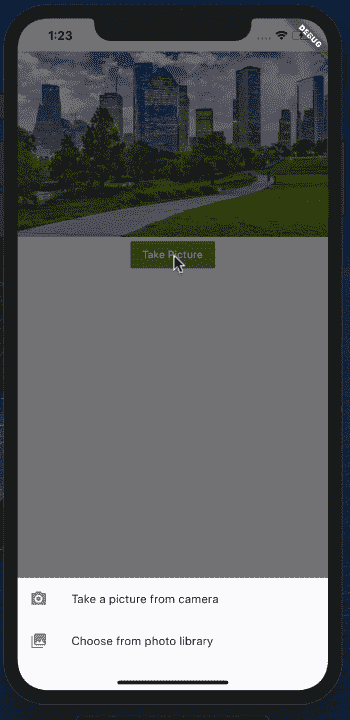
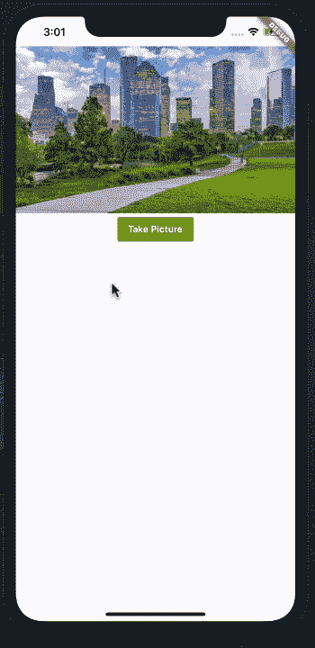
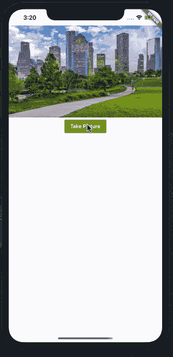

# 在 Flutter 应用程序中显示照片库中的照片

> 原文：<https://betterprogramming.pub/displaying-photos-from-your-photo-library-in-flutter-applications-34b8799a3849>

## 向您的 Flutter 应用程序介绍美丽的图像


照片由[亚历山大·安德鲁斯](https://unsplash.com/@alex_andrews?utm_source=unsplash&utm_medium=referral&utm_content=creditCopyText)在 [Unsplash](https://unsplash.com/s/photos/photo-album?utm_source=unsplash&utm_medium=referral&utm_content=creditCopyText) 上拍摄

信不信由你，大多数人购买智能手机是为了给他们的猫、狗和孩子拍出精彩的照片。iOS 和 Android 平台都提供了大量不同的照片库。

[Flutter](https://flutter.dev/) 没有什么不同，有几个包可以从相机中捕捉照片或从照片库中挑选照片。

在这篇文章中，我将介绍如何使用图像拾取器包在 Flutter 应用程序中显示照片库中的照片。

# 入门指南

在添加任何额外的包来与照片库集成之前，我们需要构建一个基本的用户界面，允许用户预览来自相机或照片库的图片。

下面的实现创建了一个基本的接口来满足我们的需求。

结果如下所示:



应用程序的用户界面

我们已经使用这个美丽的休斯顿市中心的图像作为我们的应用程序占位符图像。

“拍照”按钮应该为用户提供从相机中拍照或从照片库中选择照片的选项。按钮`onTap`的实现代码如下所示:

`_showOptions`方法显示一个底部模态表，由两个选项组成。他们可以从相机中拍照，也可以从照片库中选择一张照片。这显示在下面的动画中:



底部模板

这太棒了！在下一节中，我们将安装所需的包，并开始从照片库中选择照片。

# 从照片图库中选择照片

Flutter 中的[图像拾取器](https://pub.dev/packages/image_picker)包允许用户从照片库中拾取图像。图像拾取器也允许用户使用相机捕捉照片，但为此，我们将使用不同的包。

首先安装图像拾取器包，将其添加到`pubspec.yaml` 文件中，如下所示:

接下来，您必须配置 iOS 平台所需的权限。打开位于 *iOS > Runner* 文件夹中的`info.plist`文件，添加以下键值。

当用户从底部表单小部件中选择*从照片库中选择*选项时，图像拾取器将会出现。 `_showPhotoLibrary`方法实现如下:

就是这样！当您运行应用程序并点击*从照片库选择*选项时，它将触发`_showPhotoLibrary`方法，该方法将启动照片库。如下所示:



展示照片库

看起来棒极了！

我们仍然需要替换占位符图像，并在其位置显示所选图像。

图像拾取器允许我们访问与图像相关的`File`对象。`File`对象有一个包含图像路径的 path 属性。上面图像的路径如下所示:

```
/Users/azamsharp/Library/Developer/CoreSimulator/Devices/5091AD3A-FCFF-4C0D-B3E2–984BE1CC757C/data/Containers/Data/Application/922A8DFF-D441–48A4-A0C7-BABCCC37E502/tmp/image_picker_061D8B5D-4BF8–4B11-B739–85410C14C4E0–12357–0000E8DRAFA1C474.jpg
```

为了持久化路径，我们需要将它保存在状态中。这需要将我们的小部件从无状态改为有状态，并公开一个`_path`属性，如下面的实现所示:

现在，当`ImagePicker`返回新路径时，它被分配给`setState`闭包内的`_path`属性。这触发了构建方法，我们可以在其中更新`Image`小部件，如下所示:

结果如下所示:



从照片图库中选择照片

你们中的一些人可能已经注意到，一旦照片被选中，底部的表单不会关闭。下面的实现解决了这个问题，并使用导航器弹出底部的工作表视图。

就是这样！这是由两部分组成的系列文章的第一部分。在下一篇文章中，你将学习如何集成手机摄像头并在视图中显示拍摄的照片。

*   [GitHub](https://github.com/azamsharp/AzamSharp-Weekly/blob/master/photo_app.zip)

谢谢，祝编码愉快！