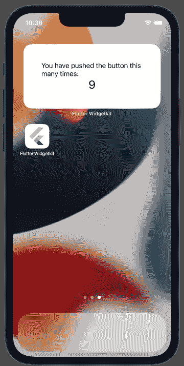
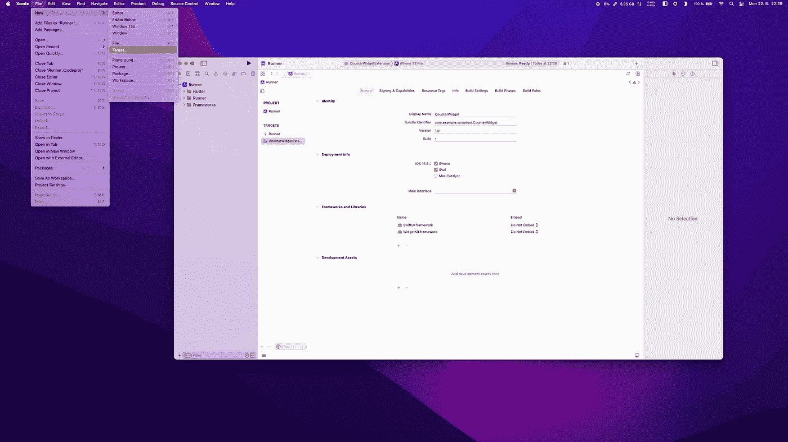
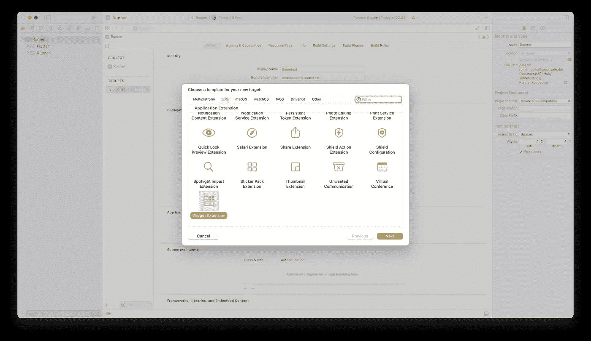
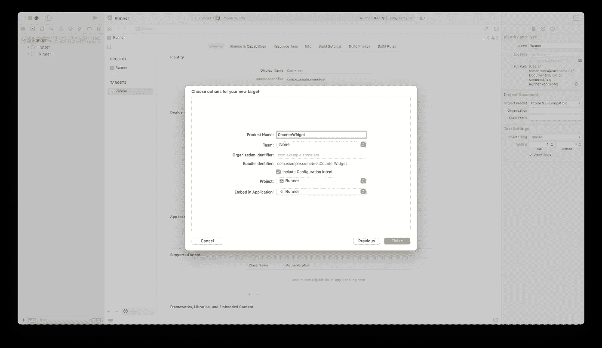
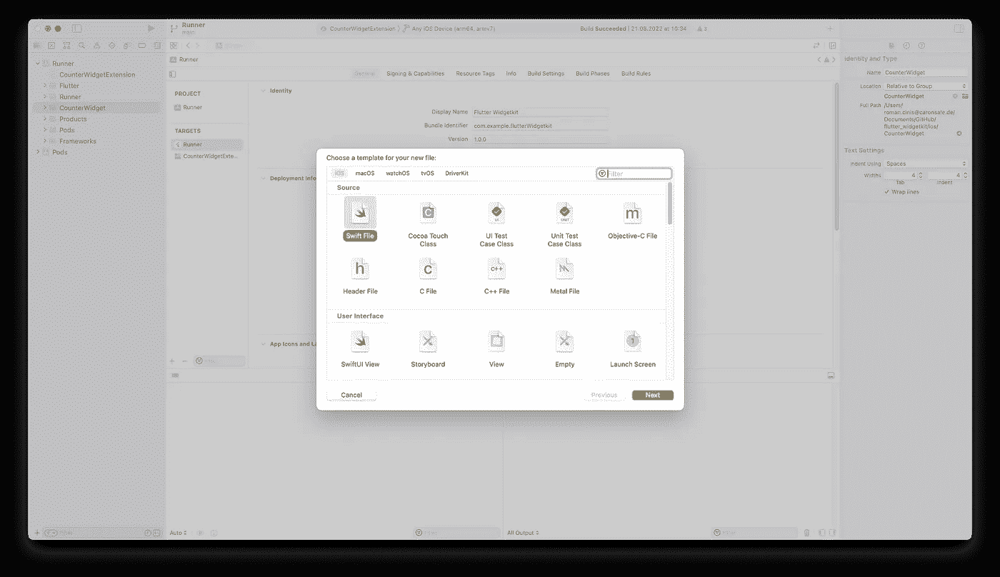
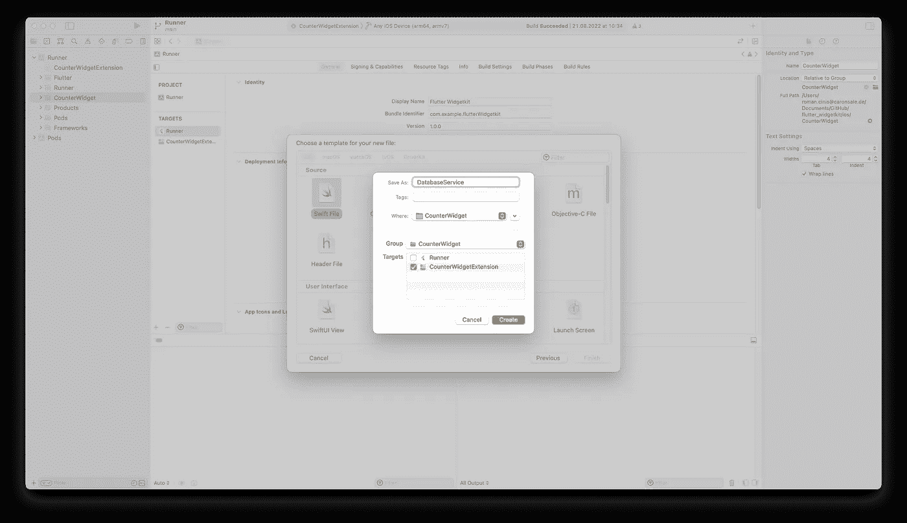
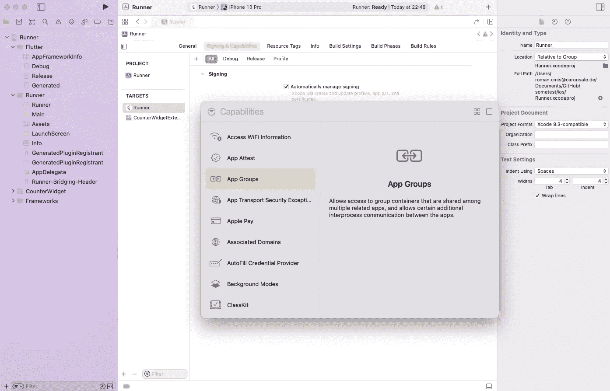
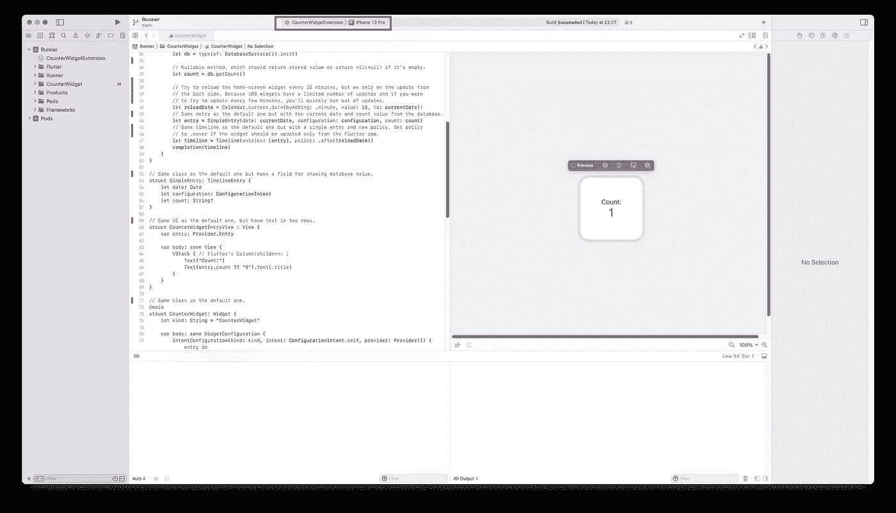

# 在 iOS 主屏幕上显示 Flutter 应用程序中的 SQLite 数据

> 原文：<https://betterprogramming.pub/displaying-sqlite-data-from-the-flutter-app-on-the-ios-home-screen-ea62965c92a6>

## Flutter 与 SwiftUI 和 Dart 与 Swift——从 Flutter 开发者的角度


这张图片的背景是由[星线](https://www.freepik.com/free-vector/versus-vs-comparision-screen-background-template-design_9874140.htm)制作的

嘿，德夫斯！如果你已经几乎完美地完成了你的 Flutter 项目，并且正在寻找其他方法来提高用户使用你的应用程序(例如，在 iPhones 上)时的 UX，有一个选择——在 iOS 主屏幕上显示你的应用程序数据！如果你没有 Swift 开发的经验，那就更好了，因为在本文中，我将从一个 Flutter 开发者的角度，向你展示 Dart 与 Swift 以及 Flutter 与 SwiftUI 的一些基本区别。

# 开始之前

有两个小限制——你不能在 Flutter 框架中编写 iOS 上的主屏幕小部件，而且这些小部件只能在 iOS 14+上使用。你将需要用 Swift 编写它们，但是如果你已经是一个有经验的 Flutter 开发者，用 Swift 编码对你来说将是小菜一碟。Dart 在功能和用途方面与 Swift 非常相似，只有语法和符号上的细微差别。

您将看到一个在 Dart 和 Swift 中具有相同功能的数据库服务类的示例，以及 Flutter 和 SwiftUI 之间的基本差异。正如您可能注意到的，我们将添加的 Swift 部分将是绝对最小的。相对来说，这是对你知识的一个很好的扩展，而且对你的开发者简历来说是一个额外的奖励。

您可以在此处获得包含 VCS 提交历史记录的源代码，以查看更改情况:

[](https://github.com/tsinis/flutter_widgetkit) [## GitHub-tsin is/flutter _ widget kit:在 iOS 主屏幕上显示来自 Flutter 应用程序的 SQLite 数据…

### 此时您不能执行该操作。您已使用另一个标签页或窗口登录。您已在另一个选项卡中注销，或者…

github.com](https://github.com/tsinis/flutter_widgetkit) 

所以抓住它作为一个起点/参考，让我们去做吧！

# 我们将做什么



为了进行演示，我们将重写经典的 Flutter " **Counter** "应用程序，在你的 iPhone 主屏幕上显示点击次数。因此，我们将把计数数据存储在 Flutter 中可用的最好的本地存储器之一— **SQLite** 。但是你可以很容易地使用你喜欢的方式，比如键值数据库、`NSUserDefaults`等等。，这样就更容易了。SQLite 具有独立于平台的优势，因此只要有 SQLite 支持，您的查询就可以工作。

顺便说一下，Swift 对 SQLite 有“开箱即用”的支持。

我们将每隔 15 分钟自动刷新一次主屏幕数据，但(主要)是直接从 Flutter 实时刷新。

# **入门**

我假设您已经有了这个项目，如果没有，那么通过下面的命令创建一个新的项目:

```
flutter **create** ...
```

接下来，让我们创建 Swift 的小部件。从您的 Flutter 项目命令的根目录运行:

```
**open** ios/Runner.xcworkspace
```



将一个新的微件扩展目标(**文件- >新目标- >微件扩展**)添加到您最顶层的跑步者，并给它起一个您喜欢的名字。



在意图配置的**包括配置意图**上添加复选标记；否则，它将创建一个静态配置。IDE 将添加一些文件，其中一些我们将在后续步骤中进行编辑。



## 数据库服务 Swift 文件

让我们在 Xcode 中添加一个`DatabaseService.swift`文件，我们将在后续步骤中用到它。右击`CounterWidget`文件夹，选择**新建文件…**



选择 **Swift 文件**并提供一个名称，确保选择正确的目标(不是 Runner 一个，而是你的 Widget 一个)。



## 应用程序组

我们还没有离开 Xcode，因为:

> iOS 应用程序是“**沙箱化的**”，所以我们必须创建一个**应用程序组**来连接主屏幕小部件和我们的 Flutter 应用程序。



为此，只需将功能***应用程序组**添加到您的 Flutter 应用程序和主屏幕小部件中。两个目标的组名(**group.com.somename**)必须相同。这一刻到此为止，现在是代码时间！*

# *代码部分*

*Xcode 的官僚作风已经结束，所以让我们创建一个服务，它将提供在设备上存储离线数据的能力，并且在两种语言中非常相似。由于它是一个 SQLite 数据库，因此该服务的设计应该能够完成类似如下的工作:*

*   *必须导入 SQLite 库，*
*   *有一个合适的名字，像`DatabaseService`，*
*   *SQLite 本身有私有字段`db`，*
*   *有一个打开数据库和初始化类的方法`openDb()`，*
*   *具有用于读取存储值的方法`getCount()`，*
*   *具有私有的不可变的`String`字段，用于应用程序组 ID、数据库文件名和允许从数据库获取数据的 SELECT 语句*

*在 Dart 端，我们还需要表名、id 和值标识符的字段，以及更新计数器并将其保存到 DB 的方法。因此，让我们在每种语言中一步一步地创建它，并看看它们之间的一些差异，让我们总是从 Dart 开始，您可能更熟悉它。*

# *骨架类*

```
***class** DatabaseService {} // Dart class.*
```

*在 Swift 中可能也是如此，但在这里我们可能更愿意使用`struct`。*

*因为在 Swift 中`Classes`是引用类型，`Structs`是值类型对象:*

```
***struct** DatabaseService {}*
```

*将它以及 Swift 中所有与 DB 相关的东西添加到`DatabaseService.swift`文件中。*

## *不可变字段*

*在 Dart 语言中，我们是这样声明私有不可变字段的:*

```
**static* *const* **_appGroupId** = ‘group.com.example.flutterWidgetkit’;
*static* *const* **_dbPath** = ‘database.db’;
*static* *const* **_queryStatementInt** = “SELECT value FROM counter;”;*
```

*在 Swift 中，我们必须使用一个 *"private"* 关键字来代替名称中的下划线，并使用一个 *"let"* 关键字来实现不变性。*

*要指定类型，我们必须编写“:*String”*并用双引号将文本值括起来*

```
**private* *let* **queryStatementInt** = “SELECT value FROM counter;”
*private* *let* **appGroupId** = “group.com.example.flutterWidgetkit”
*private* *let* **dbPath**: String = “database.db”*
```

## *进口*

*Dart/Flutter 没有对`SQLite`的官方支持，所以选择你最喜欢的包，在这个例子中，我将使用`[sqflite](https://pub.dev/packages/sqflite)`包。首先，使用以下命令将其添加到您的项目中:*

```
*flutter pub add **sqflite***
```

*现在导入看起来像这样:*

```
**import* ‘package:sqflite/sqflite.dart’;*
```

*由于 Swift 内置了对 SQLite 的支持，因此它将站在 Swift 一边:*

```
**import* SQLite3*
```

*对于一些基本层也是如此:*

```
**import* Foundation*
```

## *数据库字段*

*这将再次成为一个私有的:*

```
**final* ***Database*** _db;*
```

*在 Swift 中，它可能是可变的和可空的，因为如果 Swift 没有找到 DB 文件，我们不应该仅仅创建一个新的数据库(与 Flutter 相反，Flutter 应该在第一次运行时创建一个 DB):*

```
**private* *var* **db**: OpaquePointer?*
```

*如您所见，这个支持空值的操作符与 Dart 相同。*

## *类初始化*

*由于 Dart 没有异步构造函数/工厂，数据库打开总是异步操作，我们可以使用私有构造函数和静态异步方法`openDb()`，它将返回`DatabaseService`本身:*

```
**const* *DatabaseService*._(this._db);*static* *Future*<*DatabaseService*> **openDb**() *async* {
...
*return* *DatabaseService*._(database);
}*
```

*在 Swift 中，用箭头->符号指定返回类型，用`func`关键字声明函数/方法*

```
****init***() {
db = openDb()
}*private* *func* **openDb**() -> OpaquePointer? {
...
}*
```

## *获取计数数据方法*

*在 Dart 中，它将再次是异步操作，因为我们正在使用本机平台功能，并且在两端都有可空的返回，因为 DB 不一定包含数据(如果没有进行 tap)。*

```
**Future*<*int*?> **getCount**() *async* {}*
```

*但是在 Swift 中我们只显示数据，所以我们只能返回字符串:*

```
**func* **getCount**() -> String? {}*
```

## ***完成省道边***

*好了，让我们用 Flutter 中的实际功能来填充我们的框架。因此，为了打开和创建一个 DB，我们还需要几个编译时常量:表名、id 和值标识符。*

*要打开数据库，我们需要知道应用程序组目录(因为你可能还记得，iOS 应用程序是沙箱化的)，有几个软件包，但我将使用[这个](https://pub.dev/packages/app_group_directory):*

```
*flutter pub add **app_group_directory***
```

*如果我们考虑依赖关系，让我们添加一个[包](https://pub.dev/packages/flutter_widgetkit)，用于手动触发 iOS 主屏幕小部件的刷新:*

```
*flutter pub add **flutter_widgetkit***
```

**顺便说一句，这个包中有很棒的文档，也有一篇文章的链接，其中有一个类似的例子，但是使用了*[*user defaults*](https://developer.apple.com/documentation/foundation/userdefaults)*作为本地存储。**

*现在打开 DB 就像这样简单:*

```
**static* *Future*<*DatabaseService*> **openDb**() *async* {
*final* directory = *await AppGroupDirectory*.getAppGroupDirectory(_appGroupId);*if* (directory == *null*) *throw* *Exception*(‘App Group $_appGroupId not found!’);*final* database = *await* openDatabase(join(directory.path, _dbPath),
version: *1*,
onCreate: (db, _) => db.execute(
‘’’
CREATE TABLE $_table(
$_id TEXT PRIMARY KEY,
$_value INTEGER
)
‘’’,
 ),
);*return* *DatabaseService*._(database);
}*
```

*为了更新计数和强制窗口小部件刷新，让我们写(id 在这里永远不会改变，但这只是一个例子，对不对？):*

```
**Future*<*void*> **updateCount**(*int* count) *async* {
*/// Insert a new count to the database, if exists — just replace it.
await* _db.insert(
_table,
{_id: _id, _value: count},
conflictAlgorithm: ConflictAlgorithm.replace,
);*/// This will trigger a rebuild of Swift’s home-screen widget.
return* *WidgetKit*.reloadAllTimelines();
}*
```

*最后，要从 DB 中获得值，请添加以下几行:*

```
**Future*<*int*?> **getCount**() *async* {
*final* map = *await* _db.rawQuery(_queryStatementInt);
*if* (map.isEmpty) *return* *null*;
*final* maybeCount = map.first[_value];*return* maybeCount *is* *int* ? maybeCount : *null*;
}*
```

*现在只需传递您的通行证存储计数，并更新您的应用程序的回调，我们就完成了。你可以在 GitHub 上看到结果*

*[](https://github.com/tsinis/flutter_widgetkit/blob/main/lib/database_service.dart) [## 主 tsin is/flutter _ widget kit/database _ service . dart

### 此文件包含双向 Unicode 文本，其解释或编译可能与下面显示的不同…

github.com](https://github.com/tsinis/flutter_widgetkit/blob/main/lib/database_service.dart) 

## **最终确定 Swift 数据库服务**

从`DatabaseService`的角度来看，很容易打开我们将使用与 Dart 中类似的方法:打开应用程序组目录并查找数据库数据(如果存在):

```
*private* *func* **openDb**() -> OpaquePointer? {
*let* fileManager = *FileManager*.default
*let* directory = fileManager.containerURL(forSecurityApplicationGroupIdentifier: appGroupId)
*let* dbFile = directory!.appendingPathComponent(dbPath)
*var* db: OpaquePointer?*if* sqlite3_open(dbFile.path, &db) != SQLITE_OK {
print(“Error opening database”)
*return* *nil* } *else* {
print(“Successfully opened connection to database at \(dbPath)”)
*return* db
 }
}
```

> 正如您可能注意到的， **nil** 是 Swift 的 Dart 的 **null** 值的等价物。

算起来，不会那么相似:

```
*func* **getCount**() -> String? {
*var* maybeCount: String?
*var* queryStatement: OpaquePointer?
*let* sqlState = sqlite3_prepare_v2(db, queryStatementInt, *-1*, &queryStatement, *nil*)
*if* sqlState == SQLITE_OK {
  *while* sqlite3_step(queryStatement) == SQLITE_ROW {
  *let* value = sqlite3_column_int(queryStatement, *0*)
  maybeCount = String(describing: value)
  }
} *else* {
  print(“SELECT statement could not be prepared”)
}
sqlite3_finalize(queryStatement)*return* maybeCount
}
```

Swift 实现数据库服务的结果也可在 GitHub 上获得:

[](https://github.com/tsinis/flutter_widgetkit/blob/main/ios/CounterWidget/DatabaseService.swift) [## 主 tsin is/flutter _ widget kit/databaseservice . swift

### 此时您不能执行该操作。您已使用另一个标签页或窗口登录。您已在另一个选项卡中注销，或者…

github.com](https://github.com/tsinis/flutter_widgetkit/blob/main/ios/CounterWidget/DatabaseService.swift) 

# **为 iOS 编写主屏幕小工具**

现在，我们将需要在 SwiftUI 中编写一个主屏幕小部件，但重要的是，我们已经有了 Xcode 的大部分代码。

让我们看看它在`CounterWidget.swift`文件中给我们提供了什么。有很多类，但是我们可以忽略其中的大部分。其中最重要的一条是:

```
struct SimpleEntry: **TimelineEntry**
```

`TimelineEntry`是一个协议，指定何时应该显示一个小部件，在这里我们可以添加我们需要在 UI 上显示的数据，在这个例子中，我们将只添加可空类型的计数(您可能还记得，总有一种情况是数据库中还没有存储数据，但不用担心我们会在 UI 上处理它):

```
*struct* SimpleEntry: TimelineEntry {
*let* date: Date
*let* configuration: ConfigurationIntent
*let* **count**: String?
}
```

您将会看到许多警告，并大叫缺少“*计数*”，您现在只需提供默认值“1”就可以平息大多数警告。

下一个重要的东西是我们的 UI(视图)，它在

```
CounterWidgetEntryView : **View**
```

这包含以下可访问`entry.count`值的代码:

```
var **entry**: Provider.Entry
```

SwiftUI 与 Flutter 共享相同的声明性，所以让我们替换默认的:

```
Text(entry.**date**, style: .time),
```

使用:

```
Text(entry.**count** ?? “0”),
```

看起来就像我们在颤振中做的一样，对吗？

但是我宁愿在上面添加一些标题来描述这个数字，在 Flutter 中，我会使用这样的`Column`小部件:

```
***Column****(
  children: [* Text(“Count:”),
   Text(entry.count ?? “0”),
]
```

在 SwiftUI 中，这将非常非常相似:

```
**VStack** {
  Text(“Count:”)
  Text(entry.count ?? “0”).font(.title)
}
```

正如您可能看到的，它几乎是 1:1，语法和命名几乎没有区别。

Swift 的`VStack`是 Flutter 的`Column`一样的组件。

我还在计数中添加了“ *title* ”样式，使其更大。UI 到此为止。

最后也是最重要的一个需要理解的类是`[IntentTimelineProvider](https://developer.apple.com/documentation/widgetkit/intenttimelineprovider)`。该协议负责构建 UI 并在时间轴上显示/更新它，它包含三种方法:

*   `*placeholder*`:允许我们向用户显示一个占位符视图，并告诉 *WidgetKit* 在加载小部件时呈现什么。
*   `*getSnapshot*` : `*WidgetKit*`在短暂的情况下显示小部件时发出快照请求，例如当我们在屏幕上添加一个小部件时。
*   最重要的一个，它允许你从数据库加载数据，并声明我们的小部件的下一个刷新时刻。我们的代码使用`.after`更新策略，它告诉`*WidgetKit*`每隔大约 15 分钟请求一次新的时间线，但是我们将更依赖于来自 Dart 端的更新(通过`WidgetKit.reloadAllTimelines()` 调用)。在这里，我们可以初始化我们的`DatabaseService`，从中获取值，并将其添加到时间轴中。

您可以在这里看到默认 Flutter/SwiftUI 生成的文件和最终结果之间的差异:

[](https://github.com/tsinis/flutter_widgetkit/compare/2841d6aff96862c0c86e2a7e6e440f277fbf09df...main) [## 比较 2841 D6 aff 96862 c0c 86 e 2 a 7 e 6 e 440 f 277 fbf 09 df...main tsinis/flutter_widgetkit

### 很遗憾，我们现在似乎无法为您提供这种比较。可能太大了，也可能有…

github.com](https://github.com/tsinis/flutter_widgetkit/compare/2841d6aff96862c0c86e2a7e6e440f277fbf09df...main) 

就这样，现在你应该可以通过 Swift 的 WidgetKit 在 iOS 主屏幕上显示 Flutter 应用程序的点击次数了。只需在项目根目录下使用以下命令运行您的应用程序，然后从 Xcode 运行您的主屏幕小部件(在顶部菜单中选择合适的目标):

```
flutter **run**
```



我希望在读完这篇文章后，你已经获得了足够的勇气，开始自己用 Swift 编程。不管 Flutter 是否存在，这种类似 Dart 的语言将会伴随我们一段时间，正如你所看到的，它在你的 Flutter 项目中非常有用。感谢阅读！*