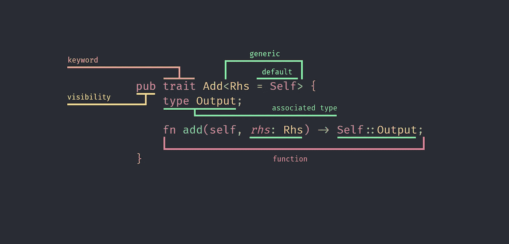

# 解剖铁锈特征以了解它们的秘密

> 原文：<https://betterprogramming.pub/dissecting-rust-traits-to-learn-their-secrets-839845d3d71e>

## 我们将分解 Add trait，以了解它如何实现所有的 trait 工具来提供所有的灵活性

剖析特征

特征是 Rust 中最有趣的特征之一。对于任何编程语言来说，这都是一个令人难以置信的基本操作，但它有一点我们可以在 **traits** 中找到的一切，甚至是运算符重载，所以这是一个令人难以置信的例子，可以学习如何将 traits 的工具拼凑在一起，以提供一个完美绑定的功能，从而提供惊人的灵活性。**我们来看看**。

# 通用的

首先，我们有`pub trait Add`，这个特征的头，它指定这个特征被命名为`Add`，并且它是公开的，没有任何限制，所以这个特征可以在 Rust 项目的任何地方实现和使用。

然后我们有`Rhs`，这是一个通用标识符，就像常用的`T`。在这种情况下，之所以这样命名，是因为首字母缩略词的意思是**右手边**，这是一种描述性的方式，表明这种特征的一般部分是什么，这种类型我们将添加到实现`Add`的项目中。例如，在加法运算`Counter(0) + 1`中，RHS 是右边的那个，它的类型是一个整数(i32，u8，无论什么)。

这个泛型的一个重要注意事项是，它不只是`Rhs`而是`Rhs = Self`。这意味着默认情况下，RHS 类型将与实现特征的项目相同。因此，我们可以像这样在两个计数器之间实现加法。

看，我们是不是在 impl Add 中省略了泛型

# 该功能

我们的下一步是 trait 定义的函数，我们必须实现它来允许我们的项目增加。我们看到它有两个参数:`Rhs`类型的`self`和`rhs`。

这其中很重要的一点就是**我们有** `self` **而没有** `&self`。这意味着如果我们实现了这个特征，我们将在执行加法时消耗这个项目。这样做是为了提供灵活性，因为如果我们希望它被消费，我们可以为`Counter`实现`Add`;如果我们希望它在添加后继续存在，我们可以为`&Counter`实现`Add`;如果我们希望允许这两种行为，我们可以为两者都实现`Add`。

为&Counter 实现 Add <self>，这不会消耗计数器</self>

最后，函数的最后一部分是它的返回类型，我们可以看到它是`Self::Output`。让我们看看那是什么。

# 关联的类型

最后，`Output`是 trait 的一部分，它给了我们最后的额外灵活性，它就像是 trait 的第二个泛型，定义了从加法中返回的类型。

通过这种方式，你可以从一个加法中输出一个不同于运算中所用的两个东西中的任何一个。在上面的两个例子中，我们返回计数器，但是也可以返回我们想要的任何值，就像这样:

计数器+ i16 返回一个 i32

你一定想知道为什么要这样实现。我们用一个通称来定义输出图像，例如:`trait Add<Rhs, Output>`。有了这个签名，我们可以制作`impl Add<i32, Counter> for Counter`和`impl Add<i32, i32> for Counter`。这将导致冲突，因为同一个`Counter(2) + 4`可能返回两个不同的东西。

# 包扎

我们已经看到了标准库中最常用的特征之一，以及它如何使用组件来实现我们希望从加法这样的操作中获得的灵活性。一个很好的工具实现，让我们定义或实现具有很多通用性的 trait。有了这些:

*   我们可以在所有权或借贷上实现特征。
*   我们可以使用泛型来处理不同类型的项目。
*   我们可以为这些泛型指定默认值，以节省代码和时间。
*   我们可以指定我们选择返回或使用的额外类型。
*   我们可以做这样疯狂的事情:

相加&Counter 和 i32 会使 as so 失败，返回结果

最后一点，像往常一样，这里是带有工作示例的存储库:

 [## 中等/主要克里金属的附加性状/中等

### 存放我的 Medium 帖子中使用的示例的存储库- medium/add_trait 位于 main kriogenia/medium

github.co](https://github.com/kriogenia/medium/tree/main/add_trait)